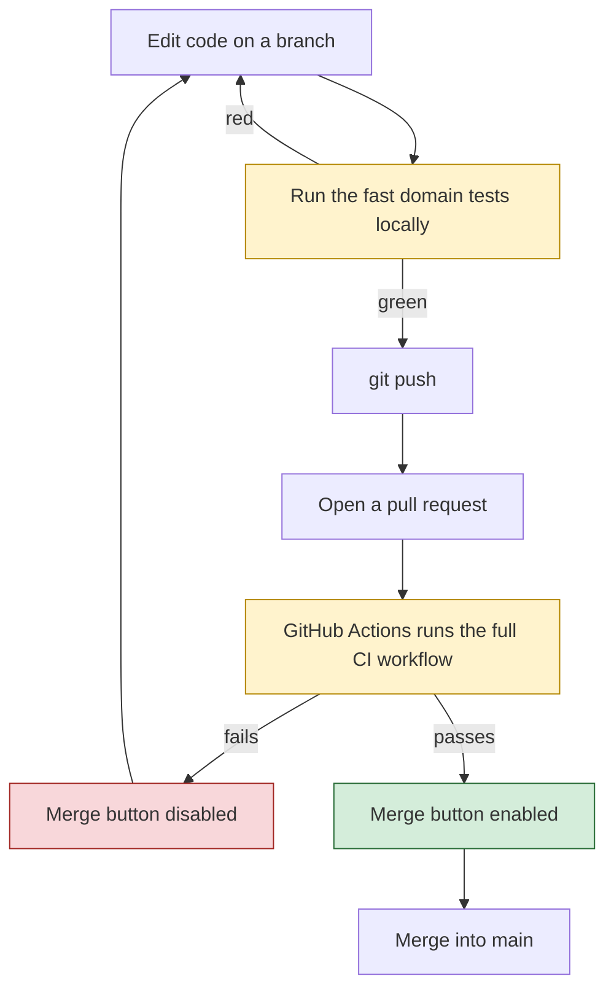
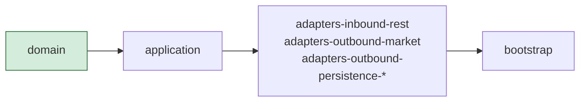
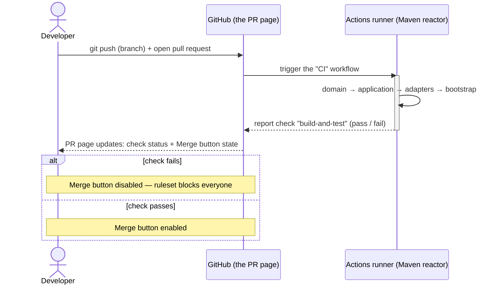
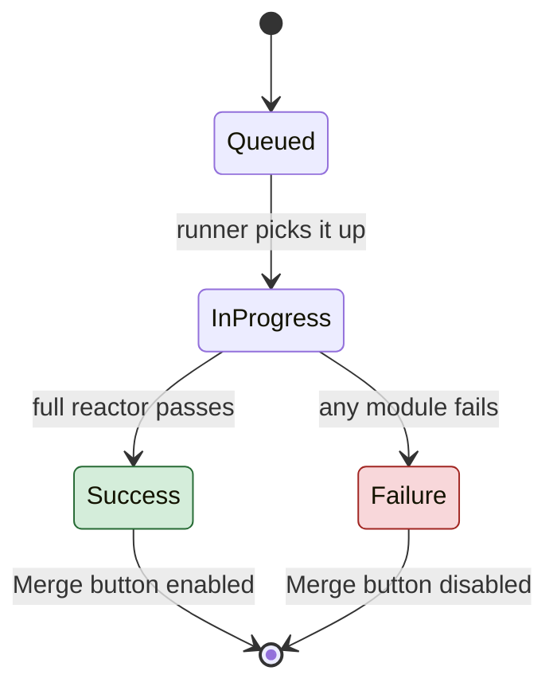

# CI Discipline Walkthrough — HexaStock

This document explains, in full, how Continuous Integration is enforced on
this repository's `main` branch, and walks through verified evidence that
the enforcement actually works. It complements two smaller companion
repositories built for the same purpose:

- [ci-demo-python](https://github.com/alfredorueda/ci-demo-python)
- [ci-demo-java](https://github.com/alfredorueda/ci-demo-java)

Those two repositories show the same mechanism in isolation, on a tiny,
dependency-free domain model with a sub-second test suite. This document
shows the identical mechanism operating on HexaStock itself: a real,
production-shaped, multi-module Hexagonal Architecture codebase with a
Maven reactor, Testcontainers-backed integration tests, and a test suite
that takes closer to two minutes than two seconds. The underlying idea does
not change with scale; what changes is everything around it — and that
difference is worth seeing directly.

Looking for a condensed, copy-paste-ready run sheet instead of the fully
explained version below? See
[CI_DEMO_SCRIPT.md](CI_DEMO_SCRIPT.md).

---

## 1. What this walkthrough shows

1. **Automated tests** catch mistakes without a human having to notice
   them — at any scale, from three unit tests to several hundred.
2. **A CI pipeline** (GitHub Actions) runs the full test suite automatically
   on every push and every pull request, regardless of how long that suite
   takes to run.
3. **A pull request** is where the result of that automated check becomes
   visible, before a change ever reaches `main`.
4. **A branch protection ruleset** turns "please don't merge broken code"
   into something GitHub itself enforces — with no exception for
   administrators.

A natural follow-up question: what stops someone from weakening the
*tests* instead of fixing the *code*? Section 10 addresses it directly —
and, unlike the two smaller companion repositories, this one already runs
part of the answer in its real pipeline (SonarCloud's Quality Gate).



---

## 2. How HexaStock's pipeline differs from the two smaller demos

| | ci-demo-python / ci-demo-java | HexaStock |
|---|---|---|
| Modules | One | Seven (Maven multi-module reactor: `domain`, `application`, three adapter modules, `bootstrap`, plus the parent POM) |
| Test suite, happy path | ~0.02s | ~2 minutes |
| Infrastructure needed by tests | None | Testcontainers spins up real MySQL and MongoDB instances for the persistence adapter tests |
| Required check | `Run domain tests` | `build-and-test` |
| Protection mechanism | Classic branch protection | **Ruleset** (GitHub's newer branch-protection system — same intent, different configuration surface) |
| What a domain-level bug costs | The full suite, since there's only one tier | Seconds — the Maven reactor fails fast at the `domain` module, before the slower modules ever run |

That last row is the most important difference, and it's worth dwelling on.

### The Maven reactor builds modules in dependency order



`domain` has no dependencies on anything else in the project — it's pure
business logic — so Maven builds and tests it first. By default, Maven
stops the entire build at the first module whose tests fail. A bug in a
domain value object or aggregate is therefore caught in well under a
second of test time, and the build never even reaches the modules that
need Docker. A bug that only a slower module can catch — say, a JPA
mapping error — costs the full run, because every module before it in the
reactor has to build and pass first.

This is the same "test pyramid" idea the two smaller demo repositories
teach in isolation — fast, infrastructure-free tests catch what they can
before anything slow gets a chance to run — except here it's not a
teaching simplification. It's how the reactor actually behaves, because
`domain` and `application` are genuinely dependency-free of infrastructure,
by architectural design (see [CONTRIBUTING.md](CONTRIBUTING.md) for the
Hexagonal Architecture principles this project enforces).

---

## 3. The protection mechanism: a ruleset, not classic branch protection

GitHub has two ways to protect a branch: the classic **branch protection
rules** (what the two smaller demo repositories use) and the newer
**repository rulesets**, which HexaStock uses. They express the same
intent through a different API and a different settings page
(`Settings → Rules → Rulesets` instead of `Settings → Branches`).

The active ruleset on this repository, `MainProtection`, applies to the
default branch and enforces:

| Rule | Effect |
|---|---|
| `deletion` | `main` cannot be deleted. |
| `non_fast_forward` | No force-pushes to `main` — history cannot be rewritten. |
| `pull_request` | Changes must arrive through a pull request; direct pushes to `main` are rejected. |
| `required_status_checks` | The `build-and-test` check must pass, and the branch must be up to date with `main`, before a pull request can be merged. |

Bypass is set to nobody (`bypass_actors: []`), meaning these rules apply
to every contributor equally, including repository administrators — the
same choice made on the two smaller demo repositories via their
`enforce_admins: true` setting.



---

## 4. Verified evidence

The two claims above — "a failing check blocks the merge" and "a passing
check allows it" — were each verified directly against this repository,
not assumed from configuration alone.

### 4.1 A failing pull request was blocked

[PR #30](https://github.com/alfredorueda/HexaStock/pull/30) introduced a
single-line, deliberate regression in `Portfolio.buy()`:

```java
Holding holding = findOrCreateHolding(ticker);
holding.buy(quantity, price);
// balance = balance.subtract(totalCost);   // <-- commented out
```

Result, captured directly from the Actions log:

```
[ERROR] Tests run: 9, Failures: 3, Errors: 0, Skipped: 0, Time elapsed: 0.041 s <<< FAILURE! -- in cat.gencat.agaur.hexastock.model.portfolio.PortfolioTest$StockOperations
[ERROR]   PortfolioTest$StockOperations.shouldAddHoldingAndDecreaseBalanceWhenBuying:126 expected: <500.00> but was: <1000.00>
[ERROR]   PortfolioTest$StockOperations.shouldAddLotToExistingHoldingWhenBuyingMore:148 expected: <585.00> but was: <1000.00>
[ERROR]   PortfolioTest$StockOperations.shouldIncreaseBalanceAndUpdateHoldingWhenSelling:186 expected: <800.00> but was: <1300.00>
[ERROR] Tests run: 117, Failures: 3, Errors: 0, Skipped: 0
[ERROR] BUILD FAILURE
```

The `domain` module alone runs 117 tests; three failed, and the reactor
stopped there — the whole run, queued to failed, completed in **46
seconds**. The pull request's merge state, read directly from the GitHub
API immediately afterward:

```json
{"mergeable": "MERGEABLE", "mergeStateStatus": "BLOCKED"}
```

`mergeable: true` means there was no textual conflict with `main` — the
change could technically be combined. `mergeStateStatus: BLOCKED` is the
separate, decisive signal: the ruleset's required check had not passed, so
GitHub refused to allow the merge regardless. The PR was closed without
merging, exactly as a real failing contribution should be.

### 4.2 This document reached `main` through a passing pull request

This walkthrough and its companion [CI_DEMO_SCRIPT.md](CI_DEMO_SCRIPT.md)
were themselves written on a branch, pushed, and opened as
[PR #31](https://github.com/alfredorueda/HexaStock/pull/31) against
`main` — not committed directly, since the ruleset no longer allows that.
The full suite (all seven modules, including the Testcontainers-backed
persistence tests) had to pass before the **Merge** button became
available. That pull request is the mechanism working as intended, not a
separate claim to take on faith.



---

## 5. Reproducing this live

The same deliberate bug used in section 4.1 can be reproduced safely on a
throwaway branch — it never has to touch `main`. See
[CI_DEMO_SCRIPT.md](CI_DEMO_SCRIPT.md) for the exact copy-paste steps. In
outline:

0. **Fork this repository, then clone your fork** — not this one. Cloning
   `alfredorueda/HexaStock` directly won't let you push branches or open
   pull requests, since you don't have write access to it:
   ```bash
   git clone https://github.com/<your-username>/HexaStock.git
   cd HexaStock
   ```
   (Fork first, from `https://github.com/alfredorueda/HexaStock` →
   **Fork**, top-right. Forking copies the code but not the
   `MainProtection` ruleset from section 3 — optional to recreate under
   **Settings → Rules → Rulesets** on your fork if you also want to see
   the merge-blocked behavior there.)
1. Branch from `main`.
2. Comment out `balance = balance.subtract(totalCost);` in
   `Portfolio.buy()`.
3. Run `./mvnw -pl domain,application clean test` locally — confirm 3
   failures, in well under a second.
4. Push, open a pull request, watch `build-and-test` fail (about 30–60s)
   and the **Merge** button disable.
5. Revert the change, push again, watch the full suite run (close to 2
   minutes this time) and the **Merge** button enable.
6. Close the pull request without merging, or merge it — either is a
   correct ending, since the branch no longer contains the bug.

---

## 6. Glossary

| Term | Meaning here |
|---|---|
| **Maven reactor** | The order in which a multi-module Maven build compiles and tests each module, following their declared dependencies. |
| **Module** | An independently buildable unit of the project — `domain`, `application`, and the various adapters are each their own Maven module with their own `pom.xml`. |
| **Fail-fast** | Maven's default behavior: the build stops at the first module whose tests fail, rather than continuing to build the rest. |
| **Testcontainers** | A library that starts real, disposable Docker containers (here, MySQL and MongoDB) for integration tests, then tears them down afterward. |
| **Ruleset** | GitHub's newer mechanism for branch protection — a named set of rules (status checks, PR requirements, force-push restrictions, and more) applied to one or more branches. |
| **Required status check** | A named CI check that must report success before a pull request can be merged, enforced by a ruleset or classic branch protection rule. |
| **`mergeStateStatus`** | A field on a pull request, readable via the GitHub API, that reports *why* a PR can or cannot currently be merged — distinct from `mergeable`, which only reports the absence of a text conflict. |

---

## 7. Troubleshooting / FAQ

**A passing run takes much longer here than in the two smaller demo repos.**
That's expected. The full suite builds and tests all seven modules,
including two that start real database containers via Testcontainers.
Roughly two minutes is normal for a happy-path run on this repository.

**A failing run at the `domain` or `application` module finishes fast, but
a failing run at a later module doesn't.**
That's the Maven reactor's fail-fast behavior interacting with module
order: everything before the failing module still has to build and pass
first. A bug caught by `domain` tests is nearly free; a bug only caught
by, say, the persistence adapter tests costs everything before it in the
reactor too.

**The check is green, but the Merge button is still disabled.**
The required status check is configured as *strict*: the branch must also
be up to date with the latest `main`. Use the **Update branch** button on
the PR, wait for the check to re-run, and the Merge button becomes
available.

**A direct push to `main` is rejected.**
That's the ruleset's `pull_request` rule working as intended — as of this
configuration, every change to `main` must arrive through a pull request,
with no exception for administrators. Create a branch and open a pull
request instead.

**Where do I see the ruleset itself?**
`Settings → Rules → Rulesets` on the repository, or via
`gh api repos/<owner>/HexaStock/rulesets`.

---

## 8. Possible future improvement: a two-job staged pipeline

Section 2 shows that the Maven reactor already behaves like a staged
pipeline in practice: a `domain`-level bug fails in under a minute, before
the slower modules ever run, simply because of module build order. That
behavior is real, but implicit — it falls out of how Maven happens to
order the reactor, not from an explicit pipeline design.

The next step in maturity would be to make that split explicit in
`.github/workflows/build.yml`: a fast job running only
`./mvnw -pl domain,application clean test`, and a second job — declared
with `needs:` on the first — running the full `clean verify` across all
modules. Every push would get feedback from the fast job within seconds;
the slower, infrastructure-heavy job would only start once the fast one
had already passed.

This is intentionally left as a future improvement rather than done here.
Splitting the job would change the required check's name, which this
document and [CI_DEMO_SCRIPT.md](CI_DEMO_SCRIPT.md) currently cite
precisely (`build-and-test`, with real log excerpts and timings) — a
change worth making deliberately, with its own round of verification, not
folded into a documentation update.

---

## 9. Why a passing check isn't the whole guarantee: protecting test integrity

A question follows naturally from everything above: the `MainProtection`
ruleset guarantees that `build-and-test` passes before a pull request can
be merged — but what stops a contributor from weakening or deleting the
very tests that check runs, inside the same pull request that introduces
the bug? If the tests themselves can be edited freely, "the check is
green" and "the code is correct" are not actually the same statement.

This is a well-documented limitation of CI-based gatekeeping in general,
not a flaw specific to this repository: an automated check can only
verify that the code satisfies the rules currently encoded in the test
suite. It cannot verify that those rules are still the right ones.
Engineering organizations address this gap with a combination of
practices, layered on top of — not instead of — the CI mechanism this
document demonstrates.

### 9.1 Mandatory human review

Automated status checks and human review answer different questions, and
production-grade branch protection requires both:

- **Require a pull request before merging**, with **required approving
  review count ≥ 1**, ensures at least one person reads the diff, not
  just the CI result.
- **Dismiss stale pull request approvals when new commits are pushed**
  revokes a prior approval the moment new commits — including ones that
  touch the test files — are pushed, forcing a fresh look.
- Disallowing self-approval prevents the author of a change from also
  being its only reviewer.

For a repository using rulesets, as this one does, these options live
under **Settings → Rules → Rulesets**, on the same `MainProtection`
ruleset already covered in section 3, alongside its `pull_request` and
`required_status_checks` rules.

### 9.2 CODEOWNERS: routing test changes to the right reviewer

A `CODEOWNERS` file lets a repository designate specific reviewers for
specific paths — in a multi-module project like this one, per module:

```
# CODEOWNERS
/domain/src/test/            @qa-team
/application/src/test/       @qa-team
```

Combined with the branch protection option **Require review from Code
Owners**, this guarantees that *any* pull request touching a test file
must be approved by someone from the designated team — typically QA or a
senior engineer — regardless of who approves the rest of the change. This
is the most direct, widely used answer to "how do we stop people from
quietly weakening the tests?": it does not prevent the edit, but it
guarantees a specific, accountable reviewer sees it before the change can
reach `main`.

### 9.3 Coverage and mutation testing as an automated gate — already partly in place here

Human review does not scale perfectly, so many organizations back it with
automated signals that are harder to game than "the suite passes". Unlike
the two smaller companion repositories, HexaStock's real pipeline already
runs part of this layer:

- **Code coverage**, via **JaCoCo**, is generated on every build (see
  [CI_SETUP.md](CI_SETUP.md)) and reported to **SonarCloud**, whose
  **Quality Gate** can fail the check if a pull request lowers the
  covered-line percentage below a configured threshold. This is a coarse
  signal — a test can assert nothing meaningful and still count toward
  coverage — but it reliably catches wholesale deletion of test files,
  and it is already visible on every pull request in this repository as
  the `SonarCloud Code Analysis` check.
- **Mutation testing** (PIT, Stryker4s) goes further, and is *not* part
  of this repository's pipeline today. It automatically introduces small,
  deliberate bugs ("mutants") into the production code and re-runs the
  suite against each one; a healthy suite should fail on most mutants. A
  suite that has been weakened — assertions removed, edge cases deleted —
  lets a much larger share of mutants survive, which mutation testing
  reports as a falling *mutation score*, even while code coverage stays
  unchanged. Adding it is a natural extension of the SonarCloud
  integration already in place.

### 9.4 Static rules against common tampering patterns

A lightweight, additional CI step can scan a diff for patterns that
usually indicate a test was disabled rather than fixed: `@Disabled`
annotations, a shrinking total test count relative to `main` without an
explicit justification label, or an assertion-free test body. This does
not replace review, but it turns an easy-to-miss diff detail into a hard
build failure.

### 9.5 What this means for the mechanism shown in this document

The `MainProtection` ruleset demonstrated throughout this document is a
necessary layer, not a complete one. It guarantees that the currently
defined tests pass before a change reaches `main` — a real and valuable
guarantee, verified directly in section 4. Making sure those tests stay
meaningful is a separate, complementary problem, solved primarily through
mandatory human review (`CODEOWNERS` plus required approvals on test
paths) and automated integrity signals — partially in place here already
via SonarCloud's coverage-backed Quality Gate, with mutation testing as
the natural next step. Neither review nor automated signals substitutes
for the other.

---

## 10. Related documents

- [CI_DEMO_SCRIPT.md](CI_DEMO_SCRIPT.md) — condensed run sheet for this
  same walkthrough.
- [CI_SETUP.md](CI_SETUP.md) — the original one-time setup instructions
  for this pipeline (SonarCloud configuration, secrets, and the branch
  protection step this document supersedes with verified evidence that it
  is in place and working).
- [CONTRIBUTING.md](CONTRIBUTING.md) — the architectural principles this
  project enforces, including the dependency direction that makes the
  fast-fail behavior in section 2 possible in the first place.
- [ci-demo-python](https://github.com/alfredorueda/ci-demo-python) and
  [ci-demo-java](https://github.com/alfredorueda/ci-demo-java) — the same
  mechanism, isolated to a minimal domain model, for a first introduction
  to these ideas before seeing them at this project's scale.
