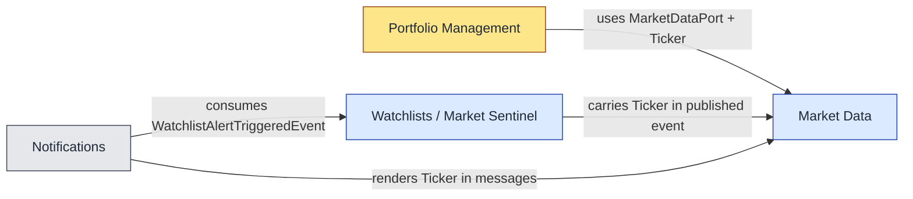

# 1. Domain-Driven Design in HexaStock

> **Reading prerequisites.** Familiarity with Eric Evans's *Domain-Driven Design: Tackling Complexity in the Heart of Software* (2003) and Vaughn Vernon's *Implementing Domain-Driven Design* (2013) is assumed. This chapter does not re-derive the patterns; it instantiates them in the HexaStock codebase.

## 1.1 Why DDD for a financial-portfolio platform

Financial portfolio management is a domain in which the cost of an *imprecise model* compounds rapidly. A single ambiguity — for example, conflating a *Lot* (a discrete purchase of shares at a specific price) with a *Holding* (the running aggregate of all open Lots for a given ticker) — propagates into incorrect cost-basis calculations, misleading profit-and-loss reports and, ultimately, regulatory exposure. The platform therefore treats the discovery and faithful encoding of the *ubiquitous language* as a first-class engineering activity rather than as analytical preamble.

DDD provides three layered toolkits that we exploit in sequence:

1. **Strategic patterns** — *Bounded Contexts*, *Context Maps*, the distinction between *Core*, *Supporting* and *Generic* subdomains — used to carve the system into independently evolvable units of meaning.
2. **Tactical patterns** — *Aggregates*, *Entities*, *Value Objects*, *Domain Services*, *Repositories*, *Domain Events* — used to encode invariants and behaviour inside each context.
3. **Modelling discipline** — *Ubiquitous Language*, *Knowledge Crunching*, *Refactoring towards deeper insight* — used to keep the model honest as the domain is better understood.

## 1.2 Strategic decomposition: the four bounded contexts

HexaStock is currently decomposed into four bounded contexts, each of which is a Spring Modulith application module (see Chapter 3 for the runtime enforcement mechanism).

### 1.2.1 Portfolio Management *(core subdomain)*

Owns the central business invariants: a `Portfolio` aggregate that holds a cash `Money` balance and a collection of `Holding` entities, each containing zero or more `Lot` entities under FIFO accounting. Cardinal use cases are *open portfolio*, *deposit / withdraw cash*, *buy stock*, *sell stock with FIFO realised gain* and *historical reporting*.

Its base package is `cat.gencat.agaur.hexastock.portfolios`. The aggregate root is
[Portfolio.java](../../domain/src/main/java/cat/gencat/agaur/hexastock/portfolios/model/portfolio/Portfolio.java). Lot is an entity inside the Holding sub-aggregate (see [Lot.java](../../domain/src/main/java/cat/gencat/agaur/hexastock/portfolios/model/portfolio/Lot.java)).

### 1.2.2 Market Data *(supporting subdomain)*

Owns the `Ticker` value object, the `StockPrice` value object and a single secondary port — `MarketDataPort` — that abstracts over external price providers (Finnhub, Alpha Vantage, a deterministic mock for tests). It is a *leaf* context: nothing in the rest of the platform depends on a specific provider.

Base package: `cat.gencat.agaur.hexastock.marketdata`.

### 1.2.3 Watchlists / Market Sentinel *(supporting subdomain, event publisher)*

Owns the `Watchlist` aggregate (a collection of `AlertEntry` value objects expressing price thresholds the user is interested in) and a domain service — `MarketSentinelService` — that periodically reads current prices for every distinct ticker referenced by an active watchlist, compares them to configured thresholds and publishes a `WatchlistAlertTriggeredEvent` for each match.

This is the only context that currently *publishes* a domain event for cross-context consumption. Chapter 4 dissects the event end-to-end.

Base package: `cat.gencat.agaur.hexastock.watchlists`.

### 1.2.4 Notifications *(generic subdomain, event consumer)*

Owns the `NotificationSender`, `NotificationDestination` and `NotificationRecipient` types, the channel-specific adapters (Telegram, logging) and the `WatchlistAlertNotificationListener` that consumes `WatchlistAlertTriggeredEvent`. It contains no business invariants; it is a transport layer for events emitted by other contexts.

Base package: `cat.gencat.agaur.hexastock.notifications`.

### 1.2.5 The current Context Map

The relationships between contexts are deliberately asymmetric and one-directional, which keeps the dependency graph acyclic and forms the substrate for Modulith verification:

In Context Map vocabulary:

- **Portfolio Management → Market Data** is a *Conformist* relationship: Portfolio Management does not influence the shape of `Ticker` or `StockPrice` and accepts them as the upstream model dictates.
- **Watchlists → Market Data** is also *Conformist* for the same reason.
- **Notifications → Watchlists** is a *Customer/Supplier* relationship implemented through a *Published Language* (the event payload), which is a deliberate design choice: Notifications must never call back into Watchlists synchronously.
- Market Data is a strict *Open Host Service* — it exposes a primary port (`GetStockPriceUseCase`) and, exceptionally, a secondary port (`MarketDataPort`) for batched look-ups consumed by Portfolio Management for performance reasons.

## 1.3 Tactical patterns inside Portfolio Management

The Portfolio Management context concentrates almost all the domain complexity in HexaStock and is therefore the natural showcase for tactical DDD.

### 1.3.1 The Portfolio aggregate root

`Portfolio` is the consistency boundary for everything that mutates a single user's holdings: it owns the cash balance, the list of `Holding`s, and the invariants that link them. The aggregate exposes intention-revealing methods — `deposit`, `withdraw`, `buy`, `sell` — and forbids direct mutation of its internal collections.

A typical invariant enforced inside the aggregate is *"a sale must reduce the balance only by the realised proceeds, never by the cost basis"*. Encapsulating this rule inside `Portfolio.sell(...)` — instead of in an application service — is the essence of tactical DDD: the rule cannot be bypassed because there is no other public path that mutates a Lot's `remainingShares`.

### 1.3.2 The Holding sub-aggregate and Lot entity

A `Holding` groups all open `Lot`s for a given `Ticker`. The `Lot` entity carries `initialShares`, `remainingShares`, `unitPrice` and `purchasedAt`, and exposes a `reduce(ShareQuantity)` operation that protects the *"remaining shares cannot go negative"* invariant. FIFO sale logic walks the Lots in chronological order and calls `reduce` on each in turn until the requested quantity is satisfied.

This decomposition is where the *ubiquitous language* of the financial domain meets the code: a portfolio has *holdings*, a holding is composed of *lots*, and a lot has a *cost basis*. Preserving these terms verbatim in the type system is what makes the model self-documenting for non-engineering domain experts.

### 1.3.3 Value objects

The `model.money` package contains the strongly-typed value objects that make the rest of the model both safe and expressive:

- `Money` — an immutable pair of `BigDecimal amount` plus `Currency`, with arithmetic that refuses to mix currencies.
- `Price` — semantically distinct from `Money` even though structurally similar; encodes "price per share".
- `ShareQuantity` — wraps a non-negative `int` count of shares; enforces positivity at construction.
- `Ticker` (in Market Data) — wraps an uppercase symbol after format validation.

Value objects are the single most under-appreciated tactical pattern in DDD. In HexaStock they account for roughly half the defects that would otherwise have escaped into integration tests, because the type system itself rejects illegal states (a `Money` cannot accidentally be added to a `ShareQuantity`; a negative `ShareQuantity` cannot be constructed).

### 1.3.4 Domain services and application services

The distinction is preserved with discipline:

- A **domain service** lives in the `domain` Maven module and operates only on aggregates and value objects. The most prominent example is the FIFO sale logic embedded inside `Portfolio.sell(...)`. (HexaStock currently keeps that logic *inside* the aggregate rather than in a separate domain service, because there is no need for it to be reused outside the Portfolio aggregate. This is a legitimate DDD modelling choice.)
- An **application service** lives in the `application` Maven module, has no business rules of its own, and orchestrates: it loads aggregates through ports, invokes their methods, and persists them back. `PortfolioStockOperationsService` is the canonical example: it performs the price look-up, calls `portfolio.sell(ticker, quantity, price)`, persists the aggregate and would be the natural place to publish a `LotSoldEvent` (see Chapter 5).

### 1.3.5 Repositories as outbound ports

Every aggregate has a corresponding *outbound port* in the application layer (`PortfolioPort`, `WatchlistPort`) and one or more adapters in the infrastructure layer (JPA entity + Spring Data repository, Mongo document + Spring Data repository). The port is expressed in domain terms — it returns `Optional<Portfolio>`, never an entity — and the adapter handles the impedance mismatch.

This is the bridge between DDD and Hexagonal Architecture, examined in Chapter 2.

## 1.4 Strategic discipline that the code already enforces

A subtle but powerful property of the HexaStock codebase is that its strategic decisions are not merely documented — they are *executed*. Three mechanisms do the enforcing:

1. **Maven module boundaries.** The `domain` module has no Spring, no JPA and no Jackson on its classpath. It is *physically impossible* for a domain class to leak a framework annotation. ADR-007 captures this constraint; the build itself enforces it.
2. **`HexagonalArchitectureTest`.** ArchUnit rules verify that no class in `domain` depends on `application`, that no class in `application` depends on adapter packages, and that controllers never reach into the domain directly. See Chapter 2.
3. **`ModulithVerificationTest`.** Spring Modulith's `MODULES.verify()` plus a small set of bespoke assertions enforce that no bounded context can call into another except through declared `allowedDependencies`. See Chapter 3.

DDD practitioners often complain that strategic boundaries dissolve under maintenance pressure. In HexaStock they cannot, because every boundary is checked on every CI build.

## 1.5 What DDD intentionally does *not* do for us

DDD provides no answer to the questions of *how to deploy*, *how to wire dependencies* or *how to keep adapters out of the domain*. Those questions are answered by Hexagonal Architecture (Chapter 2) and Spring Modulith (Chapter 3). Conversely, those two technologies do not tell us how to *think* about the domain — that is the contribution of DDD.

The three approaches are stratified, not competing:

| Layer | Question answered | HexaStock instantiation |
|---|---|---|
| DDD | What is the right model? | `Portfolio`, `Holding`, `Lot`, `Watchlist`, `WatchlistAlertTriggeredEvent` |
| Hexagonal | How do we keep the model framework-agnostic? | `domain` and `application` Maven modules, primary/secondary ports |
| Modulith | How do we keep contexts cleanly separated at runtime? | `@ApplicationModule`, `@NamedInterface`, `MODULES.verify()` |

The next two chapters take each lower layer in turn.
