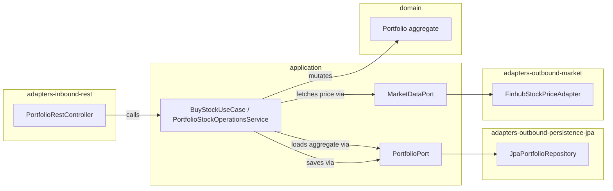

# 2. Hexagonal Architecture in HexaStock

> **Reading prerequisites.** Familiarity with Alistair Cockburn's *Hexagonal Architecture* (2005) and the broader *Ports and Adapters* literature (Vaughn Vernon, Tom Hombergs) is assumed.

## 2.1 The motivating question

Hexagonal Architecture answers a single, narrowly scoped question: *"how do we prevent the framework, the database and the delivery mechanism from reaching into the business model?"*. In a financial-portfolio platform that question is not academic. The cost-basis logic embedded in `Portfolio.sell(...)` must be testable in milliseconds without a Spring context, without a JPA EntityManager and without an HTTP server. It must also be reusable from a REST endpoint, a Telegram bot, a batch job and — eventually — from a different runtime altogether (a CLI, a serverless function, a JVM other than the Bootstrap one).

The hexagonal pattern delivers this by inverting the conventional control flow: the *domain* and the *application service* sit at the centre and define abstractions (*ports*); everything else is an *adapter* that plugs into one of those ports.

## 2.2 The Maven topology as the enforcement layer

In HexaStock, the hexagon is not an aspiration documented in a wiki. It is the Maven reactor:

```
domain/                                  no Spring, no JPA, no Jackson
application/                             no Spring (only @org.springframework
                                         imports allowed are in test scope)
adapters-inbound-rest/                   Spring Web, controller layer
adapters-inbound-telegram/               Spring Web, Telegram webhook
adapters-outbound-persistence-jpa/       Spring Data JPA, Hibernate
adapters-outbound-persistence-mongodb/   Spring Data MongoDB
adapters-outbound-market/                Spring RestClient, external APIs
adapters-outbound-notification/          Spring, Telegram client
bootstrap/                               composition root: Spring Boot
                                         application + integration tests
```

The dependency direction is one-way and is enforced both at compile time (because the dependency is declared in the child `pom.xml`) and at architecture-test time. A class in `domain` cannot import from `application` because `domain/pom.xml` does not depend on `application`. A class in `application` cannot import from `adapters-outbound-persistence-jpa` because `application/pom.xml` does not depend on it. A controller in `adapters-inbound-rest` cannot reach into `domain` because the architecture tests forbid it (only the application layer is reachable from a controller).

This is the *physical* manifestation of the hexagon. The *logical* manifestation lives inside `application/`.

## 2.3 Primary and secondary ports

The vocabulary is unambiguous in the codebase:

- **Primary ports** (`application/.../port/in/`) are interfaces whose implementations live in the application layer (`*Service`). They express *use cases* — "buy stock", "sell stock", "create watchlist", "detect buy signals". Inbound adapters call them.
- **Secondary ports** (`application/.../port/out/`) are interfaces whose implementations live in the outbound-adapter layer. They express *capabilities the use case requires from the outside world* — "load a portfolio by id", "fetch the current price for a ticker", "publish a domain event". The application layer depends on the abstractions; the implementations are wired in by the Bootstrap module.

A representative use-case slice:



Three properties of this picture deserve emphasis:

1. **The application layer holds no transitive dependency on Spring, JPA or Hibernate.** Every dotted line from `application` to an outbound concrete class crosses a port interface; the concrete class is wired in by the Bootstrap module's `SpringAppConfig`.
2. **The domain layer is invisible to inbound adapters.** A controller can never new up a `Portfolio` directly; it must go through a use case. That use case is the only legitimate orchestrator of aggregate state changes.
3. **Adapters are replaceable in isolation.** Switching the JPA persistence adapter for the MongoDB one — or vice versa — requires zero changes in `application/` or `domain/`. The two persistence adapters live side by side in the build today and share a contract test (`AbstractPortfolioPortContractTest`) that both implementations satisfy.

## 2.4 Why the hexagon survives Spring Modulith

The most common misunderstanding voiced about HexaStock by engineers seeing the project for the first time is *"with Modulith you would no longer need the Maven hexagon — you could fold everything into a single module organised by package"*. This is incorrect, and the misunderstanding is worth defusing explicitly.

The two decompositions are *orthogonal*:

| | Maven decomposition | Modulith decomposition |
|---|---|---|
| **Unit** | A `*.jar` artefact with its own classpath | A package tree with `@ApplicationModule` annotation |
| **Boundary enforced at** | Compile time (transitive dependency graph) | Runtime + verification time (`MODULES.verify()`) |
| **Question answered** | "What may this code *import*?" | "What may this bounded context *call*?" |
| **HexaStock value** | Keeps Spring out of the domain (ADR-007) | Keeps `notifications` from calling into `portfolios` |

A Maven module *cannot* answer the second question, because once two contexts share a classpath there is nothing to stop a class in one from importing a class in the other. A Modulith application module *cannot* answer the first question, because `@ApplicationModule` is a Spring annotation that lives on the classpath that includes Spring; it does not protect the domain from framework leakage.

HexaStock therefore uses both, and it does so by design: each Maven module groups *layers* of the hexagon (domain, application, inbound-X adapter, outbound-X adapter, bootstrap), and each Modulith module groups a *bounded context*'s slice across all of those Maven modules. The two decompositions intersect orthogonally.

A worked example: the Watchlists Modulith module spans

- `domain/.../watchlists/model/watchlist/` (entities and value objects),
- `application/.../watchlists/application/{port.in,port.out,service}/` (ports and use case),
- `adapters-inbound-rest/.../watchlists/adapter/in/` (REST controller and DTOs),
- `adapters-outbound-persistence-jpa/.../watchlists/adapter/out/persistence/jpa/`,
- `adapters-outbound-persistence-mongodb/.../watchlists/adapter/out/persistence/mongodb/`,

while the Maven `application` module spans `portfolios.application.*`, `marketdata.application.*` and `watchlists.application.*` — three Modulith contexts in one Maven module.

## 2.5 The three architecture tests that hold the line

Three suites, all in the Bootstrap module, defend the hexagon and the contexts:

1. [HexagonalArchitectureTest.java](../../bootstrap/src/test/java/cat/gencat/agaur/hexastock/architecture/HexagonalArchitectureTest.java) — ArchUnit rules covering domain isolation, application-layer purity and adapter-direction conventions.
2. [ModulithVerificationTest.java](../../bootstrap/src/test/java/cat/gencat/agaur/hexastock/architecture/ModulithVerificationTest.java) — Spring Modulith's `MODULES.verify()` plus bespoke assertions on each module's allowed dependencies.
3. The contract tests for outbound adapters (`AbstractPortfolioPortContractTest`, `AbstractWatchlistPortContractTest`, `AbstractWatchlistQueryPortContractTest`) — one abstract test class per port, two concrete subclasses per adapter (JPA and Mongo) — which prove that both implementations satisfy the same behavioural contract derived from the port's Javadoc.

These three suites together turn the hexagon from a documentation artefact into a *failing build* if the rules are broken.

## 2.6 ADR-007: the application layer stays Spring-free

A consequential and frequently revisited architectural decision is that the `application` Maven module's main classpath has no `org.springframework.*` imports. The implications run deep:

- The `DomainEventPublisher` interface lives in `application/.../port/out/`, but its concrete adapter `SpringDomainEventPublisher` lives in `bootstrap/.../config/events/`. Application services depend on the interface; Spring's `ApplicationEventPublisher` is hidden behind it.
- Application services receive their dependencies through plain constructors. They are wired by `SpringAppConfig` in the Bootstrap module, not by a `@Service` annotation on the service class.
- Use cases can be unit-tested in plain JUnit without `@SpringBootTest`. A typical service test in `application/src/test/java/...` constructs the service with hand-built fakes and never starts a Spring context.

The Modulith annotations themselves illustrate the rule's force: the `@ApplicationModule` annotation for the `watchlists` context cannot live in the `application` module's `package-info.java` (because that would import a Spring annotation into the application classpath). It lives instead in the Bootstrap module's mirror package — a separate `package-info.java` declared on the same logical Java package — so the annotation is on the classpath but not in the application module. The arrangement is replicated for `portfolios`, `marketdata` and `notifications`. This is a deliberate, documented exception machinery that preserves both ADR-007 and Modulith's package-based discovery.

## 2.7 The hexagon as the substrate for everything that follows

Without the hexagonal Maven topology, none of the rest of the architecture would be tractable. Spring Modulith verification depends on package-level boundaries that are themselves a consequence of the hexagonal cut. Domain events as plain POJOs depend on the application layer being framework-free, which is itself an enforcement of the hexagon. Contract testing of adapters depends on adapters and ports being separated.

The hexagon is therefore not in tension with Modulith; it is its prerequisite.
