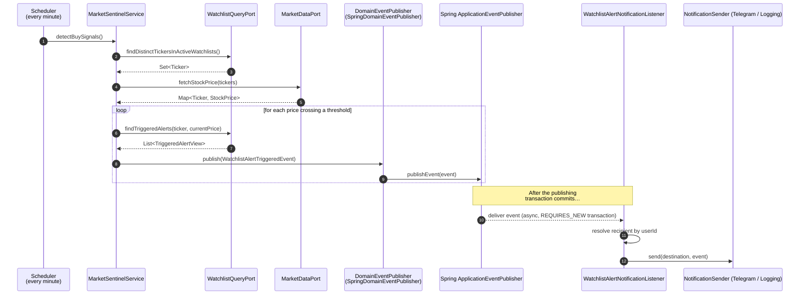

# 4. Domain Events — Deep Dive

> **Reading prerequisites.** Familiarity with the Domain Events pattern as described by Evans, Vernon and Fowler. This chapter dissects the only domain event currently in production in HexaStock — `WatchlistAlertTriggeredEvent` — from authoring to consumption.

## 4.1 Why domain events at all

Two motivations dominate the decision to introduce domain events into a bounded-context-aligned codebase:

1. **Decoupling of business reactions from business decisions.** A *fact* in the domain ("a watchlist alert has triggered for ticker AAPL at threshold $200") is logically distinct from any *reaction* to it ("send a Telegram message"). Encoding the fact as an event allows reactions to be added, replaced or duplicated without touching the publisher.
2. **Eventually-consistent integration without a message broker.** Spring Modulith's `@ApplicationModuleListener` provides asynchronous, after-commit, transaction-scoped event delivery *inside the JVM*, with a clean upgrade path to a real broker (Kafka, RabbitMQ, AMQP) using `spring-modulith-events-kafka` / `spring-modulith-events-amqp` *without changing the publisher or the listener code*. The same publisher and listener types work in both deployment modes; only the externalisation adapter changes.

For HexaStock today, the in-process flavour is more than sufficient. The architecture is, however, designed so that the move to externalised events would be a configuration change, not a refactor.

## 4.2 The current event: `WatchlistAlertTriggeredEvent`

### 4.2.1 Authorship and shape

The event lives in [application/.../watchlists/WatchlistAlertTriggeredEvent.java](../../application/src/main/java/cat/gencat/agaur/hexastock/watchlists/WatchlistAlertTriggeredEvent.java). It is a Java `record` — immutable by construction, with structural equality and a compact canonical representation.

Three properties of the design bear emphasis:

1. **No infrastructure dependency.** The event imports `Ticker` and `Money` and nothing else from the project. There is no Spring annotation, no Jackson annotation, no JPA annotation. The class compiles in the framework-free `application` Maven module.
2. **Business identity, not transport identity.** The payload carries `userId` (the business identifier of the watchlist owner) and *not* a `chatId`, `email` or `phoneNumber`. This is a deliberate boundary: the publisher's domain model has no notion of "delivery channel"; mapping `userId` to a delivery destination is the consumer's responsibility.
3. **Self-validation in the canonical constructor.** The compact constructor calls `Objects.requireNonNull` on every required field, ensuring that a malformed event cannot be published.

### 4.2.2 Publication: the `DomainEventPublisher` port

The publisher is an outbound port — [DomainEventPublisher.java](../../application/src/main/java/cat/gencat/agaur/hexastock/application/port/out/DomainEventPublisher.java) — with a single method:

```java
public interface DomainEventPublisher {
    void publish(Object event);
}
```

The deliberate use of `Object` (rather than a marker interface or a parameterised `T extends DomainEvent`) reflects a stylistic decision in the codebase: domain events are plain records and do not implement any framework-imposed marker. Spring Modulith identifies them by *publication* through this port, not by type membership.

The Spring adapter that backs this port is `SpringDomainEventPublisher` in `bootstrap/.../config/events/`. It wraps Spring's `ApplicationEventPublisher` and is the only place in the codebase where the framework's publisher is referenced. No application service depends on Spring; all of them depend on the port.

### 4.2.3 The publication site

The publication takes place inside [MarketSentinelService.detectBuySignals()](../../application/src/main/java/cat/gencat/agaur/hexastock/watchlists/application/service/MarketSentinelService.java). The relevant kernel of the method:

```java
prices.forEach((ticker, stockPrice) -> {
    Money currentPrice = stockPrice.price().toMoney();
    queryPort.findTriggeredAlerts(ticker, currentPrice)
             .forEach(view -> eventPublisher.publish(toEvent(view, currentPrice)));
});
```

The service:

1. Reads the set of tickers referenced by *active* watchlists from the CQRS read side (`WatchlistQueryPort`), avoiding any aggregate hydration cost.
2. Performs a *single* batched price look-up through `MarketDataPort.fetchStockPrice(Set<Ticker>)`.
3. For each (ticker, current price) pair, asks the query port for the materialised view of every alert whose threshold is now reached.
4. Translates each `TriggeredAlertView` into a `WatchlistAlertTriggeredEvent` and publishes it.

There is no awareness of *who* will consume the event, *when*, or through *which channel*.

### 4.2.4 Consumption: the `@ApplicationModuleListener`

The consumer is in [WatchlistAlertNotificationListener.java](../../adapters-outbound-notification/src/main/java/cat/gencat/agaur/hexastock/notifications/WatchlistAlertNotificationListener.java):

```java
@Component
public class WatchlistAlertNotificationListener {
    @ApplicationModuleListener
    public void on(WatchlistAlertTriggeredEvent event) {
        NotificationRecipient recipient = recipientResolver.resolve(event.userId());
        for (NotificationDestination destination : recipient.destinations()) {
            NotificationSender sender = pickSender(destination);
            if (sender == null) { /* warn and continue */ }
            sender.send(destination, event);
        }
    }
}
```

`@ApplicationModuleListener` is functionally equivalent to the combination
`@TransactionalEventListener(AFTER_COMMIT) + @Async + @Transactional(REQUIRES_NEW)`. The semantic guarantees that this combination provides are central to HexaStock's reasoning:

- **AFTER_COMMIT.** The listener fires only if the publishing transaction *commits*. A rolled-back trigger never produces a notification.
- **`@Async`.** The listener runs on a different thread, so a slow Telegram client never blocks the publisher.
- **`@Transactional(REQUIRES_NEW)`.** Each listener invocation gets its own transaction, so a notification failure does not corrupt the publishing context.

This is exactly the property that makes domain events tractable in a financial system. A botched notification cannot reverse a triggered alert; conversely, a rolled-back alert cannot leak a stray notification.

## 4.3 The end-to-end flow



The diagram makes plain that the publisher and the consumer are separated by an *event bus boundary*, even though both run inside the same JVM. The boundary is what makes the architecture amenable to future evolution.

## 4.4 The architecture verifications that hold around the event

Two architectural assertions in [ModulithVerificationTest.java](../../bootstrap/src/test/java/cat/gencat/agaur/hexastock/architecture/ModulithVerificationTest.java) are particularly relevant:

- `watchlistsHasNoOutgoingModuleDependencies` — proves that Watchlists' only outgoing cross-module dependency is on `marketdata`. In particular, Watchlists has no compile-time dependency on Notifications. The arrow from Watchlists to Notifications exists only at runtime through the event bus.
- `notificationsOnlyDependsOnWatchlists` — proves that Notifications depends only on `watchlists` (for the event type) and `marketdata::model` (for `Ticker` rendering). It cannot, for example, accidentally start importing the `Watchlist` aggregate.

These assertions are the formal counterpart of the diagram above. They hold today and they will continue to hold as new events are added in Chapter 5.

## 4.5 Integration test coverage

The end-to-end flow is exercised by [NotificationsEventFlowIntegrationTest.java](../../bootstrap/src/test/java/cat/gencat/agaur/hexastock/notifications/NotificationsEventFlowIntegrationTest.java), which:

1. Boots the full Spring context (`@SpringBootTest`).
2. Seeds a watchlist with an active alert via the application port.
3. Publishes a synthetic price crossing through `MarketSentinelService`.
4. Awaits the asynchronous listener execution (`Awaitility`) and asserts that exactly one notification reached the configured logging sender, with the expected payload.

The test is *behavioural*: it does not assert on Spring internals or on event-bus mechanics. It merely proves that "when a threshold is crossed, a notification is emitted with the right payload, after the publishing transaction has committed".

## 4.6 Common questions and their answers

**Q. Why not use Spring's `ApplicationEventPublisher` directly in the application service?**
Because the application Maven module is intentionally Spring-free (ADR-007). The `DomainEventPublisher` port is the indirection that preserves that constraint. The cost of the indirection is one interface and one adapter; the benefit is that application services remain unit-testable without a Spring context.

**Q. Why is the event in the `application` module rather than in `domain`?**
Because the event references `Ticker` from `marketdata::model`. The `domain` Maven module's `watchlists` package depends only on its own value objects; the cross-context payload composition belongs in `application`. A future refactor could promote the event to `domain` if `Ticker` were also moved (it currently lives under `marketdata.model.market`), but the present arrangement is internally consistent.

**Q. Why an in-process bus rather than Kafka from day one?**
Because the operational cost of running a broker for a single low-cardinality event would dwarf the engineering cost of the in-process design, and because `spring-modulith-events-{kafka, amqp, jms}` provide a drop-in upgrade when the cardinality justifies it. The publisher and consumer code does not change; only the externalisation adapter does.

**Q. What happens if the listener throws?**
With `@ApplicationModuleListener`, the listener's `REQUIRES_NEW` transaction rolls back; the publishing transaction is unaffected (it has already committed). Spring Modulith's *event publication registry* (when configured with `spring-modulith-events-jpa` or `-mongodb`) records the failure and supports re-delivery. The current configuration uses the in-memory registry, sufficient for development and demonstration but not for production durability — a future hardening step.

The next chapter looks forward, identifying further domain events whose introduction would refine the same pattern.
