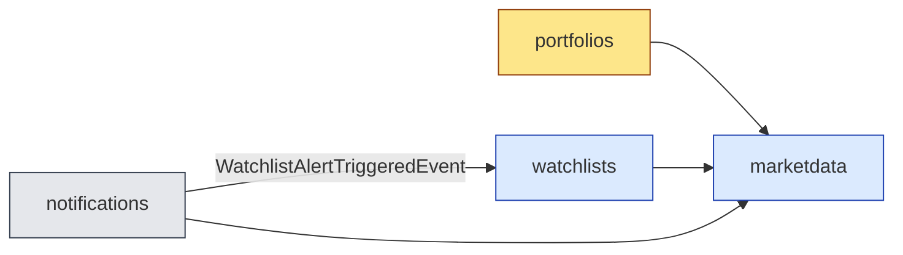

# HexaStock — Consultancy Cheat Sheet

> One-page revision aid. Read on the morning of the consultancy. For the full narrative, see Chapters 1–5 of the [briefing pack](README.md).

---

## A. The three layers of architectural concern

| Layer | Question | HexaStock answer |
|---|---|---|
| **DDD** | What is the right model? | Four bounded contexts: `portfolios` (core), `marketdata` (supporting), `watchlists` (supporting), `notifications` (generic). |
| **Hexagonal** | How do we keep the model framework-agnostic? | A Maven reactor with `domain` (no Spring), `application` (no Spring), inbound adapters, outbound adapters, `bootstrap` (composition root). |
| **Modulith** | How do we keep contexts cleanly separated at runtime? | `@ApplicationModule` + `@NamedInterface` + `MODULES.verify()` in `ModulithVerificationTest`. |

The three are *stratified*, not competing. Each lower layer enables the one above.

## B. The Maven hexagon at a glance

```
domain/                                  pure Java, no frameworks
application/                             ports + use cases, no Spring
adapters-inbound-rest/                   Spring Web controllers
adapters-inbound-telegram/               Telegram webhook
adapters-outbound-persistence-jpa/       Spring Data JPA
adapters-outbound-persistence-mongodb/   Spring Data MongoDB
adapters-outbound-market/                External price providers
adapters-outbound-notification/          Telegram + logging senders
bootstrap/                               Spring Boot composition root
```

Why preserved under Modulith: Maven enforces *what may import what at compile time*; Modulith enforces *what may call what at runtime*. They are orthogonal — keep both.

## C. The four bounded contexts



- `marketdata` is a **leaf** (no outgoing module dependencies).
- `notifications` and `watchlists` are connected only by an **in-process domain event**; there is no compile-time dependency from `watchlists` on `notifications`.

## D. The single domain event in production

`WatchlistAlertTriggeredEvent` — a Java `record` in `application/.../watchlists/`.

**Publication path:**

1. `MarketSentinelService.detectBuySignals()` (application service)
2. `DomainEventPublisher.publish(event)` (port — application layer)
3. `SpringDomainEventPublisher` (adapter — bootstrap layer)
4. Spring `ApplicationEventPublisher`

**Consumption path:**

1. `@ApplicationModuleListener` on `WatchlistAlertNotificationListener.on(event)`
2. → `NotificationRecipientResolver.resolve(userId)`
3. → `NotificationSender.send(destination, event)` (Telegram or logging)

**Semantic guarantees of `@ApplicationModuleListener`:**

- `AFTER_COMMIT` — fires only if the publishing transaction commits.
- `@Async` — runs on a different thread.
- `@Transactional(REQUIRES_NEW)` — listener failure does not corrupt publisher.

## E. The five rules every event must respect

1. **Java `record`.** Immutable by construction.
2. **No infrastructure imports.** No Spring, no Jackson, no JPA.
3. **Business identity, not transport identity.** Carry `userId`, never `chatId`/`email`.
4. **Past tense name.** `LotSoldEvent`, not `SellLotCommand`.
5. **`Instant occurredOn`.** UTC, mandatory.

## F. The roadmap of future events

| Event | Publisher | Why it matters | Plausible consumers |
|---|---|---|---|
| **`LotSoldEvent`** *(highest priority)* | `PortfolioStockOperationsService.sellStock(...)` | Per-lot realised gain → tax reporting, audit, brokerage reconciliation. May fire multiple times per sale (one per lot consumed under FIFO). | `reporting`, `audit`, `integrations.brokerage`, `watchlists` |
| **`StockBoughtEvent` / `StockSoldEvent`** | Same service | Aggregate-level trade fact. Feeds transaction history, trading-volume dashboards, optional confirmations. | `reporting`, `notifications`, `watchlists` |
| **`CashDepositedEvent` / `CashWithdrawnEvent`** | Cash operations service | Feeds balance-threshold alerts in Watchlists, AML/KYC monitors, daily-balance projections. | `watchlists`, `audit`, `reporting` |
| **`PortfolioOpenedEvent` / `PortfolioClosedEvent`** | Portfolio lifecycle service | Welcome notifications, retention analytics, closure audits. | `notifications`, `reporting`, `audit` |
| **`WatchlistAlertSilencedEvent`** | `MarketSentinelService` | Companion to a future *alert silencing* feature; prevents notification storms. | `notifications`, *alert-storm dashboard* |

**Suggested introduction order:** Lot/Stock events → Cash events → Portfolio lifecycle → Alert silencing.

## G. Why Lot-level events deserve a dedicated explanation

A single `Portfolio.sell(...)` invocation under FIFO accounting may consume *multiple* `Lot` entities — possibly partially. Each consumption is an independent business fact: it has its own cost basis, its own realised gain, and its own purchase date (which matters for tax holding-period rules). Encoding each consumption as its own `LotSoldEvent` therefore mirrors the domain and unlocks per-lot consumers (audit, reporting) that an aggregate-level event would force into recomputation.

This is the canonical *"one aggregate operation, multiple emitted events"* pattern. It is currently absent from HexaStock; introducing it is the recommended first step of the roadmap.

## H. Talking points for the consultancy

Three points that consistently land well:

1. **"The hexagon is the substrate, Modulith is the runtime contract."** Spell out the orthogonality (Section A above). Most engineers expect to choose one or the other.
2. **"The publisher knows nothing of the consumer."** Walk the code: open `MarketSentinelService` (no `@Component`, no Spring), then `WatchlistAlertNotificationListener` (no reference to Watchlists internals — only to the event type). The decoupling is *visible*.
3. **"Lot-level events come for free."** Open `Portfolio.sell(...)` and show that the FIFO loop already iterates lots. Adding a `LotSoldEvent` per iteration is a five-line change *because* of the architecture.

## I. Live demo script (15 minutes)

| Min | Action |
|---|---|
| 0–2 | Show `./mvnw clean verify -DskipITs` running. Highlight `MODULES.verify()` and the architecture-test suites passing. |
| 2–5 | Open the four `package-info.java` files of the application modules; explain `allowedDependencies` and `@NamedInterface`. |
| 5–8 | Open `WatchlistAlertTriggeredEvent`, `MarketSentinelService.detectBuySignals()`, `WatchlistAlertNotificationListener`. Trace one event through the pipeline. |
| 8–11 | Run `NotificationsEventFlowIntegrationTest`. Show the assertion that the listener fired *after commit*, on a different thread, with the right payload. |
| 11–13 | Show `bootstrap/target/spring-modulith-docs/`: the auto-generated module diagram. |
| 13–15 | Walk the `Portfolio.sell(...)` FIFO loop and sketch — on the screen, in the IDE — where `eventPublisher.publish(new LotSoldEvent(...))` would go. Close with the roadmap table from Section F. |

## J. Files you may want open during the session

- [Portfolio.java](../../domain/src/main/java/cat/gencat/agaur/hexastock/portfolios/model/portfolio/Portfolio.java)
- [Lot.java](../../domain/src/main/java/cat/gencat/agaur/hexastock/portfolios/model/portfolio/Lot.java)
- [WatchlistAlertTriggeredEvent.java](../../application/src/main/java/cat/gencat/agaur/hexastock/watchlists/WatchlistAlertTriggeredEvent.java)
- [DomainEventPublisher.java](../../application/src/main/java/cat/gencat/agaur/hexastock/application/port/out/DomainEventPublisher.java)
- [MarketSentinelService.java](../../application/src/main/java/cat/gencat/agaur/hexastock/watchlists/application/service/MarketSentinelService.java)
- [WatchlistAlertNotificationListener.java](../../adapters-outbound-notification/src/main/java/cat/gencat/agaur/hexastock/notifications/WatchlistAlertNotificationListener.java)
- [ModulithVerificationTest.java](../../bootstrap/src/test/java/cat/gencat/agaur/hexastock/architecture/ModulithVerificationTest.java)
- [HexagonalArchitectureTest.java](../../bootstrap/src/test/java/cat/gencat/agaur/hexastock/architecture/HexagonalArchitectureTest.java)
- [MODULITH-BOUNDED-CONTEXT-INVENTORY.md](../architecture/MODULITH-BOUNDED-CONTEXT-INVENTORY.md)

Good luck.
