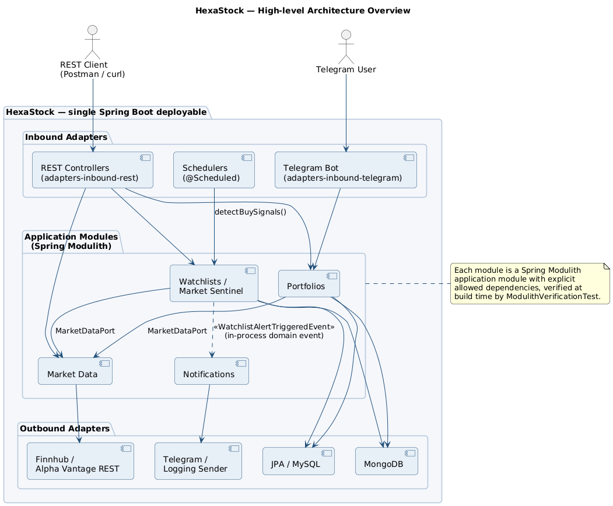

# 00 — Architecture Overview

> **Audience.** Senior Java engineers and architects attending the Monday session.
> **Reading time.** ~15 minutes.
> **Prerequisite.** Working knowledge of Spring Boot and basic DDD vocabulary.

---

## 1. What HexaStock is

HexaStock is a small but realistic financial-portfolio backend used inside the
Generalitat de Catalunya / AGAUR teaching context. Functionally it lets a user:

- open a **Portfolio**, deposit and withdraw cash,
- **buy** stocks at the current market price (creating *lots* with FIFO ordering),
- **sell** stocks consuming those lots in FIFO order and computing realised
  profit / loss,
- inspect **Transactions** (an append-only ledger of all monetary movements),
- maintain **Watchlists** with price-threshold alerts, and receive a
  **notification** when an alert triggers.

Stock prices come from external market-data providers (Finnhub, Alpha Vantage,
plus a deterministic mock for tests). Notifications are delivered today through
either a Telegram bot or a logging sink, depending on the active Spring profile.

The whole system runs as a **single Spring Boot deployable** with an embedded
relational option (JPA / MySQL or H2) and a MongoDB option for the persistence
side. There are no microservices. There is no message broker.

---

## 2. Business capabilities (≈ candidate bounded contexts)

Four business capabilities have been identified, each promoted to a Spring
Modulith application module:

| Capability | Modulith module | Core types |
|---|---|---|
| Portfolio management & FIFO trading | `portfolios` | `Portfolio`, `Lot`, `Transaction` |
| Market data acquisition | `marketdata` | `Ticker`, `StockPrice`, `MarketDataPort` |
| Watchlists & alert detection | `watchlists` | `Watchlist`, `AlertEntry`, `MarketSentinelService` |
| Outbound notifications | `notifications` | `NotificationChannel`, `NotificationDestination`, `NotificationSender` |

The provenance of those modules is the inventory in
[`doc/architecture/MODULITH-BOUNDED-CONTEXT-INVENTORY.md`](../../architecture/MODULITH-BOUNDED-CONTEXT-INVENTORY.md);
their boundaries are enforced at build time by
[`ModulithVerificationTest`](../../../bootstrap/src/test/java/cat/gencat/agaur/hexastock/architecture/ModulithVerificationTest.java).

---

## 3. The four architectural styles in play, and how they coexist

```
DDD              ──►  decides where the boundaries between capabilities lie
Hexagonal        ──►  decides where the boundaries between layers lie
Spring Modulith  ──►  enforces both at build time
Domain Events    ──►  let one capability react to another without coupling
```

[](diagrams/Rendered/01-architecture-overview.svg)

### 3.1 DDD — strategic and tactical

- The four bounded contexts above are *strategic DDD* applied to this codebase.
- Inside each context the *tactical DDD* vocabulary is used: aggregate roots
  (`Portfolio`, `Watchlist`), value objects (`Money`, `Ticker`, `Price`,
  `ShareQuantity`), domain services where they earn their keep, repositories
  hidden behind ports.
- The ubiquitous language is documented in
  [`doc/tutorial/sellStocks/UBIQUITOUS-LANGUAGE.md`](../../tutorial/sellStocks/UBIQUITOUS-LANGUAGE.md)
  and referenced by `SELL-STOCK-DOMAIN-TUTORIAL.md`.

### 3.2 Hexagonal Architecture — ports and adapters

- The hexagon is *per bounded context*, not global. Each capability has its own
  primary ports (`...UseCase`) and secondary ports (`...Port`).
- Layering is enforced by **Maven module dependencies**: `application` depends
  on `domain`; every adapter module depends on `application`; only `bootstrap`
  depends on adapters. The dependency graph is in
  [diagrams/02-maven-multimodule.puml](diagrams/02-maven-multimodule.puml).
- The *application* Maven module is intentionally Spring-free
  ([ADR-007](../../architecture/adr/)). The only Spring annotation tolerated
  there is `jakarta.transaction.@Transactional`, which is a JTA spec annotation
  rather than a Spring one. Everything Spring-aware lives in `bootstrap` or in
  outbound adapter modules.
- A second build-time guard, `HexagonalArchitectureTest` (ArchUnit), fails the
  build if a domain class imports `org.springframework.*`, `jakarta.persistence.*`,
  or `com.fasterxml.jackson.*`.

### 3.3 Spring Modulith — runtime enforcement of bounded contexts

- Each business capability is a top-level Java package directly under
  `cat.gencat.agaur.hexastock.*` — `portfolios`, `marketdata`, `watchlists`,
  `notifications`. That makes them detectable as Modulith application modules.
- The `@org.springframework.modulith.ApplicationModule` annotations live on
  `package-info.java` files inside the **bootstrap** Maven module so the
  `application` module stays Spring-free; runtime detection works because
  Spring Modulith scans by package, not by JAR.
- Allowed cross-module dependencies are declared explicitly:

  ```text
  portfolios     → marketdata::model, marketdata::port-out
  watchlists     → marketdata::model
  notifications  → watchlists, marketdata::model
  ```

- `ModulithVerificationTest.verifyModuleStructure()` calls `MODULES.verify()`
  to fail the build on any cycle or undeclared cross-module dependency.

### 3.4 Domain Events — the only intentional decoupling mechanism today

- Exactly one domain event flows in production: `WatchlistAlertTriggeredEvent`,
  emitted by `MarketSentinelService` and consumed by
  `WatchlistAlertNotificationListener` (in the `notifications` module) using
  `@ApplicationModuleListener`.
- The event is a plain Java `record`. The publisher is an outbound port
  (`DomainEventPublisher`) implemented by `SpringDomainEventPublisher`, which
  delegates to Spring's `ApplicationEventPublisher`. Application code never
  imports anything from Spring.
- See the deep dive: [02-WATCHLISTS-EVENT-FLOW-DEEP-DIVE.md](02-WATCHLISTS-EVENT-FLOW-DEEP-DIVE.md).

---

## 4. Why this combination makes sense *here*

HexaStock is small enough that microservices would be massive over-engineering,
but it is structured enough that a "fat Spring Boot project" would erode
quickly. The combination of the four styles addresses that trade-off:

- **DDD gives the boundaries.** Without them every other tool degenerates into
  ceremony.
- **Hexagonal gives the layering.** It keeps the domain free of frameworks and
  makes adapters interchangeable (JPA *and* MongoDB persistence both compile
  against the same ports).
- **Spring Modulith gives the enforcement.** It is the difference between a
  bounded context being a *team agreement* and being a *failing build*.
- **Domain events give the in-process decoupling.** They let two modules
  collaborate without one importing the other's internals — a property that
  becomes very valuable on day one of every cross-team change.

The thesis the consultancy will defend is that this combination is
**deliberately conservative**: the project is one deployable, no broker, no
outbox, no event store. The architectural shape, however, is the one that lets
the project grow into any of those choices later without rewriting the domain.

---

## 5. What this overview is *not*

- It is not a defence of the current layout against the alternatives — that is
  in [03-LAYOUT-ALTERNATIVES.md](03-LAYOUT-ALTERNATIVES.md).
- It is not a deep dive on any single mechanism — see the dedicated documents.
- It does not claim that the current implementation is production-ready under
  arbitrary load or reliability targets — see [04-PRODUCTION-EVOLUTION.md](04-PRODUCTION-EVOLUTION.md).
