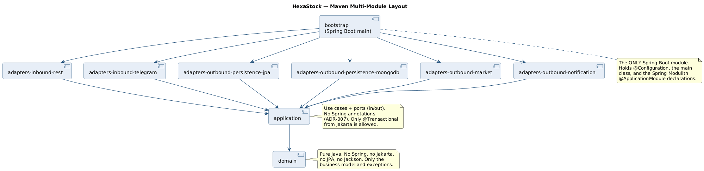
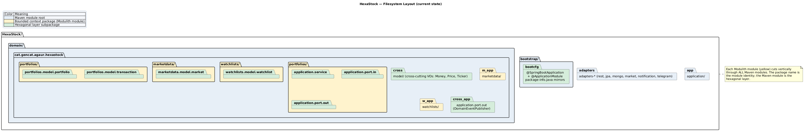
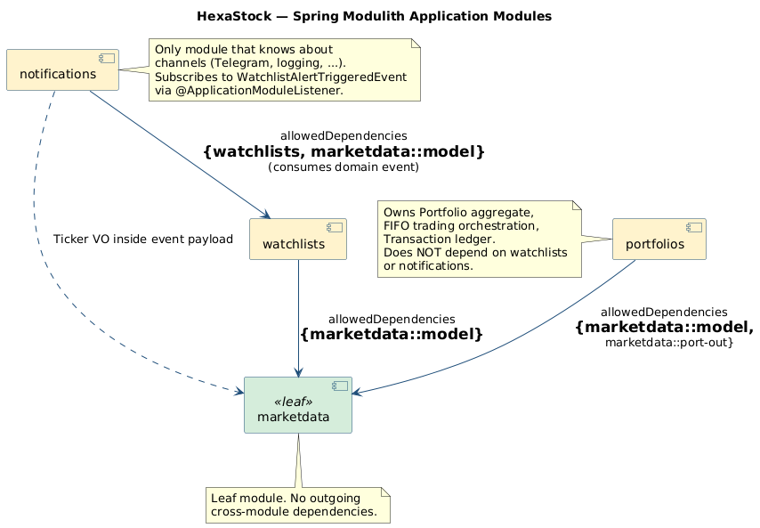

# 01 — Filesystem, Maven and Modulith Structure

> **Audience.** Engineers who will navigate the codebase live during the session.
> **Reading time.** ~15 minutes.

---

## 1. The three orthogonal axes

A frequent point of confusion when senior engineers first read this codebase is
that it is organised along **three orthogonal axes** simultaneously:

| Axis | Encoded by | Enforced by |
|---|---|---|
| Hexagonal layer (domain / application / adapter / bootstrap) | Maven modules | Maven dependency graph + `HexagonalArchitectureTest` (ArchUnit) |
| Bounded context (portfolios / marketdata / watchlists / notifications) | Top-level Java packages under `cat.gencat.agaur.hexastock.*` | `ModulithVerificationTest` (`MODULES.verify()`) |
| Adapter technology (JPA, Mongo, REST, Telegram, market provider) | Distinct Maven adapter modules | Maven module isolation |

Once you internalise that those three axes are independent, the layout reads
trivially.

---

## 2. Maven multi-module layout

[](diagrams/Rendered/02-maven-multimodule.svg)

The aggregator [`pom.xml`](../../../pom.xml) declares nine modules:

```text
domain
application
adapters-inbound-rest
adapters-inbound-telegram
adapters-outbound-notification
adapters-outbound-persistence-jpa
adapters-outbound-persistence-mongodb
adapters-outbound-market
bootstrap
```

Their dependency rules are simple and strictly enforced by Maven:

- `application` depends on `domain` (and on nothing Spring).
- Every `adapters-*` module depends on `application` (and may depend on its
  technology stack: JPA, Spring Data MongoDB, OkHttp, Telegram Bots, etc.).
- `bootstrap` is the *only* Spring Boot module. It depends on every adapter and
  contains `HexaStockApplication` (`@SpringBootApplication`), `@Configuration`
  classes, and the Spring Modulith `@ApplicationModule` declarations on
  `package-info.java`.

This forces a constraint that is easy to verify by reading any POM: the domain
module's POM is *minimal* — JUnit and AssertJ for tests, nothing else. The
application module's POM adds only what is strictly needed for use cases.

### Why split adapters into separate Maven modules at all?

Three reasons that survived several rounds of internal review:

1. **Compile-time isolation of optional adapters.** A deployment that does not
   want MongoDB simply does not include `adapters-outbound-persistence-mongodb`
   on the classpath. The application code does not change.
2. **Forced ports first.** A new adapter cannot be written until a port exists,
   because the adapter module depends on `application`, not the other way round.
3. **Clear cost of leaks.** An accidental import of, say, JPA in the domain
   would not even compile (the domain module has no `jakarta.persistence`
   dependency on its classpath).

---

## 3. Filesystem layout

[](diagrams/Rendered/03-filesystem-layout.svg)

Inside each Maven module, the source tree follows a single rule:

```text
<maven-module>/src/main/java/
  cat/gencat/agaur/hexastock/
    <bounded-context>/
      <hexagonal-sublayer>/
        ... Java types ...
```

Concrete examples for the **Watchlists** context:

```text
domain/src/main/java/cat/gencat/agaur/hexastock/
  watchlists/model/watchlist/Watchlist.java
  watchlists/model/watchlist/WatchlistId.java
  watchlists/model/watchlist/AlertEntry.java
  watchlists/model/watchlist/AlertNotFoundException.java
  watchlists/model/watchlist/DuplicateAlertException.java

application/src/main/java/cat/gencat/agaur/hexastock/
  watchlists/package-info.java                     ← javadoc + Modulith intent
  watchlists/WatchlistAlertTriggeredEvent.java     ← published API (record)
  watchlists/application/port/in/WatchlistUseCase.java
  watchlists/application/port/in/MarketSentinelUseCase.java
  watchlists/application/port/out/WatchlistPort.java
  watchlists/application/port/out/WatchlistQueryPort.java
  watchlists/application/port/out/TriggeredAlertView.java
  watchlists/application/service/WatchlistService.java
  watchlists/application/service/MarketSentinelService.java

adapters-inbound-rest/src/main/java/cat/gencat/agaur/hexastock/
  watchlists/adapter/in/...                        ← REST controller, DTOs

adapters-outbound-persistence-jpa/src/main/java/cat/gencat/agaur/hexastock/
  watchlists/adapter/out/persistence/jpa/...       ← JPA entities + repository

adapters-outbound-persistence-mongodb/src/main/java/cat/gencat/agaur/hexastock/
  watchlists/adapter/out/persistence/mongodb/...   ← Mongo documents + repository

bootstrap/src/main/java/cat/gencat/agaur/hexastock/
  watchlists/package-info.java                     ← @ApplicationModule lives here
```

Read that vertical slice once and you have read every bounded context — they
all follow the same template.

---

## 4. The relationship between Maven modules, Java packages, and Modulith modules

| Concept | Identity carrier | Example |
|---|---|---|
| Maven module | `pom.xml` artifact id | `application` |
| Hexagonal sublayer | Suffix in package name | `application.port.in`, `application.service` |
| Bounded context | Top-level package under `cat.gencat.agaur.hexastock` | `watchlists` |
| Modulith module | Same top-level package | `watchlists` (detected by Spring Modulith) |
| Modulith *named interface* | Inner package marked with `@NamedInterface` | `marketdata::port-out` |

Three observations matter for the consultancy:

- **A Modulith module is a package, not a JAR.** It cuts vertically through
  Maven modules. The Watchlists Modulith module spans `domain`, `application`,
  `adapters-inbound-rest`, `adapters-outbound-persistence-jpa`,
  `adapters-outbound-persistence-mongodb`, and `bootstrap`.
- **`package-info.java` files appear twice for the same package** — once in
  `application` (Spring-free, javadoc only) and once in `bootstrap` (carrying
  `@ApplicationModule`). This is the price ADR-007 pays to keep `application`
  pure. The duplication is intentional and has a long comment in the
  bootstrap-side `package-info.java` explaining why.
- **Cross-module dependencies are *opt-in*, not *opt-out*.** `notifications`
  declares `allowedDependencies = {"watchlists", "marketdata::model"}`; a fifth
  module appearing in its imports would fail `MODULES.verify()`.

---

## 5. The Spring Modulith view

[](diagrams/Rendered/04-modulith-modules.svg)

Live inspection commands for the demo:

```bash
# Renders Modulith's own PlantUML / AsciiDoc into target/spring-modulith-docs
./mvnw -pl bootstrap test -Dtest=ModulithVerificationTest#writeDocumentation

# Verifies the dependency graph is acyclic and respects allowed dependencies
./mvnw -pl bootstrap test -Dtest=ModulithVerificationTest
```

What `MODULES.verify()` would catch the moment someone broke the rules:

- An accidental `import cat.gencat.agaur.hexastock.notifications.*` from inside
  `portfolios` — refused as an undeclared module dependency.
- A circular dependency between two modules — refused as a cycle.
- Any class outside `marketdata` that imports a non-`@NamedInterface` package
  of `marketdata` — refused as a leak past the published interface.

---

## 6. How the layout supports — and constrains — DDD and Hexagonal

### Supports

- **Vertical slices stay coherent.** Everything that belongs to the
  *Watchlists* business capability lives under packages whose first segment
  is `watchlists`, regardless of which Maven module hosts the file.
- **Layer purity is mechanical, not aspirational.** A reviewer does not need
  to *spot* a Spring import in the domain — Maven would have failed the build
  long before review.
- **Adapters are interchangeable.** `WatchlistJpaRepositoryAdapter` and
  `WatchlistMongoRepositoryAdapter` both implement the same `WatchlistPort`.
  Swapping persistence is a Spring bean wiring choice, not a refactoring
  exercise.

### Constrains

- **Newcomers see nine Maven modules and one tree per module — that is a lot.**
  The first half-day is spent learning the map. The investment pays back
  quickly, but it is real.
- **A single bounded context spans many directories.** Renaming the *Watchlists*
  module touches eight `src/main/java/cat/gencat/agaur/hexastock/watchlists`
  trees. Modern IDEs (IntelliJ "Refactor → Move package") handle this, but
  command-line `git mv` does not.
- **Two `package-info.java` files for the same package.** Discussed above —
  ADR-007 is the trade-off.

The competing layouts and how they compare are analysed in
[03-LAYOUT-ALTERNATIVES.md](03-LAYOUT-ALTERNATIVES.md).
