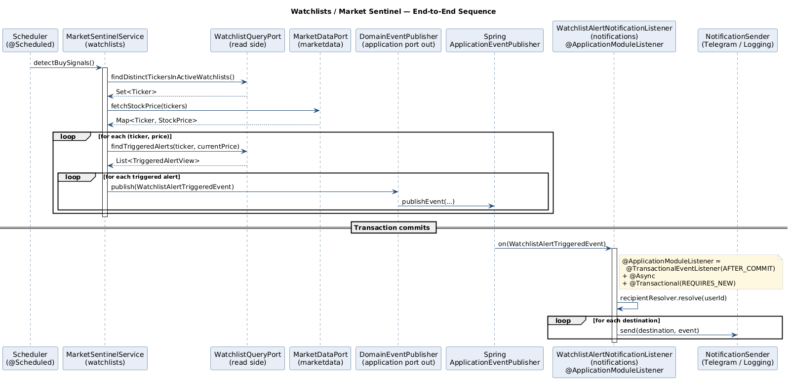
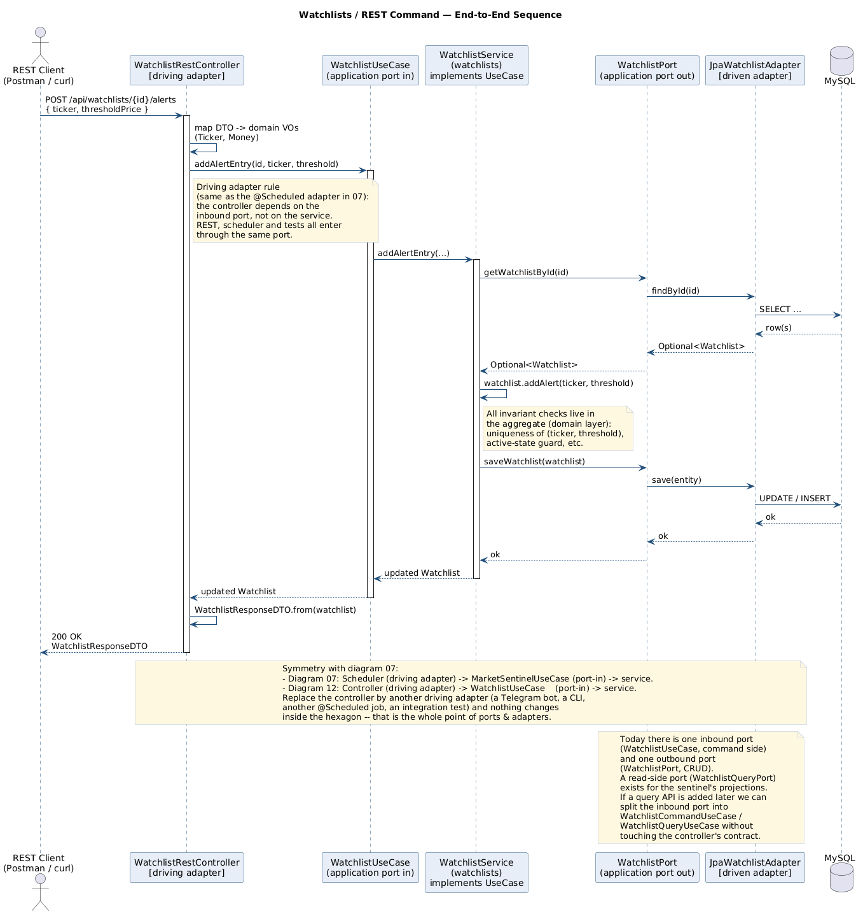
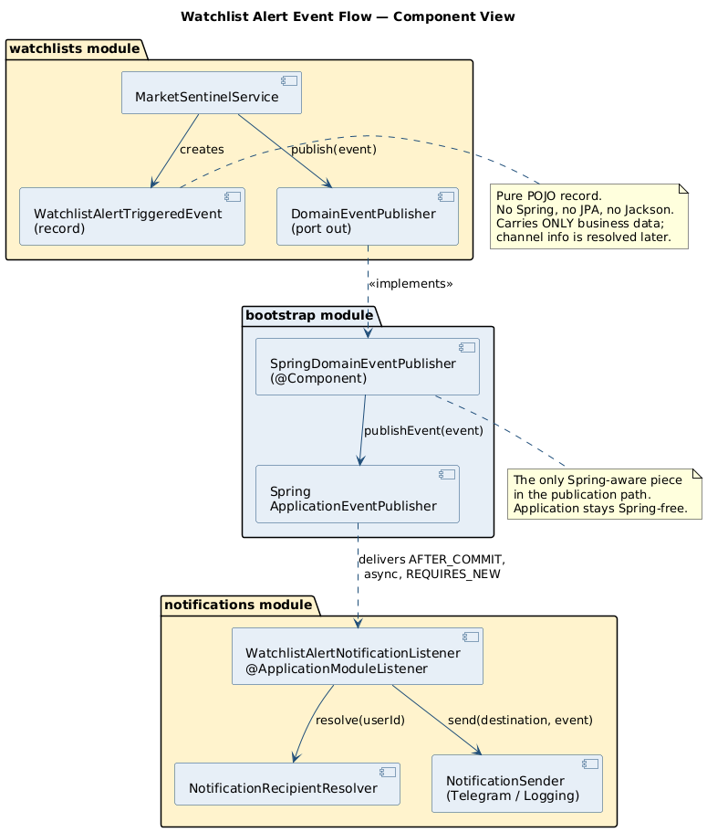
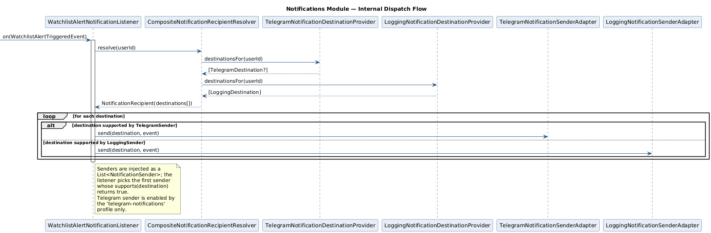

# 02 — Watchlists / Market Sentinel: Domain Event Deep Dive

> **Audience.** Engineers who will live-trace the canonical event flow during the demo.
> **Reading time.** ~20 minutes.
> **Source artefacts.**
> [`MarketSentinelService`](../../../application/src/main/java/cat/gencat/agaur/hexastock/watchlists/application/service/MarketSentinelService.java) ·
> [`WatchlistAlertTriggeredEvent`](../../../application/src/main/java/cat/gencat/agaur/hexastock/watchlists/WatchlistAlertTriggeredEvent.java) ·
> [`DomainEventPublisher`](../../../application/src/main/java/cat/gencat/agaur/hexastock/application/port/out/DomainEventPublisher.java) ·
> [`SpringDomainEventPublisher`](../../../bootstrap/src/main/java/cat/gencat/agaur/hexastock/config/events/SpringDomainEventPublisher.java) ·
> [`WatchlistAlertNotificationListener`](../../../adapters-outbound-notification/src/main/java/cat/gencat/agaur/hexastock/notifications/WatchlistAlertNotificationListener.java) ·
> [`NotificationsEventFlowIntegrationTest`](../../../bootstrap/src/test/java/cat/gencat/agaur/hexastock/notifications/NotificationsEventFlowIntegrationTest.java).

---

## 1. Business intent

A user maintains one or more **Watchlists**. Each `Watchlist` is an aggregate
that holds a list of `AlertEntry` value objects, each pinning a `Ticker` to a
`Money` threshold (for example: "tell me when AAPL falls below 170 USD"). The
Market Sentinel periodically scans the universe of distinct tickers across all
**active** watchlists, fetches their current price from the market data
provider, and — for each alert whose threshold has been reached — publishes a
domain event. The user is then notified through whichever channels the
`Notifications` module knows about (Telegram or logging today; email,
WebSocket, mobile push tomorrow).

The point of using a domain event here is *not* convenience: it is that the
`Watchlists` module must remain **completely ignorant** of how those alerts
become user-visible signals. That is the entire teaching value of the example.

---

## 2. End-to-end sequence

[](diagrams/Rendered/07-watchlist-sentinel-sequence.svg)

The same hexagonal entry-point rule applies to the synchronous REST side.
Diagram 12 shows a representative command (`POST /api/watchlists/{id}/alerts`)
flowing through the **same kind of inbound port** the scheduler uses:

[](diagrams/Rendered/12-watchlist-rest-sequence.svg)

Both pictures share a single rule: every driving adapter (REST controller,
`@Scheduled` job, Telegram bot, integration test) talks to a `*UseCase`
inbound port; the application service implements the port; the service in
turn talks to the domain aggregate and to outbound ports. The two diagrams
are deliberately drawn with the same vocabulary so the symmetry is visible.

The flow is short enough to walk verbally during the demo:

1. A driving adapter — the `MarketSentinelScheduler` (`@Scheduled`) or an
   integration test — calls the **inbound port**
   `MarketSentinelUseCase.detectBuySignals()`. The scheduler does **not**
   know `MarketSentinelService` exists; that is the whole point of
   hexagonal — every entry point (REST, scheduler, test) goes through a
   port, and the port is implemented by the application service.
2. The service implementation reads, on a CQRS-style **read port**
   (`WatchlistQueryPort.findDistinctTickersInActiveWatchlists()`), the set of
   tickers currently being watched.
3. It calls `MarketDataPort.fetchStockPrice(tickers)`, returning a
   `Map<Ticker, StockPrice>`. This is the only outgoing call that crosses
   process boundaries.
4. For each price, it asks the read port `findTriggeredAlerts(ticker, price)`
   for the materialised list of `TriggeredAlertView` projections.
5. For each triggered alert it builds a `WatchlistAlertTriggeredEvent` and
   calls `DomainEventPublisher.publish(event)`.

The publication call returns immediately; the listener does not run inside the
calling transaction (see §5).

---

## 3. The event itself — anatomy of a good domain event

```java
public record WatchlistAlertTriggeredEvent(
        String watchlistId,
        String userId,
        Ticker ticker,
        AlertType alertType,
        Money threshold,
        Money currentPrice,
        Instant occurredOn,
        String message
) {
    public WatchlistAlertTriggeredEvent { /* explicit non-null validation */ }
    public Optional<String> messageOptional() { ... }
    public enum AlertType { PRICE_THRESHOLD_REACHED }
}
```

Five properties are worth highlighting because they recur in every healthy
domain-event design:

| Property | Embodied here by |
|---|---|
| **It is a Java `record`.** Immutable, value-equal, no setters. | The whole class. |
| **It carries business identity, not infrastructure identity.** | `userId` is the watchlist owner, *not* a Telegram chat id, *not* an email address. The `notifications` module resolves channels later. |
| **It validates its invariants at construction.** | The compact constructor calls `Objects.requireNonNull` on every required field. |
| **It is timestamped at the source.** | `occurredOn` is set by the publisher's injected `Clock`, never inferred downstream. |
| **It is enum-typed, not string-typed.** | `AlertType.PRICE_THRESHOLD_REACHED` keeps the contract evolvable without breaking existing consumers. |

What it deliberately does **not** carry: any mention of channels, transport,
retries, or downstream system identities. Those would couple the publisher to
the consumer.

---

## 4. Where the event lives — and why that matters

[](diagrams/Rendered/08-watchlist-event-flow.svg)

| Concern | Where | Why |
|---|---|---|
| Event type | `application` Maven module, package `cat.gencat.agaur.hexastock.watchlists` | The published API of the Watchlists module. Living in the application module makes it visible to consumers without dragging the domain along, and keeps it Spring-free. |
| Publisher port | `application/.../application/port/out/DomainEventPublisher.java` | Plain Java interface, the only contract the application service knows. |
| Publisher adapter | `bootstrap/.../config/events/SpringDomainEventPublisher.java` | Bridges the port to Spring's `ApplicationEventPublisher`. The only Spring-aware piece. |
| Consumer | `adapters-outbound-notification/.../WatchlistAlertNotificationListener.java` | Lives in the `notifications` Modulith module. Spring's `@ApplicationModuleListener` does the wiring. |

The bidirectional rule is: **publishers know the event, consumers know the
event, neither knows the other.** That property is what lets you add a second
consumer (an `AuditTrailListener`, say) without touching the publisher.

---

## 5. Transactional semantics — the real reason `@ApplicationModuleListener` exists

```java
@ApplicationModuleListener
public void on(WatchlistAlertTriggeredEvent event) { ... }
```

`@ApplicationModuleListener` is a Spring Modulith convenience that expands to:

```text
@TransactionalEventListener(phase = AFTER_COMMIT)
@Async
@Transactional(propagation = REQUIRES_NEW)
```

Each piece earns its place:

- **`AFTER_COMMIT`** — guarantees the publisher's transaction has *successfully
  committed* before the listener runs. If the publisher rolls back, the event
  is silently discarded. This is the entire reason this annotation exists in
  Modulith: it makes "I detected a triggered alert and I want to notify the
  user" a transactionally honest assertion.
- **`@Async`** — runs the listener on a separate thread. The publishing
  transaction is not slowed down by Telegram latency or by a slow recipient
  resolver.
- **`@Transactional(REQUIRES_NEW)`** — gives the listener its own transactional
  context. If a future consumer needs to write to the database (an audit log,
  for example), it writes in *its own* transaction; a failure does not roll
  back the publishing transaction (which is already committed) and does not
  cascade to other listeners.

These three properties together are what make in-process domain events safe
enough to be used in a real codebase rather than being a leaky abstraction.

---

## 6. The notification side — why it can be ignored from the publisher's point of view

[](diagrams/Rendered/09-notification-flow.svg)

Inside the listener:

1. `NotificationRecipientResolver.resolve(userId)` produces a
   `NotificationRecipient` carrying *every* known destination for that user.
   The default implementation (`CompositeNotificationRecipientResolver`)
   aggregates results from each `NotificationDestinationProvider` bean —
   today: a Telegram one (active under the `telegram-notifications` profile)
   and a logging one (always active).
2. For each `NotificationDestination`, the listener picks the first
   `NotificationSender` whose `supports(destination)` returns true, and calls
   `send(destination, event)`.

That entire mechanism is private to the `notifications` module. The
`watchlists` module has no idea any of those types exist. Adding SMS would be:

- a new `SmsNotificationDestination`,
- a new `SmsNotificationDestinationProvider` (resolves a phone number for a
  `userId`),
- a new `SmsNotificationSenderAdapter`.

No change to `Watchlists`. No change to the event. No change to the listener.
That is what the consultancy is selling.

---

## 7. Why this is a perfect teaching example

A short, defensible list:

- It is **real code that runs**, not an abstract example. The flow is exercised
  by `NotificationsEventFlowIntegrationTest` and (in deployment) by a
  `@Scheduled` job.
- It exercises **all four architectural styles at once** — DDD (the
  `Watchlist` aggregate), Hexagonal (the `DomainEventPublisher` port + Spring
  adapter), Modulith (the `@ApplicationModule` boundary and
  `@ApplicationModuleListener` consumer), and Domain Events (the
  `WatchlistAlertTriggeredEvent` record).
- It demonstrates **asymmetric coupling**: `notifications` declares
  `allowedDependencies = {"watchlists", "marketdata::model"}`, but the inverse
  is *not* declared and would fail the build. That asymmetry is the entire
  point.
- It demonstrates the **CQRS read side** without going full CQRS:
  `WatchlistQueryPort` returns flat `TriggeredAlertView` projections, distinct
  from the `Watchlist` aggregate **write path** (which loads the full
  aggregate in order to mutate it). The sentinel never loads the aggregate;
  the controller only loads it on write commands.
- The behaviour is **safely reversible** — disabling the listener (commenting
  out `@ApplicationModuleListener`) produces zero alerts, but breaks no
  invariants. That property would not hold if `MarketSentinelService` were
  calling `notificationSender.send(...)` directly.

---

## 8. Caveats and honest limitations

- The event is **in-memory only**. If the JVM crashes between `AFTER_COMMIT`
  and the listener body running, the event is lost. There is no outbox today.
  See [04-PRODUCTION-EVOLUTION.md §2](04-PRODUCTION-EVOLUTION.md) for what to
  do about this.
- The listener's `@Async` execution uses Spring's default executor. A
  production deployment should configure a bounded executor with explicit
  rejection policy.
- There is no retry. A `Sender.send(...)` failure is logged and dropped. In
  production, retries would belong in the sender adapter (or in the broker
  layer once the event is externalised), *not* in the listener.
- The `notifications` module currently depends on the `Ticker` value object
  from `marketdata`, which it includes in the rendered message. That keeps the
  example honest but means a hypothetical extraction would still need a shared
  kernel for `Ticker`. A future refactor could carry the ticker as a `String`
  in the event instead, eliminating that dependency.
