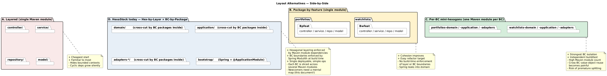

# 03 — Layout Alternatives: a Rigorous Comparison

> **Audience.** Senior engineers who will, correctly, ask *"why did you split it
> like this rather than like that?"*.
> **Reading time.** ~20 minutes.

This document compares the current HexaStock layout against four common
alternatives for projects that combine **Spring Modulith + DDD + Hexagonal
Architecture + bounded-context thinking**, and explains the position the
project takes.

---

## A. Layered, single Maven module

**Shape.** One Maven artefact. Top-level packages by *technical layer* —
`controller`, `service`, `repository`, `model`. The bounded contexts are not
visible at the package level; they are diluted across the four layer packages.

**Strengths.**
- The shape every Spring tutorial uses; new joiners need zero ramp-up.
- Cheapest possible build; everything compiles in one go.
- Refactoring across layers is trivial because nothing is enforced.

**Weaknesses.**
- Bounded contexts are *invisible*. A `WatchlistService` and a `PortfolioService`
  end up next to each other in the same `service` package, and a junior
  developer will gladly inject one into the other.
- There is no build-time guarantee that the domain is framework-free.
- Spring Modulith has nothing to enforce — everything lives in the same module.
- Cycles grow silently. By the time `controller → service → repository →
  service` cycles appear, unwinding them is a multi-week project.

**Good fit for.** A throwaway prototype, a take-home interview project, or a
codebase whose lifetime is measured in months.

**Comparison with HexaStock.** This is the layout HexaStock would degenerate
into if every guard rail (`HexagonalArchitectureTest`, `ModulithVerificationTest`,
the multi-module Maven graph) were removed. The project's thesis is that the
incremental cost of avoiding this layout is small and pays back almost
immediately.

---

## B. Package-by-feature, single Maven module

**Shape.** One Maven artefact. Top-level packages by *bounded context* —
`portfolios/`, `watchlists/`. Inside each, sub-packages mirror the layered
shape — `portfolios/controller`, `portfolios/service`, `portfolios/repository`,
`portfolios/model`.

**Strengths.**
- Bounded contexts become visible the moment you open the project tree.
- A reviewer can see a feature-shaped commit; cross-context noise drops.
- It is the natural starting point for an *incremental* migration toward
  Modulith — it is exactly what was done in the early stages of the HexaStock
  refactoring program (see
  [SPRING-MODULITH-GLOBAL-REFACTORING-PLAN.md](../../architecture/SPRING-MODULITH-GLOBAL-REFACTORING-PLAN.md)).

**Weaknesses.**
- Layer boundaries are not enforced; nothing prevents a controller importing a
  repository directly. Spring Modulith does not catch this — it polices
  *modules*, not *layers*.
- Bounded-context boundaries are not enforced either, unless Spring Modulith
  is added on top with explicit `allowedDependencies`. Without that, a
  `WatchlistsService` can still import a `PortfoliosService` freely.
- The domain is on the same classpath as Spring; the "no Spring in the
  domain" rule is aspirational only.

**Good fit for.** Single-team projects of moderate size where the team can be
trusted with conventions but not with build-time enforcement.

**Comparison with HexaStock.** Adding `spring-modulith-core` to a layout B
project gets you most of the *bounded-context* enforcement that HexaStock has,
but none of the *layer* enforcement. The HexaStock thesis is that paying the
multi-Maven-module tax buys you the latter.

---

## C. Per-bounded-context mini-hexagons (Maven module per BC)

**Shape.** One Maven artefact per bounded context, each containing its own
`-domain`, `-application`, `-adapters` sub-modules. So:
`portfolios-domain`, `portfolios-application`, `portfolios-adapters-jpa`,
`portfolios-adapters-rest`, etc. — multiplied by the number of contexts.

**Strengths.**
- The strongest possible isolation. Each BC is a fully independent
  hexagonal application; it could in principle be extracted to its own
  repository tomorrow.
- Build-time impossible to import across BCs unless the dependency is
  declared in the consumer's POM.
- Independent test execution per BC.

**Weaknesses.**
- The Maven module count explodes. With four bounded contexts and three
  hexagonal layers each, you get ~12 modules before any persistence variant
  is added, and ~20 once you split JPA/Mongo/REST adapters per BC.
- **Cross-BC value-object reuse becomes painful.** `Money`, `Ticker`,
  `Price` need to live in a shared kernel module that every BC depends on,
  which becomes a magnet for "I'll just add this here for now".
- High risk of *premature splitting*. Bounded contexts are not always
  obvious early; this layout makes them very expensive to merge later.
- Setup, IDE indexing, and CI friction are non-trivial.

**Good fit for.** Multi-team projects where each BC has a separate codeowner
and the BC boundaries have already been validated by months of operational
experience. Often a stop on the way to physically separated services.

**Comparison with HexaStock.** This is what HexaStock might evolve into *if*
the project grows to multiple teams, *if* one BC starts shipping at a
materially different cadence than the others, and *if* the cost of the extra
Maven modules is justified by the team structure. None of those is true today.

---

## D. Modulith-first (top-level package per module, single Maven module)

**Shape.** One Maven artefact. Top-level packages directly map to Spring
Modulith application modules. Internal sub-packages can use any internal
convention. Everything is enforced by Spring Modulith only.

**Strengths.**
- This is the canonical Spring Modulith reference shape (the `kitchensink`
  sample).
- Lowest ceremony for a Modulith-first design.
- Build-time BC isolation through `MODULES.verify()`.

**Weaknesses.**
- Hexagonal layering inside a module is *convention*, not *enforcement*.
- Domain code can import Spring; no compile-time wall protects it.
- A purely package-based hexagon needs ArchUnit rules to be more than a
  visual organisation choice.

**Good fit for.** Greenfield projects that want Modulith's BC enforcement
*now* and are happy to layer hexagonal discipline on top via ArchUnit rather
than via Maven modules.

**Comparison with HexaStock.** HexaStock is essentially "Layout D plus
hexagonal layering enforced by Maven modules". The extra Maven modules pay
for the layering enforcement; the top-level package convention pays for the
BC enforcement.

---

## E. HexaStock today — Hexagonal × Bounded Context, by Maven *and* by package

**Shape.** Already described in [01-FILESYSTEM-AND-MAVEN-STRUCTURE.md](01-FILESYSTEM-AND-MAVEN-STRUCTURE.md):

- *Hexagonal layer* → Maven module (`domain`, `application`,
  `adapters-*`, `bootstrap`).
- *Bounded context* → top-level Java package
  (`portfolios`, `marketdata`, `watchlists`, `notifications`).
- *Hexagonal sublayer inside a BC* → Java sub-package
  (`watchlists.application.port.in`, `watchlists.application.service`,
  `watchlists.adapter.out.persistence.jpa`).

**Strengths.**
- Hexagonal layering is *mechanically* enforced by the Maven dependency
  graph: the `application` module's POM does not contain Spring; the `domain`
  module's POM does not even contain Jakarta. A leak does not compile.
- Bounded contexts are *mechanically* enforced by Spring Modulith via
  `MODULES.verify()`; cross-module imports must be declared in
  `allowedDependencies`.
- Domain events stay framework-free: they live in `application` (a
  Spring-free Maven module) and only the adapter
  (`SpringDomainEventPublisher`) knows about Spring.
- Persistence variants (JPA *and* MongoDB) coexist as alternative
  Maven adapter modules selecting at deployment time.

**Weaknesses.**
- Each BC is split across many Maven modules; an IDE-driven mental map is
  needed.
- `package-info.java` files appear twice for the same package
  (Spring-free copy in `application`, Spring-aware copy with
  `@ApplicationModule` in `bootstrap`). The duplication is intentional but
  is the kind of thing senior engineers will rightly question.
- Newcomers spend the first half-day learning the layout. The investment
  pays back quickly, but it is real.

**When this is right.** When you want the *enforcement* of layered
hexagonal *and* the enforcement of bounded contexts, *and* the project is
small enough that one Spring Boot deployable still makes operational sense.
That is precisely HexaStock today.

---

## How to explain this coherently to senior engineers

A four-line summary that survives any whiteboard:

> "We picked the layout that lets the build itself enforce two orthogonal
> things — *layer purity* via Maven modules, and *bounded-context isolation*
> via Spring Modulith. The cost is one extra `package-info.java` per module
> and a slightly larger Maven graph. The benefit is that we will never
> *accidentally* leak Spring into the domain or `WatchlistsService` into
> `Portfolios`, and we paid that cost on day one rather than during the
> first cross-team incident."

Then, if pushed:

- Layout A would let the project ship faster *today*, and erode faster *next
  quarter*.
- Layout B is what HexaStock looked like during early Modulith phases; it
  was the right *transitional* shape, not the right *destination*.
- Layout C is what HexaStock might *eventually* become, if and only if the
  team structure and the cadence pressure justify the multiplication of
  Maven modules.
- Layout D is what HexaStock would look like without the Maven module split
  — it would be cleaner to navigate, but `domain/` would not be guaranteed
  framework-free.

The current shape is a deliberate, conservative bet on *enforcement over
ergonomics* — a bet that pays off as soon as the codebase is touched by
more than one engineer.
