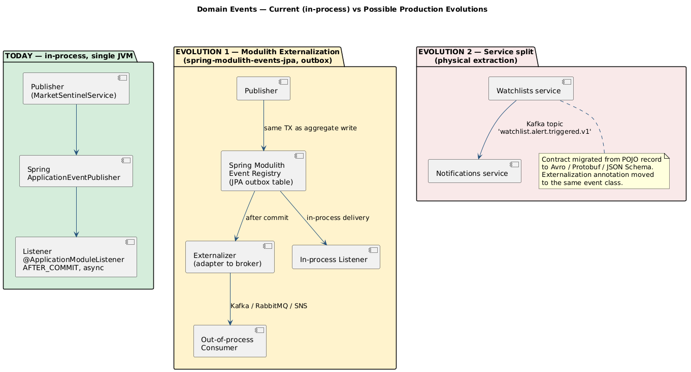

# 04 — From Current Solution to Realistic Production Evolution

> **Audience.** Engineers and architects who will ask *"and what would you do at
> 10× the load?"*.
> **Reading time.** ~15 minutes.

The current Watchlists / Notifications event flow is intentionally simple:
in-memory, in-process, no broker, no outbox. This document explains what that
buys you, where it stops being safe, and the realistic evolution paths — none
of which require throwing away the current architecture.

[](diagrams/Rendered/11-current-vs-future-events.svg)

---

## 1. What the current implementation actually guarantees

| Property | Today | How |
|---|---|---|
| Event is delivered iff the publishing transaction commits | ✅ | `@ApplicationModuleListener` ⇒ `@TransactionalEventListener(AFTER_COMMIT)` |
| Listener does not slow down the publisher | ✅ | `@ApplicationModuleListener` ⇒ `@Async` |
| Listener failure does not roll back the publisher | ✅ | `@ApplicationModuleListener` ⇒ `@Transactional(REQUIRES_NEW)` |
| Event survives a JVM crash between commit and listener invocation | ❌ | No persistence; in-memory event bus |
| Event survives a listener exception | ❌ | No retry; logged and dropped |
| Event has a global ordering guarantee | ❌ | None requested or provided |
| Event is consumable from another process | ❌ | In-process only |
| Event has a published, versioned schema | ⚠️ | Java record contract; no machine-checkable schema |

The honest summary: it is **good enough for a single-deployable, single-team
financial-portfolio backend with non-mission-critical notifications**, and is
*architecturally shaped* so that any of the missing properties can be added
without rewriting the publisher.

---

## 2. Evolution path 1 — add durability inside the same monolith

The Spring Modulith project ships
[`spring-modulith-events-jpa`](https://docs.spring.io/spring-modulith/reference/events.html)
(and equivalents for MongoDB, JDBC, Kafka, etc.). Adding it gives the
**transactional outbox pattern** with effectively no code changes:

```xml
<dependency>
    <groupId>org.springframework.modulith</groupId>
    <artifactId>spring-modulith-starter-jpa</artifactId>
</dependency>
```

What you get the moment you flip that switch:

- Every `ApplicationEventPublisher.publishEvent(event)` whose event class is
  marked `@org.springframework.modulith.events.Externalized` (or annotated
  with the framework-level externalisation marker) is **persisted to an
  outbox table inside the same JDBC transaction** as the publisher's writes.
- Listener invocations become **completion records** in that same table.
- A scheduled poller / republisher retries failed listener invocations until
  they succeed (or are explicitly dead-lettered).

The publisher does not change. The listener does not change. What changes:

- The application has a new database table (`event_publication`), so a
  schema migration is needed.
- The listener should be made *idempotent*, because retries become possible.
  In practice this means designing the side effect to tolerate a duplicate
  invocation — which is good practice anyway.

The architectural diagram is `EVOLUTION 1` in the figure above.

---

## 3. Evolution path 2 — externalise selected events to a broker

Once the outbox is in place, **externalising** a specific event becomes a
configuration change rather than a redesign. Spring Modulith supports
externalising to Kafka, RabbitMQ, AWS SNS/SQS, JMS, etc., via additional
starters and a single annotation on the event class:

```java
@org.springframework.modulith.events.Externalized("watchlist.alert.triggered.v1")
public record WatchlistAlertTriggeredEvent(...) { ... }
```

The framework will then publish each persisted event to the configured
broker after commit, with at-least-once semantics backed by the outbox.

What this enables:

- A second consumer in **another process** (a notifications worker, a
  reporting job, a fraud-detection pipeline) can subscribe to the broker
  topic without modifying HexaStock.
- A truly async processing pipeline that survives consumer outages.
- A natural seam for a future *physical* extraction of the consumer (see §4).

What it costs:

- The event becomes a **published contract** in the strong sense. Consumers
  outside the codebase will rely on it. Versioning discipline becomes
  mandatory: name the topic `*.v1`, plan for `*.v2`, never silently change
  field semantics.
- The Java `record` POJO is no longer the contract — the **wire format
  schema** is. Avro, Protobuf, or JSON Schema (with a registry) becomes a
  serious choice, not a stylistic one.
- Operational concerns enter: broker availability, consumer lag, dead-letter
  topics, retry budgets.

---

## 4. Evolution path 3 — physically extract a module

If `notifications` becomes either (a) a substantially heavier workload than
the rest of the application, (b) a separately-owned product, or (c) a
compliance-isolated component, it can be extracted into a separate
deployable. The architecture is already shaped for this:

- The publishing side already speaks an external contract (after step 3).
- The notifications module already imports nothing from `portfolios` and
  only consumes the published `WatchlistAlertTriggeredEvent` plus the
  `Ticker` VO.
- The module's adapters (`TelegramNotificationSenderAdapter`,
  `LoggingNotificationSenderAdapter`) are independently deployable units.

Extraction is not free, of course:

- The shared `Ticker` value object now needs a strategy: vendored copy,
  shared library, or replaced by a `String` ticker inside the event.
- The persistence story for the notifications side (if any) becomes a
  separate database, not a separate schema.
- Operational concerns (CI, deployment pipelines, observability,
  identity/auth between services) are now in scope.

The point: this is a *capability you preserve*, not a *target you commit
to*. The current layout makes the option cheap to keep open without paying
the cost upfront.

---

## 5. What the current architecture deliberately *does not* claim

These are the honest "no" answers to the questions a senior engineer will
ask:

- **"Is this microservices-ready?"** — No, and it does not claim to be. It
  is *deployable-monolith-correct* and *extraction-friendly*. Those are
  different goals.
- **"Does this guarantee exactly-once delivery?"** — No. Exactly-once does
  not exist outside of constrained transactional boundaries. The current
  flow is *at-most-once in memory*; with the outbox it becomes *at-least-once
  with idempotent consumers*.
- **"Is the event a stable API?"** — Today it is an internal Java record.
  The moment a second team consumes it, treat it as a stable API and apply
  versioning rules. Not before.
- **"Should every aggregate operation publish a domain event?"** — No.
  Publish events for **business facts other modules legitimately want to
  react to**. Publishing for the sake of "decoupling" leads to event spam
  and makes the aggregate harder to reason about.

---

## 6. Where this leaves the consultancy thesis

> "We picked an architecture that is honest about today's needs and shaped
> for tomorrow's options. The Watchlists event flow is the smallest correct
> example of that thesis: in-process today, outbox-and-broker-ready
> tomorrow, extractable the day after — and none of those moves require us
> to revisit the Watchlists *domain* code."

That sentence is the take-away. Everything else in this folder is the
evidence that backs it.
