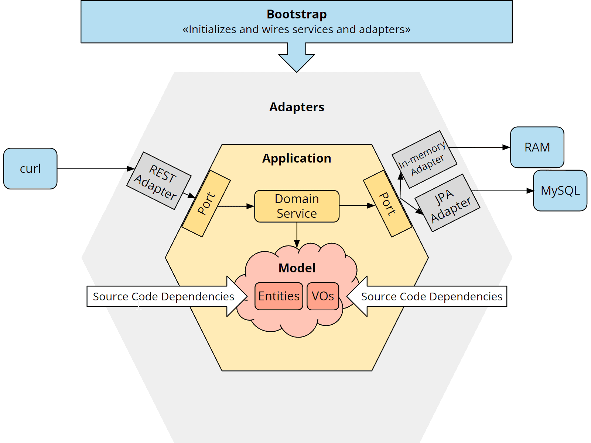

# 📌 HexaStock Demo
**Building a Financial Portfolio App with Hexagonal Architecture & DDD**

---

## 01. Introduction & Adapter Swap in Action
- Quick look at the **Hexagonal Architecture diagram**
- Present HexaStock: a financial portfolio app built with DDD
- Switch smoothly between **FinHub** and **AlphaVantage**
- Spring profiles load different adapters automatically
- Same business request, different provider behind the scenes
- Demonstrates true decoupling of domain from infrastructure

*Source: [HappyCoders – Hexagonal Architecture with Spring Boot](https://www.happycoders.eu/software-craftsmanship/hexagonal-architecture-spring-boot/)*

---

## 02. Rich Domain Model
- Entities: **Portfolio**, **Holding**, **Transaction** with embedded logic
- Value Objects: **Money**, **Ticker**, **Quantity** enforce correctness
- Business rules (cash checks, FIFO, transactions) live inside the model

---

## 03. Lightning-Fast Unit Tests
- Pure domain tests run in **milliseconds**
- Scenarios: insufficient funds, invalid operations, FIFO sales
- Enables **TDD and rapid feedback** without frameworks

---

## 04. Integration with Testcontainers
- Fresh **MySQL Docker container** for each test suite
- **REST Assured** calls to the real REST API
- Validate: 201 Created, 200 OK, 400 Bad Request, 404 Not Found, 409 Conflict

---

## 05. REST API & Swagger
- Resource-oriented endpoints with correct HTTP verbs
- Proper status codes for each case (201, 200, 400, 404, 409)
- **Swagger UI** for API docs + IntelliJ HTTP client for live calls
- Database viewer shows updates in real time

---

## 06. CI Pipeline & Coverage
- **GitHub Actions**: build, test, integration, coverage on every push
- **JaCoCo** coverage report ~92%
- Guarantees safe refactoring and long-term evolvability

---