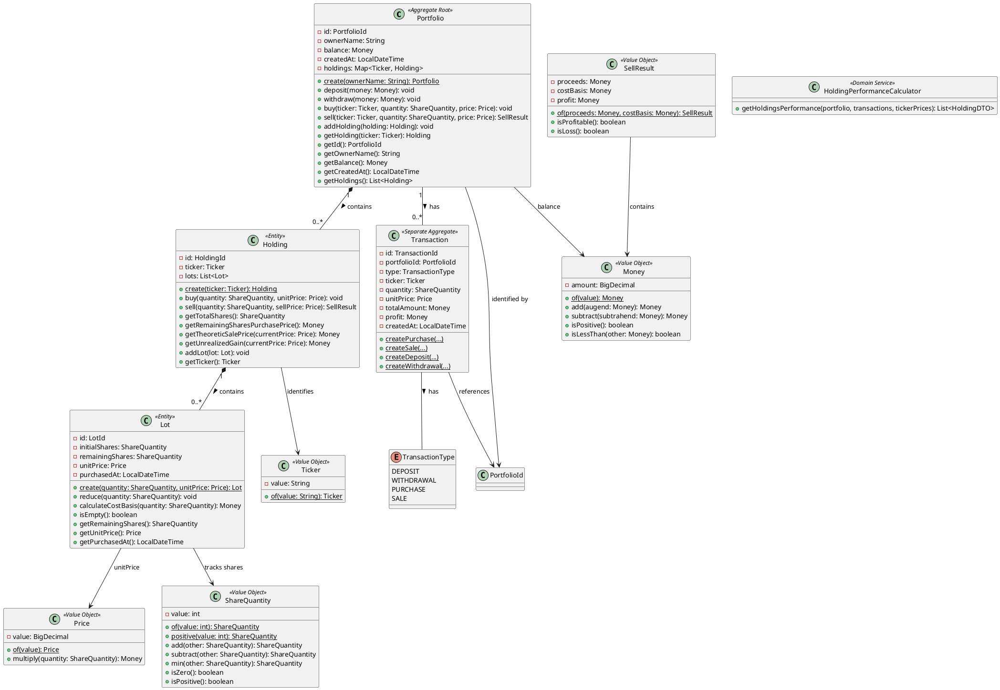

# Stock Portfolio API Specification
---

## Table of Contents

1. [Global Error Contract](#1-global-error-contract)
2. [User Stories](#2-user-stories)
   - 2.1 [Create Portfolio](#21-us-01--create-portfolio)
   - 2.2 [Get Portfolio](#22-us-02--get-portfolio)
   - 2.3 [List All Portfolios](#23-us-03--list-all-portfolios)
   - 2.4 [Deposit Funds](#24-us-04--deposit-funds)
   - 2.5 [Withdraw Funds](#25-us-05--withdraw-funds)
   - 2.6 [Buy Stocks](#26-us-06--buy-stocks)
   - 2.7 [Sell Stocks](#27-us-07--sell-stocks)
   - 2.8 [Get Transaction History](#28-us-08--get-transaction-history)
   - 2.9 [Get Holdings Performance](#29-us-09--get-holdings-performance)
   - 2.10 [Get Stock Price](#210-us-10--get-stock-price)
3. [Domain Model](#3-domain-model)
4. [PlantUML Diagram](#4-plantuml-diagram)
5. [HTTP Request File](#5-http-request-file)
6. [Suggested Future Evolutions](#6-suggested-future-evolutions)
7. [Implementation Notes and Deviations](#7-implementation-notes-and-deviations)
8. [Follow-up Issue Suggestions](#8-follow-up-issue-suggestions)


---

## 1. Global Error Contract

All error responses use the **RFC 7807 Problem Detail** format (`application/problem+json`), produced by Spring's `ProblemDetail` class via `ExceptionHandlingAdvice`.

```json
{
  "type":     "about:blank",
  "title":    "<Human-readable error title>",
  "status":   <HTTP status code as integer>,
  "detail":   "<Specific error message from the exception>",
  "instance": "<Request URI>"
}
```

### Exception → HTTP Status Mapping

| Exception Class | HTTP Status | `title` value | Typical `detail` examples |
|---|---|---|---|
| `PortfolioNotFoundException` | **404** | `Portfolio Not Found` | `Portfolio not found with id: <id>` |
| `HoldingNotFoundException` | **404** | `Holding Not Found` | `Holding not found in portfolio: <ticker>` / `Holding <ticker> not exists` |
| `InvalidAmountException` | **400** | `Invalid Amount` | `Deposit amount must be positive` / `Withdrawal amount must be positive` / `Price must be positive: <value>` |
| `InvalidQuantityException` | **400** | `Invalid Quantity` | `Quantity must be positive: <value>` / `Share quantity cannot be negative: <value>` |
| `InvalidTickerException` | **400** | `Invalid Ticker` | `Ticker cannot be empty` / `Invalid ticker: <value>` |
| `ConflictQuantityException` | **409** | `Conflict Quantity` | `Not enough shares to sell. Available: <n>, Requested: <m>` |
| `InsufficientFundsException` | **409** | `Insufficient Funds` | `Insufficient funds for withdrawal` / `Insufficient funds to buy <n> shares of <ticker>` |
| `ExternalApiException` | **503** | `External API Error` | *(provider-specific message)* |

> **Implementation pointer:** `ExceptionHandlingAdvice` — `cat.gencat.agaur.hexastock.adapter.in.ExceptionHandlingAdvice`

---

## 2. User Stories

---

### 2.1 US-01 — Create Portfolio

**As an** investor  
**I want to** create a new investment portfolio  
**So that** I can start managing my investments

#### Preconditions

- None.

#### Acceptance Criteria

| # | Given / When / Then |
|---|---|
| 1 | **Given** a valid owner name<br/>**When** I POST `/api/portfolios` with `{"ownerName":"Alice"}`<br/>**Then** I receive **201 Created** with a `Location` header pointing to `/api/portfolios/{id}` and a body containing `id`, `ownerName`, `cashBalance` (0.00), `currency` ("USD") |

#### Success Response (201 Created)

```json
{
  "id": "550e8400-e29b-41d4-a716-446655440000",
  "ownerName": "Alice",
  "cashBalance": 0.00,
  "currency": "USD"
}
```

Headers:
```
Location: http://localhost:8080/api/portfolios/550e8400-e29b-41d4-a716-446655440000
```

#### Implementation Pointers

| Layer | Class / Method |
|---|---|
| Controller | `PortfolioRestController.createPortfolio(CreatePortfolioDTO)` |
| Use Case | `PortfolioManagementUseCase.createPortfolio(String)` |
| Service | `PortfolioManagementService.createPortfolio(String)` |
| Domain | `Portfolio.create(String)` |
| DTO (request) | `CreatePortfolioDTO(String ownerName)` |
| DTO (response) | `CreatePortfolioResponseDTO(String id, String ownerName, BigDecimal cashBalance, String currency)` |
| Tests | `PortfolioRestControllerIntegrationTest` — `createPortfolio()` helper, `ListAllPortfolios` nested class |

---

### 2.2 US-02 — Get Portfolio

**As an** investor  
**I want to** retrieve my portfolio details  
**So that** I can see my current balance and account information

#### Preconditions

- Portfolio with the given ID must exist.

#### Acceptance Criteria

| # | Given / When / Then |
|---|---|
| 1 | **Given** an existing portfolio<br/>**When** I GET `/api/portfolios/{id}`<br/>**Then** I receive **200 OK** with `id`, `ownerName`, `balance`, `createdAt` |
| 2 | **Given** a non-existent portfolio ID<br/>**When** I GET `/api/portfolios/{id}`<br/>**Then** I receive **404 Not Found** with ProblemDetail `title: "Portfolio Not Found"` |

#### Success Response (200 OK)

```json
{
  "id": "550e8400-e29b-41d4-a716-446655440000",
  "ownerName": "Alice",
  "balance": 10000.00,
  "createdAt": "2025-01-15T10:30:00"
}
```

#### Implementation Pointers

| Layer | Class / Method |
|---|---|
| Controller | `PortfolioRestController.getPortfolio(String id)` |
| Use Case | `PortfolioManagementUseCase.getPortfolio(PortfolioId)` |
| Service | `PortfolioManagementService.getPortfolio(PortfolioId)` |
| DTO (response) | `PortfolioResponseDTO(String id, String ownerName, BigDecimal balance, LocalDateTime createdAt)` |
| Tests | `PortfolioRestControllerIntegrationTest.WhenPortfolioExists.HappyPath.getPortfolio_returnsDtoWithBasicFields()`, `WhenPortfolioDoesNotExist.getNonExistentPortfolio_returns404()` |

---

### 2.3 US-03 — List All Portfolios

**As an** administrator or investor  
**I want to** list all portfolios in the system  
**So that** I can get an overview of all accounts

#### Preconditions

- None.

#### Acceptance Criteria

| # | Given / When / Then |
|---|---|
| 1 | **Given** multiple portfolios exist<br/>**When** I GET `/api/portfolios`<br/>**Then** I receive **200 OK** with a JSON array of portfolio objects, each containing `id`, `ownerName`, `balance`, `createdAt` |
| 2 | **Given** no portfolios exist<br/>**When** I GET `/api/portfolios`<br/>**Then** I receive **200 OK** with an empty array `[]` |

#### Success Response (200 OK)

```json
[
  {
    "id": "...",
    "ownerName": "Alice",
    "balance": 1000.00,
    "createdAt": "2025-01-15T10:30:00"
  },
  {
    "id": "...",
    "ownerName": "Bob",
    "balance": 2500.00,
    "createdAt": "2025-01-15T11:00:00"
  }
]
```

#### Implementation Pointers

| Layer | Class / Method |
|---|---|
| Controller | `PortfolioRestController.getAllPortfolios()` |
| Use Case | `PortfolioManagementUseCase.getAllPortfolios()` |
| Service | `PortfolioManagementService.getAllPortfolios()` |
| Port (out) | `PortfolioPort.getAllPortfolios()` |
| Tests | `PortfolioRestControllerIntegrationTest.ListAllPortfolios.returnsAllCreatedPortfoliosWithCorrectBalances()` |

---

### 2.4 US-04 — Deposit Funds

**As an** investor managing my portfolio  
**I want to** add money to my portfolio's cash balance  
**So that** I have funds available for future stock purchases

#### Preconditions

- Portfolio must exist.
- Deposit amount must be positive (> 0).

#### Acceptance Criteria

| # | Given / When / Then |
|---|---|
| 1 | **Given** an existing portfolio with balance $5000<br/>**When** I POST `/api/portfolios/{id}/deposits` with `{"amount": 2000}`<br/>**Then** I receive **200 OK** (empty body) and the balance becomes $7000 |
| 2 | **Given** an existing portfolio<br/>**When** I deposit amount `0`<br/>**Then** I receive **400 Bad Request** with `title: "Invalid Amount"`, `detail` containing `"amount"` |
| 3 | **Given** an existing portfolio<br/>**When** I deposit a negative amount<br/>**Then** I receive **400 Bad Request** with `title: "Invalid Amount"`, `detail` containing `"amount"` |
| 4 | **Given** a non-existent portfolio ID<br/>**When** I deposit any amount<br/>**Then** I receive **404 Not Found** with `title: "Portfolio Not Found"` |

#### Implementation Pointers

| Layer | Class / Method |
|---|---|
| Controller | `PortfolioRestController.deposit(String id, DepositRequestDTO request)` |
| Use Case | `PortfolioManagementUseCase.deposit(PortfolioId, Money)` |
| Service | `PortfolioManagementService.deposit(PortfolioId, Money)` |
| Domain | `Portfolio.deposit(Money)` — throws `InvalidAmountException` if not positive |
| DTO (request) | `DepositRequestDTO(BigDecimal amount)` |
| Tests | `PortfolioRestControllerIntegrationTest.WhenPortfolioExists.DepositsAndWithdrawals` — `deposit_updatesBalance()`, `depositZeroAmount_returns400()`, `depositNegativeAmount_returns400()`, `WhenPortfolioDoesNotExist.depositToNonExistentPortfolio_returns404()` |

> **Note:** The domain `Portfolio.deposit()` method's Javadoc incorrectly references `InsufficientFundsException`, but the actual code throws `InvalidAmountException` when the amount is not positive. Tests confirm `InvalidAmountException` (400).

---

### 2.5 US-05 — Withdraw Funds

**As an** investor managing my portfolio  
**I want to** withdraw money from my portfolio's cash balance  
**So that** I can use these funds elsewhere

#### Preconditions

- Portfolio must exist.
- Withdrawal amount must be positive (> 0).
- Portfolio balance must be ≥ withdrawal amount.

#### Acceptance Criteria

| # | Given / When / Then |
|---|---|
| 1 | **Given** a portfolio with balance $5000<br/>**When** I POST `/api/portfolios/{id}/withdrawals` with `{"amount": 2000}`<br/>**Then** I receive **200 OK** (empty body) and the balance becomes $3000 |
| 2 | **Given** a portfolio<br/>**When** I withdraw amount `0`<br/>**Then** I receive **400 Bad Request** with `title: "Invalid Amount"` |
| 3 | **Given** a portfolio<br/>**When** I withdraw a negative amount<br/>**Then** I receive **400 Bad Request** with `title: "Invalid Amount"` |
| 4 | **Given** a portfolio with balance $100<br/>**When** I withdraw $200<br/>**Then** I receive **409 Conflict** with `title: "Insufficient Funds"`, `detail` containing `"Insufficient funds"` |
| 5 | **Given** a portfolio with balance $0<br/>**When** I withdraw $1<br/>**Then** I receive **409 Conflict** with `title: "Insufficient Funds"` |
| 6 | **Given** a non-existent portfolio ID<br/>**When** I withdraw any amount<br/>**Then** I receive **404 Not Found** with `title: "Portfolio Not Found"` |

#### Implementation Pointers

| Layer | Class / Method |
|---|---|
| Controller | `PortfolioRestController.withdraw(String id, WithdrawalRequestDTO request)` |
| Use Case | `PortfolioManagementUseCase.withdraw(PortfolioId, Money)` |
| Service | `PortfolioManagementService.withdraw(PortfolioId, Money)` |
| Domain | `Portfolio.withdraw(Money)` — throws `InvalidAmountException` if not positive, `InsufficientFundsException` if balance < amount |
| DTO (request) | `WithdrawalRequestDTO(BigDecimal amount)` |
| Tests | `PortfolioRestControllerIntegrationTest.WhenPortfolioExists.DepositsAndWithdrawals` — `withdraw_updatesBalance()`, `withdrawZeroAmount_returns400()`, `withdrawNegativeAmount_returns400()`, `withdrawMoreThanBalance_returns409()`, `withdrawFromZeroBalance_returns409()`, `WhenPortfolioDoesNotExist.withdrawFromNonExistentPortfolio_returns404()` |

---

### 2.6 US-06 — Buy Stocks

**As an** investor with a portfolio  
**I want to** purchase shares of a specific stock by providing the ticker symbol and quantity  
**So that** I can build my investment portfolio without needing to manually research current market prices

#### Preconditions

- Portfolio must exist.
- Ticker must be valid: 1–5 uppercase letters matching `^[A-Z]{1,5}$`.
- Quantity must be positive (> 0).
- Portfolio balance must be ≥ total cost (quantity × current market price).

#### Acceptance Criteria

| # | Given / When / Then |
|---|---|
| 1 | **Given** a funded portfolio<br/>**When** I POST `/api/portfolios/{id}/purchases` with `{"ticker":"AAPL","quantity":5}`<br/>**Then** I receive **200 OK** (empty body), balance decreases by (5 × market price), and a holding for AAPL appears with 5 remaining shares |
| 2 | **Given** a portfolio with existing AAPL holding<br/>**When** I buy more AAPL shares<br/>**Then** a new lot is added to the existing holding |
| 3 | **Given** a portfolio with insufficient funds<br/>**When** I buy stock<br/>**Then** I receive **409 Conflict** with `title: "Insufficient Funds"`, `detail` containing `"Insufficient funds"` |
| 4 | **Given** a portfolio<br/>**When** I buy with quantity `0`<br/>**Then** I receive **400 Bad Request** with `title: "Invalid Quantity"`, `detail` containing `"Quantity must be positive"` |
| 5 | **Given** a portfolio<br/>**When** I buy with negative quantity<br/>**Then** I receive **400 Bad Request** with `title: "Invalid Quantity"`, `detail` containing `"Quantity must be positive"` |
| 6 | **Given** a portfolio<br/>**When** I buy with an invalid ticker (e.g., `"ZZZZ_INVALID"`)<br/>**Then** I receive **400 Bad Request** with `title: "Invalid Ticker"`, `detail` containing the invalid ticker string, and no holding is created |
| 7 | **Given** a portfolio<br/>**When** I buy with an empty ticker `""`<br/>**Then** I receive **400 Bad Request** with `title: "Invalid Ticker"` |
| 8 | **Given** a non-existent portfolio ID<br/>**When** I buy stock<br/>**Then** I receive **404 Not Found** with `title: "Portfolio Not Found"` |

#### Implementation Pointers

| Layer | Class / Method |
|---|---|
| Controller | `PortfolioRestController.buyStock(String id, PurchaseDTO request)` |
| Use Case | `PortfolioStockOperationsUseCase.buyStock(PortfolioId, Ticker, ShareQuantity)` |
| Service | `PortfolioStockOperationsService.buyStock(...)` — fetches price via `StockPriceProviderPort`, delegates to `Portfolio.buy()`, saves, records transaction |
| Domain | `Portfolio.buy(Ticker, ShareQuantity, Price)` — validates quantity positive, checks sufficient funds, finds/creates holding |
| Domain | `Holding.buy(ShareQuantity, Price)` — creates a new `Lot` |
| Domain | `Lot.create(ShareQuantity, Price)` — validates positive quantity |
| Validation | `Ticker(String)` constructor — validates format `^[A-Z]{1,5}$`; `ShareQuantity.positive(int)` — validates > 0 |
| DTO (request) | `PurchaseDTO(String ticker, int quantity)` |
| Tests | `PortfolioRestControllerIntegrationTest.WhenPortfolioExists.BuyingShares` — `buyReducesBalanceAndAddsHolding()`, `buyWithInsufficientFunds_returns409()`, `buyWithZeroQuantity_returns400()`, `buyWithNegativeQuantity_returns400()`, `buyWithInvalidTicker_returns400_andNoHoldingCreated()`, `buyWithEmptyTicker_returns400()`, `multipleBuysAndSellsAcrossTickers()` |

> **Note:** The controller calls `ShareQuantity.positive(request.quantity())` which throws `InvalidQuantityException` for values ≤ 0 *before* the domain `Portfolio.buy()` method is reached. The `Ticker.of(request.ticker())` call also validates the ticker format at the controller level.

---

### 2.7 US-07 — Sell Stocks

**As an** investor with existing stock holdings  
**I want to** sell shares of a specific stock by providing the ticker symbol and quantity  
**So that** I can realize profits, cut losses, or rebalance my portfolio

#### Preconditions

- Portfolio must exist.
- Ticker must be valid: 1–5 uppercase letters.
- Quantity must be positive (> 0).
- Portfolio must hold the specified ticker.
- Portfolio must hold ≥ requested quantity of shares for that ticker.

#### Acceptance Criteria

| # | Given / When / Then |
|---|---|
| 1 | **Given** a portfolio holding 5 shares of AAPL<br/>**When** I POST `/api/portfolios/{id}/sales` with `{"ticker":"AAPL","quantity":3}`<br/>**Then** I receive **200 OK** with `portfolioId`, `ticker`, `quantity`, `proceeds` (> 0), `costBasis`, `profit`; 2 shares remain |
| 2 | **Given** the sale uses FIFO accounting<br/>**When** I sell 8 shares from lots [10@$100, 5@$120]<br/>**Then** 8 shares are sold from the oldest lot first; cost basis = 8 × $100 = $800 |
| 3 | **Given** a portfolio holding 5 shares of AAPL<br/>**When** I sell 10 shares<br/>**Then** I receive **409 Conflict** with `title: "Conflict Quantity"`, `detail` containing `"Not enough shares to sell"` |
| 4 | **Given** a portfolio<br/>**When** I sell with quantity `0`<br/>**Then** I receive **400 Bad Request** with `title: "Invalid Quantity"`, `detail` containing `"Quantity must be positive"` |
| 5 | **Given** a portfolio<br/>**When** I sell with negative quantity<br/>**Then** I receive **400 Bad Request** with `title: "Invalid Quantity"`, `detail` containing `"Quantity must be positive"` |
| 6 | **Given** a portfolio that does NOT hold MSFT<br/>**When** I sell MSFT<br/>**Then** I receive **404 Not Found** with `title: "Holding Not Found"` |
| 7 | **Given** a non-existent portfolio ID<br/>**When** I sell stock<br/>**Then** I receive **404 Not Found** with `title: "Portfolio Not Found"` |

#### Success Response (200 OK)

```json
{
  "portfolioId": "550e8400-e29b-41d4-a716-446655440000",
  "ticker": "AAPL",
  "quantity": 3,
  "proceeds": 540.00,
  "costBasis": 300.00,
  "profit": 240.00
}
```

#### Implementation Pointers

| Layer | Class / Method |
|---|---|
| Controller | `PortfolioRestController.sellStock(String id, SaleRequestDTO request)` |
| Use Case | `PortfolioStockOperationsUseCase.sellStock(PortfolioId, Ticker, ShareQuantity)` |
| Service | `PortfolioStockOperationsService.sellStock(...)` — fetches price via `StockPriceProviderPort`, delegates to `Portfolio.sell()`, saves, records transaction |
| Domain | `Portfolio.sell(Ticker, ShareQuantity, Price)` — validates quantity positive, checks holding exists (`HoldingNotFoundException`), delegates to `Holding.sell()`, adds proceeds to balance |
| Domain | `Holding.sell(ShareQuantity, Price)` — FIFO lot iteration, throws `ConflictQuantityException` if insufficient shares, removes empty lots |
| Domain | `Lot.reduce(ShareQuantity)`, `Lot.calculateCostBasis(ShareQuantity)` |
| Domain | `SellResult.of(Money proceeds, Money costBasis)` — calculates profit |
| DTO (request) | `SaleRequestDTO(String ticker, int quantity)` |
| DTO (response) | `SaleResponseDTO(String portfolioId, String ticker, int quantity, BigDecimal proceeds, BigDecimal costBasis, BigDecimal profit)` |
| Tests | `PortfolioRestControllerIntegrationTest.WhenPortfolioExists.SellingShares` — `sellReturnsProceeds_andUpdatesHoldings()`, `sellMoreThanOwned_returns409()`, `sellWithZeroQuantity_returns400()`, `sellWithNegativeQuantity_returns400()`, `sellTickerNotOwned_returns404()`, `WhenPortfolioDoesNotExist.sellOnNonExistentPortfolio_returns404()` |
| Domain Tests | `HoldingTest.SellingOperations` — FIFO, cross-lot, loss scenarios; `PortfolioTest.StockOperations` |

---

### 2.8 US-08 — Get Transaction History

**As an** investor  
**I want to** view my portfolio's transaction history  
**So that** I can review past financial activities

#### Preconditions

- Portfolio ID must be a non-blank string (validated by `PortfolioId`).

#### Acceptance Criteria

| # | Given / When / Then |
|---|---|
| 1 | **Given** a portfolio with transactions<br/>**When** I GET `/api/portfolios/{id}/transactions`<br/>**Then** I receive **200 OK** with a JSON array of transaction objects |
| 2 | **Given** a portfolio with transactions<br/>**When** I GET `/api/portfolios/{id}/transactions?type=PURCHASE`<br/>**Then** I receive **200 OK** with a JSON array (**NOTE: the `type` query parameter is accepted but currently NOT used for filtering — all transactions are returned regardless**) |

#### Success Response (200 OK)

Each element in the array wraps the full `Transaction` domain object:

```json
[
  {
    "transaction": {
      "id": { "value": "..." },
      "portfolioId": { "value": "..." },
      "type": "PURCHASE",
      "ticker": { "value": "AAPL" },
      "quantity": { "value": 10 },
      "unitPrice": { "value": 150.00 },
      "totalAmount": { "amount": 1500.00 },
      "profit": { "amount": 0.00 },
      "createdAt": "2025-01-15T10:30:00"
    }
  }
]
```

> **⚠️ Observed behavior:** The `TransactionDTO` record wraps the raw `Transaction` domain object (`TransactionDTO(Transaction transaction)`). This means the JSON serialization exposes internal value-object structure (e.g., `{"value": "..."}` for `PortfolioId`, `Ticker`, etc.) rather than flattened primitives. See [Follow-up Issue #2](#follow-up-issue-2-transactiondto-exposes-domain-internals).

> **⚠️ Observed behavior:** The `type` query parameter is accepted by the controller but the `TransactionService.getTransactions()` method ignores it — it always returns all transactions for the portfolio. See [Follow-up Issue #1](#follow-up-issue-1-transaction-type-filter-not-implemented).

#### Implementation Pointers

| Layer | Class / Method |
|---|---|
| Controller | `PortfolioRestController.getTransactions(String id, String type)` — `@RequestParam(required = false) String type` |
| Use Case | `TransactionUseCase.getTransactions(String portfolioId, Optional<String> type)` |
| Service | `TransactionService.getTransactions(String, Optional<String>)` — retrieves all transactions, wraps each in `TransactionDTO`, **does not filter by type** |
| Port (out) | `TransactionPort.getTransactionsByPortfolioId(PortfolioId)` |
| DTO (response) | `TransactionDTO(Transaction transaction)` — wraps raw domain object |
| Tests | *No dedicated integration tests for the transactions endpoint exist in the current test suite* |

---

### 2.9 US-09 — Get Holdings Performance

**As an** investor monitoring my investments  
**I want to** see a performance summary of each stock in my portfolio  
**So that** I can assess how my investments are doing

#### Preconditions

- Portfolio must exist.

#### Acceptance Criteria

| # | Given / When / Then |
|---|---|
| 1 | **Given** a portfolio with holdings<br/>**When** I GET `/api/portfolios/{id}/holdings`<br/>**Then** I receive **200 OK** with a JSON array of holding performance objects |
| 2 | **Given** a newly created portfolio with no holdings<br/>**When** I GET `/api/portfolios/{id}/holdings`<br/>**Then** I receive **200 OK** with an empty array `[]` |
| 3 | **Given** a non-existent portfolio ID<br/>**When** I GET `/api/portfolios/{id}/holdings`<br/>**Then** I receive **404 Not Found** with `title: "Portfolio Not Found"` |

#### Success Response (200 OK)

```json
[
  {
    "ticker": "AAPL",
    "quantity": 10,
    "remaining": 10,
    "averagePurchasePrice": 150.00,
    "currentPrice": 160.00,
    "unrealizedGain": 100.00,
    "realizedGain": 0.00
  }
]
```

| Field | Description |
|---|---|
| `ticker` | Stock symbol |
| `quantity` | Total shares ever purchased (all BUY transactions) |
| `remaining` | Shares currently held (after sells) |
| `averagePurchasePrice` | Weighted average of all purchase prices (totalCost / totalQty) |
| `currentPrice` | Live market price (0.00 if provider unavailable) |
| `unrealizedGain` | (currentPrice − purchasePrice) × remainingShares per lot, summed |
| `realizedGain` | Sum of `profit` from all SALE transactions for this ticker |

#### Implementation Pointers

| Layer | Class / Method |
|---|---|
| Controller | `PortfolioRestController.getHoldings(String id)` |
| Use Case | `ReportingUseCase.getHoldingsPerformance(String portfolioId)` |
| Service | `ReportingService.getHoldingsPerformance(String)` — loads portfolio, transactions, fetches live prices, delegates to calculator |
| Domain Service | `HoldingPerformanceCalculator.getHoldingsPerformance(Portfolio, List<Transaction>, Map<Ticker,StockPrice>)` — single-pass O(T) aggregation |
| Domain | `Holding.getUnrealizedGain(Price)`, `Holding.getRemainingSharesPurchasePrice()`, `Holding.getTheoreticSalePrice(Price)` |
| DTO (response) | `HoldingDTO(String ticker, BigDecimal quantity, BigDecimal remaining, BigDecimal averagePurchasePrice, BigDecimal currentPrice, BigDecimal unrealizedGain, BigDecimal realizedGain)` |
| Tests | `PortfolioRestControllerIntegrationTest.WhenPortfolioExists.HappyPath` — `getHoldings_emptyAfterCreation()`, `endToEnd_depositBuySellWithdraw()`; `ReportingServiceTest`; `HoldingPerformanceCalculatorTest` (comprehensive unit tests) |

> **Note:** The previous spec documented this endpoint as `/api/portfolios/{id}/performance`. The actual implementation uses **`/api/portfolios/{id}/holdings`**. The `/performance` endpoint does not exist.

---

### 2.10 US-10 — Get Stock Price

**As an** investor  
**I want to** look up the current market price of a stock  
**So that** I can make informed trading decisions

#### Preconditions

- Ticker symbol must be valid (1–5 uppercase letters).

#### Acceptance Criteria

| # | Given / When / Then |
|---|---|
| 1 | **Given** a valid ticker symbol<br/>**When** I GET `/api/stocks/{symbol}`<br/>**Then** I receive **200 OK** with `symbol`, `price`, `time`, `currency` |
| 2 | **Given** an invalid ticker format<br/>**When** I GET `/api/stocks/{symbol}`<br/>**Then** I receive **400 Bad Request** with `title: "Invalid Ticker"` |

#### Success Response (200 OK)

```json
{
  "symbol": "AAPL",
  "price": 178.50,
  "time": "2025-01-15T15:30:00Z",
  "currency": "USD"
}
```

#### Implementation Pointers

| Layer | Class / Method |
|---|---|
| Controller | `StockRestController.getStockPrice(String symbol)` — `@GetMapping("/{symbol}")` |
| Use Case | `GetStockPriceUseCase.getPrice(Ticker)` |
| Service | `GetStockPriceService.getPrice(Ticker)` — delegates to `StockPriceProviderPort` |
| Port (out) | `StockPriceProviderPort.fetchStockPrice(Ticker)` |
| DTO (response) | `StockPriceDTO(String symbol, double price, Instant time, String currency)` |
| Tests | *No dedicated integration tests for this endpoint in the current test suite* |

---

## 3. Domain Model

### 3.1 Domain Entities

#### Portfolio (Aggregate Root)

- **Attributes:**
  - `id`: `PortfolioId` — UUID-based unique identifier
  - `ownerName`: `String` — Name of the portfolio owner
  - `balance`: `Money` — Cash balance (scale 2, HALF_UP)
  - `createdAt`: `LocalDateTime` — Creation timestamp
  - `holdings`: `Map<Ticker, Holding>` — Stock holdings indexed by ticker
- **Key Methods:**
  - `create(String ownerName)` — factory, generates UUID, zero balance
  - `deposit(Money)` — throws `InvalidAmountException` if ≤ 0
  - `withdraw(Money)` — throws `InvalidAmountException` if ≤ 0, `InsufficientFundsException` if balance < amount
  - `buy(Ticker, ShareQuantity, Price)` — throws `InvalidQuantityException` if ≤ 0, `InsufficientFundsException` if insufficient funds
  - `sell(Ticker, ShareQuantity, Price)` → `SellResult` — throws `InvalidQuantityException` if ≤ 0, `HoldingNotFoundException` if ticker not held
  - `addHolding(Holding)` — for reconstitution; throws `EntityExistsException` if duplicate
  - `getHolding(Ticker)` — throws `HoldingNotFoundException` if not found

#### Holding (Entity)

- **Attributes:**
  - `id`: `HoldingId` — UUID-based unique identifier
  - `ticker`: `Ticker` — Stock symbol
  - `lots`: `List<Lot>` — Chronologically ordered purchase lots
- **Key Methods:**
  - `create(Ticker)` — factory
  - `buy(ShareQuantity, Price)` — creates and adds a new `Lot`
  - `sell(ShareQuantity, Price)` → `SellResult` — FIFO accounting, throws `ConflictQuantityException` if insufficient shares, removes empty lots
  - `getTotalShares()` → `ShareQuantity`
  - `getRemainingSharesPurchasePrice()` → `Money` — sum of (unitPrice × remainingShares) per lot
  - `getTheoreticSalePrice(Price)` → `Money`
  - `getUnrealizedGain(Price)` → `Money`
  - `addLot(Lot)` — throws `EntityExistsException` if duplicate ID

#### Lot (Entity)

- **Attributes:**
  - `id`: `LotId` — UUID-based unique identifier
  - `initialShares`: `ShareQuantity`
  - `remainingShares`: `ShareQuantity`
  - `unitPrice`: `Price`
  - `purchasedAt`: `LocalDateTime`
- **Key Methods:**
  - `create(ShareQuantity, Price)` — factory; throws `InvalidQuantityException` if ≤ 0
  - `reduce(ShareQuantity)` — throws `ConflictQuantityException` if quantity > remaining
  - `calculateCostBasis(ShareQuantity)` → `Money`
  - `isEmpty()` → `boolean` — true when remainingShares is zero

#### Transaction (Separate Aggregate)

- **Attributes:**
  - `id`: `TransactionId`
  - `portfolioId`: `PortfolioId`
  - `type`: `TransactionType` — enum: `DEPOSIT`, `WITHDRAWAL`, `PURCHASE`, `SALE`
  - `ticker`: `Ticker` — null for DEPOSIT/WITHDRAWAL
  - `quantity`: `ShareQuantity` — ZERO for DEPOSIT/WITHDRAWAL
  - `unitPrice`: `Price` — null for DEPOSIT/WITHDRAWAL
  - `totalAmount`: `Money`
  - `profit`: `Money` — only meaningful for SALE; ZERO otherwise
  - `createdAt`: `LocalDateTime`
- **Factory Methods:**
  - `createDeposit(PortfolioId, Money)`
  - `createWithdrawal(PortfolioId, Money)`
  - `createPurchase(PortfolioId, Ticker, ShareQuantity, Price)`
  - `createSale(PortfolioId, Ticker, ShareQuantity, Price, Money totalAmount, Money profit)`

### 3.2 Value Objects

| Value Object | Wraps | Validation | Purpose |
|---|---|---|---|
| `Money` | `BigDecimal` (scale 2, HALF_UP) | Not null | Monetary amounts |
| `Price` | `BigDecimal` (scale 2, HALF_UP) | Must be > 0 (`InvalidAmountException`) | Per-share price |
| `ShareQuantity` | `int` | Must be ≥ 0 (`InvalidQuantityException`); `.positive()` requires > 0 | Number of shares |
| `Ticker` | `String` | Not null/blank, must match `^[A-Z]{1,5}$` (`InvalidTickerException`) | Stock symbol |
| `PortfolioId` | `String` | Not null, not blank | Portfolio identity |
| `HoldingId` | `String` | Not null, not blank | Holding identity |
| `LotId` | `String` | Not null, not blank | Lot identity |
| `TransactionId` | `String` | Not null, not blank | Transaction identity |
| `SellResult` | `Money` × 3 | — | Sale outcome: `proceeds`, `costBasis`, `profit` |
| `StockPrice` | `Ticker`, `Price`, `Instant` | — | Stock price at a point in time |

### 3.3 Relationships

- A **Portfolio** contains 0..* **Holdings** (one-to-many, indexed by `Ticker`)
- A **Holding** contains 0..* **Lots** (one-to-many, ordered chronologically)
- A **Portfolio** is associated with 0..* **Transactions** (separate aggregate, linked by `PortfolioId`)

---

## 4. PlantUML Diagram



---

## 5. HTTP Request File

```http
### Create a new portfolio
POST http://localhost:8080/api/portfolios
Content-Type: application/json

{
  "ownerName": "John Doe"
}

### List all portfolios
GET http://localhost:8080/api/portfolios

### Get portfolio details
GET http://localhost:8080/api/portfolios/550e8400-e29b-41d4-a716-446655440000

### Deposit funds into a portfolio
POST http://localhost:8080/api/portfolios/550e8400-e29b-41d4-a716-446655440000/deposits
Content-Type: application/json

{
  "amount": 10000.00
}

### Withdraw funds from a portfolio
POST http://localhost:8080/api/portfolios/550e8400-e29b-41d4-a716-446655440000/withdrawals
Content-Type: application/json

{
  "amount": 500.00
}

### Buy Stocks
POST http://localhost:8080/api/portfolios/550e8400-e29b-41d4-a716-446655440000/purchases
Content-Type: application/json

{
  "ticker": "AAPL",
  "quantity": 10
}

### Sell Stocks
POST http://localhost:8080/api/portfolios/550e8400-e29b-41d4-a716-446655440000/sales
Content-Type: application/json

{
  "ticker": "AAPL",
  "quantity": 5
}

### Get transaction history
GET http://localhost:8080/api/portfolios/550e8400-e29b-41d4-a716-446655440000/transactions

### Get transaction history with type filter (NOTE: filter is accepted but NOT applied)
GET http://localhost:8080/api/portfolios/550e8400-e29b-41d4-a716-446655440000/transactions?type=PURCHASE

### Get holdings performance
GET http://localhost:8080/api/portfolios/550e8400-e29b-41d4-a716-446655440000/holdings

### Get stock price
GET http://localhost:8080/api/stocks/AAPL
```

---

## 6. Suggested Future Evolutions

### 6.1 Portfolio Performance Analysis

- Day-to-day change in portfolio value
- Sector-based diversification analysis
- Performance comparison with market benchmarks
- Risk metrics (beta, volatility)
- Portfolio allocation visualization

### 6.2 Tax Reporting

- Annual realized gains/losses report
- Long-term vs. short-term capital gains classification
- Tax lot optimization strategies (beyond simple FIFO)
- Export capabilities for tax preparation software

### 6.3 Enhanced Transaction Filtering

- Implement the `type` query parameter filtering (see Follow-up Issue #1)
- Add date range filtering (`fromDate`, `toDate`)
- Add amount range filtering (`minAmount`, `maxAmount`)
- Add ticker filtering
- Pagination support

---

## 7. Implementation Notes and Deviations

### 7.1 Automated Stock Price Fetching

The current implementation automatically fetches stock prices at the time of transaction via `StockPriceProviderPort`. The `mockfinhub` profile provides a mock adapter for testing that returns random yet reasonable prices.

### 7.2 REST Design Considerations

- **POST operations** (deposit, withdraw, buy) return **200 OK** with empty body (no resource representation returned).
- **Create Portfolio** returns **201 Created** with `Location` header and a response body — this is the only endpoint that returns 201.
- **Sell** returns **200 OK** with a `SaleResponseDTO` body containing sale details.
- All error responses use **RFC 7807 ProblemDetail** format.

### 7.3 Transaction Recording

All financial operations (deposit, withdrawal, purchase, sale) are recorded as `Transaction` objects via `TransactionPort.save()` in the respective service methods.

### 7.4 FIFO Accounting

Sales use First-In-First-Out accounting. When selling shares:
1. Iterate lots in chronological order (insertion order).
2. Sell from each lot up to its remaining shares.
3. Calculate cost basis from the original purchase prices of the sold lots.
4. Remove fully depleted lots (`lots.removeIf(Lot::isEmpty)`).

### 7.5 Single-Currency Assumption

All monetary values are assumed to be in USD. The `CreatePortfolioResponseDTO` and `StockPriceDTO` include a hardcoded `"USD"` currency field.

---

## 8. Follow-up Issue Suggestions

### Follow-up Issue #1: Transaction Type Filter Not Implemented

**Observed behavior in code/tests:**
The `GET /api/portfolios/{id}/transactions?type=PURCHASE` endpoint accepts the `type` query parameter (controller method signature: `@RequestParam(required = false) String type`), passes it to `TransactionUseCase.getTransactions(String, Optional<String>)`, but the `TransactionService` implementation completely ignores it — it always returns all transactions.

**Reproduction pointers:**
- `PortfolioRestController.getTransactions()` — line receiving `type` param
- `TransactionService.getTransactions()` — `type` parameter is received as `Optional<String>` but never used in the body
- The previous spec (section 2.3) documented multiple query params (`ticker`, `type`, `fromDate`, `toDate`, `minAmount`, `maxAmount`), but only `type` is accepted by the controller and none are actually applied.

**Suggested fix:** Implement filtering in `TransactionService` using `Stream.filter()` or push it to the `TransactionPort` query.

---

### Follow-up Issue #2: TransactionDTO Exposes Domain Internals

**Observed behavior in code/tests:**
`TransactionDTO` is defined as `record TransactionDTO(Transaction transaction)` which wraps the raw domain `Transaction` object. When serialized to JSON, this exposes the internal value-object structure (e.g., `"id": {"value": "..."}`, `"ticker": {"value": "AAPL"}`, `"totalAmount": {"amount": 1500.00}`) rather than providing a flattened API-friendly representation.

**Reproduction pointers:**
- `TransactionDTO.java` — wraps `Transaction` directly
- Compare with `PortfolioResponseDTO` and `SaleResponseDTO` which properly flatten domain objects to primitives

**Suggested fix:** Flatten `TransactionDTO` to expose primitive fields (String, BigDecimal, etc.) like other DTOs in the project.

---

### Follow-up Issue #3: Portfolio Not Found Message Contains Informal Language

Already fixed in the current codebase 

---

### Follow-up Issue #4: Previous Spec Documented Non-Existent `/performance` Endpoint

**Observed behavior in code:**
The previous spec documented `GET /api/portfolios/{id}/performance` with a `limit` query param. The actual endpoint is `GET /api/portfolios/{id}/holdings` with no query parameters. The controller method `getHoldings()` does not accept a `limit` parameter.

**Reproduction pointers:**
- `PortfolioRestController.getHoldings(String id)` — no `limit` param
- No `/performance` mapping exists in any controller

---
