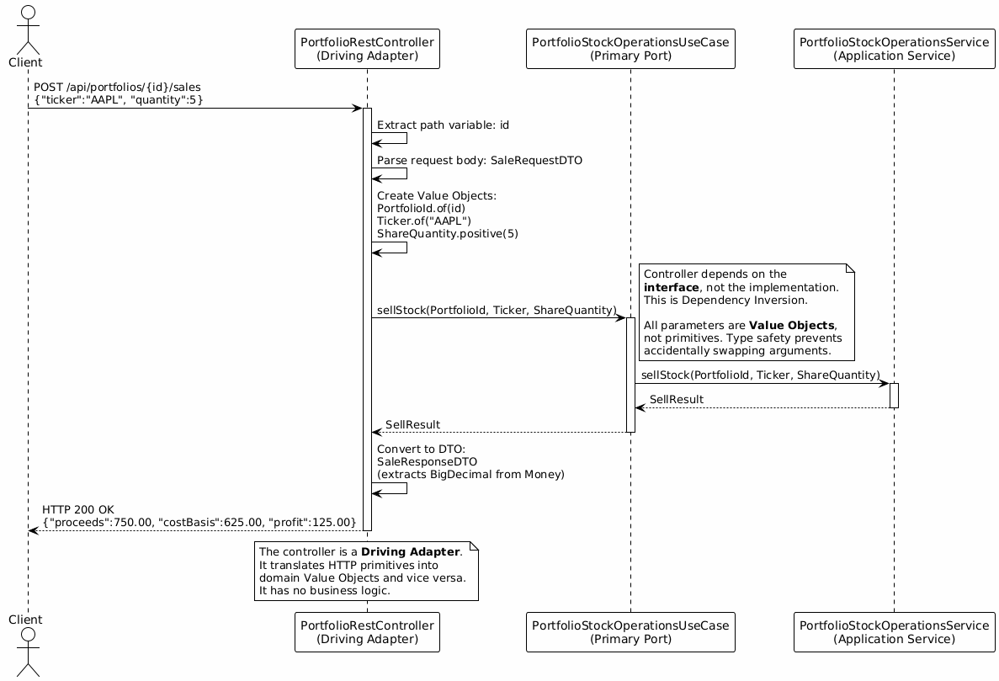
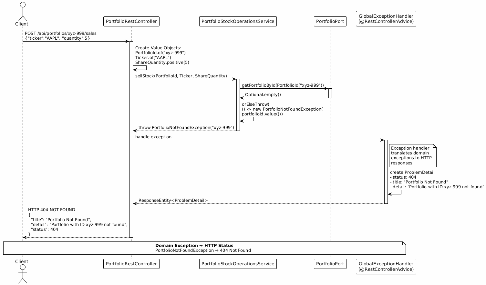
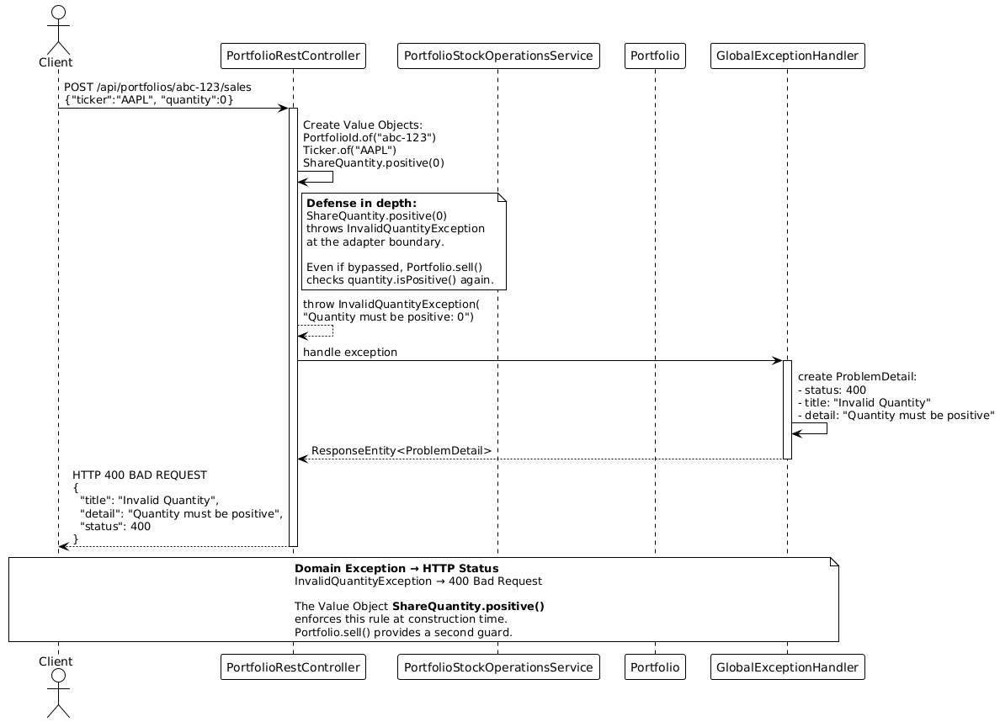

# Selling Stocks in HexaStock: Hexagonal Architecture and DDD Tutorial

## Table of Contents

- [Architecture Overview (Hexagonal / Ports & Adapters)](#architecture-overview-hexagonal--ports--adapters)
  - [How This Tutorial Maps to the Diagram](#how-this-tutorial-maps-to-the-diagram)
- [1. Purpose and Learning Objectives](#1-purpose-and-learning-objectives)
- [2. Domain Context: What "Selling Stocks" Means in HexaStock](#2-domain-context-what-selling-stocks-means-in-hexastock)
- [3. Entry Point: The REST Endpoint (Driving Adapter)](#3-entry-point-the-rest-endpoint-driving-adapter)
- [4. Hexagonal Architecture Map for the SELL Use Case](#4-hexagonal-architecture-map-for-the-sell-use-case)
- [5. Step-by-Step Execution Trace: Happy Path](#5-step-by-step-execution-trace-happy-path)
  - [Step 1: Controller Receives Request](#step-1-controller-receives-request)
  - [Step 2: Controller Calls Inbound Port](#step-2-controller-calls-inbound-port)
  - [Step 3: Application Service Orchestrates](#step-3-application-service-orchestrates)
  - [Step 4: Domain Model Enforces Invariants](#step-4-domain-model-enforces-invariants)
  - [Step 5: Persistence Adapter Saves Changes](#step-5-persistence-adapter-saves-changes)
  - [Step 6: Response Returns to Client](#step-6-response-returns-to-client)
- [6. Why Application Services Orchestrate and Aggregates Protect Invariants](#6--why-application-services-orchestrate-and-aggregates-protect-invariants)
  - [A) Roles Explained with Real Code](#a-roles-explained-with-real-code)
  - [B) Concrete Domain Example: Why Direct Manipulation Breaks Invariants](#b-concrete-domain-example-why-direct-manipulation-breaks-invariants)
  - [C) Sequence Diagram: Orchestrator vs Aggregate Root](#c-sequence-diagram-orchestrator-vs-aggregate-root)
  - [D) Teaching Note](#d-teaching-note)
- [7. Transactionality and Consistency](#7-transactionality-and-consistency)
- [8. Persistence Mapping](#8-persistence-mapping)
  - [Domain Model → JPA Entities](#domain-model--jpa-entities)
  - [Repositories](#repositories)
- [9. Error Flows](#9-error-flows)
  - [Error 1: Portfolio Not Found](#error-1-portfolio-not-found)
  - [Error 2: Invalid Quantity](#error-2-invalid-quantity)
  - [Error 3: Selling More Than Owned](#error-3-selling-more-than-owned)
- [10. Key Takeaways](#10-key-takeaways)
  - [About Hexagonal Architecture](#about-hexagonal-architecture)
  - [About Domain-Driven Design](#about-domain-driven-design)
- [11. Summary: The Complete Sell Flow](#11-summary-the-complete-sell-flow)
- [12. Exercises for Students](#12-exercises-for-students)
  - [Exercise 1: Trace the Buy Flow](#exercise-1-trace-the-buy-flow)
  - [Exercise 2: Identify Aggregate Boundaries](#exercise-2-identify-aggregate-boundaries)
  - [Exercise 3: Map Domain Exceptions to HTTP Status Codes](#exercise-3-map-domain-exceptions-to-http-status-codes)
  - [Exercise 4: Explain the Role of @Transactional](#exercise-4-explain-the-role-of-transactional)
  - [Exercise 5: Add a Maximum Sell Percentage Invariant](#exercise-5-add-a-maximum-sell-percentage-invariant)
  - [Exercise 6: Distinguish Value Objects from Entities](#exercise-6-distinguish-value-objects-from-entities)
  - [Exercise 7: Add a Third Stock Price Provider Adapter (Prove the Hexagon Works)](#exercise-7-add-a-third-stock-price-provider-adapter-prove-the-hexagon-works)
- [13. References](#13-references)

> **💡 How to use this Table of Contents:**  
> Click any link to jump directly to that section. The structure follows the document's hierarchy: main sections (##) are at the top level, subsections (###) are indented once, and specific exercises or cases (####) are indented twice. Use your browser's back button or scroll to navigate between sections.

---

## Architecture Overview (Hexagonal / Ports & Adapters)

Before diving into the execution flow of selling stocks, it's essential to understand the **architectural foundation** that shapes the entire codebase. HexaStock implements **Hexagonal Architecture** (also known as **Ports and Adapters**), a pattern designed to isolate business logic from external dependencies and infrastructure concerns.

### Core Architectural Layers

**Application Core** — The heart of the system, completely isolated from external technologies:
- **Domain Layer:** Contains pure business logic (entities, value objects, domain services). This is where business rules like FIFO accounting, invariant protection, and portfolio consistency are enforced. Examples: `Portfolio`, `Holding`, `Lot`, `Ticker`, `Money`, `Price`, `ShareQuantity`, `PortfolioId`, `HoldingId`, `LotId`.
- **Application Layer:** Orchestrates use cases by coordinating domain objects and ports. Application services are thin coordinators with no business logic—they retrieve data, delegate decisions to the domain, and persist results. Examples: `PortfolioStockOperationsService`.

**Ports** — Interfaces that define contracts between the core and the outside world:
- **Inbound Ports (Primary/Driving):** Define what the application can do. These are use case interfaces implemented by application services. Examples: `PortfolioStockOperationsUseCase`.
- **Outbound Ports (Secondary/Driven):** Define what the application needs from external systems. The core depends on these abstractions, not on concrete implementations. Examples: `PortfolioPort`, `StockPriceProviderPort`, `TransactionPort`.

**Adapters** — Concrete implementations that connect the core to the real world:
- **Inbound Adapters (Driving):** Receive requests from users or external systems and translate them into domain operations. Examples: `PortfolioRestController` (HTTP/REST), potential CLI or messaging adapters.
- **Outbound Adapters (Driven):** Implement outbound ports to interact with databases, external APIs, or other infrastructure. Examples: JPA repositories for persistence, Finnhub/AlphaVantage clients for stock prices.

**Dependency Direction:** All dependencies point **inward** toward the domain. Adapters depend on ports, ports are defined by the core, and the domain has zero dependencies on infrastructure. This is **Dependency Inversion** in action.

### Why This Architecture Matters for This Tutorial

Understanding this structure is critical because:
- **Class diagrams** in this tutorial explicitly show domain model entities and their relationships
- **Sequence diagrams** trace execution across architectural boundaries (adapter → port → service → domain)
- **Persistence mapping** explains how the domain model (technology-agnostic) is separated from JPA entities (infrastructure)
- **Transaction management** is placed at the application service level (infrastructure concern), not in the domain (business logic)
- **Error handling** demonstrates how domain exceptions (business language) are translated by adapters into HTTP responses (technical protocol)


> *Image credit:*  
> *The architectural diagram referenced in this tutorial is based on work by **Tom Hombergs**.*  
> *Sources:*  
> *– Article: [Hexagonal Architecture with Java and Spring](https://reflectoring.io/spring-hexagonal/)*  
> *– Reference implementation: [BuckPal – A Hexagonal Architecture Example](https://github.com/thombergs/buckpal)*  
> *Used for educational purposes with proper attribution.*


> *Image credit:*  
> *The architectural diagram referenced in this tutorial is based on work by **Herberto Graça**.*  
> *Source: [Explicit Architecture #01: DDD, Hexagonal, Onion, Clean, CQRS, … How I put it all together](https://herbertograca.com/2017/11/16/explicit-architecture-01-ddd-hexagonal-onion-clean-cqrs-how-i-put-it-all-together/)*  
> *Used for educational purposes with proper attribution.*

### How This Tutorial Maps to the Diagram

The sell stock use case flows through these architectural layers:

- **Primary (Driving) Adapters** → `PortfolioRestController` in package `adapter.in`
- **Inbound Ports** → `PortfolioStockOperationsUseCase` interface in `application.port.in`
- **Application Layer** → `PortfolioStockOperationsService` orchestrates the use case, manages transaction boundaries, and coordinates between ports
- **Domain Layer** → `Portfolio` (aggregate root), `Holding`, `Lot` (entities), `Ticker`, `Money`, `Price`, `ShareQuantity`, `SellResult`, `PortfolioId`, `HoldingId`, `LotId` (value objects), domain exceptions
- **Outbound Ports** → `PortfolioPort` (persistence abstraction), `StockPriceProviderPort` (external price data), `TransactionPort` (audit log)
- **Secondary (Driven) Adapters** → JPA repositories (`PortfolioJpaAdapter`), external API clients (`FinnhubStockPriceAdapter`, `AlphaVantageStockPriceAdapter`), transaction repositories

As you read through sections 3–9, you'll trace a real HTTP request flowing through these layers, observing how each component fulfills its architectural role while maintaining strict separation of concerns.

---

## 1. Purpose and Learning Objectives

This tutorial explains a **real use case** from the HexaStock codebase: **selling stocks from a portfolio**. By following the actual execution path through real code, you will learn:

- How **Hexagonal Architecture** separates concerns between adapters, ports, and domain logic
- How **Domain-Driven Design (DDD)** protects business invariants through aggregate roots
- Why application services **orchestrate** while aggregates **decide**
- How FIFO accounting is implemented at the domain level
- How domain exceptions translate to HTTP responses
- How **Value Objects** (`Money`, `Price`, `ShareQuantity`, `Ticker`, `PortfolioId`, etc.) replace primitives to enforce domain rules at construction time and make the ubiquitous language explicit in code

---

## 2. Domain Context: What "Selling Stocks" Means in HexaStock

[](diagrams/Rendered/HexaStock%20Domain%20Model.svg)

In this system:

- A **Portfolio** represents an investor's account containing cash (`Money`) and stock holdings
- A **Holding** tracks all shares owned for a specific stock ticker (e.g., `Ticker.of("AAPL")`)
- A **Lot** represents a single purchase transaction—a batch of shares (`ShareQuantity`) bought at a specific price (`Price`) and time
- **FIFO (First-In-First-Out)** accounting is used: when selling, the oldest lots are sold first
- A **Transaction** record is created for every financial activity (deposit, withdrawal, purchase, sale)

When you sell stocks in HexaStock:
1. The system fetches the current market price (returned as a `StockPrice` containing a `Price` value object)
2. It applies FIFO to determine which lots to draw from
3. It calculates proceeds (`Money` received), cost basis (`Money` originally paid), and profit/loss (`Money`)
4. It updates the portfolio's cash balance (`Money`) and holdings
5. It records a transaction for audit purposes

> **💡 Why Value Objects?**
> The domain uses `Money`, `Price`, `ShareQuantity`, `Ticker`, `PortfolioId`, `HoldingId`, and `LotId` instead of primitives (`BigDecimal`, `int`, `String`). This eliminates an entire class of bugs (e.g., passing a quantity where a price is expected), enforces validation at construction time, and makes the code self-documenting through the ubiquitous language.

---

## 3. Entry Point: The REST Endpoint (Driving Adapter)

**File:** `src/main/java/cat/gencat/agaur/hexastock/adapter/in/PortfolioRestController.java`

**Endpoint:** `POST /api/portfolios/{id}/sales`

```java
@PostMapping("/{id}/sales")
public ResponseEntity<SaleResponseDTO> sellStock(@PathVariable String id,
                                                 @RequestBody SaleRequestDTO request) {
    SellResult result =
            portfolioStockOperationsUseCase.sellStock(
                    PortfolioId.of(id),
                    Ticker.of(request.ticker()),
                    ShareQuantity.positive(request.quantity()));
    return ResponseEntity
            .ok(new SaleResponseDTO(id, request.ticker(), request.quantity(), result));
}
```

**Request Body Example:**
```json
{
  "ticker": "AAPL",
  "quantity": 5
}
```

**Why This Is a Driving Adapter:**
- It receives HTTP requests from the outside world
- It **depends on the inbound port** (`PortfolioStockOperationsUseCase`), **not** on the implementation
- It converts HTTP-specific data (JSON, path variables) into **Value Objects** (`PortfolioId.of(id)`, `Ticker.of(...)`, `ShareQuantity.positive(...)`)
- It converts domain results (`SellResult`) into DTOs (`SaleResponseDTO`)
- It handles HTTP concerns (status codes, response entities)

> **💡 Boundary mapping:** Notice how the controller is the **translation layer** between the external world (primitives in JSON/path) and the domain world (Value Objects). The DTO `SaleRequestDTO(String ticker, int quantity)` uses primitives because JSON is a primitive format. The controller immediately wraps these into `Ticker`, `ShareQuantity`, and `PortfolioId` before crossing into the application core. `ShareQuantity.positive(...)` rejects zero or negative values at the boundary.

This controller **drives** the application by calling its use cases. It does not contain business logic.

[](diagrams/Rendered/sell-http-to-port.svg)

---

## 4. Hexagonal Architecture Map for the SELL Use Case

Here is the complete architecture trace for selling stocks:

| Layer | Component | Type | Package/Class |
|-------|-----------|------|---------------|
| **Driving Adapter** | REST Controller | HTTP → Application | `adapter.in.PortfolioRestController` |
| **Primary Port** | Inbound Interface | Use Case Definition | `application.port.in.PortfolioStockOperationsUseCase` |
| **Application Service** | Orchestrator | Use Case Implementation | `application.service.PortfolioStockOperationsService` |
| **Domain Model** | Aggregate Root | Business Logic | `model.Portfolio` |
| **Domain Model** | Entity | Business Logic | `model.Holding` |
| **Domain Model** | Entity | Business Logic | `model.Lot` |
| **Domain Model** | Value Objects | Type Safety & Validation | `model.Money`, `model.Price`, `model.ShareQuantity`, `model.Ticker`, `model.PortfolioId`, `model.HoldingId`, `model.LotId`, `model.SellResult` |
| **Secondary Port** | Outbound Interface | Persistence Contract | `application.port.out.PortfolioPort` |
| **Secondary Port** | Outbound Interface | Price Provider Contract | `application.port.out.StockPriceProviderPort` |
| **Secondary Port** | Outbound Interface | Transaction Storage Contract | `application.port.out.TransactionPort` |
| **Driven Adapters** | JPA Repositories | Application → Database | `adapter.out.jpa.*` |

**Diagram Reference:** See [`diagrams/sell-http-to-port.puml`](diagrams/sell-http-to-port.puml)

---

## 5. Step-by-Step Execution Trace: Happy Path

### Step 1: Controller Receives Request

The `PortfolioRestController` receives:
```json
POST /api/portfolios/abc-123/sales
{
  "ticker": "AAPL",
  "quantity": 5
}
```

It extracts:
- Portfolio ID: `"abc-123"` (from path) → wrapped as `PortfolioId.of("abc-123")`
- Ticker: `"AAPL"` (from request body) → wrapped as `Ticker.of("AAPL")`
- Quantity: `5` (from request body) → wrapped as `ShareQuantity.positive(5)`

### Step 2: Controller Calls Inbound Port

```java
SellResult result = portfolioStockOperationsUseCase.sellStock(
    PortfolioId.of(id),
    Ticker.of(request.ticker()),
    ShareQuantity.positive(request.quantity())
);
```

The controller calls the **use case interface**, not a concrete class. This is dependency inversion in action. Notice how all parameters are **Value Objects**, not primitives—the type system prevents accidentally swapping a portfolio ID for a ticker.

### Step 3: Application Service Orchestrates

**File:** `application.service.PortfolioStockOperationsService`

```java
@Override
public SellResult sellStock(PortfolioId portfolioId, Ticker ticker, ShareQuantity quantity) {
    // 1. Retrieve portfolio from persistence
    Portfolio portfolio = portfolioPort.getPortfolioById(portfolioId)
        .orElseThrow(() -> new PortfolioNotFoundException(portfolioId.value()));

    // 2. Fetch current stock price from external provider
    StockPrice stockPrice = stockPriceProviderPort.fetchStockPrice(ticker);
    Price price = stockPrice.price();

    // 3. Delegate to domain model (AGGREGATE ROOT)
    SellResult sellResult = portfolio.sell(ticker, quantity, price);

    // 4. Persist updated portfolio
    portfolioPort.savePortfolio(portfolio);

    // 5. Record transaction for audit
    Transaction transaction = Transaction.createSale(
        portfolioId, ticker, quantity, price,
        sellResult.proceeds(), sellResult.profit()
    );
    transactionPort.save(transaction);

    return sellResult;
}
```

**Notice what the service does:**
- ✅ Retrieves data from adapters (using `PortfolioId`, `Ticker` value objects)
- ✅ Extracts the `Price` from the `StockPrice` returned by the provider
- ✅ Calls the aggregate root with Value Objects (`Ticker`, `ShareQuantity`, `Price`)
- ✅ Coordinates persistence
- ❌ Does **NOT** contain domain rules
- ❌ Does **NOT** manipulate nested entities directly

**Diagram Reference:** See [`diagrams/sell-application-service.puml`](diagrams/sell-application-service.puml)

[](diagrams/Rendered/sell-application-service.svg)

### Step 4: Domain Model Enforces Invariants

**File:** `model.Portfolio`

```java
public SellResult sell(Ticker ticker, ShareQuantity quantity, Price price) {
    if (!quantity.isPositive())
        throw new InvalidQuantityException("Quantity must be positive");

    if (!holdings.containsKey(ticker))
        throw new HoldingNotFoundException("Holding not found in portfolio: " + ticker);

    Holding holding = holdings.get(ticker);
    SellResult result = holding.sell(quantity, price);
    balance = balance.add(result.proceeds());

    return result;
}
```

The Portfolio (aggregate root):
- Validates inputs using Value Object methods (`quantity.isPositive()`)
- Protects the invariant: "You can only sell holdings you own"
- Delegates to the Holding entity
- Updates its own cash balance (`Money`)
- Returns the result (`SellResult`)

> **💡 Value Object validation:** Much of the validation that used to be manual (`if (quantity <= 0)`) is now built into the Value Objects themselves. `ShareQuantity` rejects negative values at construction time. `Price` rejects non-positive values at construction time. The domain methods provide an additional layer of protection for business-level invariants.

**File:** `model.Holding`

```java
public SellResult sell(ShareQuantity quantity, Price sellPrice) {
    if (getTotalShares().value() < quantity.value()) {
        throw new ConflictQuantityException(
                "Not enough shares to sell. Available: " + getTotalShares()
                + ", Requested: " + quantity);
    }

    ShareQuantity remainingToSell = quantity;
    Money costBasis = Money.ZERO;

    // FIFO: Sell from oldest lots first
    for (var lot : lots) {
        if (remainingToSell.isZero()) break;

        ShareQuantity sharesSoldFromLot = lot.getRemainingShares().min(remainingToSell);
        Money lotCostBasis = lot.calculateCostBasis(sharesSoldFromLot);
        costBasis = costBasis.add(lotCostBasis);

        lot.reduce(sharesSoldFromLot);
        remainingToSell = remainingToSell.subtract(sharesSoldFromLot);
    }

    lots.removeIf(Lot::isEmpty);

    Money proceeds = sellPrice.multiply(quantity);
    return SellResult.of(proceeds, costBasis);
}
```

The Holding:
- Protects the invariant: "You cannot sell more shares than you own" (comparing `ShareQuantity` values)
- Implements FIFO across multiple lots using `ShareQuantity.min()` for clean lot-by-lot iteration
- Delegates cost basis calculation to each `Lot` via `lot.calculateCostBasis(sharesSoldFromLot)`
- Calculates proceeds using `Price.multiply(ShareQuantity)` → returns `Money`
- Creates the result via `SellResult.of(proceeds, costBasis)` which auto-calculates profit
- Removes depleted lots (`lots.removeIf(Lot::isEmpty)`) to keep the aggregate lean

**File:** `model.Lot`

```java
public void reduce(ShareQuantity quantity) {
    if (quantity.value() > remainingShares.value()) {
        throw new ConflictQuantityException("Cannot reduce by more than remaining quantity");
    }
    remainingShares = remainingShares.subtract(quantity);
}

public Money calculateCostBasis(ShareQuantity quantity) {
    return unitPrice.multiply(quantity);
}
```

The Lot:
- Protects the invariant: "Remaining shares cannot go negative"
- Updates its remaining quantity using `ShareQuantity.subtract()`
- Calculates cost basis using `Price.multiply(ShareQuantity)` → returns `Money`

**Diagram Reference:** See [`diagrams/sell-domain-fifo.puml`](diagrams/sell-domain-fifo.puml)

[](diagrams/Rendered/sell-domain-fifo.svg)

### Step 5: Persistence Adapter Saves Changes

The `PortfolioPort` implementation (a JPA adapter) converts the domain `Portfolio` into JPA entities and persists them.

**Diagram Reference:** See [`diagrams/sell-persistence-adapter.puml`](diagrams/sell-persistence-adapter.puml)

[](diagrams/Rendered/sell-persistence-adapter.svg)

### Step 6: Response Returns to Client

The controller wraps the `SellResult` in a DTO and returns:

```json
HTTP 200 OK
{
  "portfolioId": "abc-123",
  "ticker": "AAPL",
  "quantity": 5,
  "proceeds": 750.00,
  "costBasis": 625.00,
  "profit": 125.00
}
```

> **💡 DTO mapping:** The `SaleResponseDTO` constructor accepts the domain `SellResult` and extracts the raw `BigDecimal` values from `Money` via `.amount()` for JSON serialization. This keeps the boundary clean: Value Objects inside the hexagon, primitives outside.

---

## 6. 🎯 Why Application Services Orchestrate and Aggregates Protect Invariants

This is the **most important concept** in DDD and Hexagonal Architecture.

### A) Roles Explained with Real Code

**Inbound Port (Contract):**

```java
// application.port.in.PortfolioStockOperationsUseCase
public interface PortfolioStockOperationsUseCase {
    SellResult sellStock(PortfolioId portfolioId, Ticker ticker, ShareQuantity quantity);
}
```

This interface defines **what** the application can do, not **how**. Notice the use of Value Objects (`PortfolioId`, `Ticker`, `ShareQuantity`) instead of primitives—the port speaks the domain's ubiquitous language.

**Application Service (Orchestrator):**

```java
// application.service.PortfolioStockOperationsService
@Transactional
public class PortfolioStockOperationsService
    implements PortfolioStockOperationsUseCase {

    private final PortfolioPort portfolioPort;
    private final StockPriceProviderPort stockPriceProviderPort;
    private final TransactionPort transactionPort;

    @Override
    public SellResult sellStock(PortfolioId portfolioId, Ticker ticker, ShareQuantity quantity) {
        Portfolio portfolio = portfolioPort.getPortfolioById(portfolioId)
            .orElseThrow(() -> new PortfolioNotFoundException(portfolioId.value()));

        StockPrice stockPrice = stockPriceProviderPort.fetchStockPrice(ticker);
        Price price = stockPrice.price();

        SellResult sellResult = portfolio.sell(ticker, quantity, price);

        portfolioPort.savePortfolio(portfolio);

        Transaction transaction = Transaction.createSale(
            portfolioId, ticker, quantity, price,
            sellResult.proceeds(), sellResult.profit());
        transactionPort.save(transaction);

        return sellResult;
    }
}
```

**Role:** **DIRECTOR OF ORCHESTRA**
- It retrieves the portfolio
- It fetches the price
- It **delegates the decision** to the aggregate root
- It persists the changes
- It records the transaction

**What it does NOT do:**
- ❌ Validate quantities
- ❌ Check if holdings exist
- ❌ Implement FIFO logic
- ❌ Calculate profit/loss
- ❌ Update lot quantities directly

**Aggregate Root (Decision Maker):**

```java
// model.Portfolio
public SellResult sell(Ticker ticker, ShareQuantity quantity, Price price) {
    if (!quantity.isPositive())
        throw new InvalidQuantityException("Quantity must be positive");
    if (!holdings.containsKey(ticker))
        throw new HoldingNotFoundException("Holding not found");

    Holding holding = holdings.get(ticker);
    SellResult result = holding.sell(quantity, price);
    balance = balance.add(result.proceeds());

    return result;
}
```

**Role:** **GUARDIAN OF INVARIANTS**
- It enforces "quantity must be positive" (via `ShareQuantity.isPositive()`)
- It enforces "you can only sell holdings you own"
- It updates the balance (`Money`) **consistently** with the sale
- It controls access to its nested entities (Holding, Lot)

---

### B) Concrete Domain Example: Why Direct Manipulation Breaks Invariants

#### ❌ **Anti-Pattern: Service Manipulating Nested Entities Directly**

Imagine if the application service did this:

```java
// WRONG! DO NOT DO THIS!
@Override
public SellResult sellStock(PortfolioId portfolioId, Ticker ticker, ShareQuantity quantity) {
    Portfolio portfolio = portfolioPort.getPortfolioById(portfolioId).orElseThrow();

    Holding holding = portfolio.getHoldings().stream()
        .filter(h -> h.getTicker().equals(ticker))
        .findFirst()
        .orElseThrow();

    // Service directly manipulates lots - DANGEROUS!
    ShareQuantity remaining = quantity;
    for (Lot lot : holding.getLots()) {
        if (remaining.isPositive()) {
            ShareQuantity toSell = lot.getRemainingShares().min(remaining);
            lot.reduce(toSell);  // Direct manipulation!
            remaining = remaining.subtract(toSell);
        }
    }

    // Update balance - might be inconsistent!
    Money someAmount = Price.of(150).multiply(quantity);
    portfolio.deposit(someAmount); // WRONG way to add proceeds!

    portfolioPort.savePortfolio(portfolio);
}
```

**What breaks:**

1. **FIFO Logic Duplication:** The FIFO algorithm is now in the service, not in the domain. If business rules change (e.g., switch to LIFO), you must change the service, not the domain model.

2. **Invariant Violation Risk:** What if the service forgets to check `getTotalShares().value() < quantity.value()`? The portfolio would be in an invalid state.

3. **Balance Inconsistency:** What if the balance update logic doesn't match the actual proceeds calculation? The portfolio becomes corrupted.

4. **No Central Enforcement:** If another use case (e.g., "bulk sell") also needs to sell stocks, it must duplicate all validation and calculation logic.

5. **Testability:** You now need integration tests to verify FIFO works correctly. With the current design, you can unit-test `Holding.sell()` in isolation.

#### ✅ **Correct Pattern: Aggregate Root Protects Invariants**

In the real code:

```java
// Application service: simple orchestration
SellResult sellResult = portfolio.sell(ticker, quantity, price);
```

The `Portfolio` aggregate:
- **Validates** inputs using Value Object methods
- **Checks** holdings exist
- **Delegates** to `Holding` (which it controls)
- **Updates** balance consistently with `Money.add()`
- **Returns** a complete `SellResult`

**Benefits:**
- All domain rules are in **one place** (the domain model)
- The service cannot corrupt the portfolio state
- Tests can verify invariants in isolation
- Business logic changes are localized

---

### C) Sequence Diagram: Orchestrator vs Aggregate Root

**Diagram Reference:** See [`diagrams/sell-orchestrator-vs-aggregate.puml`](diagrams/sell-orchestrator-vs-aggregate.puml)

This diagram explicitly shows:
- The **Application Service** calling `Portfolio.sell(Ticker, ShareQuantity, Price)` (aggregate root)
- The **Portfolio** calling `Holding.sell(ShareQuantity, Price)` (controlled entity)
- The **Holding** calling `Lot.reduce(ShareQuantity)` (controlled entity)
- **NO** direct service → Holding communication
- **NO** direct service → Lot communication

---

### D) Teaching Note

> **💡 Key Principle**
>
> **Application services coordinate; aggregates decide.**
>
> The application service is a **traffic controller**. It fetches data, calls the aggregate, and saves results. It does not make business decisions.
>
> The aggregate root is a **consistency boundary**. All changes to entities within the aggregate must go through the root. This ensures invariants are never violated.
>
> **Value Objects** reinforce this boundary by making the types expressive. You cannot accidentally pass a `ShareQuantity` where a `Price` is expected—the compiler catches it.

---

## 7. Transactionality and Consistency

The application service is annotated with `@Transactional`:

```java
@Transactional
public class PortfolioStockOperationsService
    implements PortfolioStockOperationsUseCase {
    // ...
}
```

### Why Transactions Matter for Stock Selling

Selling stocks is a **critical financial operation** that must maintain strict consistency guarantees:

1. **Multi-Step Operation:** A single sell involves multiple database writes:
   - Update portfolio balance (add proceeds as `Money`)
   - Update holding lot quantities (reduce `ShareQuantity` via FIFO)
   - Record transaction for audit trail
   
   These changes must **all succeed or all fail together**. Partial updates would corrupt the portfolio state.

2. **Consistency Across Aggregates:** Portfolio state and transaction history must remain synchronized. If the transaction record fails to save, the portfolio changes must be rolled back to prevent discrepancies in financial reporting.

3. **Invariant Protection:** The domain model enforces business rules (e.g., "cannot sell more than you own" via `ShareQuantity` comparisons), but the transaction boundary ensures these validations and subsequent state changes happen atomically—no other thread can observe an intermediate state.

### ACID Guarantees in Action

Spring's `@Transactional` ensures:

1. **Atomicity:** All database operations (save portfolio, save transaction) succeed or fail together
2. **Consistency:** If the transaction record fails to save, the portfolio changes are rolled back
3. **Isolation:** Concurrent sells on the same portfolio are serialized (preventing race conditions)
4. **Durability:** Once committed, the sale is permanent

**Important separation of concerns:** The domain enforces **business consistency** (invariants, validations via Value Objects), while infrastructure enforces **technical consistency** (ACID properties, transaction boundaries).

### Concurrency Risks in Financial Operations

When multiple users (or concurrent requests from the same user) attempt to sell stocks from the same portfolio simultaneously, several problems can arise without proper synchronization:

**Lost Update Problem:**
- Request 1 reads balance = `Money.of(1000)`
- Request 2 reads balance = `Money.of(1000)` (stale)
- Request 1 sells stock, adds proceeds → balance = `Money.of(1500)`, commits
- Request 2 sells stock, adds proceeds → calculates `Money.of(1300)` based on stale read, commits
- **Result:** Final balance is $1300, but should be $1800. The first update is lost.

**Double-Spending:**
- Request 1 reads holding: `ShareQuantity.of(10)` available
- Request 2 reads holding: `ShareQuantity.of(10)` available (stale)
- Request 1 sells 10 shares, commits
- Request 2 attempts to sell 10 shares, but only `ShareQuantity.ZERO` remain
- Without proper isolation, Request 2 might observe an inconsistent intermediate state.

**FIFO Corruption:**
- Two concurrent sells might both attempt to reduce the same lot simultaneously
- Without serialization, lot `ShareQuantity` values could become negative or inconsistent
- The aggregate's invariants would be violated mid-operation

### How HexaStock Handles Concurrency

HexaStock uses **database-level transaction isolation** to prevent these issues:

- The `@Transactional` annotation establishes a transaction boundary at the application service level
- Database isolation (typically READ_COMMITTED or higher) ensures that concurrent transactions see consistent snapshots
- For high-contention scenarios, **pessimistic locking** can be applied using JPA's `@Lock(LockModeType.PESSIMISTIC_WRITE)`, which serializes access to specific portfolio rows
- This ensures that when Transaction 1 is processing a sale, Transaction 2 waits until Transaction 1 commits before reading the portfolio

The transaction boundary is intentionally placed at the **application service**, not the domain model, because:
- Domain objects should be technology-agnostic (pure business logic)
- Transaction management is an infrastructure concern
- The service coordinates multiple operations (fetch, execute domain logic, persist, audit) that must succeed or fail atomically

---

> **📖 Deep Dive: Concurrency and Locking**
>
> This tutorial focuses on the architectural and domain design aspects of stock selling. For a **detailed explanation of concurrency control mechanisms**, including:
> - Pessimistic locking with `SELECT ... FOR UPDATE`
> - Optimistic locking with version fields
> - Transaction isolation levels and their trade-offs
> - Race condition demonstrations with real tests
> - When to use which strategy in production financial systems
>
> See the dedicated tutorial: **[Concurrency Control with Pessimistic Database Locking](CONCURRENCY-PESSIMISTIC-LOCKING.md)**

---

## 8. Persistence Mapping

### Domain Model → JPA Entities

The `Portfolio` domain object is mapped to a `PortfolioEntity` (JPA):
- `Portfolio.id` (`PortfolioId`) → `PortfolioEntity.id` (`String`)
- `Portfolio.balance` (`Money`) → `PortfolioEntity.balance` (`BigDecimal`)
- `Portfolio.holdings` (`Map<Ticker, Holding>`) → `PortfolioEntity.holdings` (one-to-many)

A **mapper** converts between the two, extracting primitive values from Value Objects for persistence and re-wrapping them when loading:

```java
Portfolio domainPortfolio = PortfolioMapper.toDomain(portfolioEntity);
PortfolioEntity jpaEntity = PortfolioMapper.toEntity(domainPortfolio);
```

### Repositories

- `PortfolioRepository` (JPA) implements `PortfolioPort` (domain interface)
- `TransactionRepository` (JPA) implements `TransactionPort` (domain interface)

This inversion of dependencies is the essence of Hexagonal Architecture: the domain defines **what** it needs (ports), and adapters provide **how** (implementations). The persistence layer deals with primitives (`String`, `BigDecimal`, `int`), while the domain layer deals with Value Objects (`PortfolioId`, `Money`, `ShareQuantity`). The mapper handles the translation.

**Diagram Reference:** See [`diagrams/sell-persistence-adapter.puml`](diagrams/sell-persistence-adapter.puml)

[](diagrams/Rendered/sell-persistence-adapter.svg)

---

## 9. Error Flows

### Error 1: Portfolio Not Found

**Trigger:** Selling from a non-existent portfolio

**Exception:** `PortfolioNotFoundException` (domain exception)

**Code:**

```java
Portfolio portfolio = portfolioPort.getPortfolioById(portfolioId)
    .orElseThrow(() -> new PortfolioNotFoundException(portfolioId.value()));
```

**HTTP Response:**

```json
HTTP 404 Not Found
{
  "title": "Portfolio Not Found",
  "detail": "Portfolio with ID abc-123 not found",
  "status": 404
}
```

**Exception Handler:** The `@RestControllerAdvice` class catches `PortfolioNotFoundException` and converts it to HTTP 404.

**Diagram Reference:** See [`diagrams/sell-error-portfolio-not-found.puml`](diagrams/sell-error-portfolio-not-found.puml)

[](diagrams/Rendered/sell-error-portfolio-not-found.svg)

---

### Error 2: Invalid Quantity

**Trigger:** Selling zero or negative shares

**Exception:** `InvalidQuantityException` (domain exception)

**Code:**

```java
// In the controller, ShareQuantity.positive() rejects non-positive values:
ShareQuantity.positive(request.quantity())
// → throws InvalidQuantityException("Quantity must be positive: 0")

// In Portfolio.sell(), an additional guard:
if (!quantity.isPositive())
    throw new InvalidQuantityException("Quantity must be positive");
```

> **💡 Defense in depth:** The `ShareQuantity.positive()` factory method validates at the adapter boundary, and `Portfolio.sell()` validates again inside the domain. This layered approach ensures protection even if a caller bypasses the controller.

**HTTP Response:**

```json
HTTP 400 Bad Request
{
  "title": "Invalid Quantity",
  "detail": "Quantity must be positive",
  "status": 400
}
```

**Diagram Reference:** See [`diagrams/sell-error-invalid-quantity.puml`](diagrams/sell-error-invalid-quantity.puml)

[](diagrams/Rendered/sell-error-invalid-quantity.svg)

---

### Error 3: Selling More Than Owned

**Trigger:** Trying to sell 100 shares when you only own 10

**Exception:** `ConflictQuantityException` (domain exception)

**Code:**

```java
// In Holding.sell()
if (getTotalShares().value() < quantity.value()) {
    throw new ConflictQuantityException(
            "Not enough shares to sell. Available: " + getTotalShares()
            + ", Requested: " + quantity);
}
```

**HTTP Response:**

```json
HTTP 409 Conflict
{
  "title": "Conflict Quantity",
  "detail": "Not enough shares to sell. Available: 10, Requested: 100",
  "status": 409
}
```

**Diagram Reference:** See [`diagrams/sell-error-sell-more-than-owned.puml`](diagrams/sell-error-sell-more-than-owned.puml)

[](diagrams/Rendered/sell-error-sell-more-than-owned.svg)

---

## 10. Key Takeaways

### About Hexagonal Architecture

1. **Ports Define Contracts:** The application defines interfaces (ports) that adapters implement. This allows swapping implementations (e.g., change from Finnhub to AlphaVantage for stock prices) without changing the core.

2. **Dependency Inversion:** The controller depends on `PortfolioStockOperationsUseCase` (interface), not on the concrete service. The service depends on `PortfolioPort` (interface), not on the JPA repository.

3. **Testability:** You can test the application service with mock ports. You can test the domain model with no infrastructure at all.

4. **Adapters Are Replaceable:** The REST controller could be replaced with a CLI adapter, a gRPC service, or a message queue consumer—all using the same ports.

### About Domain-Driven Design

1. **Aggregate Roots Protect Boundaries:** `Portfolio` is the aggregate root. All changes to `Holding` and `Lot` must go through the `Portfolio`. This prevents inconsistent states.

2. **Application Services Are Thin:** The service has **no business logic**. It only coordinates. If you see `if` statements, calculations, or validations in a service, you're doing it wrong.

3. **Domain Exceptions Are Business Language:** `ConflictQuantityException` is not a technical exception like `NullPointerException`. It represents a business rule violation. This makes the code self-documenting.

4. **FIFO Is Domain Logic:** The FIFO algorithm is in `Holding.sell()`, not in a service or adapter. This is where it belongs: close to the data it operates on, protected by the aggregate root.

5. **Encapsulation Matters:** The `Portfolio` does not expose a `setBalance()` method. The only way to change the balance is through domain methods like `deposit()`, `withdraw()`, `buy()`, or `sell()`. This prevents corruption.

6. **Value Objects Eliminate Primitive Obsession:** Types like `Money`, `Price`, `ShareQuantity`, `Ticker`, `PortfolioId`, `HoldingId`, and `LotId` replace raw `BigDecimal`, `int`, and `String`. This makes the code type-safe, self-validating, and expressive in the ubiquitous language. You cannot accidentally pass a `Money` where a `Price` is expected, even though both wrap `BigDecimal` internally.

---

## 11. Summary: The Complete Sell Flow

```
HTTP Request
    ↓
PortfolioRestController (Driving Adapter)
    ↓ maps primitives to Value Objects:
    │   PortfolioId.of(id), Ticker.of(ticker), ShareQuantity.positive(quantity)
    ↓ calls
PortfolioStockOperationsUseCase (Primary Port / Interface)
    ↓ implemented by
PortfolioStockOperationsService (Application Service)
    ↓ uses
PortfolioPort (Secondary Port) → fetch portfolio by PortfolioId
StockPriceProviderPort (Secondary Port) → fetch StockPrice (contains Price)
    ↓ delegates to
Portfolio.sell(Ticker, ShareQuantity, Price) (Aggregate Root - Domain Logic)
    ↓ delegates to
Holding.sell(ShareQuantity, Price) (Entity - Domain Logic)
    ↓ delegates to
Lot.reduce(ShareQuantity) (Entity - Domain Logic)
    ↓ returns
SellResult (Value Object: Money proceeds, Money costBasis, Money profit)
    ↓ service saves
PortfolioPort.savePortfolio() (Secondary Port)
TransactionPort.save() (Secondary Port)
    ↓ implemented by
JPA Repositories (Driven Adapters)
    ↓ returns
HTTP Response (SaleResponseDTO — primitives extracted from Value Objects)
```

---

## 12. Exercises for Students

The following exercises form a progressive learning path designed to deepen your understanding of Hexagonal Architecture and Domain-Driven Design through hands-on work with the HexaStock codebase.

---

### Exercise 1: Trace the Buy Flow
**Type:** Execution Understanding / Documentation

**Goal:** Understand how the `buyStock` use case mirrors the `sellStock` flow.

**What to deliver:**
- A written document (similar to section 5 of this tutorial) that traces the complete execution path for buying stocks
- Include: REST endpoint → Controller → Inbound Port → Application Service → Domain Model → Persistence
- Identify which classes validate business rules and where ACID guarantees are enforced
- Note one key difference between buy and sell operations
- Pay attention to how `ShareQuantity`, `Price`, `Money`, and `Ticker` flow through the layers

---

### Exercise 2: Identify Aggregate Boundaries
**Type:** Reasoning / Explanation

**Goal:** Understand why Portfolio is the aggregate root and what it protects.

**What to deliver:**
- A written explanation (300-500 words) answering:
  - Why is `Portfolio` the aggregate root instead of `Holding` or `Lot`?
  - What invariants would break if `Holding` were exposed as a separate aggregate?
  - Why must balance (`Money`) updates and holding modifications happen together atomically?
- Use concrete examples from the sell operation to support your reasoning

---

### Exercise 3: Map Domain Exceptions to HTTP Status Codes
**Type:** Reasoning / Design

**Goal:** Understand how domain exceptions become HTTP responses.

**What to deliver:**
- A table mapping each domain exception to its appropriate HTTP status code
- For each mapping, explain WHY that status code is correct (not just "because that's what the code does")

---

### Exercise 4: Explain the Role of @Transactional
**Type:** Reasoning / Explanation

**Goal:** Understand when and why Spring transactions are needed.

**What to deliver:**
- A written explanation answering:
  - Why is `@Transactional` on the application service, not the domain model?
  - What would happen if `portfolioPort.savePortfolio()` succeeds but `transactionPort.save()` fails?
  - Could the domain model enforce ACID guarantees itself? Why or why not?
- Propose a scenario where transaction management might fail and explain the consequences

---

## Exercise 5: Add a Maximum Sell Percentage Invariant

**Type:** Mixed (Design + Coding + Reasoning)
**Goal:** Implement a non-trivial business invariant using Domain-Driven Design principles.

---

## Business Rules

In a single sell transaction, a portfolio must respect the following rules **per holding (per ticker)**:

### Rule 1 — Small sells are always allowed

A portfolio may sell **up to 10 shares** (`ShareQuantity.of(10)`) of a holding **without any percentage restriction**, as long as enough shares exist.

### Rule 2 — Large sells are limited

When selling **more than 10 shares** in a single transaction, the portfolio **cannot sell more than 50% of the shares of the affected holding**.

The percentage is calculated using the number of shares **held before the sale** (`getTotalShares()` returns `ShareQuantity`).

> **Formal rule:**
>
> - If `sharesToSell.value() <= 10` -> allowed
> - If `sharesToSell.value() > 10` -> must satisfy: 
>   sharesToSell.value() <= holdingSharesBefore.value() * 0.50
>   


---

## Clarifications

* The rule applies **per holding (per ticker)**, not to the whole portfolio.
* The rule is **not** evaluated per lot.
* The invariant must be checked **before any state change occurs**.

---

## Examples (AAPL)

### Example 1 — Valid (✅ small sell)

* AAPL holding has `ShareQuantity.of(3)` shares
* Sell request: `ShareQuantity.of(1)`

Result: allowed.

---

### Example 2 — Valid (✅ boundary case)

* AAPL holding has `ShareQuantity.of(12)` shares
* Sell request: `ShareQuantity.of(10)`

Result: allowed.

---

### Example 3 — Valid (✅ large sell within limit)

* AAPL holding has `ShareQuantity.of(22)` shares
* Sell request: `ShareQuantity.of(11)`

50% of 22 = 11 → allowed.

---

### Example 4 — Invalid (❌ large sell exceeding limit)

* AAPL holding has `ShareQuantity.of(20)` shares
* Sell request: `ShareQuantity.of(11)`

50% of 20 = 10 → not allowed.

Result: throw `ExcessiveSaleException`.
No state must change.

---

## What to Deliver

### 1. Design Decision (written explanation)

Decide **where this invariant should be implemented**:

* `PortfolioRestController`
* `PortfolioStockOperationsService`
* `Portfolio.sell()`
* `Holding.sell()`

Justify your choice using DDD concepts:

* Aggregate boundaries
* Invariants
* Encapsulation of business rules

---

### 2. Implementation (code)

* Enforce the rule in the appropriate domain class
* Introduce a new domain exception: `ExcessiveSaleException`
* Ensure the invariant is validated **before any mutation**

---

### 3. Test (code)

Write at least some tests proving:

* Selling **10 or fewer** shares always succeeds (if shares exist)
* Selling **more than 10** shares succeeds only if it is **≤ 50%** of the holding
* Selling **more than 10** shares and **exceeding 50%** fails with `ExcessiveSaleException`
* Tests run **without infrastructure** (pure domain unit tests using `ShareQuantity`, `Price`, etc.)

---

### 4. Reflection (written)

* How would you support a future requirement where the 50% limit is **configurable per portfolio**?
* Would that change **where the invariant lives**? Why or why not?

---

### Exercise 6: Distinguish Value Objects from Entities
**Type:** Reasoning / Explanation

**Goal:** Understand the difference between entities and value objects in DDD.

**What to deliver:**
- A written explanation (400-600 words) analyzing:
  - Why is `Ticker` a value object while `Lot` is an entity?
  - Why is `Money` a value object while `Portfolio` is an entity?
  - What would happen if `SellResult` had an ID and was persisted as an entity?
  - Why are `PortfolioId`, `HoldingId`, and `LotId` value objects even though they represent identity? (Hint: they are identity *values*, not entities themselves.)
- Propose converting `Ticker` into an entity with validation rules (e.g., must be uppercase, 1-5 characters). Would this be a good design? Why or why not? (Note: `Ticker` already validates its format at construction time as a Value Object.)

---

### Exercise 7: Add a Third Stock Price Provider Adapter (Prove the Hexagon Works)

**Type:** Coding + Architecture Validation (Driven Adapter / Outbound Port)
**Goal:** Implement a **new outbound adapter** for market data that plugs into the existing port:

* `cat/gencat/agaur/hexastock/application/port/out/StockPriceProviderPort.java`

…and demonstrate that the **core of the system (domain + application services + REST controllers)** remains unchanged.

---

#### Context (what already exists in HexaStock)

HexaStock already has **two** implementations of the same outbound port (`StockPriceProviderPort`), each calling a different external provider:

* **Finnhub adapter**
* **AlphaVantage adapter**

They are both **driven adapters** (outbound): the application calls them through the port, and the adapter calls an external HTTP API.

Your task is to add a **third adapter**, using a different provider, with the same contract and behavior.

Note that `StockPriceProviderPort.fetchStockPrice(Ticker)` returns a `StockPrice` record containing a `Ticker`, a `Price` value object, and an `Instant`. Your adapter must construct this return value using the proper Value Objects.

---

## Provider Options (examples)

Pick **one** provider that offers a free tier or freemium plan. You may choose any provider you find online, but here are common options:
* **https://site.financialmodelingprep.com/**
* **Twelve Data**
* **Marketstack**
* **Financial Modeling Prep (FMP)**
* **IEX Cloud** (often limited free tier)
* **Alpaca Market Data**

You can also pick another provider not listed here, as long as:
* it exposes a "latest price" endpoint,
* it authenticates via API key,
* it returns data you can map to your domain `StockPrice` model (which contains `Price` and `Ticker` value objects).

---

## What to deliver

### 1) Implement the new adapter class (and its package)

Create a new package under `adapter.out`, for example:

* `cat.gencat.agaur.hexastock.adapter.out.twelvedata`
* or `...adapter.out.marketstack`
* or `...adapter.out.fmp`

Then implement the port:

```java
package cat.gencat.agaur.hexastock.adapter.out.twelvedata;

import cat.gencat.agaur.hexastock.application.port.out.StockPriceProviderPort;
import cat.gencat.agaur.hexastock.model.Ticker;
import cat.gencat.agaur.hexastock.model.Price;
import cat.gencat.agaur.hexastock.model.StockPrice;
import java.time.Instant;

public class TwelveDataStockPriceProviderAdapter implements StockPriceProviderPort {

    @Override
    public StockPrice fetchStockPrice(Ticker ticker) {
        // 1) Call provider HTTP API
        // 2) Parse JSON response
        // 3) Map to domain Value Objects:
        //    Price price = Price.of(parsedPrice);
        //    return StockPrice.of(ticker, price, Instant.now());
        // 4) Handle errors/rate limits in a consistent way
        throw new UnsupportedOperationException("TODO");
    }
}
```

**Strict rule:**
✅ You may add new classes in the adapter layer
❌ You must NOT change the port interface
❌ You must NOT change the use case (`PortfolioStockOperationsService`)
❌ You must NOT change the domain (`Portfolio`, `Holding`, `Lot`)
❌ You must NOT change the REST controller

This is the point of the exercise: **only infrastructure changes**.

---

### 2) Add configuration to select the provider

Make it possible to switch providers without touching the core code. Use one of these approaches:

**Option A: Spring Profiles (recommended for teaching)**

* `application-finnhub.properties`
* `application-alphavantage.properties`
* `application-twelvedata.properties`

Then activate via:

* `-Dspring.profiles.active=twelvedata`

**Option B: Property-based selection**

* `stock.price.provider=twelvedata`

Then create conditional beans.

Your final result must allow:

* Finnhub (existing)
* AlphaVantage (existing)
* Your new provider (new)

---

### 3) API key management (free-tier ready)

* Store the API key outside code:

    * environment variable, or
    * profile properties file.
* If the key is missing, fail fast with a clear error message.

---

### 4) Error handling contract (keep behavior consistent)

Your adapter must handle, at minimum:

* invalid ticker / symbol not found,
* rate limit exceeded (HTTP 429 or provider-specific message),
* provider downtime or network error.

**Deliverable:** a short note describing how your adapter translates those cases into exceptions used by the application (or a consistent exception strategy already present in the codebase).

---

### 5) Tests (prove the adapter works without breaking the hexagon)

Write one of these:

**Option A (strongly recommended): Adapter unit test with mocked HTTP**

* Use WireMock / MockWebServer
* Verify:

    * correct URL is called,
    * ticker is passed correctly,
    * response JSON is mapped correctly to `StockPrice` (containing `Price` and `Ticker` value objects).

**Option B: Run the existing sell integration test with your adapter**

* Run `PortfolioRestControllerIntegrationTest` (or equivalent)
* Switch profile to your adapter
* Show that the **same sell flow works** (controller → service → domain → port → adapter)

---

## Proof of Hexagonal Architecture (mandatory explanation)

Write a short explanation (8–12 lines) answering:

1. What changed in the codebase?
2. What did not change? (name concrete packages/classes)
3. Why does the port make this possible?

**Expected conclusion:**

> We replaced a driven adapter (infrastructure) while keeping the domain and application core intact, proving that Hexagonal Architecture isolates the core from external dependencies.

---

## Extra Challenge (optional)

Add a small "provider comparison" markdown note:

* which endpoint you used,
* whether the free tier provides real-time or delayed price,
* what the call limits are.

---

**Success criteria:** You can sell stocks using your new provider by changing only configuration (profile/property). The use case and domain behave exactly the same because they depend only on `StockPriceProviderPort`, not on the external API.

---

**End of Exercises**

Work through these exercises in order. Each builds on concepts from earlier exercises. Discuss your solutions with peers and instructors to deepen your understanding of Hexagonal Architecture and Domain-Driven Design.

---

## 13. References

- **API Specification:** `doc/stock-portfolio-api-specification.md`
- **Integration Tests:** `src/test/java/cat/gencat/agaur/hexastock/adapter/in/PortfolioRestControllerIntegrationTest.java`
- **Domain Tests:** `src/test/java/cat/gencat/agaur/hexastock/model/PortfolioTest.java`
- **Source Code:** `src/main/java/cat/gencat/agaur/hexastock/`
- **Value Object Tests:** `src/test/java/cat/gencat/agaur/hexastock/model/MoneyTest.java`, `ShareQuantityTest.java`, etc.

---
