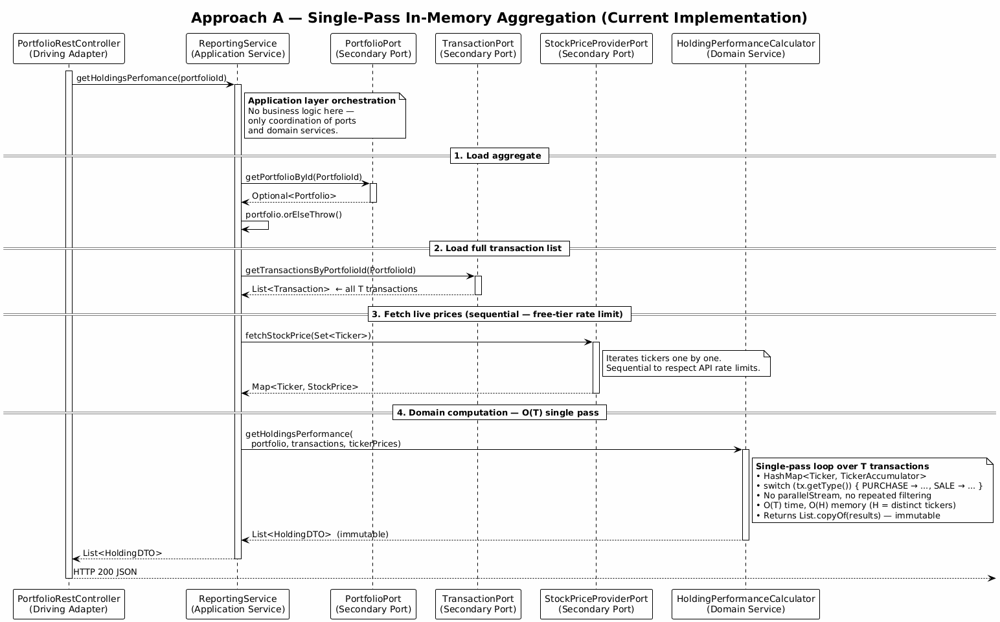
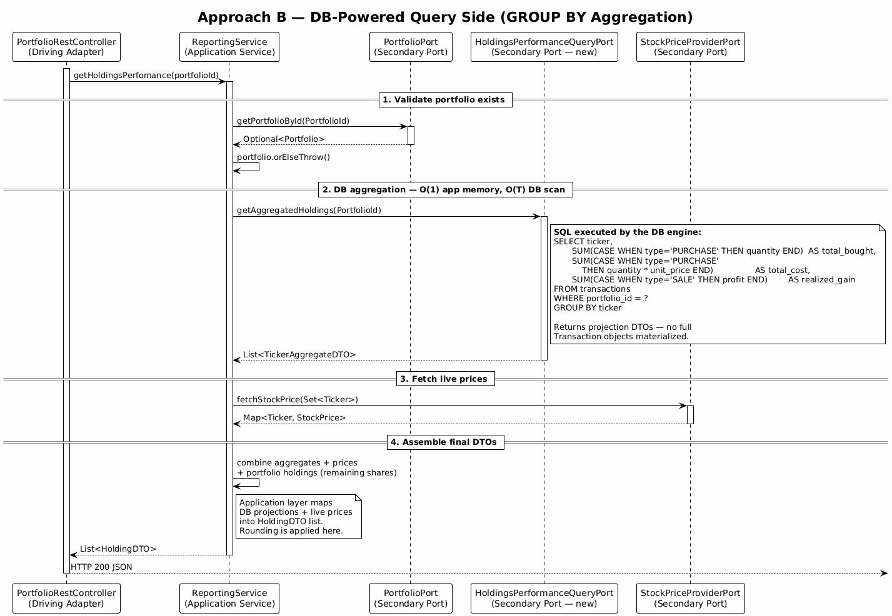
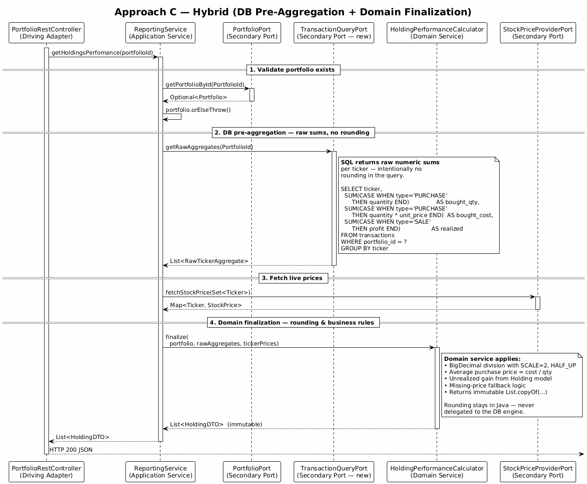
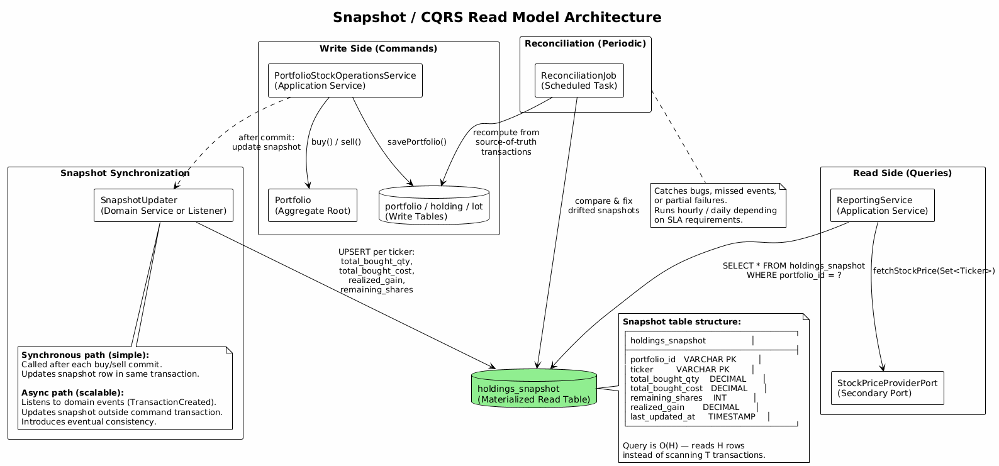

# Holdings Performance at Scale

## Evolving from In-Memory Aggregation to Production-Grade Reporting

---

## Table of Contents

- [1. Introduction and Context](#1-introduction-and-context)
- [2. Approach A — Single-Pass In-Memory Aggregation (Current)](#2-approach-a--single-pass-in-memory-aggregation-current)
  - [2.1 Algorithm Design](#21-algorithm-design)
  - [2.2 Why Sequential Instead of Parallel](#22-why-sequential-instead-of-parallel)
  - [2.3 BigDecimal Cost and Allocation Pressure](#23-bigdecimal-cost-and-allocation-pressure)
  - [2.4 Layer Separation](#24-layer-separation)
- [3. Scalability Analysis of Approach A](#3-scalability-analysis-of-approach-a)
  - [3.1 Working Set Per Request](#31-working-set-per-request)
  - [3.2 Concurrency Amplification](#32-concurrency-amplification)
  - [3.3 Heap Pressure and GC Pause Implications](#33-heap-pressure-and-gc-pause-implications)
  - [3.4 Latency Distribution Reasoning](#34-latency-distribution-reasoning)
  - [3.5 When O(T) Becomes Problematic](#35-when-ot-becomes-problematic)
- [4. Approach B — DB-Powered Query Side](#4-approach-b--db-powered-query-side)
  - [4.1 Design Overview](#41-design-overview)
  - [4.2 GROUP BY Aggregation](#42-group-by-aggregation)
  - [4.3 Port and Adapter Design](#43-port-and-adapter-design)
  - [4.4 Tradeoffs](#44-tradeoffs)
  - [4.5 Integration Testing Implications](#45-integration-testing-implications)
- [5. Approach C — Hybrid (DB Pre-Aggregation + Domain Finalization)](#5-approach-c--hybrid-db-pre-aggregation--domain-finalization)
  - [5.1 Design Overview](#51-design-overview)
  - [5.2 Boundary Definition](#52-boundary-definition)
  - [5.3 Where Rounding Must Remain in the Domain](#53-where-rounding-must-remain-in-the-domain)
  - [5.4 Tradeoff vs Approach B](#54-tradeoff-vs-approach-b)
- [6. Snapshot / CQRS Read Model](#6-snapshot--cqrs-read-model)
  - [6.1 Snapshot Table Structure](#61-snapshot-table-structure)
  - [6.2 Synchronous Update Model](#62-synchronous-update-model)
  - [6.3 Asynchronous Event-Driven Alternative](#63-asynchronous-event-driven-alternative)
  - [6.4 Eventual Consistency Discussion](#64-eventual-consistency-discussion)
  - [6.5 Reconciliation Strategy](#65-reconciliation-strategy)
  - [6.6 Operational Complexity Considerations](#66-operational-complexity-considerations)
- [7. Engineering Decision Matrix](#7-engineering-decision-matrix)
- [8. Choosing the Right Approach](#8-choosing-the-right-approach)
- [9. References](#9-references)

---

## 1. Introduction and Context

HexaStock is a portfolio management system built with **Hexagonal Architecture** and **Domain-Driven Design** on Java 21 and Spring Boot 3.x. One of its key reporting features is **holdings performance**: for each stock in a portfolio, compute the total purchased quantity, average purchase price, remaining shares, current market value, unrealized gain, and realized gain.

This tutorial examines four strategies for implementing this reporting feature, ranging from the simplest (all computation in Java) to production-scale architectures (CQRS read models). The goal is not to prescribe a single answer, but to give engineers the vocabulary and reasoning framework to choose correctly for their context.

**Prerequisite:** Approach A is already fully implemented and tested in the codebase. This document explains its internals, then explores how to evolve beyond it.

**Key files in the current implementation:**

| Layer | File | Role |
|---|---|---|
| Domain service | `model.service.HoldingPerformanceCalculator` | O(T) single-pass aggregation |
| Application service | `application.service.ReportingService` | Orchestration — loads data, delegates to domain |
| Inbound port | `application.port.in.ReportingUseCase` | Use case contract |
| Outbound ports | `PortfolioPort`, `TransactionPort`, `StockPriceProviderPort` | Data retrieval contracts |
| DTO | `adapter.in.webmodel.HoldingDTO` | Result record |

---

## 2. Approach A — Single-Pass In-Memory Aggregation (Current)

[](diagrams/Rendered/approachA-sequence.svg)

Source: `./diagrams/approachA-sequence.puml`

### 2.1 Algorithm Design

The `HoldingPerformanceCalculator` iterates the transaction list **exactly once**, maintaining a `LinkedHashMap<Ticker, TickerAccumulator>` where each accumulator tracks three running totals:

```java
static final class TickerAccumulator {
    BigDecimal totalBoughtQty  = BigDecimal.ZERO;
    BigDecimal totalBoughtCost = BigDecimal.ZERO;
    BigDecimal realizedGain    = BigDecimal.ZERO;
}
```

For each transaction, a `switch` expression dispatches on the transaction type:

```java
switch (tx.getType()) {
    case PURCHASE -> {
        var qty = BigDecimal.valueOf(tx.getQuantity().value());
        acc.totalBoughtQty  = acc.totalBoughtQty.add(qty);
        acc.totalBoughtCost = acc.totalBoughtCost.add(
                tx.getUnitPrice().value().multiply(qty));
    }
    case SALE -> acc.realizedGain = acc.realizedGain.add(
            tx.getProfit().amount());
    case DEPOSIT, WITHDRAWAL -> { /* no-op — null ticker already filtered */ }
}
```

**Complexity:**

| Metric | Value | Explanation |
|---|---|---|
| Time | O(T) | Single linear scan of T transactions |
| Memory | O(H) | One `TickerAccumulator` per distinct ticker (H ≪ T typically) |
| Passes over data | 1 | No re-filtering, no `groupingBy` + per-group re-scan |

After the loop, a second O(H) pass builds the immutable result list by combining each accumulator with live prices and portfolio state.

### 2.2 Why Sequential Instead of Parallel

The previous implementation used `parallelStream()` in multiple places. This was removed for three engineering reasons:

**1. `ForkJoinPool.commonPool()` contention**

`parallelStream()` submits work to `ForkJoinPool.commonPool()`, a JVM-wide shared resource. In a web server, every concurrent request that uses `parallelStream()` competes for the same pool. When the pool saturates, tasks queue up — producing latency spikes that are invisible in unit tests but devastating at p99 under load. The pool size defaults to `Runtime.availableProcessors() - 1`, so on a 4-core container it is exactly 3 threads shared across all requests.

**2. Overhead exceeds benefit for small-to-medium datasets**

Parallel stream imposes fixed costs: task splitting, thread hand-off via work-stealing queues, and result merging. For a collection of a few thousand elements doing simple arithmetic, these costs routinely exceed the computation itself. The crossover point where parallelism pays off depends on the workload, but for `BigDecimal.add()` across a list it is typically in the hundreds of thousands of elements — far beyond the realistic transaction count for a single portfolio.

**3. Predictability**

Sequential execution gives deterministic throughput: one thread, one core, linear time. This is trivially profiled, trivially reproduced in load tests, and trivially capacity-planned. Parallel execution introduces variance in timing that makes p95/p99 latency harder to reason about and SLA commitments harder to make.

> **Rule of thumb for server-side code:** prefer sequential streams. Reach for parallelism only when profiling proves a measurable bottleneck, and when you control the executor (not the common pool).

### 2.3 BigDecimal Cost and Allocation Pressure

Every `BigDecimal.add()`, `multiply()`, or `divide()` allocates a new `BigDecimal` object. In a single pass over T transactions, the calculator performs approximately:

- **2 × T** allocations for `PURCHASE` transactions (one for quantity conversion, one for cost multiplication + accumulation)
- **1 × T** allocations for `SALE` transactions (profit accumulation)

For T = 20,000 this is roughly 40,000–60,000 short-lived `BigDecimal` instances. These are small objects (typically 40–56 bytes on a 64-bit JVM with compressed oops) and die young — exactly the scenario G1/ZGC's young generation is optimized for. They are collected in minor GCs with near-zero pause impact.

However, as T grows into the hundreds of thousands, the allocation rate per request increases proportionally. Under high concurrency, this can elevate the young-generation promotion rate and trigger more frequent minor pauses. This is one of the signals that in-memory aggregation is reaching its practical limit (see Section 3).

### 2.4 Layer Separation

The current implementation strictly separates concerns across hexagonal layers:

| Responsibility | Layer | Class |
|---|---|---|
| Load portfolio, transactions, prices | Application | `ReportingService` |
| Iterate, aggregate, build DTOs | Domain | `HoldingPerformanceCalculator` |
| Remaining shares, unrealized gain | Domain | `Holding` (entity) |
| Rounding constants (SCALE, HALF_UP) | Domain | `HoldingPerformanceCalculator` |
| Live price fetching | Infrastructure | `StockPriceProviderPort` impl |

The domain service has **no I/O**. It receives all data as method arguments and returns an immutable `List<HoldingDTO>`. This makes it trivially unit-testable — the test suite exercises it with in-memory portfolios and transaction lists, with no mocks needed.

---

## 3. Scalability Analysis of Approach A

### 3.1 Working Set Per Request

Each call to `getHoldingsPerformance` materializes the following objects in the JVM heap:

| Object | Count | Typical size |
|---|---|---|
| `Transaction` instances | T | ~200–400 bytes each (with Value Objects) |
| `TickerAccumulator` entries | H | ~80 bytes each |
| Intermediate `BigDecimal` allocations | ~3T | ~48 bytes each |
| Result `HoldingDTO` list | H | ~120 bytes each |

For T = 20,000 and H = 15 tickers, the working set per request is approximately:

- Transactions: 20,000 × 300 bytes ≈ **6 MB**
- Accumulators: negligible
- Intermediate BigDecimals: 60,000 × 48 bytes ≈ **2.7 MB**
- Total: **~9 MB per request**

This is well within the capabilities of a modern JVM with a 256 MB–1 GB heap.

### 3.2 Concurrency Amplification

The critical insight is that the working set above is **per request**. Under concurrent load:

| Concurrent requests | Aggregate working set |
|---|---|
| 1 | ~9 MB |
| 10 | ~90 MB |
| 50 | ~450 MB |
| 100 | ~900 MB |

This is a linear amplification. A server handling 50 concurrent reporting requests on portfolios with 20,000 transactions each would hold ~450 MB of transaction objects simultaneously. Whether this is acceptable depends entirely on the JVM heap size and the GC configuration.

The transactions are loaded from the database, so the amplification also applies to JDBC result set processing, object hydration, and JPA entity mapping — all of which happen before the domain service is invoked.

### 3.3 Heap Pressure and GC Pause Implications

Approach A's allocation pattern has favorable GC characteristics for moderate T:

- **Short-lived objects** — `BigDecimal` intermediates die within the method scope. G1 and ZGC collect these efficiently in young-generation cycles.
- **No object graph complexity** — accumulators are flat, no deep reference chains. GC marking is trivial.
- **Predictable lifetime** — everything is request-scoped. No tenured-generation promotion under normal conditions.

As T grows, two effects emerge:

1. **Elevated allocation rate** — more frequent young-generation collections, potentially overlapping with other requests.
2. **Longer GC pauses if objects promote** — if the young generation is too small relative to the allocation rate, objects promote to old generation. Full GC cycles are far more expensive.

With ZGC (available since Java 15, production-ready since Java 21), pause times are bounded regardless of heap size. With G1, pause targets are configurable but the JVM may exceed them under pressure. Neither changes the fundamental economics: the larger T is, the more heap you burn per request.

### 3.4 Latency Distribution Reasoning

For a given T, the computation itself is deterministic: one pass, O(T) work. The **variance** in response time comes from three external factors:

1. **Database query time** — loading T transactions involves a single `SELECT ... WHERE portfolio_id = ?` query. With an index on `portfolio_id`, this is O(T) in the DB with sequential I/O. Latency depends on whether pages are in the buffer pool.

2. **Price API latency** — fetching H prices sequentially takes H × (API round-trip). For H = 10 tickers and 200ms per call, this is ~2 seconds — likely the dominant contributor to p95.

3. **GC pauses** — under low concurrency, GC pauses are negligible. Under high concurrency with large T, GC pauses may appear as p99 outliers.

The key observation: **Approach A's compute time is not the bottleneck.** The I/O operations (DB + price API) dominate. Optimizing the aggregation algorithm further yields diminishing returns — the next improvement must reduce I/O.

### 3.5 When O(T) Becomes Problematic

O(T) in-memory processing becomes a concern when:

- **T exceeds ~100,000** per portfolio — the working set approaches hundreds of MB per request, making concurrent processing expensive.
- **The transaction table is used by multiple portfolios** — loading all transactions for a portfolio requires filtering a shared table. Without careful indexing, this degrades.
- **Response time SLAs tighten** — if the reporting endpoint must return in <500ms at p99, spending 200ms just hydrating 100K JPA entities is unacceptable regardless of how fast the aggregation is.
- **Horizontal scaling is constrained** — each replica needs enough heap for concurrent working sets. With Approach A, scaling out means adding RAM proportional to T × concurrency.

These thresholds are not absolute numbers — they depend on the JVM heap, GC choice, container memory limits, and concurrent request patterns. The correct approach is to **monitor allocation rate and GC pause frequency** in a realistic load test, then decide whether to move to Approach B or C based on observed data, not speculation.

---

## 4. Approach B — DB-Powered Query Side

[](diagrams/Rendered/approachB-sequence.svg)

Source: `./diagrams/approachB-sequence.puml`

### 4.1 Design Overview

Approach B pushes the aggregation into the database engine using `GROUP BY`. Instead of loading all T transactions into the JVM and iterating them in Java, a SQL query returns **one row per ticker** with pre-computed sums. The application receives H projection DTOs instead of T full entities.

This eliminates the O(T) memory footprint in the JVM and moves the O(T) scan into the database, where it can leverage indexes, buffer pools, and the DB engine's optimized aggregation operators.

### 4.2 GROUP BY Aggregation

The query that replaces in-memory aggregation:

```sql
SELECT
    ticker,
    SUM(CASE WHEN type = 'PURCHASE' THEN quantity ELSE 0 END)              AS total_bought_qty,
    SUM(CASE WHEN type = 'PURCHASE' THEN quantity * unit_price ELSE 0 END) AS total_bought_cost,
    SUM(CASE WHEN type = 'SALE'     THEN profit ELSE 0 END)                AS realized_gain
FROM transactions
WHERE portfolio_id = :portfolioId
  AND type IN ('PURCHASE', 'SALE')
GROUP BY ticker
```

The result set contains H rows (one per distinct ticker). Each row maps to a projection DTO:

```java
public record TickerAggregateDTO(
    String ticker,
    BigDecimal totalBoughtQty,
    BigDecimal totalBoughtCost,
    BigDecimal realizedGain
) {}
```

No `Transaction` entity is ever materialized. The JDBC driver reads H rows directly into lightweight DTOs.

### 4.3 Port and Adapter Design

In hexagonal architecture, this requires a **new secondary port**:

```java
// application.port.out
public interface HoldingsPerformanceQueryPort {
    List<TickerAggregateDTO> getAggregatedHoldings(PortfolioId portfolioId);
}
```

The adapter implementation uses Spring Data JPA's `@Query` or a native query:

```java
// adapter.out.jpa
public class HoldingsPerformanceQueryAdapter implements HoldingsPerformanceQueryPort {
    // Native query with projection DTO mapping
}
```

The `ReportingService` would then use this port instead of `TransactionPort` + `HoldingPerformanceCalculator`. The domain service is no longer invoked for aggregation — it is replaced by the DB query.

### 4.4 Tradeoffs

**Advantages:**

- **O(1) JVM memory** — the application receives H rows regardless of T. A portfolio with 500,000 transactions still produces ~15 rows.
- **Reduced object graph** — no JPA entity hydration for Transaction objects. No `BigDecimal` intermediate allocations.
- **DB engine optimization** — the database can use covering indexes, parallel scan operators, and its own buffer pool to process the aggregation far more efficiently than a JVM loop.

**Disadvantages:**

- **Domain purity compromise** — the aggregation logic (which is genuinely domain logic: "how do we compute average purchase price?") now lives in SQL, outside the domain layer. This breaks the hexagonal principle that domain rules should be in domain code.
- **Rounding portability risk** — SQL `SUM()` and division rounding behavior varies across database engines (MySQL, PostgreSQL, H2). The Java domain centralized rounding with `SCALE = 2` and `RoundingMode.HALF_UP`. In SQL, this must be replicated with `ROUND()` or `CAST()`, introducing a subtle source of inconsistency.
- **Testing complexity** — the aggregation query cannot be tested in a plain unit test. It requires an integration test with a real (or containerized) database. This increases test suite execution time and CI complexity.
- **Dual maintenance** — if the definition of "average purchase price" changes (e.g., to exclude certain transaction types), the change must be applied to the SQL query, not to a Java method. Developers must remember that business logic lives in two places.

### 4.5 Integration Testing Implications

With Approach B, the aggregation correctness depends on the SQL query. This means:

- **Unit tests are insufficient** — the query must be executed against a real database engine to verify correctness.
- **Testcontainers is essential** — use a containerized MySQL (matching production) to run the query in integration tests. H2 in-memory databases have different rounding and type semantics.
- **Test data setup is heavier** — each test must insert Transaction rows into the database, not just build in-memory lists. This is slower and more verbose.
- **Rounding edge cases require DB-level verification** — the parameterized rounding tests from Approach A must be rewritten as integration tests that insert transactions, run the query, and assert the results against expected `BigDecimal` values.

---

## 5. Approach C — Hybrid (DB Pre-Aggregation + Domain Finalization)

[](diagrams/Rendered/approachC-sequence.svg)

Source: `./diagrams/approachC-sequence.puml`

### 5.1 Design Overview

Approach C is a compromise between A and B. The database performs the **heavy lifting** (summing quantities and costs across thousands of rows), but the domain layer retains ownership of **business-sensitive calculations** (rounding, average price, unrealized gain).

The SQL query returns **raw numeric sums without rounding**. The domain service receives these raw aggregates and applies the business rules — division with explicit `SCALE` and `RoundingMode`, missing-price fallback, and unrealized gain computation from the `Holding` entity.

### 5.2 Boundary Definition

The boundary between DB and domain is explicit and intentional:

| Responsibility | Performed by | Why |
|---|---|---|
| `SUM(quantity)` for purchases | Database | Commutative addition — no rounding risk, DB is faster |
| `SUM(quantity * unit_price)` for cost | Database | Multiplication then sum — deterministic in SQL |
| `SUM(profit)` for realized gain | Database | Same reasoning as above |
| `cost / quantity` for average price | Domain (Java) | Division requires explicit rounding — `HALF_UP` at scale 2 |
| Unrealized gain | Domain (Java) | Requires live price + `Holding.getUnrealizedGain()` |
| Missing price fallback | Domain (Java) | Business decision about what "no price available" means |

The key principle: **addition and multiplication are safe in SQL; division and rounding must stay in Java.**

### 5.3 Where Rounding Must Remain in the Domain

SQL `ROUND()` behavior is vendor-specific:

| Database | `ROUND(2.5, 0)` | Mode |
|---|---|---|
| MySQL 8 | `3` | Rounds away from zero |
| PostgreSQL 15 | `3` | Rounds half up |
| H2 (test DB) | `3` | Rounds half up |
| Java `HALF_UP` | `3` | Rounds toward nearest neighbor, ties round up |
| Java `HALF_EVEN` | `2` | Banker's rounding — different result |

For HexaStock, `HALF_UP` at scale 2 is the defined business rule. Delegating this to SQL would introduce a hidden dependency on the database engine's rounding mode — a dependency that could silently change during a database migration or version upgrade.

By keeping division and rounding in the `HoldingPerformanceCalculator`, the business rule is:
- **Explicit** — defined as `static final` constants (`SCALE = 2`, `ROUNDING = HALF_UP`)
- **Testable** — verified by parameterized unit tests without a database
- **Portable** — identical behavior regardless of the persistence engine

### 5.4 Tradeoff vs Approach B

| Dimension | Approach B (full DB) | Approach C (hybrid) |
|---|---|---|
| JVM memory | O(H) | O(H) |
| Domain purity | Compromised — logic in SQL | Preserved — rounding in Java |
| Rounding correctness | Depends on DB engine | Guaranteed by Java constants |
| Testing | Integration-only for aggregation | Unit tests for rounding + integration for sums |
| Complexity | Simpler (one query, done) | Slightly higher (query + domain finalization) |
| Maintenance | SQL + Java must agree | SQL does raw sums, Java owns business rules |

Approach C is the **recommended production path** when T exceeds the comfortable range for Approach A. It preserves domain purity for the sensitive calculations while eliminating the O(T) memory footprint.

The port definition for Approach C:

```java
// application.port.out
public interface TransactionQueryPort {
    List<RawTickerAggregate> getRawAggregates(PortfolioId portfolioId);
}
```

```java
// Returned by the DB — raw sums, no rounding applied
public record RawTickerAggregate(
    String ticker,
    BigDecimal boughtQty,
    BigDecimal boughtCost,
    BigDecimal realizedGain
) {}
```

The `HoldingPerformanceCalculator` gains a second method that accepts `RawTickerAggregate` instead of raw transactions, applying the same `SCALE`/`ROUNDING` constants.

---

## 6. Snapshot / CQRS Read Model

[](diagrams/Rendered/snapshot-architecture.svg)

Source: `./diagrams/snapshot-architecture.puml`

### 6.1 Snapshot Table Structure

A snapshot table pre-computes and stores the aggregated holdings data, eliminating both the O(T) scan and the `GROUP BY` query at read time:

```sql
CREATE TABLE holdings_snapshot (
    portfolio_id      VARCHAR(36)    NOT NULL,
    ticker            VARCHAR(5)     NOT NULL,
    total_bought_qty  DECIMAL(18,2)  NOT NULL,
    total_bought_cost DECIMAL(18,2)  NOT NULL,
    remaining_shares  INT            NOT NULL,
    realized_gain     DECIMAL(18,2)  NOT NULL,
    last_updated_at   TIMESTAMP      NOT NULL,

    PRIMARY KEY (portfolio_id, ticker)
);
```

Reading becomes a simple `SELECT * FROM holdings_snapshot WHERE portfolio_id = ?` — O(H) rows with no aggregation, no scan. The reporting endpoint only needs to add live prices and compute unrealized gain.

### 6.2 Synchronous Update Model

The simplest snapshot approach: update the snapshot row **within the same transaction** as the buy/sell command.

```java
// In PortfolioStockOperationsService, after portfolio.sell():
snapshotPort.updateSnapshot(portfolioId, ticker, updatedTotals);
```

**Advantages:**

- **Strong consistency** — the snapshot is always in sync with the write model. No stale reads.
- **Simple to implement** — no event infrastructure, no message broker, no eventual consistency concerns.
- **Transactional safety** — if the command fails, the snapshot is not updated (same DB transaction).

**Disadvantages:**

- **Write amplification** — every buy/sell operation now includes an additional `UPSERT` to the snapshot table. This increases write latency by the time for one additional SQL statement.
- **Coupling** — the command side must know about the snapshot table, creating a dependency between the write model and the read model.
- **Bottleneck risk** — the snapshot row for a given (portfolio_id, ticker) becomes a contention point under high-frequency trading scenarios.

### 6.3 Asynchronous Event-Driven Alternative

A more scalable approach: the command side emits a domain event after each transaction, and a separate listener updates the snapshot.

```java
// After portfolio.sell():
eventPublisher.publish(new TransactionCreatedEvent(
    portfolioId, ticker, type, quantity, unitPrice, profit));
```

A listener (potentially in a different process) consumes the event and updates the snapshot:

```java
@EventListener
public void onTransactionCreated(TransactionCreatedEvent event) {
    snapshotPort.updateSnapshot(event.portfolioId(), event.ticker(), ...);
}
```

This decouples the write path from the read model update, allowing them to scale independently.

### 6.4 Eventual Consistency Discussion

The async model introduces **eventual consistency**: after a buy/sell command commits, there is a window (typically milliseconds to seconds) during which the snapshot does not reflect the latest state.

**Implications for HexaStock:**

- A user who buys stock and immediately navigates to the holdings report may see the **pre-purchase** state.
- This is generally acceptable for reporting use cases — financial dashboards routinely display data that is seconds or minutes old.
- It is **not acceptable** for transactional use cases — the sell operation must always use the current portfolio state, never the snapshot.

**Mitigation strategies:**

1. **Read-your-writes consistency** — after a write, the response includes the updated state. The client does not need to re-query the snapshot immediately.
2. **Versioning** — the snapshot includes a `last_updated_at` timestamp. The client can display "as of [timestamp]" to set expectations.
3. **Synchronous fallback** — if the snapshot is stale beyond a threshold, fall back to Approach A or C for that specific request.

### 6.5 Reconciliation Strategy

Regardless of whether the snapshot is updated synchronously or asynchronously, a **reconciliation process** is essential as a safety net:

```java
@Scheduled(cron = "0 0 * * * *")  // hourly
public void reconcileSnapshots() {
    for (var portfolioId : portfolioPort.getAllPortfolioIds()) {
        var expected = computeFromTransactions(portfolioId);  // source of truth
        var actual   = snapshotPort.getSnapshot(portfolioId);
        if (!expected.equals(actual)) {
            log.warn("Snapshot drift detected for portfolio {}", portfolioId);
            snapshotPort.overwrite(portfolioId, expected);
            metrics.increment("snapshot.reconciliation.fixes");
        }
    }
}
```

Reconciliation serves multiple purposes:

- **Catches bugs** — if the snapshot update logic has a defect, reconciliation detects and corrects the drift.
- **Handles missed events** — in the async model, events can be lost (broker outage, consumer crash). Reconciliation is the backstop.
- **Audit trail** — reconciliation metrics reveal how often drift occurs, indicating the health of the snapshot pipeline.

The reconciliation frequency depends on the SLA: hourly for dashboards, every few minutes for near-real-time reporting, daily for batch analytics.

### 6.6 Operational Complexity Considerations

The snapshot model adds significant operational surface area:

| Concern | Impact |
|---|---|
| Schema migration | Two table structures to maintain (transactions + snapshot) |
| Deployment ordering | Schema changes to either table require coordinated migration |
| Monitoring | New metrics needed: snapshot staleness, reconciliation frequency, drift count |
| Failure modes | New failure scenarios: snapshot corruption, event loss, reconciliation timeout |
| Testing | Integration tests must verify both write-then-read consistency and reconciliation correctness |
| Debugging | When a report shows unexpected values, the investigation must determine whether the issue is in the write path, the snapshot update, or the read path |

This complexity is justified only when the simpler approaches (A, B, C) are insufficient for the performance or scalability requirements. For most HexaStock deployments (small-to-medium portfolios, low concurrency), Approach A or C is preferable.

---

## 7. Engineering Decision Matrix

| Dimension | Approach A | Approach B | Approach C | Snapshot |
|---|---|---|---|---|
| **Time complexity (read)** | O(T) | O(T) in DB, O(H) in app | O(T) in DB, O(H) in app | O(H) in DB and app |
| **Memory footprint (JVM)** | O(T) — full transaction list | O(H) — projection DTOs only | O(H) — raw aggregate DTOs | O(H) — snapshot rows |
| **Operational complexity** | Minimal — no extra infrastructure | Low — one new query/port | Low-Medium — new port + finalization | High — snapshot table, sync/async update, reconciliation |
| **Architectural purity** | ✅ Full — domain logic in domain layer | ⚠️ Partial — aggregation in SQL | ✅ High — raw sums in DB, business rules in Java | ⚠️ Partial — write side must update read model |
| **Rounding correctness** | ✅ Guaranteed — Java constants | ⚠️ Risk — depends on DB engine | ✅ Guaranteed — Java constants | ✅ If finalization stays in Java |
| **Concurrency behavior** | Linear heap scaling with request count | Minimal JVM impact | Minimal JVM impact | Snapshot row contention on writes |
| **Testability** | ✅ Pure unit tests, no DB needed | ⚠️ Integration tests required for query | ✅ Unit tests for rounding + integration for sums | ⚠️ Complex — write path, snapshot update, reconciliation all need testing |
| **Production suitability** | ✅ Up to ~50K–100K transactions | ✅ Up to millions of transactions | ✅ Up to millions of transactions | ✅ Unlimited — read is O(H) always |
| **Academic suitability** | ✅ Excellent — clear, self-contained, testable | ✅ Good — teaches DB-app boundary | ✅ Very good — teaches architectural tradeoffs | ⚠️ Advanced — requires event/CQRS knowledge |
| **Implementation effort** | ✅ Already done | Low — one query + port + adapter | Medium — query + port + calculator method | High — table, updater, reconciliation, monitoring |

---

## 8. Choosing the Right Approach

There is no universally correct choice. The decision depends on measurable characteristics of the deployment:

**Stay with Approach A when:**
- Transaction count per portfolio is under ~50,000
- Concurrent reporting requests are low (single-digit)
- Domain purity and testability are prioritized over raw performance
- The team is small and operational complexity must be minimized
- This is an academic or early-stage project

**Move to Approach C (hybrid) when:**
- Transaction count exceeds ~50,000 per portfolio
- Memory pressure is observed under concurrent load (monitor GC pause frequency and allocation rate)
- Domain purity must be preserved (rounding and business rules stay in Java)
- The team is comfortable with integration tests for the DB layer

**Move to Approach B when:**
- Approach C's additional complexity (two-step processing) is not justified
- The team accepts that aggregation logic lives in SQL
- The database engine's rounding behavior has been verified to match the domain requirements
- Rapid implementation is more important than architectural purity

**Move to Snapshot/CQRS when:**
- Read latency SLAs require sub-100ms at p99 regardless of transaction volume
- The reporting endpoint is called orders of magnitude more often than the write endpoints
- The team has experience with event-driven architectures and is willing to accept the operational complexity
- Reconciliation and monitoring infrastructure are already in place or budgeted for

**How to validate the decision:**

1. **Instrument Approach A** — add metrics for request duration, GC pause frequency, and JVM heap usage under realistic load.
2. **Run a load test** — simulate concurrent reporting requests with realistic transaction volumes. Observe p50, p95, and p99 latency.
3. **Identify the bottleneck** — if the bottleneck is the price API (likely), optimize there first (caching, batching). If the bottleneck is transaction loading or heap pressure, move to C.
4. **Re-measure** — after switching approaches, repeat the load test and compare. The improvement should be measurable, not theoretical.

---

## 9. References

**Project source code:**

- `HoldingPerformanceCalculator` — [`src/main/java/.../model/service/HoldingPerformanceCalculator.java`](../../../src/main/java/cat/gencat/agaur/hexastock/model/service/HoldingPerformanceCalculator.java)
- `ReportingService` — [`src/main/java/.../application/service/ReportingService.java`](../../../src/main/java/cat/gencat/agaur/hexastock/application/service/ReportingService.java)
- `HoldingPerformanceCalculatorTest` — [`src/test/java/.../model/service/HoldingPerformanceCalculatorTest.java`](../../../src/test/java/cat/gencat/agaur/hexastock/model/service/HoldingPerformanceCalculatorTest.java)
- `ReportingServiceTest` — [`src/test/java/.../application/service/ReportingServiceTest.java`](../../../src/test/java/cat/gencat/agaur/hexastock/application/service/ReportingServiceTest.java)

**Related tutorials in this project:**

- [Selling Stocks — Hexagonal Architecture and DDD](../SELL-STOCK-TUTORIAL.md)
- [Concurrency Control with Pessimistic Database Locking](../CONCURRENCY-PESSIMISTIC-LOCKING.md)
- [Dependency Inversion in Stock Selling](../DEPENDENCY-INVERSION-STOCK-SELLING.md)

**External references:**

- Vlad Mihalcea, *High-Performance Java Persistence* — covers JPA query projections, DTO mapping, and the cost of entity hydration
- Brian Goetz, *Java Concurrency in Practice* — explains `ForkJoinPool` semantics and why shared pools are problematic
- Martin Fowler, *CQRS* — https://martinfowler.com/bliki/CQRS.html
- Greg Young, *CQRS and Event Sourcing* — foundational material on read model separation
- Oracle, *BigDecimal JavaDoc (Java 21)* — https://docs.oracle.com/en/java/javase/21/docs/api/java.base/java/math/BigDecimal.html

---

*Document version: 1.0 — Generated for HexaStock (Java 21, Spring Boot 3.5, Hexagonal Architecture)*
