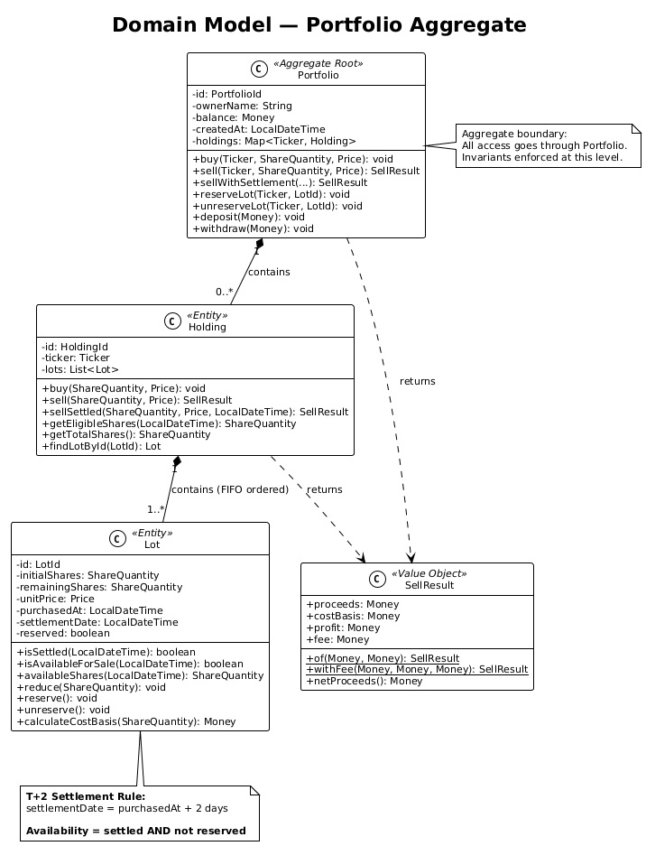
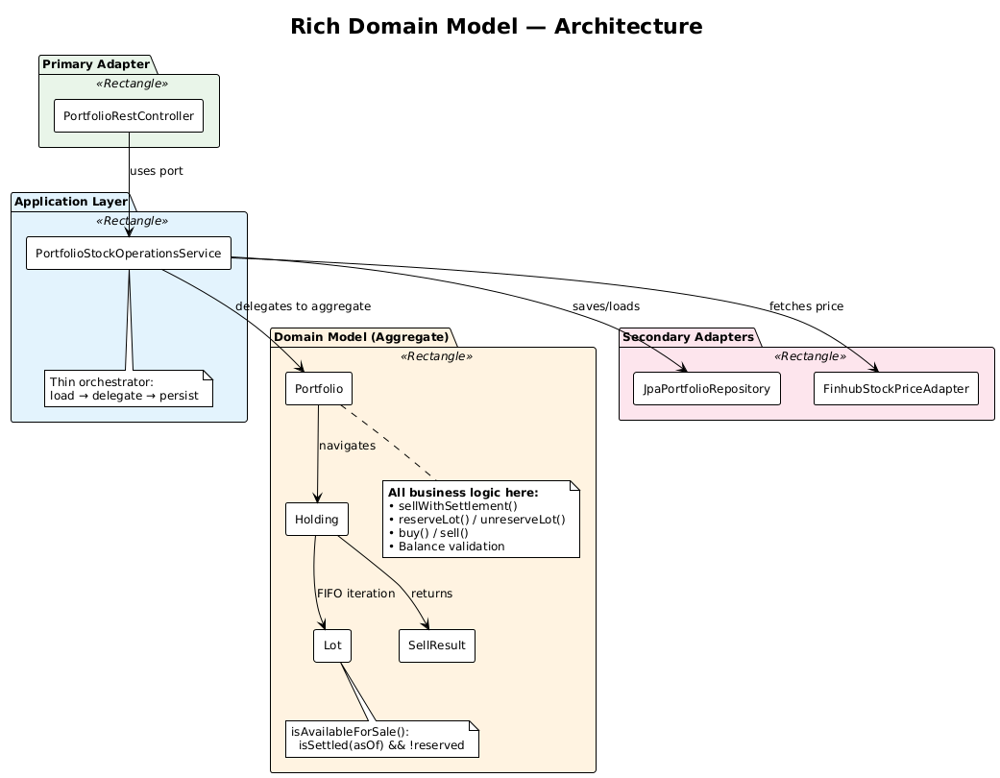
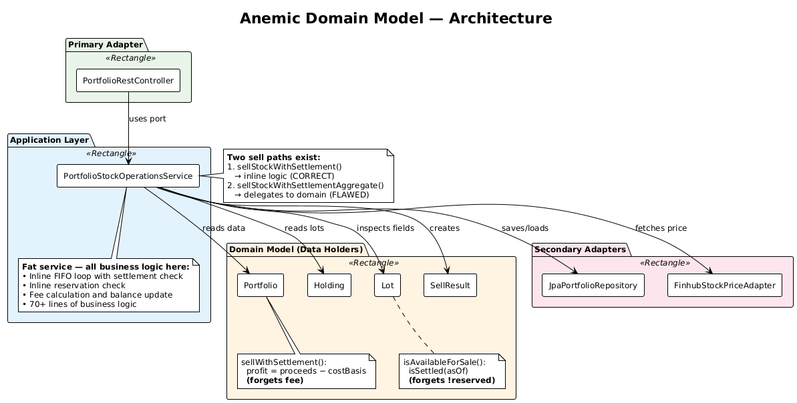
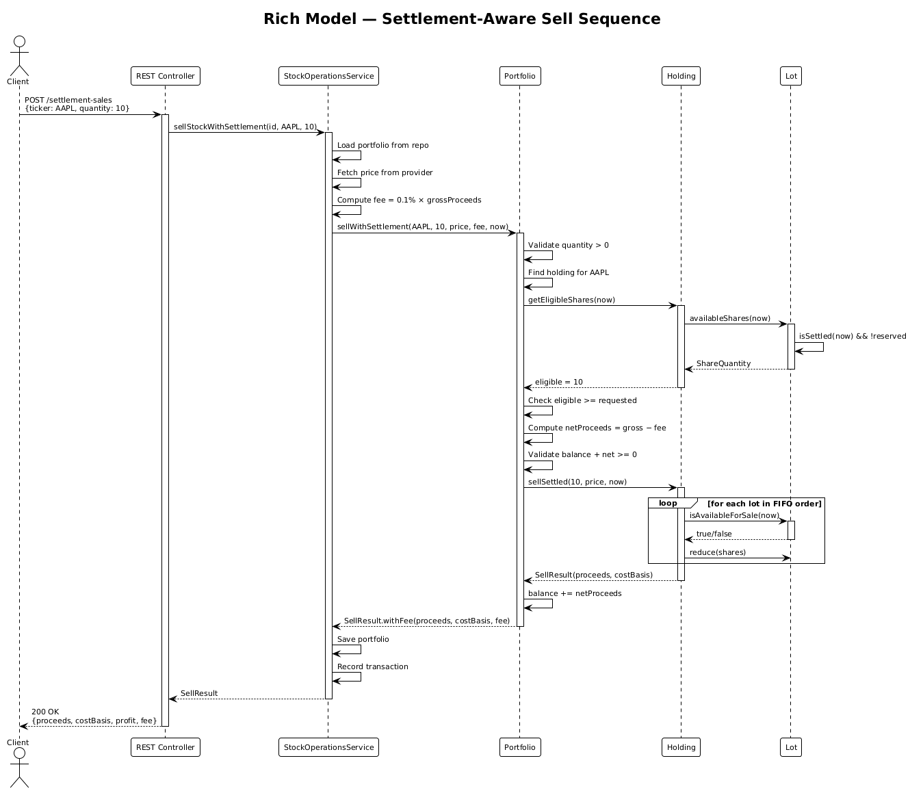
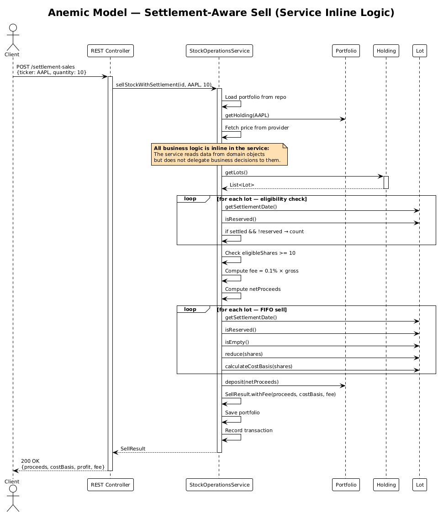
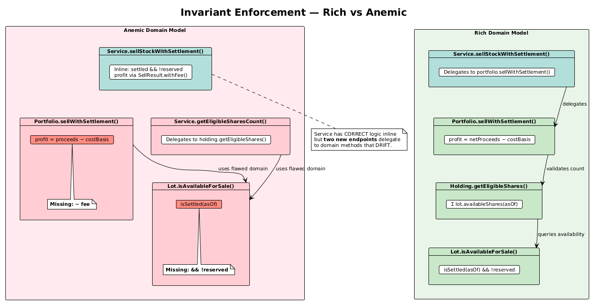
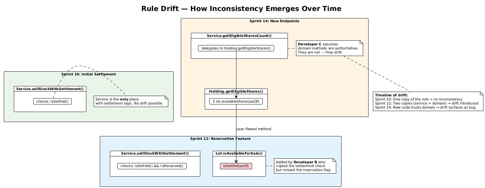

# Rich Domain Model vs. Anemic Domain Model — A Hands-On Architecture Tutorial

> **HexaStock** — A stock portfolio management system built with Java 21, Spring Boot 3,
> and Hexagonal Architecture. This tutorial uses a real, runnable codebase to demonstrate
> how architectural decisions about domain model richness affect correctness, maintainability,
> and the ability to evolve safely under change.

---

## Table of Contents

1. [Introduction](#1-introduction)
2. [Financial Background for Non-Specialists](#2-financial-background-for-non-specialists)
3. [Why This Use Case Is Intentionally Complex](#3-why-this-use-case-is-intentionally-complex)
4. [Feature Overview: Settlement-Aware FIFO Selling](#4-feature-overview-settlement-aware-fifo-selling)
5. [Executable Specifications — Gherkin as a Communication Tool](#5-executable-specifications--gherkin-as-a-communication-tool)
6. [Repository Navigation](#6-repository-navigation)
7. [Business Rules](#7-business-rules)
8. [Architectural Overview](#8-architectural-overview)
9. [Side-by-Side Code Comparison](#9-side-by-side-code-comparison)
10. [Invariant Enforcement](#10-invariant-enforcement)
11. [Test Analysis — Why Tests Pass or Fail](#11-test-analysis--why-tests-pass-or-fail)
12. [Failure Modes of the Anemic Domain Model](#12-failure-modes-of-the-anemic-domain-model)
13. [Why the Rich Domain Model Works](#13-why-the-rich-domain-model-works)
14. [Practical Takeaways](#14-practical-takeaways)
15. [Webinar Demo Guide](#15-webinar-demo-guide)

- [Appendix A — Test Matrix](#appendix-a--test-matrix)
- [Appendix B — PlantUML Diagram Index](#appendix-b--plantuml-diagram-index)
- [Appendix C — Gherkin Specification Index and Traceability Matrix](#appendix-c--gherkin-specification-index-and-traceability-matrix)
- [Appendix D — Scope of the Financial Model Used in This Tutorial](#appendix-d--scope-of-the-financial-model-used-in-this-tutorial)

---

## 1. Introduction

HexaStock models a personal stock portfolio where users can deposit cash, buy and sell
stocks, track holdings, and view transaction history. The application is built using
**Hexagonal Architecture** (Ports & Adapters) with a clear separation between:

- **Model** (`model/`) — Domain entities and value objects
- **Application** (`application/port/in/`, `application/port/out/`, `application/service/`) — Use cases and service orchestration
- **Adapters** (`adapter/in/`, `adapter/out/`) — REST controllers, JPA persistence, external APIs

The core domain aggregate is **Portfolio → Holding → Lot**, representing a portfolio
that owns holdings of different stocks, each holding composed of individual purchase lots.

The following class diagram shows the structure of the Portfolio aggregate:

[](diagrams/Rendered/domain-model.svg)

Source: [`diagrams/domain-model.puml`](diagrams/domain-model.puml)

This tutorial compares two implementation strategies for the same feature — **settlement-aware
FIFO selling with fees** — across two branches:

| Branch | Architecture | Test Results |
|--------|-------------|-------------|
| `rich-domain-model` | Business rules live inside domain entities | **170 tests, 0 failures** |
| `anemic-domain-model` | Business rules duplicated in service layer | **170 tests, 10 failures** |

Both branches share **the exact same test suite**. The 10 failures on the anemic branch are
not broken tests — they are **correct tests detecting real bugs** caused by rule drift between
duplicated implementations.

---

## 2. Financial Background for Non-Specialists

If you have built CRUD applications but never worked with trading systems, the business
rules in this tutorial may initially look arbitrary or over-engineered. They are not.
Every rule in this use case reflects a genuine operational constraint from real financial
markets. This section gives you enough context to understand *why* those rules exist
before you see *how* they are implemented.

### 2.1 Settlement: Why You Cannot Immediately Sell What You Just Bought

When you buy shares on a stock exchange, the trade is confirmed instantly — but the
actual transfer of securities and money between buyer and seller does not happen at that
moment. The process of finalising ownership and payment is called **settlement**, and
it typically takes two business days after the trade date. This convention is known as
**T+2** (trade date plus two days) and is mandated by regulators such as the
U.S. Securities and Exchange Commission.

During those two days, the shares exist in the portfolio as an obligation rather than
as freely available assets. A settlement-aware sell operation must therefore distinguish
between shares that have completed settlement and shares that have not. Selling unsettled
shares would mean selling something that has not yet been fully received — a real risk
that regulated systems are required to prevent.

### 2.2 Reserved Lots: Why Some Shares Are Temporarily Off-Limits

In practice, shares in a portfolio may be **reserved** — blocked for a specific purpose.
Common reasons include:

- **Collateral**: shares pledged against a margin loan or a credit facility.
- **Regulatory hold**: shares subject to a lock-up period after an IPO or insider transaction.
- **Pending operations**: shares committed to a corporate action, a transfer, or a conversion
  that has been initiated but not yet completed.

A reserved lot is not lost — it still belongs to the portfolio — but it must be excluded
from any sell operation until the reservation is lifted. This is not a cosmetic distinction:
selling reserved shares would break contractual obligations or regulatory requirements.

### 2.3 Fees: Why Small Numbers Matter

Every financial transaction involving a regulated market incurs costs: brokerage
commissions, exchange fees, clearing charges, regulatory levies. In HexaStock, these are
modelled as a single settlement fee proportional to gross proceeds (`FEE_RATE = 0.001`,
i.e., 0.1%).

Fees are not a formatting concern — they directly affect the correctness of every number
reported to the user:

- **Net proceeds** (what actually arrives in the account) = gross proceeds minus fee.
- **Profit** must be calculated against net proceeds, not gross. Reporting profit without
  deducting fees would overstate performance, which in a regulated context could constitute
  misrepresentation.
- The **accounting identity** — `costBasis + profit + fee = proceeds` — is the fundamental
  check that the numbers are internally consistent.

Getting this wrong by a few cents on one trade is a nuisance. Getting it wrong
systematically across thousands of trades is an audit finding.

### 2.4 FIFO: Why the Order of Consumption Matters

A portfolio is not a single bucket of identical shares. Each purchase creates a
**lot** — a distinct parcel with its own purchase price, date, and settlement status.
When a holding contains lots purchased at different prices, the order in which they
are consumed during a sale determines the **cost basis**, which in turn determines the
reported profit.

**FIFO** (First In, First Out) is the most common accounting method: the oldest lots
are sold first. This is not an arbitrary sorting preference — it is the standard
assumption in many tax jurisdictions and brokerage systems. Using a different order
would produce different cost basis and profit figures for the same sale.

FIFO also interacts with settlement and reservation: *only settled, non-reserved lots
participate in the ordering*. A lot that was purchased first but is still within its
settlement window, or that has been reserved as collateral, must be skipped.

---

## 3. Why This Use Case Is Intentionally Complex

Choosing between a Rich Domain Model and an Anemic Domain Model is one of the most
consequential architectural decisions in a business application. But the difference
between the two is not always visible.

**When business logic is trivial — field validation, simple CRUD, format checks — both
approaches produce code that looks roughly the same.** The service might be slightly
longer, the entity slightly emptier, but the practical consequences are minor. You
could implement a "create user with email validation" use case either way and struggle
to find a meaningful architectural argument for one over the other.

The real trade-offs emerge when the domain is genuinely complex:

- **Multiple interacting rules** — settlement, reservation, fees, and FIFO do not operate
  in isolation; they constrain each other.
- **Invariants that must hold across state changes** — the accounting identity
  (`costBasis + profit + fee = proceeds`) must be true after every sell, regardless of
  how the sell was triggered.
- **Temporal constraints** — a lot's eligibility depends on when it was purchased relative
  to the current date.
- **Monetary calculations with precision requirements** — rounding, fee deduction, and
  profit computation must all agree.
- **Partial consumption of state** — selling 12 shares from a lot of 10 means consuming
  the lot entirely and carrying over to the next one.
- **Rule evolution across sprints and developers** — the reservation rule was added two
  sprints after settlement; a different developer updated the service but forgot the
  entity.

This tutorial intentionally uses a realistic, multi-rule financial use case precisely
because that is where the architectural choice becomes consequential. A simpler example
would compile, pass its tests, and leave you unconvinced. The complexity here is not
gratuitous — it is the minimum needed to reveal how rule duplication causes real bugs
in an anemic model while a rich model remains safe.

By the end of this tutorial, you will have seen concrete, running code where:

- The rich model's 170 tests all pass.
- The same 170 tests, run against the anemic implementation, produce 10 failures.
- Every failure traces back to a business rule that was correctly placed in the entity
  on one branch and incorrectly duplicated in the service on the other.

That is the argument this tutorial makes — not in theory, but in test output.

---

## 4. Feature Overview: Settlement-Aware FIFO Selling

The settlement-aware sell feature adds four interacting capabilities to the
existing sell operation. Each one corresponds to a real financial constraint
explained in [§2](#2-financial-background-for-non-specialists).

### 4.1 Settlement Gating (T+2 Rule)

**Business motivation**: In regulated markets, shares are not available for resale until
settlement completes. Allowing a sale of unsettled shares would create a delivery
obligation against assets the portfolio does not yet fully own.

When shares are purchased, they do not settle immediately. Following the SEC T+2 rule,
a lot becomes available for settlement-aware selling only after 2 business days:

```
Purchase Date: March 15, 2026
Settlement Date: March 17, 2026 (T+2)
```

The `Lot.SETTLEMENT_DAYS = 2` constant defines this. A lot is settled when
`!asOf.isBefore(settlementDate)`.

### 4.2 Lot Reservation

**Business motivation**: Shares used as collateral, under regulatory hold, or committed
to a pending operation must not be sold. Selling them would break contractual or legal
obligations, even though the shares technically belong to the portfolio.

Certain lots can be reserved. Reserved lots must be excluded from settlement-aware sales:

- `Lot.reserve()` — marks the lot as reserved
- `Lot.unreserve()` — releases the reservation
- A reserved lot should NOT be available for sale, even if settled

### 4.3 Fees

**Business motivation**: Transaction fees affect net proceeds and therefore profit. Reporting
profit without deducting fees would overstate performance. The accounting identity
`costBasis + profit + fee = proceeds` is the fundamental integrity check that all the
numbers are mutually consistent.

Settlement-aware sales incur a fee (0.1% of gross proceeds):

```
FEE_RATE = 0.001
fee = grossProceeds × FEE_RATE
netProceeds = grossProceeds − fee
profit = netProceeds − costBasis
```

The accounting identity that must always hold:

```
costBasis + profit + fee = proceeds
```

### 4.4 FIFO Lot Consumption

**Business motivation**: When a holding consists of lots purchased at different prices
and dates, the order of consumption determines cost basis and reported profit. FIFO
(First In, First Out) is the standard accounting method in most jurisdictions. It also
interacts with settlement and reservation: only lots that are *both settled and
unreserved* participate in the FIFO ordering.

When selling, lots are consumed in purchase-date order (First In, First Out), but only
lots that are both **settled** and **not reserved** participate. Unsettled or reserved
lots are skipped. Partial consumption of a lot is supported — the remainder stays in
the holding.

---

## 5. Executable Specifications — Gherkin as a Communication Tool

Before diving into code and architecture, it is worth understanding *how* the business
rules described above are captured in a format that both developers and domain experts
can read. HexaStock uses **Gherkin** — the Given/When/Then specification language — to
express each rule as a concrete scenario with expected outcomes.

These are not just documentation. Each scenario corresponds to a Java test method via
`@SpecificationRef` annotations. When the tests run, they verify that the code satisfies
the scenario. The Gherkin file is the contract; the test is the enforcement.

### 5.1 Why Executable Specifications Matter for Architecture Comparison

In this tutorial, the Gherkin specifications play a specific structural role:

1. **They define what "correct" means** — independently of any implementation strategy.
   The same scenarios apply to both the rich and anemic branches.
2. **They make failures interpretable** — when a test fails on the anemic branch, the
   corresponding Gherkin scenario explains what the system *should* do and why.
3. **They reveal drift** — scenarios tagged `@anemic-branch-only @expected-failure`
   document places where the anemic model's duplicated logic produces wrong answers.

### 5.2 Settlement Gate Scenarios

Source: [`doc/features/settlement-aware-selling.feature`](../../features/settlement-aware-selling.feature)

These scenarios verify that only lots past the T+2 settlement window can participate
in a regulated sell. They pass on both branches because settlement logic is
identically implemented.

```gherkin
Scenario: Reject sell when only unsettled lots exist (SETTLE-01)
  Given Alice bought 10 shares of AAPL at $100.00 five days ago
  And Alice bought 10 shares of AAPL at $110.00 just now
  When Alice tries to settlement-sell 15 shares of AAPL at $120.00
  Then the sell is rejected with "Insufficient Eligible Shares"
  Because only the first lot (10 shares) has passed the T+2 settlement period
```

> **Architecture note**: The settlement check (`Lot.isSettled(asOf)`) is the same in both
> models. This is the one rule where duplication has not yet caused drift — because no one
> has added a second condition to it. The reservation scenarios below show what happens
> when a second condition *is* added.

```gherkin
Scenario: Allow selling exactly the settled quantity (SETTLE-02)
  Given Alice bought 10 shares of AAPL at $100.00 five days ago
  And Alice bought 10 shares of AAPL at $110.00 just now
  When Alice settlement-sells 10 shares of AAPL at $120.00 with no fee
  Then the sale proceeds are $1,200.00
  And the cost basis is $1,000.00
  And the profit is $200.00
  And 10 unsettled shares of AAPL remain in the portfolio
```

### 5.3 Reservation Scenarios — Where Drift Begins

Source: [`doc/features/reserved-lot-handling.feature`](../../features/reserved-lot-handling.feature)

Reservation is where the anemic model starts to break. The service correctly checks
`!lot.isReserved()` in its inline FIFO loop, but `Lot.isAvailableForSale()` was never
updated. Every scenario below passes on the rich branch and **fails on the anemic branch**
(except RESERVE-03 which tests unreserve symmetry).

```gherkin
Scenario: Reserved lot should not be available for sale even if settled (LOT-SETTLE-02)
  Given Alice bought 10 shares of AAPL at $100.00 ten days ago
  And the AAPL lot is settled
  When the lot is reserved
  Then Lot.isAvailableForSale() returns false
  And Lot.availableShares() returns 0
```

> **This is the single most important scenario in the tutorial.** It tests the method
> that is broken on the anemic branch: `Lot.isAvailableForSale()` returns `true` for
> a reserved lot because it only checks `isSettled(asOf)`, missing the `&& !reserved`
> condition. Every downstream failure — in FIFO ordering, eligibility counts, and the
> REST endpoint — traces back to this method.

```gherkin
Scenario: Sell from non-reserved lots in FIFO order (RESERVE-02)
  Given Alice bought 10 shares of AAPL at $100.00 ten days ago
  And Alice bought 5 shares of AAPL at $120.00 five days ago
  And both lots are settled
  When the oldest lot (10 shares) is reserved
  And Alice settlement-sells 5 shares of AAPL at $130.00 with no fee
  Then the cost basis is $600.00 (from lot2 at $120.00)
  And the profit is $50.00
  And the reserved lot still has 10 shares untouched
```

> On the anemic branch, this scenario fails with `costBasis=500` instead of `600`. The
> FIFO scan in `Holding.sellSettled()` calls `Lot.isAvailableForSale()` which does not
> skip the reserved lot — so it consumes lot1 (at $100) instead of lot2 (at $120).

The integration-level scenario demonstrates how this flaw surfaces through the REST API:

```gherkin
@anemic-branch-only @expected-failure
Scenario: Eligible shares query should exclude reserved lots (DRIFT-REST-01)
  Given Alice bought 10 shares of AAPL and 5 shares of AAPL via REST
  And all lots are settled (settlement dates backdated via JDBC)
  And the oldest lot is reserved via POST /holdings/AAPL/lots/{id}/reserve
  When Alice queries GET /holdings/AAPL/eligible-shares
  Then the expected eligible count is 5
  But the anemic model returns 15
  Because Lot.isAvailableForSale() only checks settlement, not reservation
```

### 5.4 Fee Accounting Scenarios — The Second Flaw

Source: [`doc/features/settlement-fees.feature`](../../features/settlement-fees.feature)

The fee scenarios verify that profit is computed as `netProceeds − costBasis`
(where `netProceeds = grossProceeds − fee`), not as `grossProceeds − costBasis`.
This matters because the accounting identity `costBasis + profit + fee = proceeds`
can only hold if the fee is deducted before reporting profit.

```gherkin
Scenario: Fee should be deducted when computing profit (FEE-02)
  Given Alice bought 10 shares of AAPL at $100.00 ten days ago
  And all lots are settled
  When Alice settlement-sells 10 shares of AAPL at $110.00 with fee $1.10
  Then the profit is $98.90 (= $1,100.00 − $1.10 − $1,000.00)
  And the profit is NOT $100.00 (which omits the fee)
```

> On the anemic branch, `Portfolio.sellWithSettlement()` computes
> `profit = grossProceeds.subtract(costBasis)` → $100. The correct result is $98.90.
> The service's own `sellStockWithSettlement()` method uses `SellResult.withFee()`
> which gets the right answer — but the domain method disagrees.

```gherkin
Scenario: Accounting identity must hold: profit = netProceeds − costBasis (FEE-03)
  Given Alice bought 10 shares of AAPL at $100.00 ten days ago
  And all lots are settled
  When Alice settlement-sells 10 shares of AAPL at $110.00 with fee $1.10
  Then netProceeds = $1,098.90
  And costBasis = $1,000.00
  And profit = $98.90
  And the identity holds: profit == netProceeds − costBasis
```

> **This scenario formalises the accounting identity** as a testable contract. On the
> anemic branch, `costBasis + profit + fee = 1000 + 100 + 1.10 = 1101.10 ≠ 1100.00`.
> The identity is violated because the profit formula is stale.

### 5.5 FIFO and Atomic Consistency Scenarios

Source: [`doc/features/fifo-settlement-selling.feature`](../../features/fifo-settlement-selling.feature)

The FIFO scenarios verify lot consumption order and partial consumption. Most pass on
both branches (FIFO ordering itself is correct even in the anemic model), but the
atomic end-to-end scenario combines all rules and triggers both flaws.

```gherkin
Scenario: Full atomic scenario: buy, settle, reserve, sell, verify (ATOMIC-01)
  Given Alice bought 10 shares of AAPL at $100.00 ten days ago
  And Alice bought 5 shares of AAPL at $120.00 five days ago
  And Alice bought 3 shares of AAPL at $130.00 just now
  And the first two lots are settled

  When the oldest lot (10 shares) is reserved
  Then eligible shares are 5

  When Alice settlement-sells 5 shares of AAPL at $140.00 with fee $0.70
  Then cost basis is $600.00 (5×120 from lot2)
  And net proceeds are $699.30 (700 − 0.70)
  And profit is $99.30 (699.30 − 600)
  And the accounting identity holds: profit == netProceeds − costBasis
  And the reserved lot (10 shares at $100.00) is untouched
  And the unsettled lot (3 shares at $130.00) is untouched
```

> **This is the capstone scenario.** It exercises settlement gating (lot3 is unsettled),
> reservation exclusion (lot1 is reserved), FIFO ordering (lot2 is consumed first among
> eligible lots), fee-adjusted profit, and the accounting identity — all in a single test.
> On the anemic branch it fails on multiple assertions because both flaws compound.

### 5.6 Rule Consistency Scenarios — Documenting Intentional Drift

Source: [`doc/features/rule-consistency.feature`](../../features/rule-consistency.feature)

All five scenarios in this file are tagged `@anemic-branch-only @expected-failure`.
They do not test business rules — they test the **absence of correct business rules**
in the anemic model. They exist to make the architectural argument concrete and auditable.

```gherkin
@anemic-branch-only @expected-failure
Scenario: Inline service logic vs. domain method produce different results
  Given Alice bought 10 shares of AAPL at $100.00 via REST
  And all lots are settled
  And the oldest lot is reserved

  When Alice sells via POST /{id}/sell with settlement
  Then the service correctly checks settlement AND reservation
  And the sale is rejected because eligible shares = 0

  When Alice queries GET /{id}/holdings/AAPL/eligible-shares
  Then the endpoint returns 10 (incorrectly includes reserved lot)
  Because it delegates to Holding.getEligibleShares()
  Which calls Lot.isAvailableForSale()
  Which only checks isSettled(), not !reserved
```

> **Two code paths, same question, different answers.** The sell endpoint says "0 eligible
> shares" (correct). The eligible-shares query says "10" (wrong). Both operate on the
> same data. The difference is that the sell endpoint uses inline service logic while
> the query delegates to the domain method where the reservation check is missing.

### 5.7 From Specification to Architecture: The Chain

Each Gherkin scenario traces a path from a business requirement to an architectural outcome:

```
Business Rule  →  Gherkin Scenario  →  Domain Behaviour  →  Java Test  →  Architecture Outcome
─────────────     ────────────────     ─────────────────     ─────────     ────────────────────
Rule 2:           RESERVE-02:         Lot.isAvailable       shouldSell    Rich: ✅ single method
"Reserved lots    "Sell from non-     ForSale() checks      FromNon       Anemic: ❌ service ok,
cannot be sold"   reserved lots       settlement AND        ReservedLots  domain misses !reserved
                  in FIFO order"      reservation
```

This chain is the organising principle of the entire tutorial. Every section from
[§7 Business Rules](#7-business-rules) through [§12 Failure Modes](#12-failure-modes-of-the-anemic-domain-model)
can be read as a deeper exploration of one link in this chain. The Gherkin scenarios
are the layer where business intent meets testable behaviour, and where the gap between
the rich model and the anemic model becomes visible.

For the full traceability matrix mapping every scenario to its business rule, test, and
branch outcome, see [Appendix C](#appendix-c--gherkin-specification-index-and-traceability-matrix).

---

## 6. Repository Navigation

### 6.1 Clone and Switch Branches

```bash
git clone https://github.com/alfredorueda/HexaStock.git
cd HexaStock
```

#### Rich Domain Model (all tests pass)
```bash
git checkout rich-domain-model
./mvnw test          # Expected: 170 tests, 0 failures
```

#### Anemic Domain Model (10 tests fail)
```bash
git checkout anemic-domain-model
./mvnw test          # Expected: 170 tests, 10 failures
                     #   8 domain-level (SettlementAwareSellTest)
                     #   2 integration-level (SettlementSellIntegrationTest)
```

### 6.2 Key Source Files

| File | Path |
|------|------|
| **Portfolio** (Aggregate Root) | `src/main/java/cat/gencat/agaur/hexastock/model/Portfolio.java` |
| **Holding** (Entity) | `src/main/java/cat/gencat/agaur/hexastock/model/Holding.java` |
| **Lot** (Entity) | `src/main/java/cat/gencat/agaur/hexastock/model/Lot.java` |
| **SellResult** (Value Object) | `src/main/java/cat/gencat/agaur/hexastock/model/SellResult.java` |
| **Service** (Application Layer) | `src/main/java/cat/gencat/agaur/hexastock/application/service/PortfolioStockOperationsService.java` |
| **Use Case Port** | `src/main/java/cat/gencat/agaur/hexastock/application/port/in/PortfolioStockOperationsUseCase.java` |
| **REST Controller** | `src/main/java/cat/gencat/agaur/hexastock/adapter/in/PortfolioRestController.java` |
| **Domain Tests** | `src/test/java/cat/gencat/agaur/hexastock/model/SettlementAwareSellTest.java` |
| **Integration Tests** | `src/test/java/cat/gencat/agaur/hexastock/adapter/in/SettlementSellIntegrationTest.java` |
| **Test Base Class** | `src/test/java/cat/gencat/agaur/hexastock/adapter/in/AbstractPortfolioRestIntegrationTest.java` |

### 6.3 Diagrams and Specifications

| Artifact | Path |
|----------|------|
| Rich Architecture Diagram | `diagrams/rich-architecture.puml` |
| Anemic Architecture Diagram | `diagrams/anemic-architecture.puml` |
| Rich Sell Sequence | `diagrams/rich-sell-sequence.puml` |
| Anemic Sell Sequence | `diagrams/anemic-sell-sequence.puml` |
| Invariant Enforcement | `diagrams/invariant-enforcement.puml` |
| Domain Model Class Diagram | `diagrams/domain-model.puml` |
| Rule Drift Timeline | `diagrams/rule-drift.puml` |
| Settlement Selling Spec | `doc/features/settlement-aware-selling.feature` |
| Reserved Lots Spec | `doc/features/reserved-lot-handling.feature` |
| Fee Accounting Spec | `doc/features/settlement-fees.feature` |
| FIFO Settlement Spec | `doc/features/fifo-settlement-selling.feature` |
| Rule Consistency Spec | `doc/features/rule-consistency.feature` |

---

## 7. Business Rules

The settlement-aware selling feature enforces five categories of rules. Each rule is
traced to its implementation in both branches and to the test(s) that verify it.
For the full Gherkin specifications that formalise these rules as executable scenarios,
see [§5](#5-executable-specifications--gherkin-as-a-communication-tool).

### Rule 1 — Settlement Gate

> A lot is available for settlement-aware selling only if its settlement date has passed.

- **Implementation**: `Lot.isSettled(asOf)` → `!asOf.isBefore(settlementDate)`
- **Both branches**: ✅ Correct (identical implementation)
- **Tests**: `shouldNotSellUnsettledLots`, `shouldSellExactlySettledQuantity`, `shouldReportEligibleSharesCorrectly`

### Rule 2 — Reservation Exclusion

> A reserved lot must be excluded from settlement-aware sales and from eligible share counts.

- **Rich branch**: ✅ `Lot.isAvailableForSale(asOf)` → `isSettled(asOf) && !reserved`
- **Anemic branch**: ❌ `Lot.isAvailableForSale(asOf)` → `isSettled(asOf)` — **missing `&& !reserved`**
- **Tests**: `reservedLotShouldNotBeAvailable`, `shouldSkipReservedLots`, `shouldSellFromNonReservedLots`, `shouldAllowUnreservingLot`, `shouldDistinguishTotalFromEligible`

### Rule 3 — Fee-Adjusted Profit

> Profit must account for fees: `profit = netProceeds − costBasis = (grossProceeds − fee) − costBasis`.

- **Rich branch**: ✅ `Portfolio.sellWithSettlement()` uses `SellResult.withFee(proceeds, costBasis, fee)`
- **Anemic branch**: ❌ `Portfolio.sellWithSettlement()` computes `profit = grossProceeds.subtract(costBasis)` — **fee omitted**
- **Tests**: `shouldDeductFeeFromProceeds`, `shouldMaintainAccountingIdentity`, `fullScenarioAtomicCorrectness`

### Rule 4 — FIFO Lot Consumption

> Lots must be consumed in purchase-date order. Only settled, non-reserved lots participate.

- **Both branches**: ✅ FIFO ordering is correct when using the correct eligibility check
- **Anemic branch nuance**: The service's inline FIFO logic is correct (checks settlement AND reservation), but the domain's `Holding.sellSettled()` calls the flawed `Lot.isAvailableForSale()` 
- **Tests**: `shouldConsumeSettledLotsInFifoOrder`, `shouldSkipUnsettledLotInFifoOrder`

### Rule 5 — Accounting Identity

> The identity `costBasis + profit + fee = proceeds` must always hold after a sale.

- **Rich branch**: ✅ Guaranteed by `SellResult.withFee()` factory method
- **Anemic branch**: ❌ Violated when using `Portfolio.sellWithSettlement()` because profit formula omits fee
- **Tests**: `shouldMaintainAccountingIdentity`, `aggregateSellShouldMaintainAccountingIdentity`

---

## 8. Architectural Overview

### 8.1 Rich Domain Model Architecture

```
┌─────────────────────────────────────────────────────────────────────┐
│                        REST Controller                              │
│   POST /settlement-sales → sellStockWithSettlement()                │
└─────────────────────┬───────────────────────────────────────────────┘
                      │
┌─────────────────────▼───────────────────────────────────────────────┐
│                 Application Service (~20 lines)                     │
│                                                                     │
│   1. Load portfolio from repository                                 │
│   2. Fetch stock price from external provider                       │
│   3. Compute fee = grossProceeds × 0.001                            │
│   4. Delegate to portfolio.sellWithSettlement(...)   ◄── ONE CALL   │
│   5. Save portfolio                                                 │
│   6. Record transaction                                             │
└─────────────────────┬───────────────────────────────────────────────┘
                      │
┌─────────────────────▼───────────────────────────────────────────────┐
│                    Portfolio Aggregate                               │
│                                                                     │
│   sellWithSettlement():                                             │
│     • Validate eligible shares ≥ requested quantity                 │
│     • Validate net proceeds won't cause negative balance            │
│     • Delegate FIFO selling to Holding.sellSettled()                │
│     • Update balance with netProceeds                               │
│     • Return SellResult.withFee(proceeds, costBasis, fee)           │
│                                                                     │
│   Holding.sellSettled():                                            │
│     • Iterate lots in FIFO order                                    │
│     • Skip lots where !isAvailableForSale(asOf)                     │
│     • Consume shares from eligible lots                             │
│     • Return intermediate SellResult                                │
│                                                                     │
│   Lot.isAvailableForSale():                                         │
│     • return isSettled(asOf) && !reserved     ◄── SINGLE TRUTH      │
└─────────────────────────────────────────────────────────────────────┘
```

**Key characteristic**: The service is a thin coordination layer. All business rules
(settlement check, reservation check, FIFO, fee handling, accounting identity) are
enforced inside the aggregate. There is exactly **one code path** for each rule.

[](diagrams/Rendered/rich-architecture.svg)

Source: [`diagrams/rich-architecture.puml`](diagrams/rich-architecture.puml)

### 8.2 Anemic Domain Model Architecture

```
┌──────────────────────────────────────────────────────────────────────┐
│                         REST Controller                              │
│   POST /settlement-sales         → sellStockWithSettlement()         │
│   POST /aggregate-settlement-sales → sellStockWithSettlementAggregate│
│   GET  /eligible-shares          → getEligibleSharesCount()          │
│   POST /lots/{id}/reserve        → reserveLot()                      │
└──┬────────────────────────┬──────────────────────────────────────────┘
   │                        │
   │  PATH A                │  PATH B
   │  (Inline service       │  (Delegates to
   │   logic — CORRECT)     │   domain — FLAWED)
   │                        │
┌──▼────────────────────────▼──────────────────────────────────────────┐
│                  Application Service (~70 lines for PATH A)          │
│                                                                      │
│  PATH A — sellStockWithSettlement():                                 │
│    1. Load portfolio, fetch price                                    │
│    2. Inline eligibility scan:                                       │
│       for each lot:                                                  │
│         if !empty && settled && !reserved → count as eligible        │
│    3. If eligible < requested → throw                                │
│    4. Inline FIFO selling:                                           │
│       for each lot:                                                  │
│         skip if unsettled OR reserved OR empty                       │
│         reduce lot, accumulate costBasis                             │
│    5. Use SellResult.withFee()                                       │
│    6. portfolio.deposit(netProceeds)                                 │
│    7. Save + record transaction                                      │
│                                                                      │
│  PATH B — sellStockWithSettlementAggregate():                        │
│    1. Load portfolio, fetch price, compute fee                       │
│    2. Delegate: portfolio.sellWithSettlement(...)                     │
│    3. Save + record transaction                                      │
│                                                                      │
│  getEligibleSharesCount():                                           │
│    1. Delegate: holding.getEligibleShares(now)                       │
│       → calls Lot.isAvailableForSale()  ◄── FLAWED                  │
└──────────────────────────────────────────────────────────────────────┘
                      │
┌─────────────────────▼────────────────────────────────────────────────┐
│                    Portfolio Aggregate (PASSIVE)                      │
│                                                                      │
│   sellWithSettlement():                                              │
│     • profit = grossProceeds − costBasis  ◄── FLAW: fee omitted      │
│                                                                      │
│   Lot.isAvailableForSale():                                          │
│     • return isSettled(asOf)               ◄── FLAW: reservation     │
│                                                    check missing     │
└──────────────────────────────────────────────────────────────────────┘
```

**Key characteristic**: The service contains correct inline logic, but two additional
code paths (aggregate-sell endpoint and eligible-shares query) delegate to domain
methods that contain **stale, incomplete** implementations of the same rules.

[](diagrams/Rendered/anemic-architecture.svg)

Source: [`diagrams/anemic-architecture.puml`](diagrams/anemic-architecture.puml)

---

## 9. Side-by-Side Code Comparison

### 9.1 Lot Availability Check — The Reservation Flaw

This is the root cause of **Flaw #1** — the reservation check is missing from the
anemic branch's domain method.

#### Rich Branch — `Lot.isAvailableForSale()`

```java
/**
 * Checks if this lot is available for sale: must be settled AND not reserved.
 */
public boolean isAvailableForSale(LocalDateTime asOf) {
    return isSettled(asOf) && !reserved;
}
```

#### Anemic Branch — `Lot.isAvailableForSale()`

```java
/**
 * Checks if this lot is available for sale: settled and not reserved.
 *
 * <p>Note: in the anemic model this is a passive data query — the service
 *    is responsible for actually enforcing the constraint during sell.</p>
 */
public boolean isAvailableForSale(LocalDateTime asOf) {
    // BUG: only checks settlement, forgets reservation flag
    return isSettled(asOf);
}
```

**What happened**: Settlement was implemented in Sprint 10. Reservation was added in
Sprint 12 by a different developer who updated the service's inline FIFO logic but
forgot to update this convenience method. When Sprint 14 added the eligible-shares
query endpoint, it called this method — inheriting the bug.

### 9.2 Portfolio Settlement Sell — The Fee Flaw

This is the root cause of **Flaw #2** — the fee is omitted from the profit calculation.

#### Rich Branch — `Portfolio.sellWithSettlement()`

```java
// Delegate FIFO selling to holding (only settled, non-reserved lots)
SellResult intermediateResult = holding.sellSettled(quantity, price, asOf);

// Update balance with net proceeds (after fee)
balance = balance.add(netProceeds);

// Return fee-aware result
return SellResult.withFee(intermediateResult.proceeds(), intermediateResult.costBasis(), fee);
```

The `SellResult.withFee()` factory correctly computes:
```java
public static SellResult withFee(Money proceeds, Money costBasis, Money fee) {
    Money netProceeds = proceeds.subtract(fee);
    Money profit = netProceeds.subtract(costBasis);  // ← fee deducted from profit
    return new SellResult(proceeds, costBasis, profit, fee);
}
```

#### Anemic Branch — `Portfolio.sellWithSettlement()`

```java
// Delegate FIFO lot consumption to Holding
SellResult baseResult = holding.sellSettled(quantity, sellPrice, asOf);
Money costBasis = baseResult.costBasis();

// BUG (Flaw #2 — Fee Calculation Inconsistency):
// Profit should be (grossProceeds − fee) − costBasis = netProceeds − costBasis.
// The anemic model computes it as grossProceeds − costBasis, omitting the fee.
Money profit = grossProceeds.subtract(costBasis);  // ← fee NOT deducted

balance = balance.add(netProceeds);  // ← balance update is correct

return new SellResult(grossProceeds, costBasis, profit, fee);
```

**What happened**: The fee parameter was added in Sprint 12. The developer correctly
updated the balance logic (`balance.add(netProceeds)`) but computed profit using the
pre-fee formula. The service's own `sellStockWithSettlement()` uses `SellResult.withFee()`
and gets the right answer — but the domain method disagrees.

### 9.3 Service Layer — Thin vs. Fat

#### Rich Branch — Service (`~20 lines`)

```java
@Override
public SellResult sellStockWithSettlement(PortfolioId portfolioId, Ticker ticker,
                                           ShareQuantity quantity) {
    Portfolio portfolio = portfolioPort.getPortfolioById(portfolioId)
            .orElseThrow(() -> new PortfolioNotFoundException(portfolioId.value()));

    StockPrice stockPrice = stockPriceProviderPort.fetchStockPrice(ticker);
    Price price = stockPrice.price();

    // Calculate fee as 0.1% of gross proceeds
    Money grossProceeds = price.multiply(quantity);
    Money fee = Money.of(grossProceeds.amount().multiply(FEE_RATE));

    LocalDateTime asOf = LocalDateTime.now();

    // All business rules enforced inside the aggregate
    SellResult sellResult = portfolio.sellWithSettlement(ticker, quantity, price, fee, asOf);
    portfolioPort.savePortfolio(portfolio);

    Transaction transaction = Transaction.createSaleWithFee(
            portfolioId, ticker, quantity, price,
            sellResult.proceeds(), sellResult.profit(), sellResult.fee());
    transactionPort.save(transaction);

    return sellResult;
}
```

The service handles only **infrastructure concerns**: loading, saving, fetching prices,
recording transactions. The single call to `portfolio.sellWithSettlement()` delegates
all domain logic to the aggregate.

#### Anemic Branch — Service (`~70 lines for sellStockWithSettlement alone + 3 additional methods`)

```java
@Override
public SellResult sellStockWithSettlement(PortfolioId portfolioId, Ticker ticker,
                                           ShareQuantity quantity) {
    Portfolio portfolio = portfolioPort.getPortfolioById(portfolioId)
            .orElseThrow(() -> new PortfolioNotFoundException(portfolioId.value()));
    // ... fetch price ...

    LocalDateTime asOf = LocalDateTime.now();

    // Calculate eligible shares — logic in service, NOT in domain
    int eligibleShares = 0;
    for (Lot lot : holding.getLots()) {
        if (!lot.isEmpty()
                && lot.getSettlementDate() != null
                && !asOf.isBefore(lot.getSettlementDate())
                && !lot.isReserved()) {                    // ← correct here
            eligibleShares += lot.getRemainingShares().value();
        }
    }
    if (eligibleShares < quantity.value()) { throw ...; }

    // ... fee calculation ...

    // FIFO sell — logic in service, NOT in Holding
    ShareQuantity remainingToSell = quantity;
    Money costBasis = Money.ZERO;
    for (Lot lot : holding.getLots()) {
        if (remainingToSell.isZero()) break;
        if (lot.getSettlementDate() == null || asOf.isBefore(lot.getSettlementDate())) continue;
        if (lot.isReserved()) continue;                    // ← correct here
        if (lot.isEmpty()) continue;

        ShareQuantity sharesSold = lot.getRemainingShares().min(remainingToSell);
        costBasis = costBasis.add(lot.calculateCostBasis(sharesSold));
        lot.reduce(sharesSold);
        remainingToSell = remainingToSell.subtract(sharesSold);
    }

    portfolio.deposit(netProceeds);
    SellResult result = SellResult.withFee(grossProceeds, costBasis, fee);  // ← correct here
    // ... save, record ...
    return result;
}
```

This service method is **correct** — it checks settlement AND reservation in its inline
logic, and uses `SellResult.withFee()`. But the logic exists only here. Two other
code paths delegate to the domain, where the rules are broken:

| Method | Delegates to | Result |
|--------|-------------|--------|
| `sellStockWithSettlement()` | Inline service logic | ✅ Correct |
| `sellStockWithSettlementAggregate()` | `Portfolio.sellWithSettlement()` | ❌ Flawed profit |
| `getEligibleSharesCount()` | `Holding.getEligibleShares()` | ❌ Includes reserved lots |

The following sequence diagrams trace the call flow for a settlement-aware sell in each architecture:

[](diagrams/Rendered/rich-sell-sequence.svg)

Source: [`diagrams/rich-sell-sequence.puml`](diagrams/rich-sell-sequence.puml)

[](diagrams/Rendered/anemic-sell-sequence.svg)

Source: [`diagrams/anemic-sell-sequence.puml`](diagrams/anemic-sell-sequence.puml)

### 9.4 Use Case Port — 3 vs. 6 Methods

#### Rich Branch — `PortfolioStockOperationsUseCase` (3 methods)

```java
void buyStock(PortfolioId portfolioId, Ticker ticker, ShareQuantity quantity);
SellResult sellStock(PortfolioId portfolioId, Ticker ticker, ShareQuantity quantity);
SellResult sellStockWithSettlement(PortfolioId portfolioId, Ticker ticker, ShareQuantity quantity);
```

#### Anemic Branch — `PortfolioStockOperationsUseCase` (6 methods)

```java
void buyStock(PortfolioId portfolioId, Ticker ticker, ShareQuantity quantity);
SellResult sellStock(PortfolioId portfolioId, Ticker ticker, ShareQuantity quantity);
SellResult sellStockWithSettlement(PortfolioId portfolioId, Ticker ticker, ShareQuantity quantity);
int getEligibleSharesCount(PortfolioId portfolioId, Ticker ticker);        // ← new
void reserveLot(PortfolioId portfolioId, Ticker ticker, LotId lotId);      // ← new
SellResult sellStockWithSettlementAggregate(PortfolioId portfolioId,        // ← new
                                            Ticker ticker, ShareQuantity quantity);
```

The anemic branch leaks internal aggregate structure (lot IDs, eligibility queries)
through the use case port, coupling the application layer to implementation details.

### 9.5 REST Controller — Standard vs. Expanded API Surface

The anemic branch adds **three extra endpoints** that expose aggregate internals:

| Endpoint | Purpose | Flaw |
|----------|---------|------|
| `GET /{id}/holdings/{ticker}/eligible-shares` | Query eligible shares | Delegates to flawed domain method |
| `POST /{id}/holdings/{ticker}/lots/{lotId}/reserve` | Reserve a specific lot | Exposes lot IDs to API consumers |
| `POST /{id}/aggregate-settlement-sales` | Alternate sell path | Delegates to flawed `Portfolio.sellWithSettlement()` |

---

## 10. Invariant Enforcement

An **invariant** is a condition that must always be true. In DDD, the aggregate root
is responsible for enforcing invariants. Let's trace how each architecture handles them.

### 10.1 Invariant: "Reserved lots cannot be sold"

**Rich branch** — enforced at the entity level:

```
Portfolio.sellWithSettlement()
  → Holding.sellSettled()
    → for each lot: if !lot.isAvailableForSale(asOf) → skip
      → Lot.isAvailableForSale(): return isSettled(asOf) && !reserved  ✅
```

There is ONE code path. The invariant is enforced in the entity where the data lives.
Any code that asks "is this lot available?" gets the correct answer.

**Anemic branch** — enforced in one service method, missed in another:

```
PATH A: Service.sellStockWithSettlement()
  → inline: if (lot.isReserved()) continue;  ✅ correct

PATH B: Service.getEligibleSharesCount()
  → Holding.getEligibleShares()
    → Lot.isAvailableForSale(): return isSettled(asOf)  ❌ reservation not checked
```

The invariant is enforced in the service's inline FIFO loop but NOT in the domain's
convenience method. Any new code that calls `Lot.isAvailableForSale()` will get the
wrong answer for reserved lots.

### 10.2 Invariant: "Profit must account for fees"

**Rich branch** — enforced by a single factory method:

```
Portfolio.sellWithSettlement()
  → return SellResult.withFee(proceeds, costBasis, fee)
    → profit = proceeds - fee - costBasis  ✅
```

The `SellResult.withFee()` factory method is the ONLY way to construct a fee-aware
result. It's impossible to get the formula wrong because the formula lives in one place.

**Anemic branch** — two different formulas:

```
PATH A: Service.sellStockWithSettlement()
  → SellResult.withFee(grossProceeds, costBasis, fee)
    → profit = grossProceeds - fee - costBasis  ✅

PATH B: Portfolio.sellWithSettlement()
  → profit = grossProceeds.subtract(costBasis)  ❌ fee omitted
  → return new SellResult(grossProceeds, costBasis, profit, fee)
```

The domain method constructs `SellResult` directly instead of using the factory,
embedding a stale formula.

[](diagrams/Rendered/invariant-enforcement.svg)

Source: [`diagrams/invariant-enforcement.puml`](diagrams/invariant-enforcement.puml)

---

## 11. Test Analysis — Why Tests Pass or Fail

This is the most critical section. Both branches run the **exact same** 19-test
domain test class (`SettlementAwareSellTest`) and the **exact same** 7-test
integration test class (`SettlementSellIntegrationTest`).

### 11.1 Domain Tests — `SettlementAwareSellTest` (19 tests)

All tests call `portfolio.sellWithSettlement()` or inspect domain objects directly.
On the rich branch, the aggregate enforces all invariants. On the anemic branch,
the domain methods have incomplete logic.

#### Tests that PASS on both branches (11 of 19)

These tests do not involve reservation or fee verification:

| # | Test | Nested Class | Why it passes |
|---|------|-------------|---------------|
| 1 | `shouldNotSellUnsettledLots` | SettlementGateTests | Settlement logic is identical |
| 2 | `shouldSellExactlySettledQuantity` | SettlementGateTests | No reservation, no fee |
| 3 | `shouldReportEligibleSharesCorrectly` | SettlementGateTests | No reserved lots in this test |
| 4 | `shouldConsumeSettledLotsInFifoOrder` | FifoTests | No reservation, fee=ZERO |
| 5 | `shouldSkipUnsettledLotInFifoOrder` | FifoTests | No reservation, fee=ZERO |
| 6 | `shouldPartiallyConsumeLot` | PartialLotTests | No reservation, fee=ZERO |
| 7 | `shouldRejectZeroQuantitySell` | EligibilityTests | Input validation, not invariant |
| 8 | `shouldRejectSellForNonExistentHolding` | EligibilityTests | Input validation |
| 9 | `lotShouldReportSettlementStatus` | LotSettlementTests | `isSettled()` — identical |
| 10 | `shouldRejectSellWhenFeeExceedsAvailableCash` | FeeTests | Balance check, not profit formula |
| 11 | `shouldUpdateCashBalanceWithNetProceeds` | FeeTests | Balance uses `netProceeds` — correct on both |

#### Tests that FAIL on the anemic branch (8 of 19)

##### Flaw #1 Failures — Reservation check missing from `Lot.isAvailableForSale()`

| # | Test | Expected | Actual (anemic) | Root Cause |
|---|------|----------|-----------------|------------|
| 12 | `reservedLotShouldNotBeAvailable` | `isAvailableForSale()` → `false` | `true` | Missing `&& !reserved` |
| 13 | `shouldSkipReservedLots` | Throws `InsufficientEligibleSharesException` | Sells reserved lot | Eligible count includes reserved |
| 14 | `shouldSellFromNonReservedLots` | CostBasis=600 (from lot2 only) | CostBasis=500 (from lot1 first) | Reserved lot1 not skipped |
| 15 | `shouldAllowUnreservingLot` | Eligible=0 when reserved, 10 when unreserved | Eligible=10 always | Reservation ignored |
| 16 | `shouldDistinguishTotalFromEligible` | After reservation: eligible=0 | eligible=10 | Same as above |

**Explanation**: All five tests reserve a lot and then verify that the reservation
affects availability. On the anemic branch, `Lot.isAvailableForSale()` only checks
`isSettled(asOf)`, so reservation has no effect on queries through the domain.

##### Flaw #2 Failures — Fee omitted from profit calculation

| # | Test | Expected | Actual (anemic) | Root Cause |
|---|------|----------|-----------------|------------|
| 17 | `shouldDeductFeeFromProceeds` | profit=195 (=1195−1000) | profit=200 (=1200−1000) | Fee not subtracted |
| 18 | `shouldMaintainAccountingIdentity` | costBasis+profit+fee=proceeds | costBasis+profit+fee≠proceeds | Profit inflated |

**Explanation**: These tests call `portfolio.sellWithSettlement()` with a non-zero fee and
verify the profit value. The anemic branch's domain method computes
`profit = grossProceeds - costBasis` instead of `profit = (grossProceeds - fee) - costBasis`.

##### Combined Failure — Both flaws

| # | Test | Outcome |
|---|------|---------|
| 19 | `fullScenarioAtomicCorrectness` | Fails because it reserves a lot AND checks profit with fee |

This test is a comprehensive end-to-end domain scenario that:
1. Creates 4 lots (settled+reserved, settled, settled, unsettled)
2. Reserves one lot
3. Sells 12 shares with a $10 fee
4. Verifies cost basis, profit, fee, accounting identity, and remaining lots

It fails on the anemic branch because of BOTH flaws: the reserved lot is included
in eligibility/FIFO (Flaw #1), and the profit omits the fee (Flaw #2).

### 11.2 Integration Tests — `SettlementSellIntegrationTest` (7 tests)

#### Tests that PASS on both branches (5 of 7)

| Test | Nested Class | Why it passes |
|------|-------------|---------------|
| `sellUnsettledLots_returns409` | SettlementGateRest | Both branches reject unsettled lots via the original endpoint |
| `regularSellStillWorks` | SettlementGateRest | Regular sell doesn't use settlement logic |
| `regularSaleIncludesZeroFee` | FeeInResponse | Regular sell returns fee=0 on both |
| `holdingsSurviveRoundTrip` | PersistenceRoundTrip | Tests persistence, not settlement invariants |
| `transactionRecordsExistAfterRegularSale` | PersistenceRoundTrip | Tests transaction recording |

#### Tests that FAIL on the anemic branch (2 of 7)

These tests exist only on the anemic branch's test file (the rich branch's integration
test class has 5 tests; the anemic branch adds 2 more):

##### `eligibleSharesShouldExcludeReservedLots` (RuleInconsistency)

```java
// Buy 10 + 5 shares of AAPL → age lots → reserve oldest
// Query: GET /holdings/AAPL/eligible-shares
// Expected: 5 (only unreserved lot)
// Actual:  15 (both lots — domain method ignores reservation)
int eligible = getEligibleSharesCount(portfolioId, "AAPL");
assertEquals(5, eligible, "...");
```

**Why it fails**: The endpoint calls `Holding.getEligibleShares()` which calls
`Lot.isAvailableForSale()` which only checks settlement. The reserved lot is
counted as eligible.

**Why this endpoint doesn't exist on the rich branch**: The rich domain model
doesn't need a separate eligible-shares endpoint because the aggregate already
enforces the invariant internally. An external query would be duplicating logic
that belongs inside the aggregate.

##### `aggregateSellShouldMaintainAccountingIdentity` (FeeAccountingDrift)

```java
// Buy 10 shares at $100 → age lots
// Sell via POST /aggregate-settlement-sales
// Expected: costBasis + profit + fee = proceeds
//   proceeds=1000, fee=1, costBasis=1000 → profit should be -1
//   identity: 1000 + (-1) + 1 = 1000 ✓
// Actual: profit = 0 (fee omitted)
//   identity: 1000 + 0 + 1 = 1001 ≠ 1000 ✗
```

**Why it fails**: This endpoint delegates to `Portfolio.sellWithSettlement()` which
computes `profit = grossProceeds - costBasis` (omitting fee). The accounting identity
is violated.

### 11.3 How the Integration Tests Backdated Settlement

The anemic branch's `AbstractPortfolioRestIntegrationTest` includes a JDBC-based helper
that backdates settlement dates to make lots appear settled:

```java
@Autowired JdbcTemplate jdbcTemplate;

protected void settleLots(String portfolioId) {
    jdbcTemplate.update(
        "UPDATE lot SET settlement_date = DATE_SUB(NOW(), INTERVAL 5 DAY) " +
        "WHERE holding_id IN (SELECT id FROM holding WHERE portfolio_id = ?)",
        portfolioId);
}
```

The rich branch does not need this helper because its integration tests only test the
settlement gate (rejecting unsettled lots) and don't need pre-settled lots.

---

## 12. Failure Modes of the Anemic Domain Model

### 12.1 Rule Duplication

The same business rule ("is this lot available for sale?") exists in two places:

1. **Service `sellStockWithSettlement()`** — inline loop with `!lot.isReserved()` → ✅ correct
2. **`Lot.isAvailableForSale()`** — only `isSettled(asOf)` → ❌ incomplete

When rules are duplicated, they can diverge. The developer who added reservation
updated the service logic but forgot the domain method.

### 12.2 Rule Drift Across Sprints

```
Sprint 10: Settlement feature added
  → Lot.isAvailableForSale() = isSettled(asOf)
  → Service checks settlement inline
  → Both agree: ✅

Sprint 12: Reservation feature added (different developer)
  → Service updated: checks settlement AND reservation ✅
  → Lot.isAvailableForSale() NOT updated ❌
  → They now disagree

Sprint 14: Eligible-shares query endpoint added
  → Delegates to Holding.getEligibleShares()
  → Calls Lot.isAvailableForSale() (now stale)
  → Bug shipped to production ❌
```

[](diagrams/Rendered/rule-drift.svg)

Source: [`diagrams/rule-drift.puml`](diagrams/rule-drift.puml)

### 12.3 Hidden Coupling and Coordination Burden

The anemic branch's service is correct — but its correctness is **fragile**. Any new
feature that needs the "is available for sale?" check faces a choice:

1. Call `Lot.isAvailableForSale()` — fast but wrong (doesn't check reservation)
2. Duplicate the inline logic — correct but creates another copy to maintain
3. Extract a shared utility — adds indirection without solving the root cause

In the rich model, there is no choice to make. You call `Lot.isAvailableForSale()`
and get the right answer. The entity owns its own rules.

### 12.4 API Surface Bloat

The anemic branch requires three additional REST endpoints to expose operations that
the domain should handle internally:

- **Eligible shares query** — needed because the client can't trust the domain to
  enforce the right rules during a sell
- **Reserve lot** — exposes internal lot IDs through the API boundary
- **Aggregate sell** — a "cleaner" alternative that delegates to the domain, but
  the domain is broken

These endpoints increase the attack surface, the documentation burden, and the number
of integration tests required.

---

## 13. Why the Rich Domain Model Works

### 13.1 Single Point of Truth

Every business rule is implemented exactly once, inside the entity that owns the data:

| Rule | Owner | Method |
|------|-------|--------|
| Is this lot available? | `Lot` | `isAvailableForSale()` |
| How many eligible shares? | `Holding` | `getEligibleShares()` |
| FIFO lot consumption | `Holding` | `sellSettled()` |
| Fee-adjusted profit | `Portfolio` | via `SellResult.withFee()` |
| Balance update | `Portfolio` | `sellWithSettlement()` |

No rule is duplicated. No rule can drift.

### 13.2 Aggregate Boundary

The `Portfolio` aggregate root coordinates the entire sell operation:

1. Validates preconditions (eligible shares, cash headroom)
2. Delegates FIFO consumption to `Holding`
3. Updates balance
4. Returns a correct `SellResult`

External code (service, controller, other aggregates) cannot bypass these checks
because the only public method for settlement-aware selling is
`Portfolio.sellWithSettlement()`.

### 13.3 Testability Without Infrastructure

All 19 domain tests run without Spring, without a database, without HTTP. They
instantiate domain objects directly and verify behavior. This makes them:

- **Fast** — milliseconds per test
- **Isolated** — no flaky infrastructure dependencies
- **Comprehensive** — every rule is testable at the unit level

### 13.4 Safe Evolution

When a new rule is added (e.g., "lots under regulatory hold cannot be sold"), there
is exactly one place to add it: `Lot.isAvailableForSale()`. All callers automatically
get the new check. In the anemic model, you'd need to update every inline loop that
checks lot availability.

---

## 14. Practical Takeaways

### When to Use a Rich Domain Model

- Complex business rules with multiple interacting invariants
- Rules that evolve independently across sprints/teams
- Aggregates with internal consistency requirements
- When the cost of a rule violation is high (financial, regulatory)

### When an Anemic Model May Suffice

- CRUD-heavy applications with minimal business logic
- Rapid prototyping where rules are still being discovered
- Simple validation-only logic (field constraints, format checks)
- Read-heavy query models (CQRS read side)

### Key Principles

1. **Encapsulate rules where the data lives** — If `Lot` has a `reserved` field,
   `Lot` should know what that means for availability
2. **Use factory methods to prevent formula drift** — `SellResult.withFee()` makes
   it impossible to get the accounting wrong
3. **Keep services thin** — Services should orchestrate, not calculate. Infrastructure
   concerns (load, save, fetch price, record transaction) belong in services;
   business rules belong in the domain
4. **Let tests detect drift** — The same test suite on both branches proves that
   domain tests are effective architectural guardians
5. **Resist the urge to add convenience endpoints** — If you need a query endpoint
   to check something the aggregate should enforce, the aggregate is too passive

### The Architectural Thesis — Restated

This tutorial opened with a deliberate choice: a domain complex enough that the
difference between a rich model and an anemic model becomes measurable. The evidence
is now concrete:

- **28 Gherkin scenarios** formalise the business rules as testable contracts.
- **170 Java tests** run against both branches. The rich model passes all of them.
  The anemic model fails 10 — not because the tests are unfair, but because rule
  duplication causes real bugs.
- **Two specific flaws** (reservation check missing from `Lot.isAvailableForSale()`,
  fee omitted from `Portfolio.sellWithSettlement()`) were introduced organically
  across sprints by different developers working on correctly scoped tasks.

The conclusion is not "anemic models are always wrong." It is:

> **When business rules interact, evolve across sprints, and must satisfy invariants
> that span multiple entities, placing those rules inside the entities that own
> the data eliminates an entire category of bugs that no amount of service-layer
> testing can prevent — because the bugs appear in *new* code paths that call
> the domain methods the service tests never exercise.**

If your domain is a single validation check or a format conversion, the choice
hardly matters. If your domain is settlement-aware FIFO selling with reserved
lots and fee-adjusted accounting identities, the choice is the difference between
170/170 and 160/170.

---

## 15. Webinar Demo Guide

### Pre-requisites

- Java 21+
- Docker (for Testcontainers MySQL)
- Git
- IntelliJ IDEA or VS Code with Java extensions

### Demo Flow (30–40 minutes)

#### Step 1 — Show the Rich Model Passing (5 min)

```bash
git checkout rich-domain-model
./mvnw test
```

All 170 tests pass. Highlight the domain test class `SettlementAwareSellTest` — show
that it runs without Spring context and tests the aggregate directly.

#### Step 2 — Walk Through the Code (10 min)

Open `Lot.java` and show `isAvailableForSale()`:
```java
return isSettled(asOf) && !reserved;
```

Open `Portfolio.java` and show `sellWithSettlement()`:
- Highlight `SellResult.withFee()` call at the bottom
- Show that the method does validation, delegates FIFO to `Holding`, and returns a guaranteed-correct result

Open `PortfolioStockOperationsService.java` and show `sellStockWithSettlement()`:
- Count the lines (~20)
- Point out: no loops, no lot iteration, no eligibility checks — just load, delegate, save

#### Step 3 — Switch to the Anemic Branch (2 min)

```bash
git checkout anemic-domain-model
./mvnw test
```

**10 failures** appear. Let the output sink in — same tests, different results.

#### Step 4 — Examine the Failures (10 min)

Open the test output and walk through 2–3 representative failures:

1. **`reservedLotShouldNotBeAvailable`** — Show the assertion:
   `assertFalse(lot.isAvailableForSale(NOW))` after `lot.reserve()`.
   Open `Lot.java` and show the missing `&& !reserved`.

2. **`shouldMaintainAccountingIdentity`** — Show the assertion:
   `assertEquals(result.proceeds(), identity)` where `identity = costBasis + profit + fee`.
   Open `Portfolio.java` and show `profit = grossProceeds.subtract(costBasis)` — fee is missing.

3. **`eligibleSharesShouldExcludeReservedLots`** — Show the integration test that
   reserves a lot, queries eligible shares, and gets the wrong answer. Trace the call
   from controller → service → `Holding.getEligibleShares()` → `Lot.isAvailableForSale()`.

#### Step 5 — Show the Fat Service (5 min)

Open the anemic branch's `PortfolioStockOperationsService.java` and scroll through
`sellStockWithSettlement()`:

- Count the lines (~70)
- Show the inline eligibility check with `!lot.isReserved()` — explain that this is
  correct, but the domain method doesn't have it
- Show `SellResult.withFee()` at the end — explain that the service gets the right
  answer, but the domain's `Portfolio.sellWithSettlement()` doesn't

#### Step 6 — Show the Drift Timeline (3 min)

Open `diagrams/rule-drift.puml` and render it. Walk through Sprint 10 → 12 → 14
and explain how each sprint introduced a new inconsistency.

#### Step 7 — Key Takeaway (2 min)

> "The anemic model's service is correct. But when a second code path was added that
> delegated to the domain, the domain's stale rules produced wrong answers. The tests
> caught this — but in a real codebase, the second path might ship without tests.
> The rich model makes this class of bug impossible."

### Discussion Questions

1. "How would you add a new rule — 'lots under regulatory hold cannot be sold' — to each model?"
2. "What happens when a third developer adds a reporting endpoint that calls `Lot.isAvailableForSale()`?"
3. "Could you refactor the anemic model to be safe without making it rich? What would that look like?"

---

## Appendix A — Test Matrix

### Domain Tests (`SettlementAwareSellTest` — 19 tests)

| # | Nested Class | Test Name | Rich | Anemic | Flaw |
|---|-------------|-----------|------|--------|------|
| 1 | SettlementGateTests | `shouldNotSellUnsettledLots` | ✅ | ✅ | — |
| 2 | SettlementGateTests | `shouldSellExactlySettledQuantity` | ✅ | ✅ | — |
| 3 | SettlementGateTests | `shouldReportEligibleSharesCorrectly` | ✅ | ✅ | — |
| 4 | ReservedLotTests | `shouldSkipReservedLots` | ✅ | ❌ | #1 |
| 5 | ReservedLotTests | `shouldSellFromNonReservedLots` | ✅ | ❌ | #1 |
| 6 | ReservedLotTests | `shouldAllowUnreservingLot` | ✅ | ❌ | #1 |
| 7 | FeeTests | `shouldDeductFeeFromProceeds` | ✅ | ❌ | #2 |
| 8 | FeeTests | `shouldMaintainAccountingIdentity` | ✅ | ❌ | #2 |
| 9 | FeeTests | `shouldRejectSellWhenFeeExceedsAvailableCash` | ✅ | ✅ | — |
| 10 | FeeTests | `shouldUpdateCashBalanceWithNetProceeds` | ✅ | ✅ | — |
| 11 | FifoTests | `shouldConsumeSettledLotsInFifoOrder` | ✅ | ✅ | — |
| 12 | FifoTests | `shouldSkipUnsettledLotInFifoOrder` | ✅ | ✅ | — |
| 13 | PartialLotTests | `shouldPartiallyConsumeLot` | ✅ | ✅ | — |
| 14 | EligibilityTests | `shouldDistinguishTotalFromEligible` | ✅ | ❌ | #1 |
| 15 | EligibilityTests | `shouldRejectZeroQuantitySell` | ✅ | ✅ | — |
| 16 | EligibilityTests | `shouldRejectSellForNonExistentHolding` | ✅ | ✅ | — |
| 17 | LotSettlementTests | `lotShouldReportSettlementStatus` | ✅ | ✅ | — |
| 18 | LotSettlementTests | `reservedLotShouldNotBeAvailable` | ✅ | ❌ | #1 |
| 19 | AtomicConsistencyTests | `fullScenarioAtomicCorrectness` | ✅ | ❌ | #1+#2 |

### Integration Tests (`SettlementSellIntegrationTest`)

| # | Nested Class | Test Name | Rich | Anemic | Note |
|---|-------------|-----------|------|--------|------|
| 1 | SettlementGateRest | `sellUnsettledLots_returns409` | ✅ | ✅ | — |
| 2 | SettlementGateRest | `regularSellStillWorks` | ✅ | ✅ | — |
| 3 | FeeInResponse | `regularSaleIncludesZeroFee` | ✅ | ✅ | — |
| 4 | PersistenceRoundTrip | `holdingsSurviveRoundTrip` | ✅ | ✅ | — |
| 5 | PersistenceRoundTrip | `transactionRecordsExistAfterRegularSale` | ✅ | ✅ | — |
| 6 | RuleInconsistency | `eligibleSharesShouldExcludeReservedLots` | N/A | ❌ | Flaw #1 |
| 7 | FeeAccountingDrift | `aggregateSellShouldMaintainAccountingIdentity` | N/A | ❌ | Flaw #2 |

> Tests #6 and #7 exist only on the anemic branch because the endpoints they test
> (eligible-shares, aggregate-settlement-sales) do not exist on the rich branch.

---

## Appendix B — PlantUML Diagram Index

All diagrams are embedded in their relevant sections above. Pre-rendered versions (PNG + SVG)
are available in `diagrams/Rendered/`. To re-render from source:

```bash
# Render all diagrams
./scripts/render-diagrams.sh
```

| Diagram | Source | Rendered | Section |
|---------|--------|----------|---------|
| Domain Model | [`domain-model.puml`](diagrams/domain-model.puml) | [PNG](diagrams/Rendered/domain-model.png) · [SVG](diagrams/Rendered/domain-model.svg) | [§1 Introduction](#1-introduction) |
| Rich Architecture | [`rich-architecture.puml`](diagrams/rich-architecture.puml) | [PNG](diagrams/Rendered/rich-architecture.png) · [SVG](diagrams/Rendered/rich-architecture.svg) | [§8.1 Rich Architecture](#81-rich-domain-model-architecture) |
| Anemic Architecture | [`anemic-architecture.puml`](diagrams/anemic-architecture.puml) | [PNG](diagrams/Rendered/anemic-architecture.png) · [SVG](diagrams/Rendered/anemic-architecture.svg) | [§8.2 Anemic Architecture](#82-anemic-domain-model-architecture) |
| Rich Sell Sequence | [`rich-sell-sequence.puml`](diagrams/rich-sell-sequence.puml) | [PNG](diagrams/Rendered/rich-sell-sequence.png) · [SVG](diagrams/Rendered/rich-sell-sequence.svg) | [§9.3 Service Layer](#93-service-layer--thin-vs-fat) |
| Anemic Sell Sequence | [`anemic-sell-sequence.puml`](diagrams/anemic-sell-sequence.puml) | [PNG](diagrams/Rendered/anemic-sell-sequence.png) · [SVG](diagrams/Rendered/anemic-sell-sequence.svg) | [§9.3 Service Layer](#93-service-layer--thin-vs-fat) |
| Invariant Enforcement | [`invariant-enforcement.puml`](diagrams/invariant-enforcement.puml) | [PNG](diagrams/Rendered/invariant-enforcement.png) · [SVG](diagrams/Rendered/invariant-enforcement.svg) | [§10 Invariants](#10-invariant-enforcement) |
| Rule Drift Timeline | [`rule-drift.puml`](diagrams/rule-drift.puml) | [PNG](diagrams/Rendered/rule-drift.png) · [SVG](diagrams/Rendered/rule-drift.svg) | [§12.2 Rule Drift](#122-rule-drift-across-sprints) |

---

## Appendix C — Gherkin Specification Index and Traceability Matrix

The five feature files document every business rule as an executable scenario. Each
scenario is linked to the business rule it formalises, the Java test that implements it,
and the architectural consequence visible on each branch.

### Feature File Index

| Feature File | Focus | Scenarios |
|-------------|-------|-----------|
| [`settlement-aware-selling.feature`](../../features/settlement-aware-selling.feature) | Settlement gate behaviour (domain + REST) | 5 |
| [`reserved-lot-handling.feature`](../../features/reserved-lot-handling.feature) | Lot reservation and its effect on eligibility | 6 (1 @expected-failure) |
| [`settlement-fees.feature`](../../features/settlement-fees.feature) | Fee calculations and accounting identity | 5 (1 @expected-failure) |
| [`fifo-settlement-selling.feature`](../../features/fifo-settlement-selling.feature) | FIFO order with settlement gating | 7 |
| [`rule-consistency.feature`](../../features/rule-consistency.feature) | Drift detection and cross-path inconsistency | 5 (all @expected-failure) |

### Full Traceability Matrix

| Scenario ID | Business Rule | Gherkin Scenario | Java Test | Rich | Anemic | Flaw |
|------------|--------------|-----------------|-----------|------|--------|------|
| SETTLE-01 | Rule 1 (Settlement Gate) | Reject sell when only unsettled lots exist | `shouldNotSellUnsettledLots` | ✅ | ✅ | — |
| SETTLE-02 | Rule 1 | Allow selling exactly the settled quantity | `shouldSellExactlySettledQuantity` | ✅ | ✅ | — |
| SETTLE-03 | Rule 1 | Report eligible shares excluding unsettled | `shouldReportEligibleSharesCorrectly` | ✅ | ✅ | — |
| SETTLE-REST-01 | Rule 1 | Settlement-sale endpoint returns 409 | `sellUnsettledLots_returns409` | ✅ | ✅ | — |
| SETTLE-REST-02 | Rule 1 | Regular sale works regardless of settlement | `regularSellStillWorks` | ✅ | ✅ | — |
| LOT-SETTLE-02 | Rule 2 (Reservation) | Reserved lot not available even if settled | `reservedLotShouldNotBeAvailable` | ✅ | ❌ | #1 |
| RESERVE-01 | Rule 2 | Skip reserved lots during FIFO selling | `shouldSkipReservedLots` | ✅ | ❌ | #1 |
| RESERVE-02 | Rule 2 | Sell from non-reserved lots in FIFO order | `shouldSellFromNonReservedLots` | ✅ | ❌ | #1 |
| RESERVE-03 | Rule 2 | Unreserving a lot makes it available again | `shouldAllowUnreservingLot` | ✅ | ❌ | #1 |
| ELIGIBLE-01 | Rule 2 | Distinguish total from eligible shares | `shouldDistinguishTotalFromEligible` | ✅ | ❌ | #1 |
| DRIFT-REST-01 | Rule 2 | Eligible shares query excludes reserved (REST) | `eligibleSharesShouldExcludeReservedLots` | N/A | ❌ | #1 |
| FEE-01 | Rule 3 (Fees) | Net proceeds deduct fee from gross | `shouldCalculateNetProceedsAfterFee` | ✅ | ✅ | — |
| FEE-02 | Rule 3 | Fee deducted when computing profit | `shouldDeductFeeFromProceeds` | ✅ | ❌ | #2 |
| FEE-03 | Rule 3 + Rule 5 | Accounting identity holds | `shouldMaintainAccountingIdentity` | ✅ | ❌ | #2 |
| FEE-04 | Rule 3 | Zero-profit when fee absorbs gain | `shouldReturnZeroProfitWhenFeeAbsorbsGain` | ✅ | ✅ | — |
| DRIFT-REST-02 | Rule 3 + Rule 5 | Aggregate sell maintains identity (REST) | `aggregateSellShouldMaintainAccountingIdentity` | N/A | ❌ | #2 |
| FIFO-01 | Rule 4 (FIFO) | Sell settled lots in FIFO order | `shouldConsumeSettledLotsInFifoOrder` | ✅ | ✅ | — |
| FIFO-02 | Rule 4 | Unsettled lots left intact during FIFO | `shouldSkipUnsettledLotInFifoOrder` | ✅ | ✅ | — |
| PARTIAL-01 | Rule 4 | Partially consume a lot | `shouldPartiallyConsumeLot` | ✅ | ✅ | — |
| ELIGIBLE-02 | Rule 4 | Zero eligible when all unsettled | `shouldRejectZeroQuantitySell` | ✅ | ✅ | — |
| ELIGIBLE-03 | Rule 2 + Rule 4 | Only settled and unreserved count as eligible | `shouldDistinguishTotalFromEligible` | ✅ | ❌ | #1 |
| LOT-SETTLE-01 | Rule 1 | Lot not settled before T+2 | `lotShouldReportSettlementStatus` | ✅ | ✅ | — |
| ATOMIC-01 | All rules | Full atomic end-to-end consistency | `fullScenarioAtomicCorrectness` | ✅ | ❌ | #1+#2 |
| DOMAIN-DRIFT-01 | Rule 2 (drift) | Reserved lot check missing from entity | — | N/A | ❌ | #1 |
| DOMAIN-DRIFT-02 | Rule 3 (drift) | Fee omitted from profit in Portfolio | — | N/A | ❌ | #2 |

Scenarios tagged `@anemic-branch-only @expected-failure` document behaviors that are
intentionally broken on the anemic branch to demonstrate architectural risk.

---

## Appendix D — Scope of the Financial Model Used in This Tutorial

This tutorial models a settlement-constrained sell policy as an explicit business
rule: a lot must complete T+2 settlement before it can participate in a regulated
sale. That rule is deliberately chosen because it introduces temporal constraints,
eligibility filtering, and interaction with reservation and fee logic — exactly the
kind of multi-rule complexity where the architectural difference between a Rich
Domain Model and an Anemic Domain Model becomes visible and testable.

It is worth noting that the model presented here is a pedagogical simplification,
not a universal description of how all trading operations work.

In real financial markets, trade execution and final settlement are distinct events.
A buy order may be executed in milliseconds, but the transfer of ownership and funds
between counterparties — settlement — typically completes on a later date (T+2 in
most equity markets, though the cycle varies by asset class and jurisdiction). Between
execution and settlement, the position exists as a contractual obligation backed by
clearing and risk management infrastructure.

Some market participants can and do sell again before settlement completes. Whether
this is possible depends on factors such as account type (cash vs. margin), broker or
bank infrastructure, clearing arrangements, netting agreements, and the institution's
intraday risk management policies. A retail investor on a cash account may face strict
settlement constraints; a broker-dealer with real-time clearing access may operate
under very different rules.

None of this invalidates the model used in this tutorial. On the contrary, real
trading workflows are often *more* operationally complex than what is shown here —
with additional rules for short selling, partial fills, multi-leg orders, cross-border
settlement, and regulatory holds. The tutorial selects a deliberately constrained
subset of that complexity: one that is rich enough to surface meaningful architectural
consequences, but simple enough to fit in a single codebase with 170 tests.

If a reader observes that "in practice, some traders can buy and sell again almost
immediately," the correct response is: yes — and the infrastructure that makes that
possible adds further rules, state transitions, and invariants that would make the
case for a Rich Domain Model even stronger.

---

*This tutorial was generated from the HexaStock codebase on branches `rich-domain-model`
and `anemic-domain-model`. All code excerpts, test names, and failure counts are derived
from the actual source files.*
