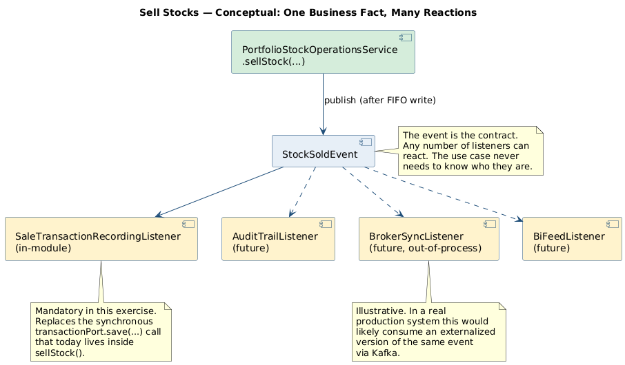
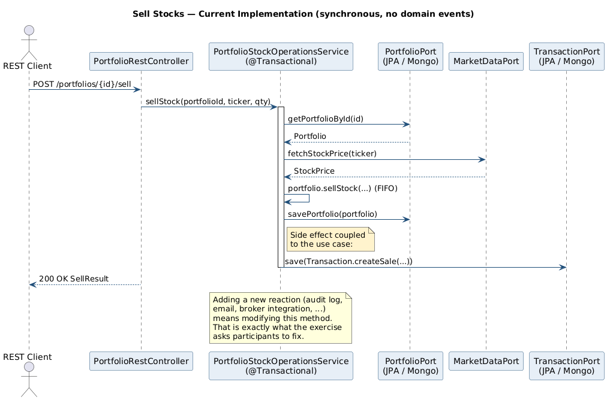
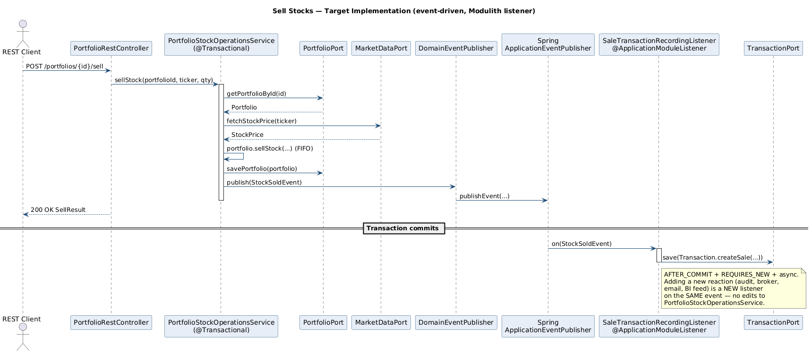

# Exercise — Refactor *Sell Stocks* with Domain Events

> **Audience.** Senior Java engineers, software architecture students and professional training participants who are already comfortable with HexaStock's [hexagonal layout](../sellStocks/SELL-STOCK-TUTORIAL.md) and the [requirement-traceability model](../README.md).
>
> **Format.** Reference demo (instructor) + hands-on refactor (participants) + facilitated review.
>
> **Scope.** Documentation only. This exercise asks participants to refactor live code; it does *not* alter the codebase as committed.

---

## At a glance

| Idea | Diagram |
|---|---|
| **Conceptual** — one business fact, many reactions | [](diagrams/Rendered/sell-events-conceptual.svg) |
| **Today** — synchronous, two persistence side effects in one method | [](diagrams/Rendered/sell-events-current.svg) |
| **Target** — event-driven, listener writes the transaction | [](diagrams/Rendered/sell-events-target.svg) |

The companion documentation set for the upcoming consultancy session lives under [doc/consultancy/monday-session/](../../consultancy/monday-session/README.md).

---

## 1. Why this exercise exists

HexaStock already contains one fully working domain-event flow: the *Watchlist / Market Sentinel → Notifications* pipeline. That pipeline is documented in [doc/tutorial/watchlists/WATCHLISTS-MARKET-SENTINEL.md](../watchlists/WATCHLISTS-MARKET-SENTINEL.md) and dissected end-to-end in the consultancy briefing chapter [04-DOMAIN-EVENTS-DEEP-DIVE.md](../../consultancy/04-DOMAIN-EVENTS-DEEP-DIVE.md).

That flow is the *instructor demo*. It exhibits the canonical separation between a *fact* (an alert condition was reached for a ticker) and *reactions* to that fact (a notification is dispatched). The publishing module — Watchlists — knows nothing about how, when or through which channel the reaction is performed.

This exercise asks participants to apply the same separation to a different, equally important business operation: **selling stocks**. The current implementation in [PortfolioStockOperationsService.sellStock(...)](../../../application/src/main/java/cat/gencat/agaur/hexastock/portfolios/application/service/PortfolioStockOperationsService.java) couples the *sell decision* with one of its consequences (recording a `Transaction`) inside a single synchronous method. The exercise is to disentangle them using the same pattern that the Watchlists module already exemplifies.

The pedagogical intent is to give participants the experience of *recognising* the pattern in working code, *justifying* its application in a new context and *implementing* the refactor end-to-end.

---

## 2. The instructor demo: the existing Market Sentinel flow

Spend approximately fifteen minutes walking through the in-flight implementation. The salient artefacts are:

| Layer | Artefact |
|---|---|
| Event (POJO record) | [WatchlistAlertTriggeredEvent.java](../../../application/src/main/java/cat/gencat/agaur/hexastock/watchlists/WatchlistAlertTriggeredEvent.java) |
| Outbound port (publisher abstraction) | [DomainEventPublisher.java](../../../application/src/main/java/cat/gencat/agaur/hexastock/application/port/out/DomainEventPublisher.java) |
| Spring adapter for the publisher | `bootstrap/.../config/events/SpringDomainEventPublisher.java` |
| Publication site (application service) | [MarketSentinelService.detectBuySignals()](../../../application/src/main/java/cat/gencat/agaur/hexastock/watchlists/application/service/MarketSentinelService.java) |
| Consumer (`@ApplicationModuleListener`) | [WatchlistAlertNotificationListener.java](../../../adapters-outbound-notification/src/main/java/cat/gencat/agaur/hexastock/notifications/WatchlistAlertNotificationListener.java) |
| End-to-end integration test | [NotificationsEventFlowIntegrationTest.java](../../../bootstrap/src/test/java/cat/gencat/agaur/hexastock/notifications/NotificationsEventFlowIntegrationTest.java) |
| Architectural verification | [ModulithVerificationTest.java](../../../bootstrap/src/test/java/cat/gencat/agaur/hexastock/architecture/ModulithVerificationTest.java) (assertions `watchlistsHasNoOutgoingModuleDependencies` and `notificationsOnlyDependsOnWatchlists`) |

Five properties of this implementation should be made explicit during the demo, because the participants will be asked to reproduce them:

1. **The event is a Java `record` with no framework imports.** It compiles in the framework-free `application` Maven module (see ADR-007).
2. **The event carries business identity, not transport identity.** It contains `userId`, never `chatId` or `email`.
3. **Publication goes through a port (`DomainEventPublisher`), not Spring's `ApplicationEventPublisher` directly.** This preserves the application layer's framework independence.
4. **The consumer uses `@ApplicationModuleListener`, which is `@TransactionalEventListener(AFTER_COMMIT) + @Async + @Transactional(REQUIRES_NEW)`.** The reaction therefore runs only after the publishing transaction commits, on a different thread, in its own transaction.
5. **The publisher knows nothing about the consumer.** No `import` statement in `MarketSentinelService` references anything in the `notifications` package; the `ModulithVerificationTest` asserts this property in CI.

Make the participants *see* property 5 by opening both files side by side. Decoupling is concrete.

---

## 3. The current *Sell Stocks* implementation

The participants' starting point is the production code in [PortfolioStockOperationsService.sellStock(...)](../../../application/src/main/java/cat/gencat/agaur/hexastock/portfolios/application/service/PortfolioStockOperationsService.java):

```java
@Override
@RetryOnWriteConflict
public SellResult sellStock(PortfolioId portfolioId, Ticker ticker, ShareQuantity quantity) {
    Portfolio portfolio = portfolioPort.getPortfolioById(portfolioId)
            .orElseThrow(() -> new PortfolioNotFoundException(portfolioId.value()));

    StockPrice stockPrice = stockPriceProviderPort.fetchStockPrice(ticker);
    Price price = stockPrice.price();

    SellResult sellResult = portfolio.sell(ticker, quantity, price);
    portfolioPort.savePortfolio(portfolio);

    Transaction transaction = Transaction.createSale(
            portfolioId, ticker, quantity, price, sellResult.proceeds(), sellResult.profit());
    transactionPort.save(transaction);

    return sellResult;
}
```

Three responsibilities are interleaved inside this single method:

1. **The core business operation.** Loading the portfolio, fetching the current price and invoking `portfolio.sell(...)`. This is what *Sell Stocks* fundamentally *is*.
2. **State persistence.** `portfolioPort.savePortfolio(portfolio)` makes the new aggregate state durable.
3. **A side effect: recording a financial transaction.** `Transaction.createSale(...)` followed by `transactionPort.save(transaction)` writes an audit-style record into a separate `Transaction` collection / table. The `Transaction` aggregate is *not* part of the `Portfolio` aggregate; it lives under [domain/.../transaction](../../../domain/src/main/java/cat/gencat/agaur/hexastock/portfolios/model/transaction/) with its own port [TransactionPort.java](../../../application/src/main/java/cat/gencat/agaur/hexastock/portfolios/application/port/out/TransactionPort.java) and its own persistence adapters.

Responsibility 3 is precisely what should be separated from responsibility 1. It is a *reaction* to a business fact (a sale happened), not a *constituent* of the fact itself.

---

## 4. The architectural problem

Three concrete problems flow from the current arrangement.

### 4.1 Open–closed violation under future reactions

Today the only consequence of a sale is that one `Transaction` row is recorded. Future plausible consequences include — non-exhaustively — an entry in an immutable audit ledger (Section 5.2 of the [domain-events roadmap](../../consultancy/05-DOMAIN-EVENTS-ROADMAP.md)), a real-time analytics projection of trading volume, a per-tax-year realised-gain aggregator, an outbound message to a brokerage reconciliation queue, an opt-in confirmation notification to the user, and a re-evaluation of any *position-size* watchlist alert configured by the same user on the same ticker. Each new reaction means a new line in `sellStock(...)`, a new injected port and a new responsibility attributed to a service whose name still claims to be about *stock operations*.

### 4.2 Transactional coupling between the decision and the reaction

The transaction record is written inside the same JPA / Mongo transaction as the portfolio mutation. If a future reaction is slow, fragile or involves an external system, that fragility leaks back into the user-facing `sellStock` path. A failed audit append should not roll back a successful sale; today's design has no mechanism to express that.

### 4.3 Bounded-context leakage as the platform grows

A future *audit*, *reporting* or *integrations.brokerage* module will need to know that a sale has occurred. Each such module would otherwise have to call `TransactionService.getTransactions(...)` on a polling basis and reconstruct the fact from the row, or — worse — depend directly on `PortfolioStockOperationsService`. Both options re-introduce the cross-module coupling that Spring Modulith exists to prevent.

A domain event addresses all three problems with a single mechanism.

---

## 5. The exercise

The exercise is performed on a new feature branch, branched from the current experimental branch (or from `main`, depending on the participants' working agreement). It is performed *without modifying tests* — except to add new tests that verify the new behaviour — and *without weakening any existing architectural assertion*.

### 5.1 Required outcome

Participants must deliver a refactor in which:

1. The application service `PortfolioStockOperationsService.sellStock(...)` continues to return the same `SellResult` and continues to enforce the same invariants.
2. The synchronous call to `transactionPort.save(...)` is *removed* from `sellStock(...)`. (The buy path is out of scope unless participants choose to extend the refactor; see Section 8.)
3. A new domain event — name and shape to be decided by the participants, based on the project's ubiquitous language — is published from `sellStock(...)` through the existing `DomainEventPublisher` port.
4. A new `@ApplicationModuleListener` consumes the event and writes the `Transaction` record. This listener replaces the synchronous side effect with an after-commit reaction.
5. All existing tests remain green. New tests cover the new event flow at the same level of rigour as [NotificationsEventFlowIntegrationTest](../../../bootstrap/src/test/java/cat/gencat/agaur/hexastock/notifications/NotificationsEventFlowIntegrationTest.java).
6. The Modulith verifications in [ModulithVerificationTest](../../../bootstrap/src/test/java/cat/gencat/agaur/hexastock/architecture/ModulithVerificationTest.java) and the architecture rules in [HexagonalArchitectureTest](../../../bootstrap/src/test/java/cat/gencat/agaur/hexastock/architecture/HexagonalArchitectureTest.java) remain green.

### 5.2 Open design questions for the participants

The exercise is deliberately *not* prescriptive about the following points. Each participant — or each pair — is expected to take a position, justify it and defend it during the review.

- **What is the event called?** Candidates include `StockSoldEvent`, `SaleExecutedEvent`, `PortfolioStockSoldEvent` and others. The name must respect the project's ubiquitous language and match the past-tense convention used by `WatchlistAlertTriggeredEvent`.
- **What does the event carry?** At minimum: portfolio identity, owner identity, ticker, quantity sold, sale price per share, proceeds, realised profit, instant of occurrence. Whether to include a list of consumed lots — the canonical *"one aggregate operation, multiple emitted events"* extension — is the more interesting design question. See Section 7.
- **In which package does the event live?** A defensible answer is `cat.gencat.agaur.hexastock.portfolios.events` (a new published-API sub-package), declared with `@NamedInterface("events")` in the bootstrap-side mirror `package-info.java`. Compare with how `cat.gencat.agaur.hexastock.marketdata.model.market` is exposed (see [marketdata/model/market/package-info.java](../../../bootstrap/src/main/java/cat/gencat/agaur/hexastock/marketdata/model/market/package-info.java)).
- **Where does the listener live?** The Transaction recording is a *Portfolio Management* concern — the `Transaction` aggregate is owned by Portfolio Management — so the listener lives inside `cat.gencat.agaur.hexastock.portfolios`. This is *intra-module* event consumption, which is a perfectly valid use of `@ApplicationModuleListener` and an excellent first step before introducing cross-module consumers.
- **Does the aggregate stay value-returning, or does it accumulate events internally?** Both styles are acceptable in DDD literature. HexaStock's `Portfolio` is currently value-returning (it returns a `SellResult`), which makes Vernon's "register events as a side effect of behaviour" idiom (IDDD, Ch. 8) the *less* idiomatic choice for this codebase. Discuss with the participants which style they prefer and why.
- **What `allowedDependencies` change in the `portfolios` `@ApplicationModule`?** If the listener is intra-module, none. If a future cross-module consumer (e.g. `audit`) is introduced as part of the same refactor, that consumer's module must declare `allowedDependencies = {..., "portfolios::events"}`.
- **What architectural assertion is added?** A bespoke test (`portfoliosEventsAreImmutableRecords`) that scans `portfolios.events` and asserts every type is a `record` is a strong candidate. Discuss whether to also assert no infrastructure imports.

### 5.3 Suggested package layout for the proposed solution

The exact layout is the participants' decision, but a defensible target — consistent with how Watchlists exposes its event — is:

```
application/src/main/java/cat/gencat/agaur/hexastock/portfolios/events/
    StockSoldEvent.java                 (or whichever name participants choose)

bootstrap/src/main/java/cat/gencat/agaur/hexastock/portfolios/events/
    package-info.java                   @NamedInterface("events")

application/src/main/java/cat/gencat/agaur/hexastock/portfolios/application/service/
    SaleTransactionRecordingListener.java   (the @ApplicationModuleListener)
    PortfolioStockOperationsService.java    (modified: publishes the event,
                                             no longer calls transactionPort)
```

A natural alternative is to place the listener in a separate `portfolios.adapter.out.events` sub-package to underline that it is an *adapter-style* infrastructure concern. The choice is itself a discussion point.

### 5.4 Suggested event shape

A serviceable starting point — *which participants are encouraged to question and improve* — is the following record:

```java
package cat.gencat.agaur.hexastock.portfolios.events;

import cat.gencat.agaur.hexastock.marketdata.model.market.Ticker;
import cat.gencat.agaur.hexastock.model.money.Money;
import cat.gencat.agaur.hexastock.model.money.Price;
import cat.gencat.agaur.hexastock.model.money.ShareQuantity;
import cat.gencat.agaur.hexastock.portfolios.model.portfolio.PortfolioId;

import java.time.Instant;
import java.util.Objects;

public record StockSoldEvent(
        PortfolioId portfolioId,
        String ownerName,
        Ticker ticker,
        ShareQuantity quantity,
        Price salePrice,
        Money proceeds,
        Money realisedProfit,
        Instant occurredOn
) {
    public StockSoldEvent {
        Objects.requireNonNull(portfolioId, "portfolioId is required");
        Objects.requireNonNull(ownerName, "ownerName is required");
        Objects.requireNonNull(ticker, "ticker is required");
        Objects.requireNonNull(quantity, "quantity is required");
        Objects.requireNonNull(salePrice, "salePrice is required");
        Objects.requireNonNull(proceeds, "proceeds is required");
        Objects.requireNonNull(realisedProfit, "realisedProfit is required");
        Objects.requireNonNull(occurredOn, "occurredOn is required");
    }
}
```

Whether `realisedProfit` should be modelled as a single signed `Money` or split into `realisedGain` / `realisedLoss` is a deliberate open question. Defer the answer to the participants.

### 5.5 Suggested publication site

Inside `PortfolioStockOperationsService.sellStock(...)`, after `portfolioPort.savePortfolio(portfolio)` and *before* the method returns:

```java
SellResult sellResult = portfolio.sell(ticker, quantity, price);
portfolioPort.savePortfolio(portfolio);

eventPublisher.publish(new StockSoldEvent(
        portfolioId,
        portfolio.getOwnerName(),
        ticker,
        quantity,
        price,
        sellResult.proceeds(),
        sellResult.profit(),
        clock.instant()));

return sellResult;
```

Two design notes worth discussing live:

- The publication is *after* `savePortfolio` and *inside* the `@Transactional` boundary. Spring Modulith's event publication registry binds the publication to the transaction; the registered listener fires only on commit.
- A `Clock` should be injected into the service rather than calling `Instant.now()` directly. The Watchlists module sets the precedent ([MarketSentinelService](../../../application/src/main/java/cat/gencat/agaur/hexastock/watchlists/application/service/MarketSentinelService.java) accepts a `Clock` constructor argument).

### 5.6 Suggested consumer

```java
package cat.gencat.agaur.hexastock.portfolios.application.service;

import cat.gencat.agaur.hexastock.portfolios.application.port.out.TransactionPort;
import cat.gencat.agaur.hexastock.portfolios.events.StockSoldEvent;
import cat.gencat.agaur.hexastock.portfolios.model.transaction.Transaction;
import org.springframework.modulith.events.ApplicationModuleListener;
import org.springframework.stereotype.Component;

@Component
public class SaleTransactionRecordingListener {

    private final TransactionPort transactionPort;

    public SaleTransactionRecordingListener(TransactionPort transactionPort) {
        this.transactionPort = transactionPort;
    }

    @ApplicationModuleListener
    public void on(StockSoldEvent event) {
        Transaction tx = Transaction.createSale(
                event.portfolioId(),
                event.ticker(),
                event.quantity(),
                event.salePrice(),
                event.proceeds(),
                event.realisedProfit());
        transactionPort.save(tx);
    }
}
```

Two notes for the review session:

- `@Component` is acceptable here because the listener lives in the `application` Maven module's *test-and-runtime classpath* via Spring's component scanning. If ADR-007 should apply with the same strictness as elsewhere, place the listener in `bootstrap/.../config/events/` and wire it manually in `SpringAppConfig`. This is a legitimate trade-off worth discussing.
- The Transaction creation logic is now in two places at once during the migration window: it must be removed from `PortfolioStockOperationsService.sellStock(...)` *atomically with* the introduction of the listener, otherwise the integration tests will see two Transaction records per sale.

### 5.7 Suggested testing

Participants are expected to add at least:

1. **A unit test** for `SaleTransactionRecordingListener` that supplies a stub `TransactionPort`, invokes `on(...)` directly with a hand-built `StockSoldEvent` and asserts that one `Transaction` was saved with the expected fields. No Spring context required.
2. **A modification to the existing service test** ([PortfolioStockOperationsServiceTest](../../../application/src/test/java/cat/gencat/agaur/hexastock/portfolios/application/service/) — locate the file) so that the test now verifies that the `TransactionPort` is *not* called by the service (the responsibility has moved) and that the `DomainEventPublisher` *is* called with an event whose fields match the `SellResult`. Use a fake publisher that records published events.
3. **A new integration test** modelled exactly on [NotificationsEventFlowIntegrationTest](../../../bootstrap/src/test/java/cat/gencat/agaur/hexastock/notifications/NotificationsEventFlowIntegrationTest.java) that boots the full Spring context, performs a sell through the application service and uses Awaitility to wait until exactly one `Transaction` is persisted by the listener. The test must assert:
    - The `Transaction` is recorded *after* the publishing transaction commits.
    - A failure inside the listener does *not* roll back the portfolio mutation.
4. **A new architecture assertion** that scans `cat.gencat.agaur.hexastock.portfolios.events` and asserts every type is a `record`.

---

## 6. Hexagonal-architecture boundaries to preserve

The refactor must respect the following invariants. Each of them is currently enforced by an existing test suite; the exercise will fail if any of them regresses.

| Invariant | Enforced by |
|---|---|
| Domain types do not import Spring or JPA. | Maven module boundary + `HexagonalArchitectureTest` |
| Application services do not import Spring (other than annotations whitelisted in `application/pom.xml`). | Maven module boundary + ADR-007 |
| `portfolios` does not import from `notifications`, `watchlists` or any other promoted module except `marketdata::model`, `marketdata::port-in`, `marketdata::port-out`. | `ModulithVerificationTest.portfoliosOnlyDependsOnMarketData` |
| Inbound REST controllers do not call domain entities directly. | `HexagonalArchitectureTest$AdapterIsolation` |

Two points deserve emphasis with the participants:

- The new `StockSoldEvent` lives in the `application` Maven module *but inside the `portfolios` package*. It is therefore part of Portfolio Management's published API; the `@NamedInterface("events")` declaration on the bootstrap-side `package-info.java` is what makes that fact explicit to Spring Modulith.
- The new listener consumes a `portfolios` event and writes a `portfolios` aggregate (`Transaction`). This is *intra-module* and crosses no architectural boundary. Future consumers in other modules — `audit`, `reporting`, `integrations.brokerage` — would have to declare `allowedDependencies = {..., "portfolios::events"}` and would each be reviewed independently.

---

## 7. Stretch goal: the canonical *"one operation, many events"* pattern

The Sell Stocks use case under FIFO accounting consumes one or more `Lot` entities — possibly partially. Each consumption is a business fact in its own right:

- It has its own *cost basis* (the price at which the lot was originally purchased).
- It has its own *purchase date*, which matters for jurisdictions where holding-period rules affect tax treatment.
- It has its own *realised gain*, which is the per-lot contribution to the aggregate `SellResult.profit()`.

A natural extension of the exercise — for participants who finish the core refactor early or for a follow-up session — is to introduce a second event, `LotSoldEvent`, and to publish one `LotSoldEvent` per lot consumed alongside the single aggregate-level `StockSoldEvent`. The full design sketch lives in section 5.2 of the [domain-events roadmap](../../consultancy/05-DOMAIN-EVENTS-ROADMAP.md).

The mechanical change is in two places:

- The aggregate's `Portfolio.sell(...)` (or its delegate inside `Holding`) returns a richer `SellResult` that includes a `List<LotConsumption>` describing each per-lot consumption.
- The application service iterates that list and publishes one `LotSoldEvent` per element, immediately after the single `StockSoldEvent`.

This stretch goal is the most direct illustration of why event-driven design matters in a financial context: the aggregate operation is *one* (the user sold 100 shares); the business facts emitted are *many* (one per lot consumed); each fact is independently consumable by reporting, audit and integration concerns. No alternative design known to the architecture community matches this expressiveness.

---

## 8. Out of scope (deliberate)

The following are explicitly *not* part of the exercise. Mention them so participants do not over-extend.

- Refactoring the buy path. The same pattern applies and the same exercise can be repeated, but doing both at once dilutes the focus.
- Externalising events to Kafka / RabbitMQ / JMS. Spring Modulith provides an in-process bus that is sufficient for HexaStock today; externalisation is a configuration change rather than a refactor and is out of scope here.
- Persisting the *event publication registry* with `spring-modulith-events-jpa` or `-mongodb`. The current configuration uses the in-memory registry, which is sufficient for the exercise and for development; production hardening is a separate task.
- Removing the `Transaction` aggregate. The `Transaction` aggregate remains. What changes is *who* writes it and *when*: not the application service synchronously, but a listener after commit.

---

## 9. Trade-offs the review must address

The facilitator should make sure the post-exercise review surfaces, at minimum, the following questions:

1. **Has the apparent simplicity of `sellStock(...)` been bought at the cost of *behavioural complexity* elsewhere?** The new asynchronous step adds operational concerns (event publication failures, listener exceptions, ordering, replays) that did not exist before. When is this trade favourable?
2. **Is the new event part of the public API of the `portfolios` module?** If yes, its shape becomes a contract; consumers will depend on its fields. Treat it as a published interface from day one.
3. **What happens if the listener throws?** With `@ApplicationModuleListener`, the listener's `REQUIRES_NEW` transaction rolls back; the publishing transaction is unaffected. The event publication registry can be configured to retain the failed publication for re-delivery. Discuss whether the current in-memory registry is sufficient for production.
4. **Is the synchronous call to `transactionPort.save(...)` *really* a side effect, or is it part of the business invariant?** A defensible counter-argument is that *"every sale must be auditable"* is a business rule, and that breaking the synchronous link weakens it. The architectural answer is that the rule is preserved by the *event publication registry*: the publication is committed atomically with the portfolio mutation, and the audit record will be produced eventually. Whether *eventual* is acceptable for a given regulatory regime is a domain decision.
5. **When is *not* introducing a domain event the right answer?** If the only consumer is intra-aggregate, if the consumer must complete synchronously to satisfy a business invariant or if the cardinality of events would dwarf the benefit, the synchronous call is preferable. Domain events are not free; they pay back when reactions are plural, optional or eventually consistent.

A good review session ends with the participants able to articulate, in their own words, why HexaStock benefits from this refactor and what would have made it overengineering.

---

## 10. Instructor notes

### 10.1 Preparation

- Confirm that the participants have a working build: `./mvnw clean verify -DskipITs` should complete green. If anything fails on their machines, fix it before the session — the exercise depends on a green baseline.
- Open the eight files listed in Section 2 in IDE tabs and have them ready.
- Have a checked-out copy of [NotificationsEventFlowIntegrationTest](../../../bootstrap/src/test/java/cat/gencat/agaur/hexastock/notifications/NotificationsEventFlowIntegrationTest.java) in front of you — participants will copy its structure for their own integration test.

### 10.2 Suggested timing (half-day session)

| Slot | Activity |
|---|---|
| 0:00–0:30 | Instructor demo of the Market Sentinel flow (Section 2). Walk every artefact; insist on the five properties at the end of Section 2. |
| 0:30–0:45 | Joint reading of the current `sellStock(...)` (Section 3) and statement of the architectural problem (Section 4). |
| 0:45–1:00 | Participants split into pairs. Each pair drafts — *on paper* — the event name, the event payload and the package layout (Section 5.2 and 5.3). Compare answers across pairs before any code is written. |
| 1:00–2:30 | Implementation. The instructor circulates, answering questions but not coding. Participants follow Sections 5.4 to 5.7. |
| 2:30–3:00 | Each pair presents its solution. The instructor asks the trade-off questions of Section 9. |
| 3:00–3:30 | Optional stretch: introduce `LotSoldEvent` (Section 7) collectively at the screen. |
| 3:30–4:00 | Recap: when domain events help, when they hurt. Cross-reference to the [domain-events roadmap](../../consultancy/05-DOMAIN-EVENTS-ROADMAP.md) for the rest of the platform. |

### 10.3 What to look for during the review

- A `record` event with `Objects.requireNonNull` in the canonical constructor.
- No Spring import in the event class.
- The publisher injected as `DomainEventPublisher`, never `ApplicationEventPublisher`.
- The listener annotated with `@ApplicationModuleListener`, not with `@EventListener` or `@TransactionalEventListener` directly.
- A `Clock` injected into the service rather than `Instant.now()`.
- Existing tests still green.
- New integration test that uses Awaitility, mirrors `NotificationsEventFlowIntegrationTest` and asserts both the *positive* property (the listener fires) and the *negative* property (a listener failure does not corrupt the publishing transaction).

### 10.4 Common pitfalls

- **Removing the synchronous call before the listener works.** Insist on the listener being functionally complete *before* the synchronous call is removed; otherwise the integration tests turn red and the participants debug two problems at once.
- **Putting the event in the wrong package.** A common error is to place `StockSoldEvent` directly in `cat.gencat.agaur.hexastock.portfolios` (the module root). Doing so would expose it as the *default* published API. The exercise prefers a `events` sub-package with an explicit `@NamedInterface("events")` declaration, mirroring how `marketdata` exposes its three slices.
- **Confusing intra-module and cross-module listening.** This exercise is *intra-module*: the listener and the publisher both belong to `portfolios`. Clarify that this is legitimate and is a sound first step before introducing cross-module consumers in other modules.
- **Forgetting the time-source abstraction.** A test that asserts an exact `Instant` will be flaky if the service calls `Instant.now()`. Inject a `Clock`.

---

## 11. Where this fits in the wider documentation set

| Document | Relationship to this exercise |
|---|---|
| [doc/tutorial/sellStocks/SELL-STOCK-TUTORIAL.md](SELL-STOCK-TUTORIAL.md) | Walkthrough of the *current* Sell Stocks implementation. Read first. |
| [doc/tutorial/sellStocks/SELL-STOCK-DOMAIN-TUTORIAL.md](SELL-STOCK-DOMAIN-TUTORIAL.md) | Focused tutorial on the FIFO domain model. Background for Section 7. |
| [doc/tutorial/sellStocks/SELL-STOCK-EXERCISES.md](SELL-STOCK-EXERCISES.md) | Pre-existing self-directed exercises. This exercise is a natural addition to that catalogue. |
| [doc/tutorial/watchlists/WATCHLISTS-MARKET-SENTINEL.md](../watchlists/WATCHLISTS-MARKET-SENTINEL.md) | Reference for the instructor demo (Section 2). |
| [doc/consultancy/04-DOMAIN-EVENTS-DEEP-DIVE.md](../../consultancy/04-DOMAIN-EVENTS-DEEP-DIVE.md) | Complete dissection of the Market Sentinel event flow, beyond what the demo covers. |
| [doc/consultancy/05-DOMAIN-EVENTS-ROADMAP.md](../../consultancy/05-DOMAIN-EVENTS-ROADMAP.md) | Forward-looking catalogue of further events; its section 5.2 (`LotSoldEvent`) is the source for the stretch goal of Section 7. |
| [doc/architecture/MODULITH-BOUNDED-CONTEXT-INVENTORY.md](../../architecture/MODULITH-BOUNDED-CONTEXT-INVENTORY.md) | The promoted-module inventory. Useful when discussing future cross-module consumers. |

---

## 12. Acceptance checklist for the participants' deliverable

A participant submission is *complete* when **all** of the following are true:

- [ ] A new event type (Java `record`, no framework imports) lives under `cat.gencat.agaur.hexastock.portfolios` and is published from `PortfolioStockOperationsService.sellStock(...)`.
- [ ] The synchronous `transactionPort.save(transaction)` call has been removed from `sellStock(...)`.
- [ ] A new `@ApplicationModuleListener` consumes the event and writes the `Transaction` record.
- [ ] A `Clock` is injected into `PortfolioStockOperationsService`.
- [ ] At least one new unit test covers the listener in isolation.
- [ ] The existing `PortfolioStockOperationsServiceTest` is updated to verify that the publisher is called and the transaction port is *not*.
- [ ] A new integration test mirrors `NotificationsEventFlowIntegrationTest` and verifies the after-commit, asynchronous Transaction recording with Awaitility.
- [ ] An ArchUnit assertion verifies that every type in the new events package is a `record`.
- [ ] `./mvnw clean verify -DskipITs` is green.
- [ ] `MODULES.verify()` and the bespoke Modulith assertions are green.
- [ ] A short Markdown note (one page) inside the participant's branch documents the design choices made in Section 5.2 and the trade-offs from Section 9.

A submission that meets all twelve items demonstrates that the participant has internalised the canonical domain-event pattern and is ready to apply it elsewhere in HexaStock without supervision.
