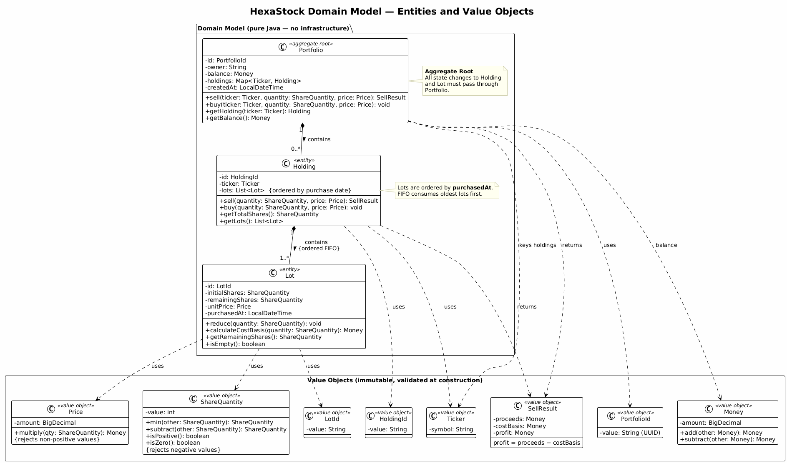
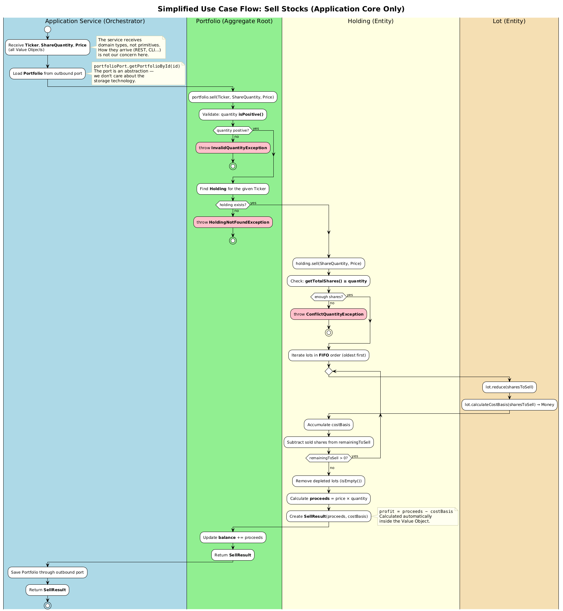
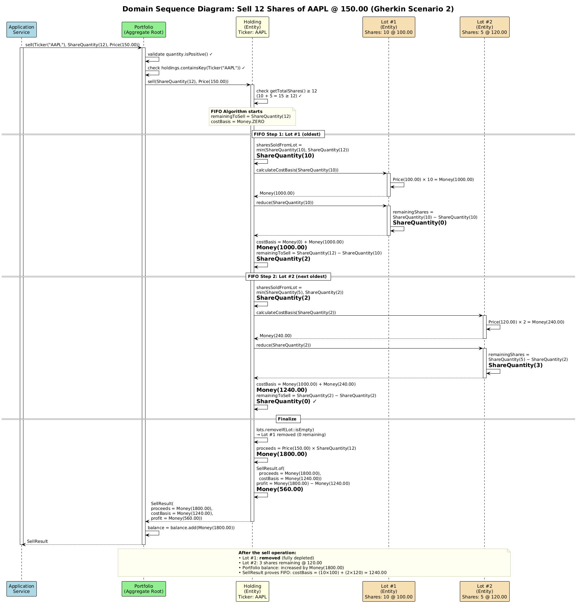
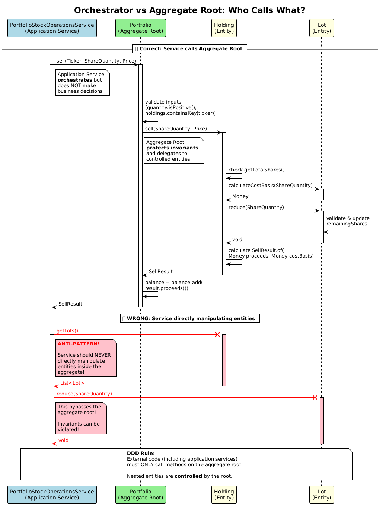

# Understanding the Domain Model: Selling Stocks with DDD

> **📖 This is a simplified version** of the full tutorial [From Specification to Integration Test: Engineering a Stock Portfolio with DDD and Hexagonal Architecture](https://github.com/alfredorueda/HexaStock/blob/main/doc/tutorial/sellStocks/SELL-STOCK-TUTORIAL.md). It focuses exclusively on the **domain model** — the business logic at the heart of HexaStock — without discussing REST controllers, HTTP endpoints, DTOs, JPA entities, persistence adapters, integration tests, or any infrastructure concern. If you want the complete architectural picture, read the full tutorial.

---

## Table of Contents

- [1. Introduction](#1-introduction)
- [2. Learning Objectives](#2-learning-objectives)
- [3. Functional Specification (Behaviour)](#3-functional-specification-behaviour)
- [4. Executable Specification (JUnit Domain Tests)](#4-executable-specification-junit-domain-tests)
  - [Aggregate Root Test (Portfolio)](#aggregate-root-test-portfolio)
  - [FIFO Algorithm Test (Holding)](#fifo-algorithm-test-holding)
- [5. Domain Context: What "Selling Stocks" Means](#5-domain-context-what-selling-stocks-means)
- [6. Domain Class Diagram](#6-domain-class-diagram)
- [7. Simplified Use Case Flow](#7-simplified-use-case-flow)
- [8. Domain Sequence Diagram: The SELL Operation](#8-domain-sequence-diagram-the-sell-operation)
- [9. Why Application Services Orchestrate and Aggregates Protect Invariants](#9-why-application-services-orchestrate-and-aggregates-protect-invariants)
  - [A) Roles Explained with Real Code](#a-roles-explained-with-real-code)
  - [B) Why Direct Manipulation Breaks Invariants](#b-why-direct-manipulation-breaks-invariants)
  - [C) Teaching Note](#c-teaching-note)
- [10. What This Simplified Tutorial Leaves Out](#10-what-this-simplified-tutorial-leaves-out)
- [11. Key Takeaways](#11-key-takeaways)
- [12. Exercises](#12-exercises)
  - [Exercise 1: Trace the Domain Logic for a Buy Operation](#exercise-1-trace-the-domain-logic-for-a-buy-operation)
  - [Exercise 2: Identify Aggregate Boundaries](#exercise-2-identify-aggregate-boundaries)
  - [Exercise 3: Distinguish Value Objects from Entities](#exercise-3-distinguish-value-objects-from-entities)
  - [Exercise 4: Add a Maximum Sell Percentage Invariant](#exercise-4-add-a-maximum-sell-percentage-invariant)

---

## 1. Introduction

HexaStock is a stock portfolio management system built with **Domain-Driven Design (DDD)**. This tutorial focuses on one specific use case — **selling stocks from a portfolio** — to teach you how domain models enforce business rules.

You will learn how:
- Business behaviour is specified before any code is written
- Aggregates, entities, and value objects collaborate to implement that behaviour
- The domain model protects its own consistency (invariants) without relying on any external technology

Everything in this tutorial runs **without a database, without a web server, and without any framework**. The domain model is pure Java.

---

## 2. Learning Objectives

By the end of this tutorial, you will understand:

- How **Gherkin scenarios** capture expected behaviour in business language before any design decisions are made
- How **JUnit tests** validate that behaviour directly against the domain model, with no infrastructure required
- How **Domain-Driven Design (DDD)** shapes the model into aggregates (`Portfolio`, `Holding`, `Lot`) that enforce business invariants
- How the **aggregate root pattern** ensures that all state changes pass through a single consistency boundary
- How **FIFO (First-In-First-Out) accounting** is implemented entirely within the domain model as a core business rule
- How **Value Objects** (`Money`, `Price`, `ShareQuantity`, `Ticker`, `PortfolioId`, etc.) replace primitives to enforce constraints at construction time
- Why **application services orchestrate** use cases without containing business logic, while **aggregates decide** and protect invariants

---

## 3. Functional Specification (Behaviour)

Before writing any code, we define the **observable behaviour** of the sell use case using Gherkin scenarios. These describe what the system must do in business terms, independent of any technical design decisions.

**Source of truth:** [US-07 — Sell Stocks (API Specification)](https://github.com/alfredorueda/HexaStock/blob/main/doc/stock-portfolio-api-specification.md#27-us-07--sell-stocks)

> **Canonical Gherkin:** [`doc/features/sell-stocks.feature`](../../features/sell-stocks.feature) — the scenarios below are reproduced for readability; the `.feature` file is the single source referenced by `@SpecificationRef` annotations in tests.

```gherkin
Feature: Sell Stocks with FIFO Lot Consumption

  Background:
    Given a portfolio exists for owner "Alice"
    And the portfolio holds AAPL with the following lots (in purchase order):
      | Lot # | Shares | Purchase Price |
      |     1 |     10 |        100.00  |
      |     2 |      5 |        120.00  |
    And the current market price for AAPL is 150.00

  Scenario: Selling shares consumed entirely from a single lot
    When I sell 8 shares of AAPL
    Then the sale response contains:
      | Field     | Value   |
      | ticker    | AAPL    |
      | quantity  |       8 |
      | proceeds  | 1200.00 |
      | costBasis |  800.00 |
      | profit    |  400.00 |
    And FIFO consumed 8 shares from Lot #1 at 100.00
    And the AAPL holding lots are now:
      | Lot # | Initial Shares | Remaining Shares | Purchase Price |
      |     1 |             10 |                2 |        100.00  |
      |     2 |              5 |                5 |        120.00  |
    And the portfolio cash balance has increased by 1200.00

  # Calculation breakdown:
  #   FIFO step 1: Lot #1 has 10 remaining → take min(10, 8) = 8 shares
  #                costBasis contribution = 8 × 100.00 = 800.00
  #                Lot #1 remaining: 10 − 8 = 2
  #   Total shares sold: 8 (request fulfilled)
  #   proceeds  = 8 × 150.00  = 1200.00
  #   costBasis = 800.00
  #   profit    = 1200.00 − 800.00 = 400.00

  Scenario: Selling shares consumed across multiple lots
    When I sell 12 shares of AAPL
    Then the sale response contains:
      | Field     | Value   |
      | ticker    | AAPL    |
      | quantity  |      12 |
      | proceeds  | 1800.00 |
      | costBasis | 1240.00 |
      | profit    |  560.00 |
    And FIFO consumed 10 shares from Lot #1 at 100.00 and 2 shares from Lot #2 at 120.00
    And Lot #1 is fully depleted and removed
    And the AAPL holding lots are now:
      | Lot # | Initial Shares | Remaining Shares | Purchase Price |
      |     2 |              5 |                3 |        120.00  |
    And the portfolio cash balance has increased by 1800.00

  # Calculation breakdown:
  #   FIFO step 1: Lot #1 has 10 remaining → take min(10, 12) = 10 shares
  #                costBasis contribution = 10 × 100.00 = 1000.00
  #                Lot #1 remaining: 10 − 10 = 0 → lot is empty, removed
  #                Shares still to sell: 12 − 10 = 2
  #   FIFO step 2: Lot #2 has 5 remaining → take min(5, 2) = 2 shares
  #                costBasis contribution = 2 × 120.00 = 240.00
  #                Lot #2 remaining: 5 − 2 = 3
  #                Shares still to sell: 2 − 2 = 0
  #   Total shares sold: 12 (request fulfilled)
  #   proceeds  = 12 × 150.00 = 1800.00
  #   costBasis = 1000.00 + 240.00 = 1240.00
  #   profit    = 1800.00 − 1240.00 = 560.00
```

---

## 4. Executable Specification (JUnit Domain Tests)

The Gherkin scenarios describe observable behaviour at the **Portfolio level** — the aggregate root. HexaStock validates this behaviour at **two complementary levels**, both of which run with no infrastructure at all (no database, no web server, no Spring context):

1. **Aggregate-level test** — exercises `Portfolio.sell(...)` and verifies financial results, balance updates, and FIFO lot consumption as a single consistent unit.
2. **Algorithm-level test** — exercises `Holding.sell(...)` and verifies the FIFO lot-consumption algorithm in isolation.

### Aggregate Root Test (Portfolio)

This is the direct executable translation of the Gherkin scenario. It invokes `Portfolio.sell(...)` exactly as the application service would, and asserts every observable outcome.

**Test source:** [PortfolioTest.java — shouldSellSharesUsingFIFOThroughPortfolioAggregateRoot_GherkinScenario](https://github.com/alfredorueda/HexaStock/blob/9f52de7b30dd683952b5a1b10ac63c878535444a/src/test/java/cat/gencat/agaur/hexastock/model/PortfolioTest.java#L201)

```java
@Test
@DisplayName("Should sell shares across multiple lots using FIFO through the aggregate root (Gherkin scenario)")
void shouldSellSharesUsingFIFOThroughPortfolioAggregateRoot_GherkinScenario() {
    // Background: a portfolio with sufficient funds to buy AAPL lots
    Price purchasePrice1 = Price.of("100.00");
    Price purchasePrice2 = Price.of("120.00");
    Price marketSellPrice = Price.of("150.00");

    Portfolio fundedPortfolio = new Portfolio(
            PortfolioId.generate(), "Alice", Money.of("10000.00"), LocalDateTime.now());

    // Background: buy 10 shares of AAPL @ 100, then 5 shares @ 120
    fundedPortfolio.buy(APPLE, ShareQuantity.of(10), purchasePrice1);
    fundedPortfolio.buy(APPLE, ShareQuantity.of(5), purchasePrice2);

    Money balanceBeforeSell = fundedPortfolio.getBalance(); // 10000 - 1000 - 600 = 8400

    // When: sell 12 shares of AAPL @ 150 through the aggregate root
    SellResult result = fundedPortfolio.sell(APPLE, ShareQuantity.of(12), marketSellPrice);

    // Then: financial results match Gherkin expectations
    assertEquals(Money.of("1800.00"), result.proceeds());   // 12 × 150
    assertEquals(Money.of("1240.00"), result.costBasis());   // (10 × 100) + (2 × 120)
    assertEquals(Money.of("560.00"), result.profit());       // 1800 − 1240

    // And: portfolio balance increased by proceeds
    assertEquals(balanceBeforeSell.add(Money.of("1800.00")), fundedPortfolio.getBalance());

    // And: FIFO lot consumption — only Lot #2 survives with 3 remaining shares
    Holding aaplHolding = fundedPortfolio.getHolding(APPLE);
    assertEquals(ShareQuantity.of(3), aaplHolding.getTotalShares());
    assertEquals(1, aaplHolding.getLots().size());

    Lot remainingLot = aaplHolding.getLots().getFirst();
    assertEquals(ShareQuantity.of(3), remainingLot.getRemainingShares());
    assertEquals(purchasePrice2, remainingLot.getUnitPrice());
}
```

> **💡 Why test through the aggregate root?** The Gherkin scenario says *"the portfolio cash balance has increased by 1800.00"* — this is a Portfolio-level invariant. Only a test that calls `Portfolio.sell(...)` can verify that the balance update and the FIFO lot consumption happen together atomically and consistently. A `Holding`-level test cannot observe the balance.

### FIFO Algorithm Test (Holding)

This lower-level test verifies the FIFO lot-consumption algorithm in isolation — shares are consumed from the oldest lot first, depleted lots are removed, and cost basis is calculated correctly — without involving portfolio-level concerns such as cash balance.

**Test source:** [HoldingTest.java — shouldSellSharesAcrossMultipleLots_GherkinScenario](https://github.com/alfredorueda/HexaStock/blob/44fa1ff6e29b79faccb0952a5103475eb4f03061/src/test/java/cat/gencat/agaur/hexastock/model/HoldingTest.java#L181)

```java
@Test
@DisplayName("Should sell shares across multiple lots using FIFO (Gherkin scenario)")
void shouldSellSharesAcrossMultipleLots_GherkinScenario() {
    // Background: buy 10 shares @ 100, then 5 shares @ 120
    holding.buy(ShareQuantity.of(10), PRICE_100);
    holding.buy(ShareQuantity.of(5), PRICE_120);

    // When: sell 12 shares @ 150 (market price from Gherkin)
    SellResult result = holding.sell(ShareQuantity.of(12), PRICE_150);

    // Then: 3 remaining shares, only Lot #2 survives
    assertEquals(ShareQuantity.of(3), holding.getTotalShares());
    assertEquals(1, holding.getLots().size());

    Lot remainingLot = holding.getLots().getFirst();
    assertEquals(ShareQuantity.of(3), remainingLot.getRemainingShares());
    assertEquals(PRICE_120, remainingLot.getUnitPrice());

    // And: financial results match Gherkin expectations
    assertEquals(Money.of("1800.00"), result.proceeds());
    assertEquals(Money.of("1240.00"), result.costBasis());
    assertEquals(Money.of("560.00"), result.profit());
}
```

> **💡 Two levels, one truth:** Both tests verify the same FIFO financial results (proceeds, cost basis, profit). The Portfolio test additionally verifies aggregate consistency (balance update). Together they form a complete executable specification at the appropriate DDD abstraction levels.

---

## 5. Domain Context: What "Selling Stocks" Means

In HexaStock:

- A **Portfolio** represents an investor's account containing cash (`Money`) and stock holdings. It is the **aggregate root** — the single entry point for all operations.
- A **Holding** tracks all shares owned for a specific stock ticker (e.g., `Ticker.of("AAPL")`). A portfolio contains zero or more holdings.
- A **Lot** represents a single purchase — a batch of shares (`ShareQuantity`) bought at a specific price (`Price`) and time. A holding contains one or more lots, ordered by purchase date.
- **FIFO (First-In-First-Out)** accounting means that when selling, the **oldest lots are consumed first**.

When the domain model sells stocks:
1. It validates that the quantity is positive and the holding exists
2. It applies FIFO to determine which lots to draw from (oldest first)
3. It calculates **proceeds** (price × quantity), **cost basis** (what was originally paid for those specific lots), and **profit** (proceeds − cost basis)
4. It updates the portfolio's cash balance
5. It removes fully depleted lots

> **💡 Why Value Objects?**
> The domain uses `Money`, `Price`, `ShareQuantity`, `Ticker`, `PortfolioId`, `HoldingId`, and `LotId` instead of primitives (`BigDecimal`, `int`, `String`). This eliminates an entire class of bugs — you cannot accidentally pass a quantity where a price is expected — and enforces validation at construction time. For example, `ShareQuantity` rejects negative values, and `Price` rejects non-positive values at the moment they are created.

---

## 6. Domain Class Diagram

The diagram below shows **only the domain model** — the entities and value objects that implement the business logic. No controllers, DTOs, JPA entities, adapters, or infrastructure classes appear here.

**Full UML diagram reference:** See [`diagrams/Rendered/domain-class-diagram.svg`](diagrams/Rendered/domain-class-diagram.svg)

[](diagrams/Rendered/domain-class-diagram.svg)

[View PlantUML source](diagrams/domain-class-diagram.puml)

**Key relationships:**
- A `Portfolio` contains zero or more `Holding` objects, indexed by `Ticker`
- A `Holding` contains one or more `Lot` objects, ordered by purchase date
- All state changes to `Holding` and `Lot` **must go through `Portfolio`** (the aggregate root)
- Value Objects are immutable and enforce constraints at construction time

---

## 7. Simplified Use Case Flow

In a complete system, the sell operation passes through many architectural layers (REST controller → port → service → domain → persistence). In this tutorial, we focus only on the **application core**.

The application service is a **thin orchestrator** — it loads data, calls the aggregate root, and saves the result. All business logic (validation, FIFO, profit calculation) lives inside the domain model. The activity diagram below traces this flow through each domain participant, including the three validation checkpoints and the FIFO loop.

**Full UML diagram reference:** See [`diagrams/Rendered/sell-use-case-flow.svg`](diagrams/Rendered/sell-use-case-flow.svg)

[](diagrams/Rendered/sell-use-case-flow.svg)

[View PlantUML source](diagrams/sell-use-case-flow.puml)

---

## 8. Domain Sequence Diagram: The SELL Operation

The sequence below traces how the sell operation flows through the **domain model only** — from the moment the application service calls `Portfolio.sell()` to the moment `SellResult` is returned. No REST controllers, HTTP requests, or database operations appear. It walks through the Gherkin Scenario 2 (selling 12 shares of AAPL at 150.00), showing both FIFO steps, lot depletion, and the final financial result.

**Full UML sequence diagram reference:** See [`diagrams/Rendered/sell-domain-sequence.svg`](diagrams/Rendered/sell-domain-sequence.svg)

[](diagrams/Rendered/sell-domain-sequence.svg)

[View PlantUML source](diagrams/sell-domain-sequence.puml)

**What this diagram shows:**
- The **Portfolio** validates inputs and delegates to the correct `Holding`
- The **Holding** implements the FIFO algorithm, iterating lots from oldest to newest
- Each **Lot** reduces its `remainingShares` and reports its `costBasis` contribution
- Depleted lots (Lot #1 with 0 remaining) are removed automatically
- The **Portfolio** updates its `balance` with the proceeds before returning the `SellResult`

> **💡 Complementary diagrams:** The repository also contains a more generic FIFO sequence diagram (selling 7 shares) and a diagram comparing correct vs anti-pattern service behaviour. See [`diagrams/Rendered/sell-domain-fifo.svg`](diagrams/Rendered/sell-domain-fifo.svg) and [`diagrams/Rendered/sell-orchestrator-vs-aggregate.svg`](diagrams/Rendered/sell-orchestrator-vs-aggregate.svg).

---

## 9. Why Application Services Orchestrate and Aggregates Protect Invariants

This is the **most important concept** in Domain-Driven Design.

### A) Roles Explained with Real Code

**Application Service (Orchestrator):**

```java
@Override
public SellResult sellStock(PortfolioId portfolioId, Ticker ticker, ShareQuantity quantity) {
    // 1. Retrieve portfolio (via an outbound port — how it's loaded is not our concern)
    Portfolio portfolio = portfolioPort.getPortfolioById(portfolioId)
        .orElseThrow(() -> new PortfolioNotFoundException(portfolioId.value()));

    // 2. Fetch current stock price (via another outbound port)
    StockPrice stockPrice = stockPriceProviderPort.fetchStockPrice(ticker);
    Price price = stockPrice.price();

    // 3. Delegate ALL business logic to the aggregate root
    SellResult sellResult = portfolio.sell(ticker, quantity, price);

    // 4. Persist (we don't care how — the port abstracts it away)
    portfolioPort.savePortfolio(portfolio);

    // ...

    return sellResult;
}
```

**Role:** The service is a **director of orchestra** — it retrieves, delegates, and persists, but **never decides**. It does not validate quantities, check holdings, implement FIFO, calculate profits, or update lots directly.

**Aggregate Root (Decision Maker):**

```java
public SellResult sell(Ticker ticker, ShareQuantity quantity, Price price) {
    if (!quantity.isPositive())
        throw new InvalidQuantityException("Quantity must be positive");
    if (!holdings.containsKey(ticker))
        throw new HoldingNotFoundException("Holding not found in portfolio: " + ticker);

    Holding holding = holdings.get(ticker);
    SellResult result = holding.sell(quantity, price);
    balance = balance.add(result.proceeds());

    return result;
}
```

**Role:** The aggregate root is the **guardian of invariants** — it validates, delegates to controlled entities, updates balance consistently, and returns a complete result.

### B) Why Direct Manipulation Breaks Invariants

Imagine if the application service bypassed the aggregate root and manipulated internal entities directly:

```java
// ❌ WRONG! DO NOT DO THIS!
Holding holding = portfolio.getHoldings().stream()
    .filter(h -> h.getTicker().equals(ticker))
    .findFirst().orElseThrow();

ShareQuantity remaining = quantity;
for (Lot lot : holding.getLots()) {
    if (remaining.isPositive()) {
        ShareQuantity toSell = lot.getRemainingShares().min(remaining);
        lot.reduce(toSell);      // Direct manipulation!
        remaining = remaining.subtract(toSell);
    }
}

Money someAmount = Price.of(150).multiply(quantity);
portfolio.deposit(someAmount);   // Wrong way to add proceeds!
```

**What breaks:**

1. **FIFO Logic Duplication** — The FIFO algorithm is now in the service, not in the domain. If business rules change (e.g., switch to LIFO), you must change the service instead of the domain model.

2. **Invariant Violation Risk** — The service might forget to check `getTotalShares() >= quantity`. The portfolio would enter an invalid state.

3. **Balance Inconsistency** — The balance update logic might not match the actual proceeds calculation, corrupting the portfolio.

4. **No Central Enforcement** — If another use case also needs to sell stocks, it must duplicate all validation and calculation logic.

5. **Testability** — You now need complex tests to verify FIFO correctness. With the correct design, you can unit-test `Holding.sell()` in isolation with no setup overhead.

**✅ Correct pattern — one line in the service, all logic in the aggregate:**

```java
SellResult sellResult = portfolio.sell(ticker, quantity, price);
```

### C) Teaching Note

> **💡 Key Principle**
>
> **Application services coordinate; aggregates decide.**
>
> The application service is a **traffic controller**. It fetches data, calls the aggregate, and saves results. It does not make business decisions.
>
> The aggregate root is a **consistency boundary**. All changes to entities within the aggregate must go through the root. This ensures invariants are never violated.
>
> **Value Objects** reinforce this boundary by making the types expressive. You cannot accidentally pass a `ShareQuantity` where a `Price` is expected — the compiler catches it.

**Diagram Reference:** See [`diagrams/Rendered/sell-orchestrator-vs-aggregate.svg`](diagrams/Rendered/sell-orchestrator-vs-aggregate.svg)

[](diagrams/Rendered/sell-orchestrator-vs-aggregate.svg)

---

## 10. What This Simplified Tutorial Leaves Out

This tutorial intentionally omits everything outside the domain model. If you want to learn about these topics, read the [full tutorial](https://github.com/alfredorueda/HexaStock/blob/main/doc/tutorial/sellStocks/SELL-STOCK-TUTORIAL.md):

| Topic | What it covers | Full tutorial section |
|---|---|---|
| **REST Controllers & DTOs** | How HTTP requests enter the system; JSON ↔ Value Object mapping | Sections 7, 9 (Steps 1–2, 6) |
| **Hexagonal Architecture Map** | Complete layer table: adapters, ports, services, domain | Section 8 |
| **Persistence & JPA** | How domain objects are mapped to database entities; the mapper pattern | Section 12 |
| **Transactionality** | `@Transactional`, ACID guarantees, concurrency control, pessimistic locking | Section 11 |
| **Error → HTTP Mapping** | How domain exceptions become HTTP 400/404/409 responses | Section 13 |
| **Integration Testing** | End-to-end tests with Testcontainers, RestAssured, and adapter swapping | Section 16 |
| **Architecture Overview** | Ports & Adapters, Dependency Inversion, architectural trade-offs | Section 1 |

---

## 11. Key Takeaways

### Domain-Driven Design

- **Aggregates protect invariants** — all state changes to `Holding` and `Lot` pass through the `Portfolio` root. The portfolio can never enter an inconsistent state.
- **Application services orchestrate** — they coordinate use cases without containing business logic. The service calls `portfolio.sell(...)` and saves the result; it does not implement FIFO.
- **Value Objects eliminate primitive obsession** — types like `Money`, `Price`, `ShareQuantity`, `Ticker`, and `PortfolioId` enforce constraints at construction time and make the ubiquitous language explicit.
- **Business rules live in the domain** — FIFO logic belongs in `Holding.sell()`, not in a service or adapter.
- **Domain exceptions speak business language** — `ConflictQuantityException` ("Not enough shares to sell") is a business rule violation, not a technical error.

### Testing the Domain

- **Domain tests need no infrastructure** — the `PortfolioTest` and `HoldingTest` examples run in milliseconds without Spring, without a database, and without any framework.
- **Two levels verify one truth** — the aggregate test checks consistency (balance + FIFO together), the holding test checks the algorithm in isolation. Both verify the same financial results.
- **Gherkin scenarios drive the tests** — the executable specifications are direct translations of the business behaviour, making them readable by non-developers.

---

## 12. Exercises

The following exercises are designed to deepen your understanding of the domain model. They require no infrastructure — all can be completed with pure Java domain classes and JUnit tests.

---

### Exercise 1: Trace the Domain Logic for a Buy Operation

**Goal:** Understand how the `buy` operation flows through the aggregate.

**What to deliver:**
- A written trace (similar to the sequence diagram in Section 8) showing how `Portfolio.buy(Ticker, ShareQuantity, Price)` works:
  - What does the Portfolio validate?
  - How does it delegate to Holding?
  - How is a new Lot created?
  - What happens to the portfolio balance?
- Identify one key difference between the buy and sell operations in the domain model

---

### Exercise 2: Identify Aggregate Boundaries

**Goal:** Understand why `Portfolio` is the aggregate root.

**What to deliver:**
- A written explanation (300–500 words) answering:
  - Why is `Portfolio` the aggregate root instead of `Holding` or `Lot`?
  - What invariants would break if `Holding` were exposed as a separate aggregate that callers could modify directly?
  - Why must balance updates and holding modifications happen together atomically?
- Use concrete examples from the sell operation to support your reasoning

---

### Exercise 3: Distinguish Value Objects from Entities

**Goal:** Understand the difference between entities and value objects.

**What to deliver:**
- A written explanation answering:
  - Why is `Ticker` a value object while `Lot` is an entity?
  - Why is `Money` a value object while `Portfolio` is an entity?
  - Why are `PortfolioId`, `HoldingId`, and `LotId` value objects even though they represent identity? (Hint: they are identity *values*, not entities themselves.)

---

### Exercise 4: Add a Maximum Sell Percentage Invariant

**Goal:** Implement a business invariant using DDD principles — entirely within the domain model.

**Business Rules:**
- A portfolio may sell **up to 10 shares** of a holding without any percentage restriction
- When selling **more than 10 shares**, the portfolio cannot sell more than **50% of the shares of the affected holding**

**What to deliver:**

1. **Design decision** — Where should this invariant be implemented: `Portfolio.sell()` or `Holding.sell()`? Justify using aggregate boundaries and encapsulation.
2. **Implementation** — Enforce the rule in the appropriate domain class. Introduce a new domain exception: `ExcessiveSaleException`.
3. **Tests** — Write domain unit tests proving:
   - Selling ≤ 10 shares always succeeds (if shares exist)
   - Selling > 10 shares succeeds only if ≤ 50% of the holding
   - Selling > 10 shares and exceeding 50% fails with `ExcessiveSaleException`
4. **Reflection** — How would you support a future requirement where the 50% limit is configurable per portfolio? Would that change where the invariant lives?

---

> **📖 Ready for the full picture?** This tutorial covered only the domain model. To see how it connects to REST controllers, persistence, transactions, error handling, and integration tests, read the [full tutorial](https://github.com/alfredorueda/HexaStock/blob/main/doc/tutorial/sellStocks/SELL-STOCK-TUTORIAL.md).
