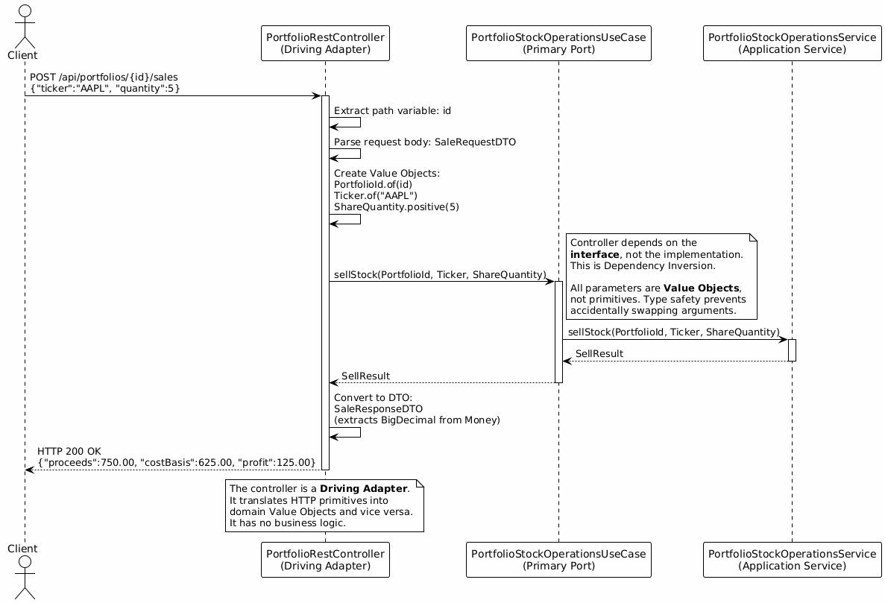
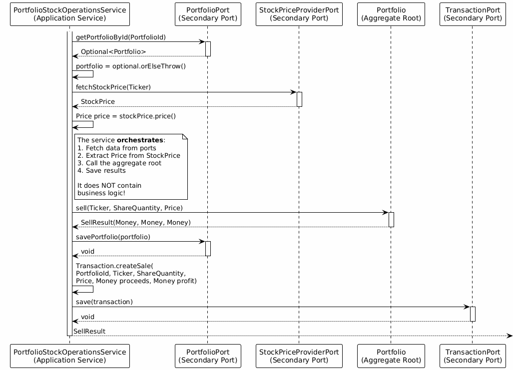
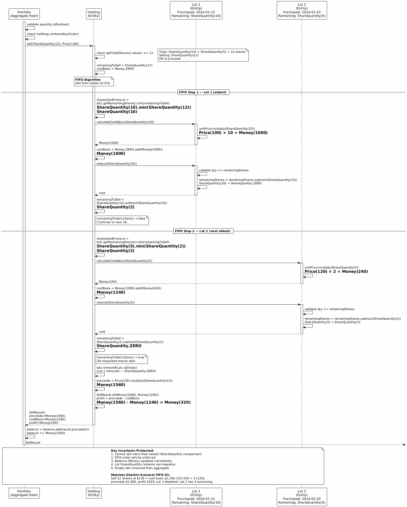
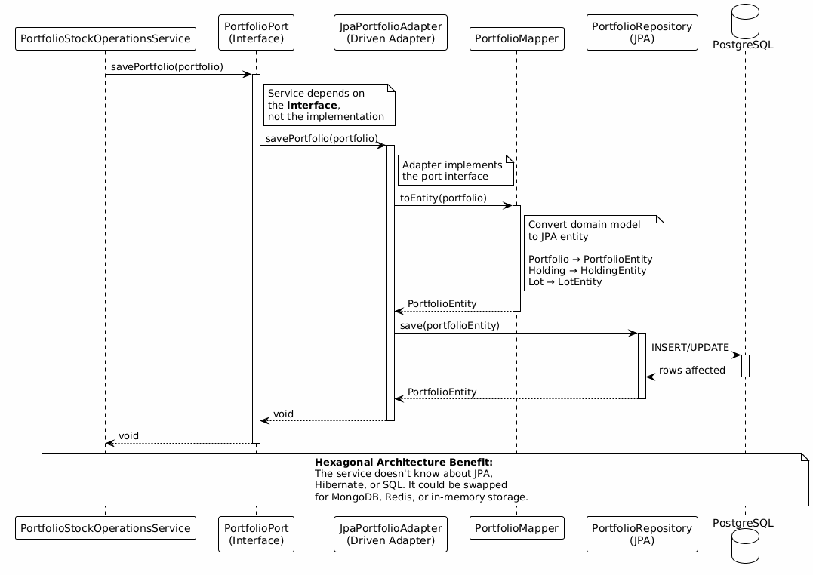
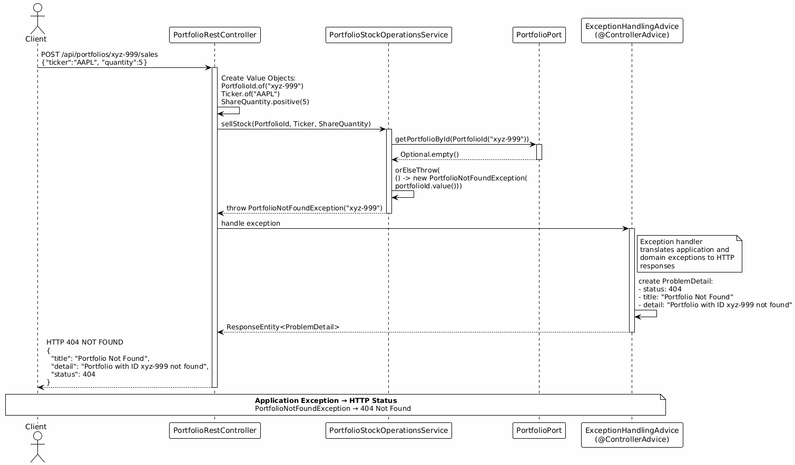
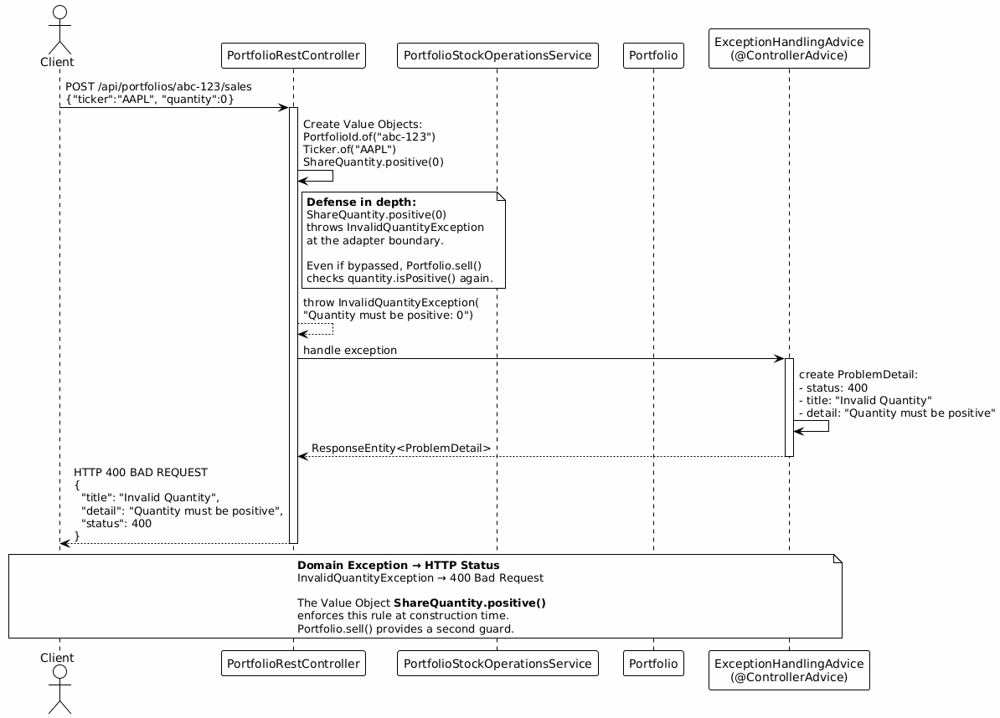
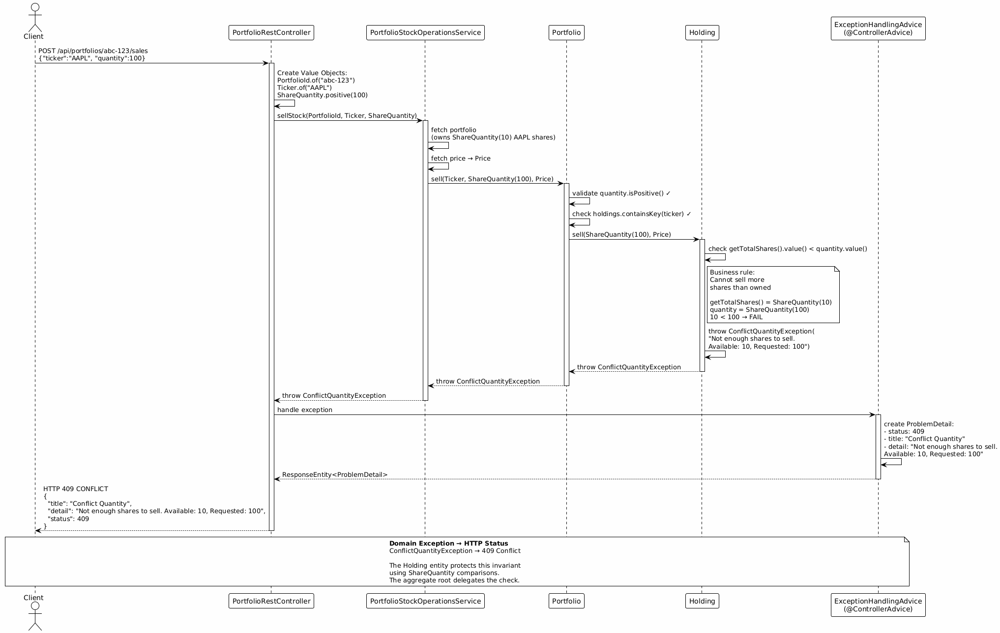

# HexaStock: Engineering Architecture That Grows Stronger Through Change

**A Technical Book on Domain-Driven Design and Hexagonal Architecture in a Financial Domain**

> *"Architecture is not documentation. It is an operational capability."*

---

## About This Book

This book is a comprehensive, code-grounded study of one operation inside HexaStock — a stock portfolio management system built with Java 21, Spring Boot 3, Domain-Driven Design (DDD), and Hexagonal Architecture. It is not a theoretical survey of design patterns. It traces a single use case — **selling stocks** — through every architectural layer, from Gherkin specification to REST controller, through application service orchestration, into the aggregate root's FIFO lot-consumption algorithm, out through persistence adapters, and back as a structured financial result.

The stock-selling use case serves as the narrative spine of the entire book. Every concept explored here — value objects, aggregate boundaries, port interfaces, dependency inversion, concurrency control, error handling, testing strategy — connects back to this central operation. By following one request through the full system, the reader will see how DDD and Hexagonal Architecture function not as abstract principles but as concrete engineering disciplines applied under realistic constraints.

The HexaStock codebase maintains over 150 automated tests, achieves greater than 90% code coverage as measured by JaCoCo, and holds a Sonar AAA maintainability rating. Every test is linked to Gherkin specifications through `@SpecificationRef` annotations, creating a verifiable traceability chain from business requirements to running code.

---

## Intended Audience

This book addresses software engineers, architects, and technical leads who have working knowledge of Java and Spring Boot and want to understand how DDD and Hexagonal Architecture function in practice.

---

## Conventions

- Code listings are drawn from the actual repository source.
- PlantUML diagrams are referenced by their source path under `doc/tutorial/*/diagrams/` and rendered as inline PNG images with SVG click-through links.
- Gherkin scenarios are maintained as canonical `.feature` files under `doc/features/`.
- All financial calculations use `BigDecimal` with scale 2 and `RoundingMode.HALF_UP`.

---

## HexaStock in Brief

### What the System Does

HexaStock is a stock portfolio management platform. The system enables investors to create and manage investment portfolios, deposit and withdraw funds, buy and sell stocks with automatic FIFO lot accounting, track holdings performance with real-time market prices, and view complete transaction history. The platform integrates with external stock price providers (Finnhub, AlphaVantage), persists data through JPA with MySQL, and exposes a RESTful API documented via OpenAPI 3.0.

### Architectural Identity

HexaStock is structured according to two complementary architectural disciplines.

**Domain-Driven Design** provides the modeling methodology. The system's core concepts — `Portfolio`, `Holding`, `Lot`, and `Transaction` — are modeled as aggregates, entities, and value objects that encapsulate business rules and protect invariants. Core business rules and invariants live in the domain model. Application services orchestrate use cases and transactions; controllers and adapters translate at the boundaries.

**Hexagonal Architecture** (Ports and Adapters) provides the structural organization. The domain model has no dependencies on frameworks, databases, or HTTP. It communicates with the outside world exclusively through port interfaces, which are implemented by adapters in the infrastructure layer. All dependencies point inward toward the domain.

### Module Structure: A Deliberate Choice

HexaStock is built as a **Maven multi-module project**. Each module corresponds to a distinct architectural responsibility in the hexagonal model, so the boundaries that a developer reads in a diagram are the same boundaries enforced by the build system.

```
HexaStock (parent pom)
├── domain/                              → Pure business model — no framework dependencies
├── application/                         → Use case orchestration, inbound and outbound ports
├── adapters-inbound-rest/               → Driving adapter: REST controllers, DTOs, error mapping
├── adapters-outbound-persistence-jpa/   → Driven adapter: JPA entities, repositories, mappers
├── adapters-outbound-market/            → Driven adapter: external stock-price provider clients
└── bootstrap/                           → Spring Boot entry point, composition root, runtime wiring
```

**`domain`** contains the framework-independent core: aggregates, entities, value objects, domain exceptions, and business rules. It has no dependency on Spring, JPA, or any infrastructure library. All other modules may depend on `domain`; `domain` depends on nothing outside the JDK.

**`application`** defines the use cases that the system supports. Inbound ports (e.g., `PortfolioStockOperationsUseCase`) declare what the outside world can ask the system to do; outbound ports (e.g., `PortfolioPort`, `StockPriceProviderPort`) declare what the application needs from infrastructure. Application services implement the inbound ports by orchestrating domain objects and outbound ports, without ever referencing a concrete adapter.

**`adapters-inbound-rest`** is the driving adapter layer. It translates HTTP requests into calls on inbound ports and maps domain results back to JSON responses. REST controllers, request/response DTOs, and the global exception-handling advice live here.

**`adapters-outbound-persistence-jpa`** is the driven persistence adapter. It implements the outbound `PortfolioPort` and `TransactionPort` using JPA entities, Spring Data repositories, and bidirectional mappers that convert between domain objects and their database representations.

**`adapters-outbound-market`** is the driven external-service adapter. It implements `StockPriceProviderPort` by integrating with third-party market APIs (Finnhub, AlphaVantage), including a mock adapter for offline development and testing.

**`bootstrap`** is the composition root. It contains `HexaStockApplication`, the Spring Boot entry point that scans all modules and wires ports to their adapter implementations at startup. Configuration classes and runtime profiles live here. No business logic resides in this module — its sole purpose is assembly.

#### Domain organization: business meaning over technical category

Inside the `domain` module, the model is not organized as a flat technical taxonomy (`entity/`, `valueobject/`, `exception/`). Instead, concepts are grouped by **business meaning**:

```
cat.gencat.agaur.hexastock.model
├── portfolio/    → Portfolio aggregate root, Holding, Lot, SellResult, and related exceptions
├── transaction/  → Transaction entity, TransactionId, TransactionType
├── market/       → StockPrice, Ticker, and market-specific exceptions
├── money/        → Money, Price, ShareQuantity, and monetary validation exceptions
```

`Portfolio` is the central aggregate. Its related concepts — `Holding`, `Lot`, `HoldingPerformance`, `SellResult` — live in the same `portfolio` package because they participate in the same consistency boundary. Shared value objects that cross aggregate boundaries (`Money`, `Price`, `ShareQuantity`) are grouped under `money`, and market-related concepts under `market`. This semantic grouping makes navigating the domain intuitive: the package name tells the reader *what business concept* the code belongs to, not merely *what DDD building block* it implements.

#### Why a multi-module structure?

Hexagonal Architecture does not mandate a single filesystem layout. Organizing by feature, by bounded context, or by a combination of both would be equally valid — and often preferable in larger systems with multiple bounded contexts. HexaStock uses module-level separation because its primary audiences — engineers, architects, and teams adopting hexagonal design — benefit most from seeing architectural boundaries enforced physically.

When each layer is a separate Maven module, the compiler itself prevents illegal dependencies: the `domain` module *cannot* import a Spring annotation, and an adapter *cannot* bypass an application port to reach another adapter. This transforms the hexagonal dependency rule from a convention that requires discipline into a constraint that the build enforces automatically. The result is a codebase where the architecture is not just documented — it is structurally guaranteed.

These Maven modules do not represent separate bounded contexts. They are architectural partitions inside the same bounded context, used to make dependency rules explicit and enforceable at build time.

---

## Specification-First Engineering

HexaStock follows a disciplined engineering sequence:

> **Specification → Contract → Tests → Implementation → Refactor Safely**

Behaviour is defined as Gherkin scenarios before any design decisions are made. The REST API is specified contract-first using OpenAPI 3.0. Tests are linked to specifications through `@SpecificationRef` annotations, creating a traceable chain from business requirements to running code. This sequence is not merely aspirational — it is enforced by the repository structure and verified by the test suite.

The sections that follow apply this engineering loop to the sell-stocks use case: starting from the Gherkin specification, moving through domain modeling and architectural reasoning, and arriving at a fully tested, fully traced implementation.

---

## Ubiquitous Language: One Domain Vocabulary Across All Artifacts

### The Concept

Domain-Driven Design is not primarily about technical patterns. It is about aligning software with the business reality it serves. At the centre of this alignment stands **Ubiquitous Language** — the single, shared vocabulary that the development team and domain experts use to describe the model, and that the model, in turn, makes explicit in code.

Eric Evans introduced Ubiquitous Language as a foundational DDD practice: within a bounded context, the same terms should appear in conversation, documentation, diagrams, and source code. A change in the language is a change in the model, and a change in the model is a change in the language — they co-evolve. Vaughn Vernon reinforces that tactical design should embody domain concepts explicitly and consistently, keeping the software focused on the business domain rather than drifting toward purely technical abstractions. Martin Fowler describes Ubiquitous Language as a common, rigorous language shared between developers and domain experts, whose purpose is to remove ambiguity and keep the model grounded in testable conversation.

This is not naming polish. When the same concept is called one thing in a Gherkin scenario, another in a class diagram, and a third in the Java source, the result is not merely confusing — it is a modelling flaw. Inconsistent terminology erodes traceability, slows onboarding, introduces subtle bugs where people believe they are discussing the same thing but are not, and quietly decouples the software from the business it is supposed to represent.

### Why It Matters in a Pedagogical Project

HexaStock is a teaching codebase. Its readers are engineers, architects, and students who will carry the patterns they learn here into production systems. If the project is sloppy with names — using "stock" in one place, "equity" in another, and "position" in a third to mean the same thing — the pedagogical message undermines itself. Conversely, when the same business term appears consistently from specification to diagram to code to test, readers absorb the discipline of Ubiquitous Language by example, not by lecture.

### Ubiquitous Language in the Sell-Stock Use Case

The sell-stock use case illustrates how one vocabulary thread runs through every artifact type in the repository.

**Gherkin specifications** express behaviour in business terms. The canonical scenario in `sell-stocks.feature` speaks of a *portfolio*, *lots* in *purchase order*, *shares*, a *market price*, *FIFO* consumption, *proceeds*, *cost basis*, and *profit*. These are not arbitrary labels — they are the language of portfolio accounting, and they appear here first because behaviour is specified before any design decisions are made.

**Domain classes** embody the same terms operationally. The aggregate root is `Portfolio`. It contains `Holding` entities, each composed of `Lot` instances. The sell operation returns a `SellResult` carrying `proceeds`, `costBasis`, and `profit` — the same three financial concepts named in the Gherkin scenario. Value objects such as `Money`, `Price`, `ShareQuantity`, and `Ticker` replace primitives, making the domain language type-safe and self-documenting. Domain exceptions — `InsufficientFundsException`, `ConflictQuantityException`, `HoldingNotFoundException` — name the business error, not the technical failure mode.

**Application services** preserve the vocabulary at the orchestration layer. `PortfolioStockOperationsService.sellStock(PortfolioId, Ticker, ShareQuantity)` reads as a domain sentence: *sell stock identified by a ticker and a share quantity from a specific portfolio*. The method delegates to `Portfolio.sell(...)`, which in turn delegates to `Holding.sell(...)` — each layer using the same terms, with progressively finer detail.

**UML class diagrams** reflect the domain structure, not persistence or framework concerns. The diagram in section 6 shows `Portfolio`, `Holding`, `Lot`, `Money`, `Price`, `ShareQuantity`, and `SellResult` — the same names the reader has already seen in the Gherkin scenario and will see again in the Java source. A reader who understands the diagram understands the code, because both speak the same language.

**UML sequence diagrams** trace the sell-stock flow through architectural layers. Even when the diagram shows technical interactions — controller calls service, service calls port, port returns aggregate — the operation names are `sellStock`, `sell`, `Portfolio`, `Holding`, `SellResult`. The technical structure is visible, but the domain vocabulary is never displaced by it.

**REST endpoints** translate at the boundary without inventing a separate vocabulary. The endpoint `POST /api/portfolios/{id}/sales` uses the plural *sales* as a resource noun consistent with the domain's `SALE` transaction type. The request DTO carries `ticker` and `quantity`; the response includes `proceeds`, `costBasis`, and `profit`. A domain expert reading the API documentation recognises the terms immediately.

**Tests** describe behaviour in domain language. Test methods are named `shouldSellSharesFromOldestLotFirst` and `shouldSellSharesAcrossMultipleLots` — these are business observations, not implementation details. `@SpecificationRef("US-07.FIFO-1")` ties each test back to a Gherkin scenario, closing the traceability loop with the same vocabulary at every link in the chain.

**Packages** group code by business meaning. The domain module organises concepts under `portfolio/`, `money/`, `market/`, and `transaction/` — reflecting what the code is about, not what DDD building block it implements.

### Cross-Artifact Consistency as a Design Discipline

The following table traces six domain terms across artifact types to show the consistency that Ubiquitous Language demands:

| Domain Term | Gherkin | Class / Type | Method / Field | Test | REST API |
|---|---|---|---|---|---|
| Portfolio | "a portfolio exists" | `Portfolio` | `Portfolio.sell(...)` | `PortfolioTest` | `/api/portfolios/{id}` |
| Holding | "the portfolio holds AAPL" | `Holding` | `Holding.sell(...)` | `HoldingTest` | — |
| Lot | "lots (in purchase order)" | `Lot` | `Lot.reduce(...)` | lot assertions in tests | — |
| Proceeds | "proceeds: 1200.00" | `SellResult` | `result.proceeds()` | `assertEquals(Money.of("1200.00"), result.proceeds())` | `"proceeds"` in JSON |
| Cost Basis | "costBasis: 800.00" | `SellResult` | `result.costBasis()` | `assertEquals(Money.of("800.00"), result.costBasis())` | `"costBasis"` in JSON |
| FIFO | "FIFO Lot Consumption" | algorithm in `Holding` | `sell(quantity, price)` | `shouldSellSharesFromOldestLotFirst` | implicit |

When every row in this table is consistent, the chain from business conversation to running code is unbroken. When a cell drifts — a test calls proceeds "revenue", or a diagram renames Holding to "Position" — the chain weakens, and with it the model's integrity.

### What Goes Wrong Without Ubiquitous Language

Terminology drift is not a cosmetic defect. It is a structural problem with concrete consequences:

- **One term, multiple meanings.** If "transaction" means a financial operation in the domain but a database transaction in the service layer, discussions become ambiguous and bugs become harder to trace.
- **Technical names displacing business names.** If the domain calls the result of a sale `SellResult` but the API calls it `TradeResponse` and the test calls it `saleOutput`, three teams can argue about the same concept without realising they agree.
- **Diagrams diverging from code.** If a class diagram labels a concept differently from the Java source, the diagram becomes unreliable, and developers stop trusting documentation.
- **Tests describing mechanics instead of behaviour.** A test named `testMethod7` or `verifySellServiceCallsRepositorySaveOnce` tells the reader nothing about the business rule being verified, and breaks the traceability chain to the specification.

These are not hypothetical risks. They are the normal degradation path of any codebase that does not treat its vocabulary as a first-class design artifact.

### Language Evolves with the Model

Ubiquitous Language is not frozen at the start of a project. As the team's understanding of the domain deepens — through conversations with domain experts, through collaborative modelling sessions, or through the discovery that a term is ambiguous — the language changes, and the model changes with it. Renaming a class, splitting a concept, or introducing a new term is not rework. It is model refinement, and it should be treated with the same rigour as any other design improvement.

Inside a bounded context, each important term should have one precise meaning. But that meaning may evolve, and the codebase should evolve with it. A healthy Ubiquitous Language is not one that never changes — it is one that changes deliberately, coherently, and across all artifacts at once.

---

## Reading Map: The HexaStock Documentation Ecosystem

This book is not an isolated document. The HexaStock repository contains a constellation of interconnected Markdown texts, each treating a specific architectural theme in depth. Together, they form a coherent body of technical writing that can be read selectively or progressively. The reading map below groups these companion documents by theme so the reader can navigate to deeper treatments of topics introduced in this book.

**Domain-Driven Design**

- [DDD Portfolio and Transactions](../../DDD%20Portfolio%20and%20Transactions.md) — Why Portfolio and Transaction are separate aggregates: aggregate invariants, consistency boundaries, unbounded collection pitfalls, JPA/Hibernate considerations, and a decision matrix grounded in Evans and Vernon.
- [Remove Lots with Zero Remaining Quantity from Portfolio Aggregate](../../Remove%20Lots%20with%20Zero%20Remaining%20Quantity%20from%20Portfolio%20Aggregate.md) — Design decision on whether to retain or prune fully consumed lots from the Portfolio aggregate, with formal analysis based on DDD principles.
- [Rich vs Anemic Domain Model](../richVsAnemicDomainModel/RICH_VS_ANEMIC_DOMAIN_MODEL_TUTORIAL.md) — Rich vs. anemic domain model: a side-by-side architectural comparison using HexaStock's settlement-aware FIFO selling, with failure mode demonstration.

**Hexagonal Architecture and Dependency Inversion**

- [Dependency Inversion in Stock Selling](../DEPENDENCY-INVERSION-STOCK-SELLING.md) — The Dependency Inversion Principle as implemented in the stock-selling service: full execution flow through ports and adapters, with testability and extensibility analysis.

**Concurrency and Persistence**

- [Concurrency Control with Pessimistic Database Locking](../CONCURRENCY-PESSIMISTIC-LOCKING.md) — Pessimistic and optimistic locking, transaction isolation levels, race condition demonstrations with real tests, and Java 21 virtual thread considerations.

**Scalability and Evolution**

- [Holdings Performance at Scale](../portfolioReporting/HOLDINGS-PERFORMANCE-AT-SCALE.md) — Four strategies for holdings performance reporting — from in-memory aggregation to CQRS read models — with engineering decision matrix.
- [Watchlists & Market Sentinel](../watchlists/WATCHLISTS-MARKET-SENTINEL.md) — Automated market monitoring and watchlists with CQRS, progressive domain model evolution, and alert fatigue prevention.

**Domain Extensions**

- [DDD Hexagonal Exercise — Lot Selection Strategies](../DDD-Hexagonal-exercise.md) — Extending lot selection strategies beyond FIFO (LIFO, highest-cost, lowest-cost, specific lot) with Strategy pattern and hexagonal structure.

**API and Specification**

- [Stock Portfolio API Specification](../../stock-portfolio-api-specification.md) — Complete REST API specification for all 10 use cases, RFC 7807 error contract, domain model, and exception mapping.
- [Gherkin Feature Files](../../features/) — Fifteen Gherkin feature files defining executable behavioural specifications for the full system.

**Companion Domain Study**

- [Sell Stock — Domain Layer Only](SELL-STOCK-DOMAIN-TUTORIAL.md) — A focused companion covering only the domain model layer of the sell operation, with no HTTP, persistence, or adapter concerns.

**Requirements Traceability**

- [Tutorial README — Traceability Chain](../README.md) — Architecture of the requirement traceability chain: Specification → Gherkin → Tests → Code, with the sell-stocks use case as the reference pilot.

---

## 1. Architecture Overview (Hexagonal / Ports & Adapters)

Before diving into the execution flow of selling stocks, it's essential to understand the **architectural foundation** that shapes the entire codebase. HexaStock implements **Hexagonal Architecture** (also known as **Ports and Adapters**), a pattern designed to isolate business logic from external dependencies and infrastructure concerns.

### Core Architectural Layers

**Application Core** — The heart of the system, completely isolated from external technologies:
- **Domain Layer:** Contains pure business logic (entities, value objects, domain services). This is where business rules like FIFO accounting, invariant protection, and portfolio consistency are enforced. Examples: `Portfolio`, `Holding`, `Lot`, `Ticker`, `Money`, `Price`, `ShareQuantity`, `PortfolioId`, `HoldingId`, `LotId`.
- **Application Layer:** Orchestrates use cases by coordinating domain objects and ports. Application services are thin coordinators with no business logic—they retrieve data, delegate decisions to the domain, and persist results. Examples: `PortfolioStockOperationsService`.

**Ports** — Interfaces that define contracts between the core and the outside world:
- **Inbound Ports (Primary/Driving):** Define what the application can do. These are use case interfaces implemented by application services. Examples: `PortfolioStockOperationsUseCase`.
- **Outbound Ports (Secondary/Driven):** Define what the application needs from external systems. The core depends on these abstractions, not on concrete implementations. Examples: `PortfolioPort`, `StockPriceProviderPort`, `TransactionPort`.

**Adapters** — Concrete implementations that connect the core to the real world:
- **Inbound Adapters (Driving):** Receive requests from users or external systems and translate them into domain operations. Examples: `PortfolioRestController` (HTTP/REST), potential CLI or messaging adapters.
- **Outbound Adapters (Driven):** Implement outbound ports to interact with databases, external APIs, or other infrastructure. Examples: JPA repositories for persistence, Finnhub/AlphaVantage clients for stock prices.

**Dependency Direction:** All dependencies point **inward** toward the domain. Adapters depend on ports, ports are defined by the core, and the domain has zero dependencies on infrastructure. This is **Dependency Inversion** in action.

### Why This Architecture Matters

Understanding this structure is critical because:
- **Class diagrams** in this book explicitly show domain model entities and their relationships
- **Sequence diagrams** trace execution across architectural boundaries (adapter → port → service → domain)
- **Persistence mapping** explains how the domain model (technology-agnostic) is separated from JPA entities (infrastructure)
- **Transaction management** is placed at the application service level (infrastructure concern), not in the domain (business logic)
- **Error handling** demonstrates how domain exceptions (business language) are translated by adapters into HTTP responses (technical protocol)


> *Image credit:*  
> *The architectural diagram referenced in this book is based on work by **Tom Hombergs**.*  
> *Sources:*  
> *– Article: [Hexagonal Architecture with Java and Spring](https://reflectoring.io/spring-hexagonal/)*  
> *– Reference implementation: [BuckPal – A Hexagonal Architecture Example](https://github.com/thombergs/buckpal)*  
> *Used for educational purposes with proper attribution.*

The diagram above illustrates the core idea of Hexagonal Architecture in a simplified form: a domain-centered system surrounded by ports and adapters. The following diagram provides a more detailed architectural view. It shows how the same principles apply in a richer environment where multiple inbound and outbound ports coexist, and where architectural styles such as DDD, Hexagonal, Onion, and Clean Architecture can be combined. Together, these two diagrams illustrate both the conceptual foundation and a more complete architectural composition.


> *Image credit:*  
> *The architectural diagram referenced in this book is based on work by **Herberto Graça**.*  
> *Source: [Explicit Architecture #01: DDD, Hexagonal, Onion, Clean, CQRS, … How I put it all together](https://herbertograca.com/2017/11/16/explicit-architecture-01-ddd-hexagonal-onion-clean-cqrs-how-i-put-it-all-together/)*  
> *Used for educational purposes with proper attribution.*

### How This Book Maps to the Architecture

The sell stock use case flows through these architectural layers: 

- **Primary (Driving) Adapters** → `PortfolioRestController` in package `adapter.in`
- **Inbound Ports** → `PortfolioStockOperationsUseCase` interface in `application.port.in`
- **Application Layer** → `PortfolioStockOperationsService` orchestrates the use case, manages transaction boundaries, and coordinates between ports
- **Domain Layer** → `Portfolio` (aggregate root), `Holding`, `Lot` (entities), `Ticker`, `Money`, `Price`, `ShareQuantity`, `SellResult`, `PortfolioId`, `HoldingId`, `LotId` (value objects), domain exceptions
- **Outbound Ports** → `PortfolioPort` (persistence abstraction), `StockPriceProviderPort` (external price data), `TransactionPort` (audit log)
- **Secondary (Driven) Adapters** → JPA repositories (`PortfolioJpaAdapter`), external API clients (`FinnhubStockPriceAdapter`, `AlphaVantageStockPriceAdapter`), transaction repositories

Sections 7–13 trace a real HTTP request flowing through these layers, showing how each component fulfils its architectural role while maintaining strict separation of concerns.

---

## 2. Purpose and Scope

This book traces a complete software engineering workflow applied to a real use case in the HexaStock system: **selling stocks from a portfolio**. Starting with observable behaviour, it moves through domain modelling and architectural reasoning, and arrives at a fully traced design with UML diagrams at every stage.

The treatment progresses from specification to design to implementation, showing how each engineering phase feeds into the next. The reader will see:

- How **functional specifications written in Gherkin** capture expected behaviour in business language before any design decisions are made
- How **executable specifications expressed as JUnit tests** validate that behaviour directly against the domain model, with no infrastructure required
- How **Domain-Driven Design (DDD)** shapes the model into aggregates (`Portfolio`, `Holding`, `Lot`) that enforce business invariants at their boundaries
- How the **aggregate root pattern** ensures that all state changes pass through a single consistency boundary, preventing invalid states
- How **Hexagonal Architecture** separates the system into adapters, ports, and domain logic — and why that separation matters for testability and maintainability
- How **application services orchestrate** use cases without containing business logic, while **aggregates decide** and protect invariants
- How **FIFO (First-In-First-Out) accounting** is implemented entirely within the domain model as a core business rule
- How **UML class diagrams** illustrate the domain model's entities, value objects, and their relationships
- How **UML sequence diagrams** trace the sell use case as it flows through each architectural layer — from REST adapter to port to service to aggregate
- How **Value Objects** (`Money`, `Price`, `ShareQuantity`, `Ticker`, `PortfolioId`, `HoldingId`, `LotId`, etc.) replace primitives to enforce domain constraints at construction time and make the [ubiquitous language](#ubiquitous-language-one-domain-vocabulary-across-all-artifacts) explicit in code
- How **domain exceptions** propagate from the aggregate through the application service and are translated by adapters into meaningful HTTP/REST responses

---

## 3. Functional Specification (Behaviour)

Before designing the domain model or writing implementation code, we start by defining the **observable behaviour** of the sell use case.

User stories typically capture the intent of a feature at a high level, but they are often too ambiguous to serve as executable specifications. Behavior-driven scenarios written in formats such as Gherkin describe concrete system behaviour through explicit inputs, actions, and expected outcomes. Because of this precision, automated tests can often be derived directly from Gherkin scenarios. For this reason, this book uses Gherkin scenarios as the primary functional specification of the sell operation.

The Gherkin scenarios below describe what the system must do in business terms, independent of any technical design decisions.

**Source of truth:** [US-07 — Sell Stocks (API Specification)](https://github.com/alfredorueda/HexaStock/blob/main/doc/stock-portfolio-api-specification.md#27-us-07--sell-stocks)

> **Canonical Gherkin:** [`doc/features/sell-stocks.feature`](../../features/sell-stocks.feature) — the scenarios below are reproduced for readability; the `.feature` file is the single source referenced by `@SpecificationRef` annotations in tests.

```gherkin
Feature: Sell Stocks with FIFO Lot Consumption

  Background:
    Given a portfolio exists for owner "Alice"
    And the portfolio holds AAPL with the following lots (in purchase order):
      | Lot # | Shares | Purchase Price |
      |     1 |     10 |        100.00  |
      |     2 |      5 |        120.00  |
    And the current market price for AAPL is 150.00

  Scenario: Selling shares consumed entirely from a single lot
    When I sell 8 shares of AAPL
    Then the sale response contains:
      | Field     | Value   |
      | ticker    | AAPL    |
      | quantity  |       8 |
      | proceeds  | 1200.00 |
      | costBasis |  800.00 |
      | profit    |  400.00 |
    And FIFO consumed 8 shares from Lot #1 at 100.00
    And the AAPL holding lots are now:
      | Lot # | Initial Shares | Remaining Shares | Purchase Price |
      |     1 |             10 |                2 |        100.00  |
      |     2 |              5 |                5 |        120.00  |
    And the portfolio cash balance has increased by 1200.00

  # Calculation breakdown:
  #   FIFO step 1: Lot #1 has 10 remaining → take min(10, 8) = 8 shares
  #                costBasis contribution = 8 × 100.00 = 800.00
  #                Lot #1 remaining: 10 − 8 = 2
  #   Total shares sold: 8 (request fulfilled)
  #   proceeds  = 8 × 150.00  = 1200.00
  #   costBasis = 800.00
  #   profit    = 1200.00 − 800.00 = 400.00

  Scenario: Selling shares consumed across multiple lots
    When I sell 12 shares of AAPL
    Then the sale response contains:
      | Field     | Value   |
      | ticker    | AAPL    |
      | quantity  |      12 |
      | proceeds  | 1800.00 |
      | costBasis | 1240.00 |
      | profit    |  560.00 |
    And FIFO consumed 10 shares from Lot #1 at 100.00 and 2 shares from Lot #2 at 120.00
    And Lot #1 is fully depleted and removed
    And the AAPL holding lots are now:
      | Lot # | Initial Shares | Remaining Shares | Purchase Price |
      |     2 |              5 |                3 |        120.00  |
    And the portfolio cash balance has increased by 1800.00

  # Calculation breakdown:
  #   FIFO step 1: Lot #1 has 10 remaining → take min(10, 12) = 10 shares
  #                costBasis contribution = 10 × 100.00 = 1000.00
  #                Lot #1 remaining: 10 − 10 = 0 → lot is empty, removed
  #                Shares still to sell: 12 − 10 = 2
  #   FIFO step 2: Lot #2 has 5 remaining → take min(5, 2) = 2 shares
  #                costBasis contribution = 2 × 120.00 = 240.00
  #                Lot #2 remaining: 5 − 2 = 3
  #                Shares still to sell: 2 − 2 = 0
  #   Total shares sold: 12 (request fulfilled)
  #   proceeds  = 12 × 150.00 = 1800.00
  #   costBasis = 1000.00 + 240.00 = 1240.00
  #   profit    = 1800.00 − 1240.00 = 560.00
```

---

## 4. Executable Specification (JUnit)

The Gherkin scenarios above describe observable behaviour at the **Portfolio level** — the aggregate root in our DDD model. Because this scenario describes observable behaviour at the `Portfolio` level, the most appropriate primary executable specification validates it through `Portfolio.sell(...)`, while a complementary `Holding` test verifies the internal FIFO algorithm in isolation. This is a deliberate DDD design choice: business behaviour is exposed by the aggregate root, and tests should reflect that boundary.

HexaStock validates this behaviour at **two complementary levels**:

1. **Aggregate-level behaviour verification** — a `Portfolio` test that exercises the complete sell operation through the aggregate root, verifying financial results, balance updates, and FIFO lot consumption as a single consistent unit.
2. **Focused algorithm verification** — a `Holding` test that verifies the internal FIFO lot-consumption algorithm in isolation, independent of portfolio-level concerns like cash balance.

### Primary: Aggregate Root Test (`Portfolio`)

This test is the direct executable translation of the Gherkin scenario. It invokes `Portfolio.sell(...)` exactly as the application service would, and asserts every observable outcome described in the specification: proceeds, cost basis, profit, balance update, and FIFO lot state.

**Test source:** [PortfolioTest.java — shouldSellSharesUsingFIFOThroughPortfolioAggregateRoot_GherkinScenario](https://github.com/alfredorueda/HexaStock/blob/9f52de7b30dd683952b5a1b10ac63c878535444a/src/test/java/cat/gencat/agaur/hexastock/model/PortfolioTest.java#L201)

```java
@Test
@DisplayName("Should sell shares across multiple lots using FIFO through the aggregate root (Gherkin scenario)")
void shouldSellSharesUsingFIFOThroughPortfolioAggregateRoot_GherkinScenario() {
    // Background: a portfolio with sufficient funds to buy AAPL lots
    Price purchasePrice1 = Price.of("100.00");
    Price purchasePrice2 = Price.of("120.00");
    Price marketSellPrice = Price.of("150.00");

    Portfolio fundedPortfolio = new Portfolio(
            PortfolioId.generate(), "Alice", Money.of("10000.00"), LocalDateTime.now());

    // Background: buy 10 shares of AAPL @ 100, then 5 shares @ 120
    fundedPortfolio.buy(APPLE, ShareQuantity.of(10), purchasePrice1);
    fundedPortfolio.buy(APPLE, ShareQuantity.of(5), purchasePrice2);

    Money balanceBeforeSell = fundedPortfolio.getBalance(); // 10000 - 1000 - 600 = 8400

    // When: sell 12 shares of AAPL @ 150 through the aggregate root
    SellResult result = fundedPortfolio.sell(APPLE, ShareQuantity.of(12), marketSellPrice);

    // Then: financial results match Gherkin expectations
    assertEquals(Money.of("1800.00"), result.proceeds());   // 12 × 150
    assertEquals(Money.of("1240.00"), result.costBasis());   // (10 × 100) + (2 × 120)
    assertEquals(Money.of("560.00"), result.profit());       // 1800 − 1240

    // And: portfolio balance increased by proceeds
    assertEquals(balanceBeforeSell.add(Money.of("1800.00")), fundedPortfolio.getBalance());

    // And: FIFO lot consumption — only Lot #2 survives with 3 remaining shares
    Holding aaplHolding = fundedPortfolio.getHolding(APPLE);
    assertEquals(ShareQuantity.of(3), aaplHolding.getTotalShares());
    assertEquals(1, aaplHolding.getLots().size());

    Lot remainingLot = aaplHolding.getLots().getFirst();
    assertEquals(ShareQuantity.of(3), remainingLot.getRemainingShares());
    assertEquals(purchasePrice2, remainingLot.getUnitPrice());
}
```

> **💡 Why test through the aggregate root?** The Gherkin scenario says *"the portfolio cash balance has increased by 1800.00"* — this is a Portfolio-level invariant. Only a test that calls `Portfolio.sell(...)` can verify that the balance update and the FIFO lot consumption happen together atomically and consistently. A `Holding`-level test cannot observe the balance at all.

### Complementary: Internal FIFO Algorithm Test (`Holding`)

HexaStock also contains a more focused domain test at the `Holding` level that verifies the FIFO lot-consumption algorithm in isolation. This lower-level test validates that the internal rule implementation is correct — shares are consumed from the oldest lot first, depleted lots are removed, and cost basis is calculated correctly — without involving portfolio-level concerns such as cash balance management.

**Test source:** [HoldingTest.java — shouldSellSharesAcrossMultipleLots_GherkinScenario](https://github.com/alfredorueda/HexaStock/blob/44fa1ff6e29b79faccb0952a5103475eb4f03061/src/test/java/cat/gencat/agaur/hexastock/model/HoldingTest.java#L181)

```java
@Test
@DisplayName("Should sell shares across multiple lots using FIFO (Gherkin scenario)")
void shouldSellSharesAcrossMultipleLots_GherkinScenario() {
    // Background: buy 10 shares @ 100, then 5 shares @ 120
    holding.buy(ShareQuantity.of(10), PRICE_100);
    holding.buy(ShareQuantity.of(5), PRICE_120);

    // When: sell 12 shares @ 150 (market price from Gherkin)
    SellResult result = holding.sell(ShareQuantity.of(12), PRICE_150);

    // Then: 3 remaining shares, only Lot #2 survives
    assertEquals(ShareQuantity.of(3), holding.getTotalShares());
    assertEquals(1, holding.getLots().size());

    Lot remainingLot = holding.getLots().getFirst();
    assertEquals(ShareQuantity.of(3), remainingLot.getRemainingShares());
    assertEquals(PRICE_120, remainingLot.getUnitPrice());

    // And: financial results match Gherkin expectations
    assertEquals(Money.of("1800.00"), result.proceeds());
    assertEquals(Money.of("1240.00"), result.costBasis());
    assertEquals(Money.of("560.00"), result.profit());
}
```

> **💡 Two levels, one truth:** Both tests verify the same FIFO financial results (proceeds, cost basis, profit). The Portfolio test additionally verifies aggregate consistency (balance update, aggregate encapsulation). The Holding test provides a fast, focused verification of the algorithm itself. Together they form a complete executable specification at the appropriate DDD abstraction levels.

---

## 5. Testing Strategy Overview

HexaStock verifies the sell use case at three complementary testing levels:

1. **Domain algorithm tests** — validate the FIFO lot-consumption logic in isolation (`HoldingTest`)
2. **Aggregate behaviour tests** — validate portfolio invariants and financial consistency through the aggregate root (`PortfolioTest`)
3. **Integration tests** — validate the complete flow through HTTP, application services, persistence, and adapters (`PortfolioTradingRestIntegrationTest`)

The first two levels are introduced in sections 3–4, alongside the functional specification, because they verify domain logic independently of infrastructure. Integration tests appear later in section 16, once the full architecture — controllers, services, ports, adapters, and persistence — has been explained. This ordering reflects the natural direction of design: define behaviour first, model the domain, then verify the entire stack.

---

## 6. Domain Context: What "Selling Stocks" Means in HexaStock

[](diagrams/Rendered/HexaStock%20Domain%20Model.svg)

> **📐 Design note:** In the diagram above, `Portfolio` and `Transaction` are modeled as **separate aggregates**. This is a deliberate DDD design decision — transaction history is kept outside the Portfolio aggregate boundary. The rationale is explained in the companion document [Portfolio and Transaction Aggregates in DDD](https://github.com/alfredorueda/HexaStock/blob/main/doc/DDD%20Portfolio%20and%20Transactions.md).

In this system:

- A **Portfolio** represents an investor's account containing cash (`Money`) and stock holdings
- A **Holding** tracks all shares owned for a specific stock ticker (e.g., `Ticker.of("AAPL")`)
- A **Lot** represents a single purchase transaction—a batch of shares (`ShareQuantity`) bought at a specific price (`Price`) and time
- **FIFO (First-In-First-Out)** accounting is used: when selling, the oldest lots are sold first
- A **Transaction** record is created for every financial activity (deposit, withdrawal, purchase, sale)

When you sell stocks in HexaStock:
1. The system fetches the current market price (returned as a `StockPrice` containing a `Price` value object)
2. It applies FIFO to determine which lots to draw from
3. It calculates proceeds (`Money` received), cost basis (`Money` originally paid), and profit/loss (`Money`)
4. It updates the portfolio's cash balance (`Money`) and holdings
5. It records a transaction for audit purposes

> **💡 Why Value Objects?**
> The domain uses `Money`, `Price`, `ShareQuantity`, `Ticker`, `PortfolioId`, `HoldingId`, and `LotId` instead of primitives (`BigDecimal`, `int`, `String`). This eliminates an entire class of bugs (e.g., passing a quantity where a price is expected), enforces validation at construction time, and makes the code self-documenting through the [ubiquitous language](#ubiquitous-language-one-domain-vocabulary-across-all-artifacts).

> **📖 Architectural perspective:** The fact that `Portfolio`, `Holding`, and `Lot` contain behaviour — not just data — is a deliberate design choice known as a **rich domain model**. To understand how this design compares to an anemic alternative where entities are plain data holders, see **[Rich vs Anemic Domain Model](../richVsAnemicDomainModel/RICH_VS_ANEMIC_DOMAIN_MODEL_TUTORIAL.md)**.

---

## 7. The REST Entry Point of the SELL Use Case

**File:** `src/main/java/cat/gencat/agaur/hexastock/adapter/in/PortfolioRestController.java`

**Endpoint:** `POST /api/portfolios/{id}/sales`

```java
@PostMapping("/{id}/sales")
public ResponseEntity<SaleResponseDTO> sellStock(@PathVariable String id,
                                                 @RequestBody SaleRequestDTO request) {
    SellResult result =
            portfolioStockOperationsUseCase.sellStock(
                    PortfolioId.of(id),
                    Ticker.of(request.ticker()),
                    ShareQuantity.positive(request.quantity()));
    return ResponseEntity
            .ok(new SaleResponseDTO(id, request.ticker(), request.quantity(), result));
}
```

**Request Body Example:**
```json
{
  "ticker": "AAPL",
  "quantity": 5
}
```

**Why This Is a Driving Adapter:**
- It receives HTTP requests from the outside world
- It **depends on the inbound port** (`PortfolioStockOperationsUseCase`), **not** on the implementation
- It converts HTTP-specific data (JSON, path variables) into **Value Objects** (`PortfolioId.of(id)`, `Ticker.of(...)`, `ShareQuantity.positive(...)`)
- It converts domain results (`SellResult`) into DTOs (`SaleResponseDTO`)
- It handles HTTP concerns (status codes, response entities)

> **💡 Boundary mapping:** Notice how the controller is the **translation layer** between the external world (primitives in JSON/path) and the domain world (Value Objects). The DTO `SaleRequestDTO(String ticker, int quantity)` uses primitives because JSON is a primitive format. The controller immediately wraps these into `Ticker`, `ShareQuantity`, and `PortfolioId` before crossing into the application core. `ShareQuantity.positive(...)` rejects zero or negative values at the boundary.

This controller **drives** the application by calling its use cases. It does not contain business logic.

[](diagrams/Rendered/sell-http-to-port.svg)

This controller represents the REST entry point of the SELL use case into the application core. Before tracing how a request flows through the system step by step, the next section presents the architectural map of the components involved in this use case.

---

## 8. Hexagonal Architecture Map for the SELL Use Case

Here is the complete architecture trace for selling stocks:

| Layer | Component | Type | Package/Class |
|-------|-----------|------|---------------|
| **Driving Adapter** | REST Controller | HTTP → Application | `adapter.in.PortfolioRestController` |
| **Primary Port** | Inbound Interface | Use Case Definition | `application.port.in.PortfolioStockOperationsUseCase` |
| **Application Service** | Orchestrator | Use Case Implementation | `application.service.PortfolioStockOperationsService` |
| **Domain Model** | Aggregate Root | Business Logic | `model.Portfolio` |
| **Domain Model** | Entity | Business Logic | `model.Holding` |
| **Domain Model** | Entity | Business Logic | `model.Lot` |
| **Domain Model** | Value Objects | Type Safety & Validation | `model.Money`, `model.Price`, `model.ShareQuantity`, `model.Ticker`, `model.PortfolioId`, `model.HoldingId`, `model.LotId`, `model.SellResult` |
| **Secondary Port** | Outbound Interface | Persistence Contract | `application.port.out.PortfolioPort` |
| **Secondary Port** | Outbound Interface | Price Provider Contract | `application.port.out.StockPriceProviderPort` |
| **Secondary Port** | Outbound Interface | Transaction Storage Contract | `application.port.out.TransactionPort` |
| **Driven Adapters** | JPA Repositories | Application → Database | `adapter.out.jpa.*` |

**Diagram Reference:** See [`diagrams/sell-http-to-port.puml`](diagrams/sell-http-to-port.puml)

---

## 9. Execution Trace of the SELL Use Case (Happy Path)

Now that we have seen both the entry point and the architectural components involved, we can trace how a sell request moves through the system step by step.

### Step 1: Controller Receives Request

The `PortfolioRestController` receives:
```json
POST /api/portfolios/abc-123/sales
{
  "ticker": "AAPL",
  "quantity": 5
}
```

It extracts:
- Portfolio ID: `"abc-123"` (from path) → wrapped as `PortfolioId.of("abc-123")`
- Ticker: `"AAPL"` (from request body) → wrapped as `Ticker.of("AAPL")`
- Quantity: `5` (from request body) → wrapped as `ShareQuantity.positive(5)`

### Step 2: Controller Calls Inbound Port

```java
SellResult result = portfolioStockOperationsUseCase.sellStock(
    PortfolioId.of(id),
    Ticker.of(request.ticker()),
    ShareQuantity.positive(request.quantity())
);
```

The controller calls the **use case interface**, not a concrete class. This is dependency inversion in action. Notice how all parameters are **Value Objects**, not primitives—the type system prevents accidentally swapping a portfolio ID for a ticker.

### Step 3: Application Service Orchestrates

**File:** `application.service.PortfolioStockOperationsService`

```java
@Override
public SellResult sellStock(PortfolioId portfolioId, Ticker ticker, ShareQuantity quantity) {
    // 1. Retrieve portfolio from persistence
    Portfolio portfolio = portfolioPort.getPortfolioById(portfolioId)
        .orElseThrow(() -> new PortfolioNotFoundException(portfolioId.value()));

    // 2. Fetch current stock price from external provider
    StockPrice stockPrice = stockPriceProviderPort.fetchStockPrice(ticker);
    Price price = stockPrice.price();

    // 3. Delegate to domain model (AGGREGATE ROOT)
    SellResult sellResult = portfolio.sell(ticker, quantity, price);

    // 4. Persist updated portfolio
    portfolioPort.savePortfolio(portfolio);

    // 5. Record transaction for audit
    Transaction transaction = Transaction.createSale(
        portfolioId, ticker, quantity, price,
        sellResult.proceeds(), sellResult.profit()
    );
    transactionPort.save(transaction);

    return sellResult;
}
```

**Notice what the service does:**
- ✅ Retrieves data from adapters (using `PortfolioId`, `Ticker` value objects)
- ✅ Extracts the `Price` from the `StockPrice` returned by the provider
- ✅ Calls the aggregate root with Value Objects (`Ticker`, `ShareQuantity`, `Price`)
- ✅ Coordinates persistence
- ❌ Does **NOT** contain domain rules
- ❌ Does **NOT** manipulate nested entities directly

**Diagram Reference:** See [`diagrams/sell-application-service.puml`](diagrams/sell-application-service.puml)

[](diagrams/Rendered/sell-application-service.svg)

### Step 4: Domain Model Enforces Invariants

**File:** `model.Portfolio`

```java
public SellResult sell(Ticker ticker, ShareQuantity quantity, Price price) {
    if (!quantity.isPositive())
        throw new InvalidQuantityException("Quantity must be positive");

    if (!holdings.containsKey(ticker))
        throw new HoldingNotFoundException("Holding not found in portfolio: " + ticker);

    Holding holding = holdings.get(ticker);
    SellResult result = holding.sell(quantity, price);
    balance = balance.add(result.proceeds());

    return result;
}
```

The Portfolio (aggregate root):
- Validates inputs using Value Object methods (`quantity.isPositive()`)
- Protects the invariant: "You can only sell holdings you own"
- Delegates to the Holding entity
- Updates its own cash balance (`Money`)
- Returns the result (`SellResult`)

> **💡 Value Object validation:** Much of the validation that used to be manual (`if (quantity <= 0)`) is now built into the Value Objects themselves. `ShareQuantity` rejects negative values at construction time. `Price` rejects non-positive values at construction time. The domain methods provide an additional layer of protection for business-level invariants.

**File:** `model.Holding`

```java
public SellResult sell(ShareQuantity quantity, Price sellPrice) {
    if (getTotalShares().value() < quantity.value()) {
        throw new ConflictQuantityException(
                "Not enough shares to sell. Available: " + getTotalShares()
                + ", Requested: " + quantity);
    }

    ShareQuantity remainingToSell = quantity;
    Money costBasis = Money.ZERO;

    // FIFO: Sell from oldest lots first
    for (var lot : lots) {
        if (remainingToSell.isZero()) break;

        ShareQuantity sharesSoldFromLot = lot.getRemainingShares().min(remainingToSell);
        Money lotCostBasis = lot.calculateCostBasis(sharesSoldFromLot);
        costBasis = costBasis.add(lotCostBasis);

        lot.reduce(sharesSoldFromLot);
        remainingToSell = remainingToSell.subtract(sharesSoldFromLot);
    }

    lots.removeIf(Lot::isEmpty);

    Money proceeds = sellPrice.multiply(quantity);
    return SellResult.of(proceeds, costBasis);
}
```

The Holding:
- Protects the invariant: "You cannot sell more shares than you own" (comparing `ShareQuantity` values)
- Implements FIFO across multiple lots using `ShareQuantity.min()` for clean lot-by-lot iteration
- Delegates cost basis calculation to each `Lot` via `lot.calculateCostBasis(sharesSoldFromLot)`
- Calculates proceeds using `Price.multiply(ShareQuantity)` → returns `Money`
- Creates the result via `SellResult.of(proceeds, costBasis)` which auto-calculates profit
- Removes depleted lots (`lots.removeIf(Lot::isEmpty)`) to keep the aggregate lean

**File:** `model.Lot`

```java
public void reduce(ShareQuantity quantity) {
    if (quantity.value() > remainingShares.value()) {
        throw new ConflictQuantityException("Cannot reduce by more than remaining quantity");
    }
    remainingShares = remainingShares.subtract(quantity);
}

public Money calculateCostBasis(ShareQuantity quantity) {
    return unitPrice.multiply(quantity);
}
```

The Lot:
- Protects the invariant: "Remaining shares cannot go negative"
- Updates its remaining quantity using `ShareQuantity.subtract()`
- Calculates cost basis using `Price.multiply(ShareQuantity)` → returns `Money`

**Diagram Reference:** See [`diagrams/sell-domain-fifo.puml`](diagrams/sell-domain-fifo.puml)

[](diagrams/Rendered/sell-domain-fifo.svg)

### Step 5: Persistence Adapter Saves Changes

The `PortfolioPort` implementation (a JPA adapter) converts the domain `Portfolio` into JPA entities and persists them.

**Diagram Reference:** See [`diagrams/sell-persistence-adapter.puml`](diagrams/sell-persistence-adapter.puml)

[](diagrams/Rendered/sell-persistence-adapter.svg)

### Step 6: Response Returns to Client

The controller wraps the `SellResult` in a DTO and returns:

```json
HTTP 200 OK
{
  "portfolioId": "abc-123",
  "ticker": "AAPL",
  "quantity": 5,
  "proceeds": 750.00,
  "costBasis": 625.00,
  "profit": 125.00
}
```

> **💡 DTO mapping:** The `SaleResponseDTO` constructor accepts the domain `SellResult` and extracts the raw `BigDecimal` values from `Money` via `.amount()` for JSON serialization. This keeps the boundary clean: Value Objects inside the hexagon, primitives outside.

---

## 10. Why Application Services Orchestrate and Aggregates Protect Invariants

This is the **most important concept** in DDD and Hexagonal Architecture.

### A) Roles Explained with Real Code

**Inbound Port (Contract):**

```java
// application.port.in.PortfolioStockOperationsUseCase
public interface PortfolioStockOperationsUseCase {
    SellResult sellStock(PortfolioId portfolioId, Ticker ticker, ShareQuantity quantity);
}
```

This interface defines **what** the application can do, not **how**. The port speaks the domain's ubiquitous language through Value Objects (`PortfolioId`, `Ticker`, `ShareQuantity`) instead of primitives.

**Application Service (Orchestrator):** The full service code was shown in Section 9, Step 3. Here it is again for reference, with role annotations:

```java
// application.service.PortfolioStockOperationsService
@Transactional
public class PortfolioStockOperationsService
    implements PortfolioStockOperationsUseCase {

    private final PortfolioPort portfolioPort;
    private final StockPriceProviderPort stockPriceProviderPort;
    private final TransactionPort transactionPort;

    @Override
    public SellResult sellStock(PortfolioId portfolioId, Ticker ticker, ShareQuantity quantity) {
        Portfolio portfolio = portfolioPort.getPortfolioById(portfolioId)
            .orElseThrow(() -> new PortfolioNotFoundException(portfolioId.value()));

        StockPrice stockPrice = stockPriceProviderPort.fetchStockPrice(ticker);
        Price price = stockPrice.price();

        SellResult sellResult = portfolio.sell(ticker, quantity, price);

        portfolioPort.savePortfolio(portfolio);

        Transaction transaction = Transaction.createSale(
            portfolioId, ticker, quantity, price,
            sellResult.proceeds(), sellResult.profit());
        transactionPort.save(transaction);

        return sellResult;
    }
}
```

**Role:** The service is a **director of orchestra** — it retrieves, delegates, and persists, but never decides. It does **not** validate quantities, check holdings, implement FIFO, calculate profits, or update lots directly.

**Aggregate Root (Decision Maker):** As seen in Section 9, Step 4:

```java
// model.Portfolio
public SellResult sell(Ticker ticker, ShareQuantity quantity, Price price) {
    if (!quantity.isPositive())
        throw new InvalidQuantityException("Quantity must be positive");
    if (!holdings.containsKey(ticker))
        throw new HoldingNotFoundException("Holding not found");

    Holding holding = holdings.get(ticker);
    SellResult result = holding.sell(quantity, price);
    balance = balance.add(result.proceeds());

    return result;
}
```

**Role:** The aggregate root is the **guardian of invariants** — it validates, delegates to controlled entities, updates balance consistently, and returns a complete result.

---

### B) Concrete Domain Example: Why Direct Manipulation Breaks Invariants

#### ❌ **Anti-Pattern: Service Manipulating Nested Entities Directly**

Imagine if the application service did this:

```java
// WRONG! DO NOT DO THIS!
@Override
public SellResult sellStock(PortfolioId portfolioId, Ticker ticker, ShareQuantity quantity) {
    Portfolio portfolio = portfolioPort.getPortfolioById(portfolioId).orElseThrow();

    Holding holding = portfolio.getHoldings().stream()
        .filter(h -> h.getTicker().equals(ticker))
        .findFirst()
        .orElseThrow();

    // Service directly manipulates lots - DANGEROUS!
    ShareQuantity remaining = quantity;
    for (Lot lot : holding.getLots()) {
        if (remaining.isPositive()) {
            ShareQuantity toSell = lot.getRemainingShares().min(remaining);
            lot.reduce(toSell);  // Direct manipulation!
            remaining = remaining.subtract(toSell);
        }
    }

    // Update balance - might be inconsistent!
    Money someAmount = Price.of(150).multiply(quantity);
    portfolio.deposit(someAmount); // WRONG way to add proceeds!

    portfolioPort.savePortfolio(portfolio);
}
```

**What breaks:**

1. **FIFO Logic Duplication:** The FIFO algorithm is now in the service, not in the domain. If business rules change (e.g., switch to LIFO), you must change the service, not the domain model.

2. **Invariant Violation Risk:** What if the service forgets to check `getTotalShares().value() < quantity.value()`? The portfolio would be in an invalid state.

3. **Balance Inconsistency:** What if the balance update logic doesn't match the actual proceeds calculation? The portfolio becomes corrupted.

4. **No Central Enforcement:** If another use case (e.g., "bulk sell") also needs to sell stocks, it must duplicate all validation and calculation logic.

5. **Testability:** You now need integration tests to verify FIFO works correctly. With the current design, you can unit-test `Holding.sell()` in isolation.

#### ✅ **Correct Pattern: Aggregate Root Protects Invariants**

In the real code:

```java
// Application service: simple orchestration
SellResult sellResult = portfolio.sell(ticker, quantity, price);
```

The `Portfolio` aggregate:
- **Validates** inputs using Value Object methods
- **Checks** holdings exist
- **Delegates** to `Holding` (which it controls)
- **Updates** balance consistently with `Money.add()`
- **Returns** a complete `SellResult`

**Benefits:**
- All domain rules are in **one place** (the domain model)
- The service cannot corrupt the portfolio state
- Tests can verify invariants in isolation
- Business logic changes are localized

---

### C) Sequence Diagram: Orchestrator vs Aggregate Root

**Diagram Reference:** See [`diagrams/sell-orchestrator-vs-aggregate.puml`](diagrams/sell-orchestrator-vs-aggregate.puml)

This diagram explicitly shows:
- The **Application Service** calling `Portfolio.sell(Ticker, ShareQuantity, Price)` (aggregate root)
- The **Portfolio** calling `Holding.sell(ShareQuantity, Price)` (controlled entity)
- The **Holding** calling `Lot.reduce(ShareQuantity)` (controlled entity)
- **NO** direct service → Holding communication
- **NO** direct service → Lot communication

---

### D) Design Principle

> **💡 Key Principle**
>
> **Application services coordinate; aggregates decide.**
>
> The application service is a **traffic controller**. It fetches data, calls the aggregate, and saves results. It does not make business decisions.
>
> The aggregate root is a **consistency boundary**. All changes to entities within the aggregate must go through the root. This ensures invariants are never violated.
>
> **Value Objects** reinforce this boundary by making the types expressive. You cannot accidentally pass a `ShareQuantity` where a `Price` is expected—the compiler catches it.

> **📖 Deep Dive: Rich vs Anemic Domain Model**
>
> The separation above — aggregates enforcing invariants while services only orchestrate — is the defining characteristic of a **rich domain model**. In an anemic model, the aggregate becomes a passive data carrier and the business rules migrate into the service layer. For a detailed architectural comparison using HexaStock's own sell flow, see the companion study **[Rich vs Anemic Domain Model](../richVsAnemicDomainModel/RICH_VS_ANEMIC_DOMAIN_MODEL_TUTORIAL.md)**.

---

## 11. Transactionality and Consistency

The application service is annotated with `@Transactional`:

```java
@Transactional
public class PortfolioStockOperationsService
    implements PortfolioStockOperationsUseCase {
    // ...
}
```

### Why Transactions Matter for Stock Selling

Selling stocks involves multiple database writes — updating the portfolio balance, reducing lot quantities via FIFO, and recording an audit transaction. These must **all succeed or all fail together**; partial updates would corrupt the portfolio state. Spring's `@Transactional` ensures ACID guarantees:

1. **Atomicity:** All database operations succeed or fail together
2. **Consistency:** If the transaction record fails to save, the portfolio changes are rolled back
3. **Isolation:** Concurrent sells on the same portfolio are serialized (preventing race conditions)
4. **Durability:** Once committed, the sale is permanent

**Key separation of concerns:** The domain enforces **business consistency** (invariants, validations via Value Objects), while infrastructure enforces **technical consistency** (ACID properties, transaction boundaries).

### Concurrency Risks in Financial Operations

When concurrent requests target the same portfolio, several problems can arise without proper synchronization:

**Lost Update Problem:**
- Request 1 reads balance = `Money.of(1000)`
- Request 2 reads balance = `Money.of(1000)` (stale)
- Request 1 sells stock, adds proceeds → balance = `Money.of(1500)`, commits
- Request 2 sells stock, adds proceeds → calculates `Money.of(1300)` based on stale read, commits
- **Result:** Final balance is $1300, but should be $1800.

**Double-Spending:**
- Both requests read `ShareQuantity.of(10)` available
- Request 1 sells 10 shares and commits
- Request 2 attempts to sell 10 shares, but only `ShareQuantity.ZERO` remain

**FIFO Corruption:**
- Two concurrent sells attempt to reduce the same lot simultaneously
- Without serialization, lot `ShareQuantity` values could become negative

### How HexaStock Handles Concurrency

HexaStock uses **database-level transaction isolation**:

- `@Transactional` establishes the boundary at the application service level
- Database isolation (typically READ_COMMITTED or higher) ensures consistent snapshots
- For high-contention scenarios, **pessimistic locking** via `@Lock(LockModeType.PESSIMISTIC_WRITE)` serializes access to specific portfolio rows

The transaction boundary is placed at the **application service** — not the domain model — because transaction management is an infrastructure concern and domain objects should remain technology-agnostic.

---

> **📖 Deep Dive: Concurrency and Locking**
>
> This book focuses on the architectural and domain design aspects of stock selling. For a **detailed explanation of concurrency control mechanisms**, including:
> - Pessimistic locking with `SELECT ... FOR UPDATE`
> - Optimistic locking with version fields
> - Transaction isolation levels and their trade-offs
> - Race condition demonstrations with real tests
> - When to use which strategy in production financial systems
>
> See the companion study: **[Concurrency Control with Pessimistic Database Locking](CONCURRENCY-PESSIMISTIC-LOCKING.md)**

---

## 12. Persistence Mapping

### Domain Model → JPA Entities

The `Portfolio` domain object is mapped to a `PortfolioEntity` (JPA):
- `Portfolio.id` (`PortfolioId`) → `PortfolioEntity.id` (`String`)
- `Portfolio.balance` (`Money`) → `PortfolioEntity.balance` (`BigDecimal`)
- `Portfolio.holdings` (`Map<Ticker, Holding>`) → `PortfolioEntity.holdings` (one-to-many)

A **mapper** converts between the two, extracting primitive values from Value Objects for persistence and re-wrapping them when loading:

```java
Portfolio domainPortfolio = PortfolioMapper.toDomain(portfolioEntity);
PortfolioEntity jpaEntity = PortfolioMapper.toEntity(domainPortfolio);
```

### Repositories

- `PortfolioRepository` (JPA) implements `PortfolioPort` (domain interface)
- `TransactionRepository` (JPA) implements `TransactionPort` (domain interface)

The persistence layer deals with primitives (`String`, `BigDecimal`, `int`), while the domain layer uses Value Objects. The mapper handles the translation — this is Dependency Inversion as described in Section 1.

**Diagram Reference:** See [`diagrams/sell-persistence-adapter.puml`](diagrams/sell-persistence-adapter.puml)

[](diagrams/Rendered/sell-persistence-adapter.svg)

---

## 13. Error Flows

### Error 1: Portfolio Not Found

**Trigger:** Selling from a non-existent portfolio

**Exception:** `PortfolioNotFoundException` (domain exception)

**Code:**

```java
Portfolio portfolio = portfolioPort.getPortfolioById(portfolioId)
    .orElseThrow(() -> new PortfolioNotFoundException(portfolioId.value()));
```

**HTTP Response:**

```json
HTTP 404 Not Found
{
  "title": "Portfolio Not Found",
  "detail": "Portfolio with ID abc-123 not found",
  "status": 404
}
```

**Exception Handler:** The `@RestControllerAdvice` class catches `PortfolioNotFoundException` and converts it to HTTP 404.

**Diagram Reference:** See [`diagrams/sell-error-portfolio-not-found.puml`](diagrams/sell-error-portfolio-not-found.puml)

[](diagrams/Rendered/sell-error-portfolio-not-found.svg)

---

### Error 2: Invalid Quantity

**Trigger:** Selling zero or negative shares

**Exception:** `InvalidQuantityException` (domain exception)

**Code:**

```java
// In the controller, ShareQuantity.positive() rejects non-positive values:
ShareQuantity.positive(request.quantity())
// → throws InvalidQuantityException("Quantity must be positive: 0")

// In Portfolio.sell(), an additional guard:
if (!quantity.isPositive())
    throw new InvalidQuantityException("Quantity must be positive");
```

> **💡 Defense in depth:** The `ShareQuantity.positive()` factory method validates at the adapter boundary, and `Portfolio.sell()` validates again inside the domain. This layered approach ensures protection even if a caller bypasses the controller.

**HTTP Response:**

```json
HTTP 400 Bad Request
{
  "title": "Invalid Quantity",
  "detail": "Quantity must be positive",
  "status": 400
}
```

**Diagram Reference:** See [`diagrams/sell-error-invalid-quantity.puml`](diagrams/sell-error-invalid-quantity.puml)

[](diagrams/Rendered/sell-error-invalid-quantity.svg)

---

### Error 3: Selling More Than Owned

**Trigger:** Trying to sell 100 shares when you only own 10

**Exception:** `ConflictQuantityException` (domain exception)

**Code:**

```java
// In Holding.sell()
if (getTotalShares().value() < quantity.value()) {
    throw new ConflictQuantityException(
            "Not enough shares to sell. Available: " + getTotalShares()
            + ", Requested: " + quantity);
}
```

**HTTP Response:**

```json
HTTP 409 Conflict
{
  "title": "Conflict Quantity",
  "detail": "Not enough shares to sell. Available: 10, Requested: 100",
  "status": 409
}
```

**Diagram Reference:** See [`diagrams/sell-error-sell-more-than-owned.puml`](diagrams/sell-error-sell-more-than-owned.puml)

[](diagrams/Rendered/sell-error-sell-more-than-owned.svg)

---

## 14. Key Takeaways

### Hexagonal Architecture

- **Ports define contracts** between the core and infrastructure — adapters implement them.
- **Adapters are replaceable** without modifying domain or application code (e.g., swap Finnhub for AlphaVantage).
- **Dependencies point inward** — adapters depend on ports, never the reverse.
- **Testability follows naturally** — the domain can be tested with no infrastructure at all.

### Domain-Driven Design

- **Aggregates protect invariants** — in HexaStock, `Portfolio` is the chosen aggregate root for this consistency boundary, so all state changes to `Holding` and `Lot` are coordinated through `Portfolio`.
- **Application services orchestrate** — they coordinate use cases without containing business logic.
- **Value Objects eliminate primitive obsession** — types like `Money`, `Price`, `ShareQuantity`, `Ticker`, and `PortfolioId` enforce constraints at construction time and make the ubiquitous language explicit.
- **Business rules live in the domain** — FIFO logic belongs in `Holding.sell()`, not in a service or adapter. The companion **[Rich vs Anemic Domain Model study](../richVsAnemicDomainModel/RICH_VS_ANEMIC_DOMAIN_MODEL_TUTORIAL.md)** shows what happens when this logic is moved to the service layer.
- **Domain exceptions speak business language** — `ConflictQuantityException` represents a business rule violation, not a technical error.

---

## 15. Summary: The Complete Sell Flow

```
HTTP Request
    ↓
PortfolioRestController (Driving Adapter)
    ↓ maps primitives to Value Objects:
    │   PortfolioId.of(id), Ticker.of(ticker), ShareQuantity.positive(quantity)
    ↓ calls
PortfolioStockOperationsUseCase (Primary Port / Interface)
    ↓ implemented by
PortfolioStockOperationsService (Application Service)
    ↓ uses
PortfolioPort (Secondary Port) → fetch portfolio by PortfolioId
StockPriceProviderPort (Secondary Port) → fetch StockPrice (contains Price)
    ↓ delegates to
Portfolio.sell(Ticker, ShareQuantity, Price) (Aggregate Root - Domain Logic)
    ↓ delegates to
Holding.sell(ShareQuantity, Price) (Entity - Domain Logic)
    ↓ delegates to
Lot.reduce(ShareQuantity) (Entity - Domain Logic)
    ↓ returns
SellResult (Value Object: Money proceeds, Money costBasis, Money profit)
    ↓ service saves
PortfolioPort.savePortfolio() (Secondary Port)
TransactionPort.save() (Secondary Port)
    ↓ implemented by
JPA Repositories (Driven Adapters)
    ↓ returns
HTTP Response (SaleResponseDTO — primitives extracted from Value Objects)
```

---

## 16. Integration Testing: Verifying the Sell Use Case End-to-End

The domain-level tests in sections 3–4 verify that the FIFO algorithm and aggregate invariants are correct **in isolation**. But as outlined in the testing strategy (Section 5), a fully working system also requires that all layers collaborate correctly through real HTTP calls and a real database. This is the role of the **REST integration tests**.

### Why Integration Tests Matter

Domain unit tests catch **algorithm bugs** (wrong FIFO order, incorrect cost basis calculation). Integration tests catch **wiring and infrastructure bugs**:

- JSON serialization/deserialization: Does the `SaleResponseDTO` correctly expose `proceeds`, `costBasis`, and `profit`?
- HTTP status codes: Does a sell on a non-existent portfolio return `404`?
- Persistence round-tripping: Are lots correctly saved and reloaded after a partial sell?
- Value Object ↔ primitive mapping: Does `ShareQuantity.of(12)` arrive correctly at the domain layer from the REST endpoint?
- Adapter substitution: Can we **swap the stock price adapter** at test time without changing any domain or application code?

### Test Architecture: One Abstract Base, Three Focused Test Classes

The integration tests follow a **split-by-responsibility** structure that mirrors the hexagonal architecture:

| Test Class | Responsibility | Key Scenarios |
|---|---|---|
| `AbstractPortfolioRestIntegrationTest` | Shared infrastructure: Testcontainers, RestAssured, JSON builders, helper methods | (base class — not executed directly) |
| `PortfolioLifecycleRestIntegrationTest` | Portfolio CRUD, deposits, withdrawals, listing | Create, deposit, withdraw, list all portfolios |
| `PortfolioTradingRestIntegrationTest` | Buy, sell, end-to-end trading, **Gherkin FIFO** | Buy/sell happy paths, error paths, FIFO scenarios |
| `PortfolioErrorHandlingRestIntegrationTest` | 404s on non-existent portfolios | Buy/sell/deposit/withdraw/get on missing portfolio |

**Source:** `src/test/java/cat/gencat/agaur/hexastock/adapter/in/`

### Hexagonal Proof: The FixedPriceStockPriceAdapter

The `MockFinhubStockPriceAdapter` used in non-Gherkin tests returns random prices — useful for general testing but unsuitable for verifying exact FIFO calculations. The `PortfolioTradingRestIntegrationTest` overrides it with a `FixedPriceStockPriceAdapter` that accepts a **queue of deterministic prices**:

```java
// FixedPriceStockPriceAdapter — deterministic, queue-based stock price adapter
//   Each enqueuePrice() provides the price for the next service call.
//   When the queue is empty, it falls back to a default price (150.00).
fixedPriceAdapter.enqueuePrice(Price.of("100.00"));  // next buy → 100.00
fixedPriceAdapter.enqueuePrice(Price.of("120.00"));  // next buy → 120.00
fixedPriceAdapter.enqueuePrice(Price.of("150.00"));  // next sell → 150.00
```

This pattern demonstrates a core hexagonal architecture benefit: **adapters are swappable**. The domain model and application service are completely unaware of which stock price provider is being used. The `@Primary` annotation ensures the fixed-price adapter takes precedence over the random-price mock during the trading tests:

```java
@TestConfiguration
static class FixedPriceConfiguration {
    @Bean
    @Primary
    FixedPriceStockPriceAdapter fixedPriceStockPriceAdapter() {
        return new FixedPriceStockPriceAdapter();
    }
}
```

> **💡 Why this matters:** This is not just a testing trick — it's a **proof that the hexagon works**. In production the stock price adapter could be swapped to a different financial data provider (e.g., Finnhub, Alpha Vantage, Yahoo Finance) without changing a single line of domain or application code.

### Gherkin FIFO Integration Tests

Inside `PortfolioTradingRestIntegrationTest`, the `GherkinFifoScenarios` nested class directly maps the Gherkin scenarios from the Functional Specification to end-to-end HTTP tests:

**Scenario 1 — Selling 8 shares from a single lot:**

```java
@Test
@DisplayName("Selling 8 shares consumed entirely from a single lot (Gherkin Scenario 1)")
void sellSharesConsumedFromSingleLot_FIFOGherkinScenario() {
    fixedPriceAdapter.enqueuePrice(Price.of("150.00"));

    sellPrecise(portfolioId, "AAPL", 8)
            .statusCode(200)
            .body("proceeds",  comparesEqualTo(new BigDecimal("1200.00")))
            .body("costBasis", comparesEqualTo(new BigDecimal("800.00")))
            .body("profit",    comparesEqualTo(new BigDecimal("400.00")));

    getHoldings(portfolioId)
            .body("find { it.ticker == 'AAPL' }.remaining", equalTo(7));
}
```

**Scenario 2 — Selling 12 shares across multiple lots:**

```java
@Test
@DisplayName("Selling 12 shares consumed across multiple lots (Gherkin Scenario 2)")
void sellSharesAcrossMultipleLots_FIFOGherkinScenario() {
    fixedPriceAdapter.enqueuePrice(Price.of("150.00"));

    sellPrecise(portfolioId, "AAPL", 12)
            .statusCode(200)
            .body("proceeds",  comparesEqualTo(new BigDecimal("1800.00")))
            .body("costBasis", comparesEqualTo(new BigDecimal("1240.00")))
            .body("profit",    comparesEqualTo(new BigDecimal("560.00")));

    getHoldings(portfolioId)
            .body("find { it.ticker == 'AAPL' }.remaining", equalTo(3));
}
```

> **💡 How does `costBasis` prove FIFO?** In Scenario 1, `costBasis = 800.00 = 8 × 100.00` — all shares came from Lot #1 (price 100.00). If LIFO were used, cost would be `5×120 + 3×100 = 900.00`. In Scenario 2, `costBasis = 1240.00 = (10 × 100.00) + (2 × 120.00)` — Lot #1 is fully depleted first, then 2 shares from Lot #2. The financial results are the **mathematical proof** of FIFO order.

### Three Verification Levels

The sell use case is now verified at three complementary levels:

| Level | Test Class | What It Catches |
|---|---|---|
| **Domain algorithm** | `HoldingTest` | FIFO lot-consumption logic errors |
| **Aggregate consistency** | `PortfolioTest` | Balance + FIFO invariant violations |
| **Full stack** | `PortfolioTradingRestIntegrationTest` | Wiring, serialization, persistence, adapter integration |

Together, these three levels form a complete verification pipeline from the Gherkin specification down to the HTTP endpoint.

### Requirements Traceability: Linking Tests to Specifications

A natural question arises when a project reaches this level of testing maturity: **how do we know which tests verify which requirements?** In HexaStock, we answer this with a lightweight **requirements traceability** chain:

```
Requirement (API Spec)  →  Gherkin Scenario (.feature)  →  @SpecificationRef  →  Test Method  →  Production Code
```

Each link in this chain serves a distinct purpose:

1. **API Specification** (`stock-portfolio-api-specification.md`) — defines acceptance criteria using IDs like `US-07.AC-1` (User Story 07, Acceptance Criterion 1).
2. **Gherkin Scenarios** (`doc/features/sell-stocks.feature`) — translate acceptance criteria into concrete, readable behaviours with explicit inputs and expected outputs. Scenario IDs like `US-07.FIFO-1` extend the numbering scheme for detailed FIFO-specific scenarios.
3. **`@SpecificationRef` annotation** — a custom Java annotation that tags each test method with the scenario ID it verifies and the testing level (DOMAIN or INTEGRATION).
4. **Test methods** — the executable proof that the production code satisfies the requirement.

This traceability is deliberately **lightweight and non-invasive**: no frameworks, no external tools, no runtime overhead. The annotation is purely informational — a human or tool can scan the codebase to produce a traceability matrix, but the tests themselves are unaffected.

> **Why this matters for AI-assisted development:** When using AI tools to generate or modify tests, the `@SpecificationRef` annotation preserves institutional knowledge. An AI can read the annotation and understand *why* a test exists, not just *what* it asserts. This makes AI-generated changes safer because the tool can verify that every acceptance criterion remains covered.

---

## 17. Exercises

The following exercises form a progressive path designed to deepen understanding of Hexagonal Architecture and Domain-Driven Design through hands-on work with the HexaStock codebase. They are intended for self-directed practice — instructors may assign them selectively depending on context and level.

---

### Exercise 1: Trace the Buy Flow
**Type:** Execution Understanding / Documentation

**Goal:** Understand how the `buyStock` use case mirrors the `sellStock` flow.

**What to deliver:**
- A written document (similar to Section 9 of this book) that traces the complete execution path for buying stocks
- Include: REST endpoint → Controller → Inbound Port → Application Service → Domain Model → Persistence
- Identify which classes validate business rules and where ACID guarantees are enforced
- Note one key difference between buy and sell operations
- Pay attention to how `ShareQuantity`, `Price`, `Money`, and `Ticker` flow through the layers

---

### Exercise 2: Identify Aggregate Boundaries
**Type:** Reasoning / Explanation

**Goal:** Understand why Portfolio is the aggregate root and what it protects.

**What to deliver:**
- A written explanation (300-500 words) answering:
  - Why is `Portfolio` the aggregate root instead of `Holding` or `Lot`?
  - What invariants would break if `Holding` were exposed as a separate aggregate?
  - Why must balance (`Money`) updates and holding modifications happen together atomically?
- Use concrete examples from the sell operation to support your reasoning

---

### Exercise 3: Map Domain Exceptions to HTTP Status Codes
**Type:** Reasoning / Design

**Goal:** Understand how domain exceptions become HTTP responses.

**What to deliver:**
- A table mapping each domain exception to its appropriate HTTP status code
- For each mapping, explain WHY that status code is correct (not just "because that's what the code does")

---

### Exercise 4: Explain the Role of @Transactional
**Type:** Reasoning / Explanation

**Goal:** Understand when and why Spring transactions are needed.

**What to deliver:**
- A written explanation answering:
  - Why is `@Transactional` on the application service, not the domain model?
  - What would happen if `portfolioPort.savePortfolio()` succeeds but `transactionPort.save()` fails?
  - Could the domain model enforce ACID guarantees itself? Why or why not?
- Propose a scenario where transaction management might fail and explain the consequences

---

### Exercise 5: Add a Maximum Sell Percentage Invariant

**Type:** Mixed (Design + Coding + Reasoning)
**Goal:** Implement a non-trivial business invariant using Domain-Driven Design principles.

---

### Business Rules

In a single sell transaction, a portfolio must respect the following rules **per holding (per ticker)**:

#### Rule 1 — Small sells are always allowed

A portfolio may sell **up to 10 shares** (`ShareQuantity.of(10)`) of a holding **without any percentage restriction**, as long as enough shares exist.

#### Rule 2 — Large sells are limited

When selling **more than 10 shares** in a single transaction, the portfolio **cannot sell more than 50% of the shares of the affected holding**.

The percentage is calculated using the number of shares **held before the sale** (`getTotalShares()` returns `ShareQuantity`).

> **Formal rule:**
>
> - If `sharesToSell.value() <= 10` -> allowed
> - If `sharesToSell.value() > 10` -> must satisfy: 
>   sharesToSell.value() <= holdingSharesBefore.value() * 0.50
>   


---

### Clarifications

* The rule applies **per holding (per ticker)**, not to the whole portfolio.
* The rule is **not** evaluated per lot.
* The invariant must be checked **before any state change occurs**.

---

### Examples (AAPL)

#### Example 1 — Valid (✅ small sell)

* AAPL holding has `ShareQuantity.of(3)` shares
* Sell request: `ShareQuantity.of(1)`

Result: allowed.

---

#### Example 2 — Valid (✅ boundary case)

* AAPL holding has `ShareQuantity.of(12)` shares
* Sell request: `ShareQuantity.of(10)`

Result: allowed.

---

#### Example 3 — Valid (✅ large sell within limit)

* AAPL holding has `ShareQuantity.of(22)` shares
* Sell request: `ShareQuantity.of(11)`

50% of 22 = 11 → allowed.

---

#### Example 4 — Invalid (❌ large sell exceeding limit)

* AAPL holding has `ShareQuantity.of(20)` shares
* Sell request: `ShareQuantity.of(11)`

50% of 20 = 10 → not allowed.

Result: throw `ExcessiveSaleException`.
No state must change.

---

### What to Deliver

#### 1. Design Decision (written explanation)

Decide **where this invariant should be implemented**:

* `PortfolioRestController`
* `PortfolioStockOperationsService`
* `Portfolio.sell()`
* `Holding.sell()`

Justify your choice using DDD concepts:

* Aggregate boundaries
* Invariants
* Encapsulation of business rules

---

#### 2. Implementation (code)

* Enforce the rule in the appropriate domain class
* Introduce a new domain exception: `ExcessiveSaleException`
* Ensure the invariant is validated **before any mutation**

---

#### 3. Test (code)

Write at least some tests proving:

* Selling **10 or fewer** shares always succeeds (if shares exist)
* Selling **more than 10** shares succeeds only if it is **≤ 50%** of the holding
* Selling **more than 10** shares and **exceeding 50%** fails with `ExcessiveSaleException`
* Tests run **without infrastructure** (pure domain unit tests using `ShareQuantity`, `Price`, etc.)

---

#### 4. Reflection (written)

* How would you support a future requirement where the 50% limit is **configurable per portfolio**?
* Would that change **where the invariant lives**? Why or why not?

---

### Exercise 6: Distinguish Value Objects from Entities
**Type:** Reasoning / Explanation

**Goal:** Understand the difference between entities and value objects in DDD.

**What to deliver:**
- A written explanation (400-600 words) analyzing:
  - Why is `Ticker` a value object while `Lot` is an entity?
  - Why is `Money` a value object while `Portfolio` is an entity?
  - What would happen if `SellResult` had an ID and was persisted as an entity?
  - Why are `PortfolioId`, `HoldingId`, and `LotId` value objects even though they represent identity? (Hint: they are identity *values*, not entities themselves.)
- Propose converting `Ticker` into an entity with validation rules (e.g., must be uppercase, 1-5 characters). Would this be a good design? Why or why not? (Note: `Ticker` already validates its format at construction time as a Value Object.)

---

### Exercise 7: Add a Third Stock Price Provider Adapter (Prove the Hexagon Works)

**Type:** Coding + Architecture Validation (Driven Adapter / Outbound Port)
**Goal:** Implement a **new outbound adapter** for market data that plugs into the existing port:

* `cat/gencat/agaur/hexastock/application/port/out/StockPriceProviderPort.java`

…and demonstrate that the **core of the system (domain + application services + REST controllers)** remains unchanged.

---

#### Context (what already exists in HexaStock)

HexaStock already has **two** implementations of the same outbound port (`StockPriceProviderPort`), each calling a different external provider:

* **Finnhub adapter**
* **AlphaVantage adapter**

They are both **driven adapters** (outbound): the application calls them through the port, and the adapter calls an external HTTP API.

Your task is to add a **third adapter**, using a different provider, with the same contract and behavior.

Note that `StockPriceProviderPort.fetchStockPrice(Ticker)` returns a `StockPrice` record containing a `Ticker`, a `Price` value object, and an `Instant`. Your adapter must construct this return value using the proper Value Objects.

---

### Provider Options (examples)

Pick **one** provider that offers a free tier or freemium plan. You may choose any provider you find online, but here are common options:
* **https://site.financialmodelingprep.com/**
* **Twelve Data**
* **Marketstack**
* **Financial Modeling Prep (FMP)**
* **IEX Cloud** (often limited free tier)
* **Alpaca Market Data**

You can also pick another provider not listed here, as long as:
* it exposes a "latest price" endpoint,
* it authenticates via API key,
* it returns data you can map to your domain `StockPrice` model (which contains `Price` and `Ticker` value objects).

---

### What to deliver

#### 1) Implement the new adapter class (and its package)

Create a new package under `adapter.out`, for example:

* `cat.gencat.agaur.hexastock.adapter.out.twelvedata`
* or `...adapter.out.marketstack`
* or `...adapter.out.fmp`

Then implement the port:

```java
package cat.gencat.agaur.hexastock.adapter.out.twelvedata;

import cat.gencat.agaur.hexastock.application.port.out.StockPriceProviderPort;
import cat.gencat.agaur.hexastock.model.Ticker;
import cat.gencat.agaur.hexastock.model.Price;
import cat.gencat.agaur.hexastock.model.StockPrice;
import java.time.Instant;

public class TwelveDataStockPriceProviderAdapter implements StockPriceProviderPort {

    @Override
    public StockPrice fetchStockPrice(Ticker ticker) {
        // 1) Call provider HTTP API
        // 2) Parse JSON response
        // 3) Map to domain Value Objects:
        //    Price price = Price.of(parsedPrice);
        //    return StockPrice.of(ticker, price, Instant.now());
        // 4) Handle errors/rate limits in a consistent way
        throw new UnsupportedOperationException("TODO");
    }
}
```

**Strict rule:**
✅ You may add new classes in the adapter layer
❌ You must NOT change the port interface
❌ You must NOT change the use case (`PortfolioStockOperationsService`)
❌ You must NOT change the domain (`Portfolio`, `Holding`, `Lot`)
❌ You must NOT change the REST controller

This is the point of the exercise: **only infrastructure changes**.

---

#### 2) Add configuration to select the provider

Make it possible to switch providers without touching the core code. Use one of these approaches:

**Option A: Spring Profiles (recommended for teaching)**

* `application-finnhub.properties`
* `application-alphavantage.properties`
* `application-twelvedata.properties`

Then activate via:

* `-Dspring.profiles.active=twelvedata`

**Option B: Property-based selection**

* `stock.price.provider=twelvedata`

Then create conditional beans.

Your final result must allow:

* Finnhub (existing)
* AlphaVantage (existing)
* Your new provider (new)

---

#### 3) API key management (free-tier ready)

* Store the API key outside code:

    * environment variable, or
    * profile properties file.
* If the key is missing, fail fast with a clear error message.

---

#### 4) Error handling contract (keep behavior consistent)

Your adapter must handle, at minimum:

* invalid ticker / symbol not found,
* rate limit exceeded (HTTP 429 or provider-specific message),
* provider downtime or network error.

**Deliverable:** a short note describing how your adapter translates those cases into exceptions used by the application (or a consistent exception strategy already present in the codebase).

---

#### 5) Tests (prove the adapter works without breaking the hexagon)

Write one of these:

**Option A (strongly recommended): Adapter unit test with mocked HTTP**

* Use WireMock / MockWebServer
* Verify:

    * correct URL is called,
    * ticker is passed correctly,
    * response JSON is mapped correctly to `StockPrice` (containing `Price` and `Ticker` value objects).

**Option B: Run the existing sell integration test with your adapter**

* Run `PortfolioRestControllerIntegrationTest` (or equivalent)
* Switch profile to your adapter
* Show that the **same sell flow works** (controller → service → domain → port → adapter)

---

### Proof of Hexagonal Architecture (mandatory explanation)

Write a short explanation (8–12 lines) answering:

1. What changed in the codebase?
2. What did not change? (name concrete packages/classes)
3. Why does the port make this possible?

**Expected conclusion:**

> We replaced a driven adapter (infrastructure) while keeping the domain and application core intact, proving that Hexagonal Architecture isolates the core from external dependencies.

---

### Extra Challenge (optional)

Add a small "provider comparison" markdown note:

* which endpoint you used,
* whether the free tier provides real-time or delayed price,
* what the call limits are.

---

**Success criteria:** You can sell stocks using your new provider by changing only configuration (profile/property). The use case and domain behave exactly the same because they depend only on `StockPriceProviderPort`, not on the external API.

---

**End of Exercises**

Work through these exercises in order. Each builds on concepts from earlier exercises. Discussing solutions with peers and colleagues deepens understanding of Hexagonal Architecture and Domain-Driven Design.

---

## Acknowledgements

The acknowledgements for this book are maintained as a dedicated chapter. See [Acknowledgements](../../ACKNOWLEDGEMENTS.md).

---

## References

### Foundational Works

- Evans, Eric. *Domain-Driven Design: Tackling Complexity in the Heart of Software.* Addison-Wesley, 2003.
- Evans, Eric. *Domain-Driven Design Reference: Definitions and Pattern Summaries.* Dog Ear Publishing, 2014.
- Vernon, Vaughn. *Implementing Domain-Driven Design.* Addison-Wesley, 2013.
- Fowler, Martin. "Ubiquitous Language." *martinfowler.com*, 2006. https://martinfowler.com/bliki/UbiquitousLanguage.html
- Cockburn, Alistair. "Hexagonal Architecture (Ports and Adapters)." *alistair.cockburn.us*, 2005. https://alistair.cockburn.us/hexagonal-architecture/
- Hombergs, Tom. *Get Your Hands Dirty on Clean Architecture.* Packt Publishing, 2019. Reference implementation: [BuckPal](https://github.com/thombergs/buckpal).
- Graça, Herberto. "DDD, Hexagonal, Onion, Clean, CQRS, … How I Put It All Together." *herbertograca.com*, 2017. https://herbertograca.com/2017/11/16/explicit-architecture-01-ddd-hexagonal-onion-clean-cqrs-how-i-put-it-all-together/

### Standards and Specifications

- Nottingham, M. and Wilde, E. "Problem Details for HTTP APIs." RFC 7807, IETF, March 2016. https://www.rfc-editor.org/rfc/rfc7807
- OpenAPI Initiative. *OpenAPI Specification, Version 3.0.* https://spec.openapis.org/oas/v3.0.3

### Project References

- **API Specification:** `doc/stock-portfolio-api-specification.md`
- **Gherkin Specification (canonical):** `doc/features/sell-stocks.feature`
- **Traceability Annotation:** `src/test/java/cat/gencat/agaur/hexastock/specification/SpecificationRef.java`
- **Integration Tests (shared base):** `src/test/java/cat/gencat/agaur/hexastock/adapter/in/AbstractPortfolioRestIntegrationTest.java`
- **Integration Tests (trading + FIFO):** `src/test/java/cat/gencat/agaur/hexastock/adapter/in/PortfolioTradingRestIntegrationTest.java`
- **Integration Tests (lifecycle):** `src/test/java/cat/gencat/agaur/hexastock/adapter/in/PortfolioLifecycleRestIntegrationTest.java`
- **Integration Tests (error handling):** `src/test/java/cat/gencat/agaur/hexastock/adapter/in/PortfolioErrorHandlingRestIntegrationTest.java`
- **Domain Tests:** `src/test/java/cat/gencat/agaur/hexastock/model/PortfolioTest.java`
- **Source Code:** `src/main/java/cat/gencat/agaur/hexastock/`
- **Value Object Tests:** `src/test/java/cat/gencat/agaur/hexastock/model/MoneyTest.java`, `ShareQuantityTest.java`, etc.

---
