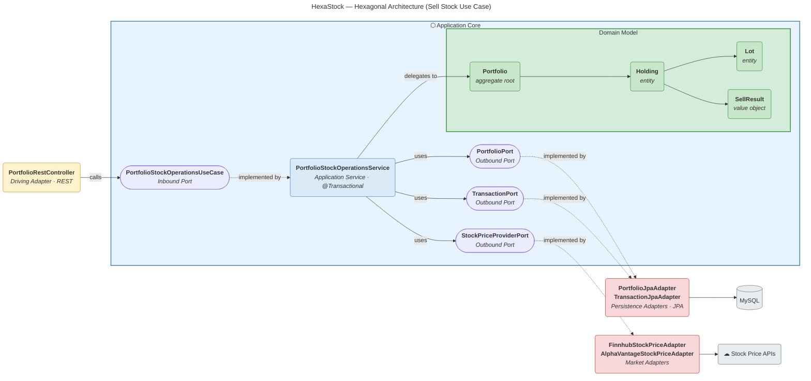

# HexaStock — Hexagonal Architecture (Mermaid)

> **Alternative diagram** — This Mermaid version provides a simplified, browser-native view of the same hexagonal architecture described in the [PlantUML diagram](Rendered/hexastock-hexagonal-architecture.svg). The architectural style is Alistair Cockburn's Hexagonal Architecture (Ports and Adapters); the visual layout draws on the teaching clarity of [Tom Hombergs' Reflectoring diagram](https://reflectoring.io/spring-hexagonal/), emphasising clean layer separation and human readability.
>
> GitHub and GitBook render Mermaid natively — no external tooling required.

### Reading Guide

| Layer | Color | What it contains | Maven Module |
|---|---|---|---|
| **Driving Adapters** | Yellow | REST controllers that initiate use cases | `adapters-inbound-rest` |
| **Application Core** | Blue | Inbound ports, application services, domain model, outbound ports | `application` + `domain` |
| **Domain Model** | Green | Aggregates, entities, value objects — pure business logic | `domain` |
| **Driven Adapters** | Red | JPA persistence and external API clients | `adapters-outbound-*` |

**Arrow conventions:**

- **Solid arrows (──▶)** — runtime calls and delegation
- **Dashed arrows (- -▶)** — implementation (adapter implements port interface)

**Value Objects** used throughout the domain: `Money`, `Price`, `ShareQuantity`, `Ticker`, `PortfolioId`.

All dependencies point **inward** toward the domain. The domain module has zero external dependencies.
