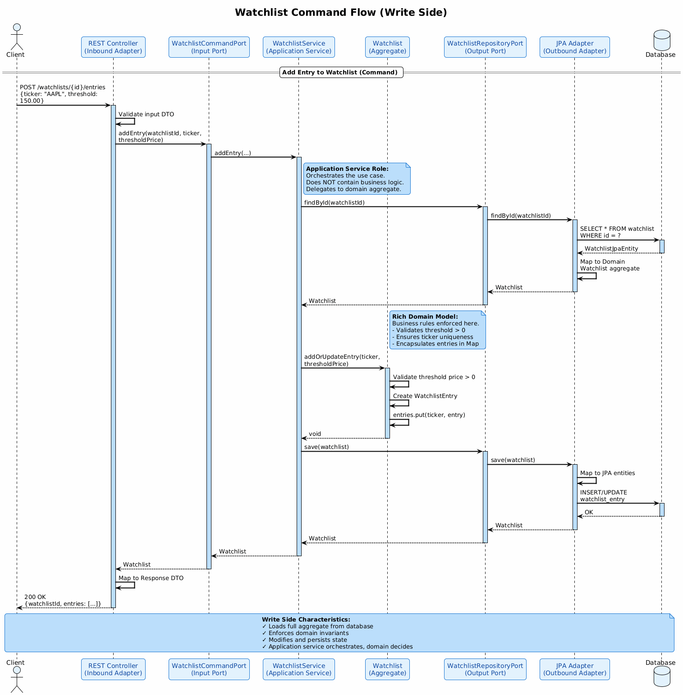
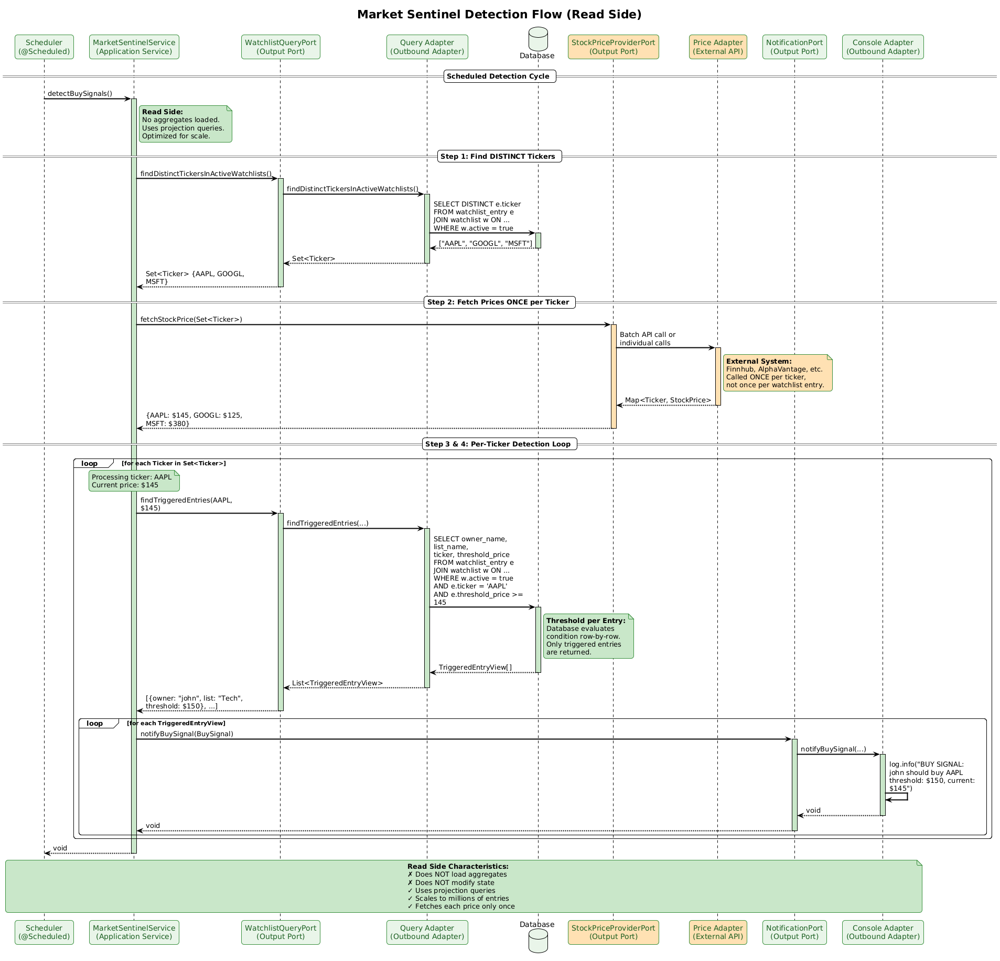
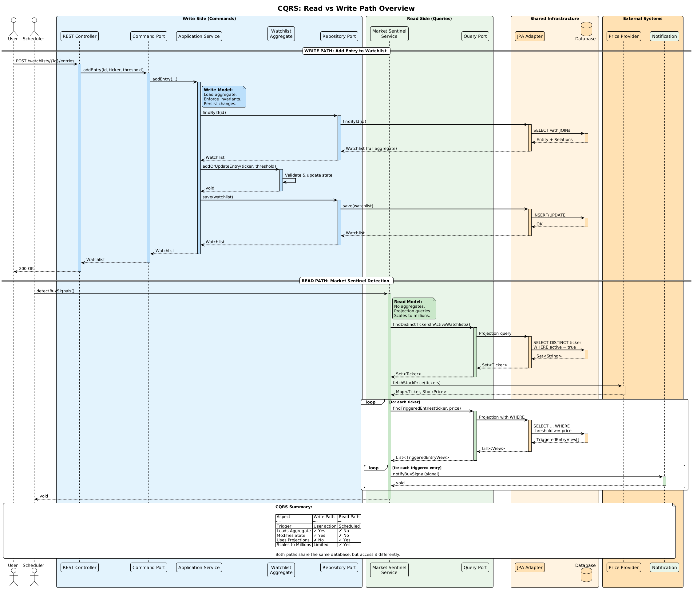

# Automated Market Monitoring & Watchlists

**Domain-Driven Design + Hexagonal Architecture + CQRS**

This document presents a comprehensive guide to implementing an automated market monitoring system within the HexaStock platform. The feature enables investors to create personalized watchlists with price alerts, while a background "Market Sentinel" continuously monitors market conditions and generates buy signals when opportunities arise. This extension demonstrates how Command Query Responsibility Segregation (CQRS) naturally emerges when scaling read-heavy monitoring operations, while preserving the integrity of the domain model for write operations.

> **Attribution — Progressive Alert Design Best Practices:**
> The progressive alert-design best practices presented in Levels 2–5 of this tutorial are obtained from
> [https://pro.stockalarm.io/blog/how-to-set-stock-price-alerts](https://pro.stockalarm.io/blog/how-to-set-stock-price-alerts).
> We do not claim originality for those concepts. They are integrated here strictly for pedagogical purposes, to show how a domain model evolves as requirements grow in complexity.

---

## Table of Contents

- [Overview](#overview)
  - [The Investor's Challenge](#the-investors-challenge)
  - [The Engineering Challenge: Scale](#the-engineering-challenge-scale)
  - [Why CQRS Emerges Naturally](#why-cqrs-emerges-naturally)
- [Progressive Learning Path](#progressive-learning-path)
  - [Why a Progressive Approach](#why-a-progressive-approach)
  - [Level Summary](#level-summary)
- [Student Assignment — Level 1: Price Threshold Alerts](#student-assignment--level-1-price-threshold-alerts)
  - [Domain Model Requirements](#domain-model-requirements)
  - [Use Cases — Write Side (Commands)](#use-cases--write-side-commands)
  - [Use Case — Read Side (Market Sentinel Query)](#use-case--read-side-market-sentinel-query)
  - [Notification Adapter](#notification-adapter)
  - [Important Clarifications](#important-clarifications)
- [Architecture & Design Guide](#architecture--design-guide)
  - [Why CQRS Is Necessary Here](#why-cqrs-is-necessary-here)
  - [Domain Model Design (Write Side)](#domain-model-design-write-side)
  - [Aggregate Invariants](#aggregate-invariants)
  - [Scalable Read-Side Algorithm (Critical Section)](#scalable-read-side-algorithm-critical-section)
    - [Step 1 — Find DISTINCT Tickers in Active Watchlists](#step-1--find-distinct-tickers-in-active-watchlists)
    - [Step 2 — Fetch Prices ONCE per Ticker](#step-2--fetch-prices-once-per-ticker)
    - [Step 3 — Query ONLY Triggered Alerts](#step-3--query-only-triggered-alerts)
    - [Step 4 — Notify](#step-4--notify)
  - [Duplicate Prevention](#duplicate-prevention)
  - [Testing Strategy](#testing-strategy)
  - [Sequence Diagrams](#sequence-diagrams)
- [Progressive Extensions](#progressive-extensions)
  - [Level 2 — Multiple Alerts per Ticker (Ladder Approach)](#level-2--multiple-alerts-per-ticker-ladder-approach)
  - [Level 3 — Percentage Change Alerts](#level-3--percentage-change-alerts)
  - [Level 4 — Contextual Filters (Alert Memo)](#level-4--contextual-filters-alert-memo)
  - [Level 5 — Alert Fatigue Prevention](#level-5--alert-fatigue-prevention)
  - [Summary of Progressive Model Evolution](#summary-of-progressive-model-evolution)
- [Clarification: CQRS in This Tutorial vs. Full CQRS](#clarification-cqrs-in-this-tutorial-vs-full-cqrs)
- [How This Would Evolve in Production](#how-this-would-evolve-in-production)
  - [Event Publishing](#event-publishing)
  - [Alert State Tracking](#alert-state-tracking)
  - [Horizontal Scaling](#horizontal-scaling)
  - [Architectural Stability](#architectural-stability)
- [Further Reading](#further-reading)
- [Special Acknowledgment](#special-acknowledgment)

---

## Overview

### The Investor's Challenge

Imagine an investor tracking dozens of stocks, waiting for the right moment to buy. They have identified target prices for each stock—prices at which they believe the investment becomes attractive. Perhaps they want to buy Apple (AAPL) if it drops below $150, or Google (GOOGL) if it falls under $120.

But a sophisticated investor doesn't set just *one* alert per stock. They think in **ladders**: "Alert me when AAPL drops below $150, and again at $140, and urgently at $130." Each level represents a different conviction or strategy — a first tranche buy, a second reinforcement, or a deep-value opportunity.

The problem is clear: **investors cannot manually monitor market prices continuously**. Markets move fast, opportunities appear and disappear within minutes, and constantly checking prices is neither practical nor efficient.

This is where **watchlists** come in. A watchlist allows an investor to:

1. **Track potential buying opportunities** by listing stocks of interest
2. **Define multiple price alerts per stock**, each with its own threshold
3. **Receive automated notifications** when market conditions match their criteria

But the investor doesn't want to run manual checks. They want the system to do it for them. They want a **Market Sentinel**—an automated guardian that continuously watches the market and alerts them when action is needed.

### The Engineering Challenge: Scale

For a single user with a handful of watchlists, implementing this feature is straightforward: load the watchlists, fetch the current prices, compare, and notify. Simple.

But what happens when the platform grows?

- **100 users** with 10 watchlists each = 1,000 watchlists
- **10,000 users** with 20 watchlists each = 200,000 watchlists
- **1 million users** = potentially millions of alert entries

The naive approach—loading all watchlist aggregates into memory, iterating through each alert, and fetching prices repeatedly—**does not scale**. Memory consumption explodes. Network calls to price providers multiply unnecessarily. The system becomes slow and expensive.

**The real engineering challenge is not evaluating a price condition. The real challenge is executing that evaluation efficiently at scale.**

### Why CQRS Emerges Naturally

This scalability challenge reveals a fundamental architectural insight: **write operations and read operations have fundamentally different characteristics**.

**Write operations** (creating watchlists, adding alerts, updating thresholds):
- Modify state
- Must protect domain invariants
- Require loading the full aggregate
- Are relatively infrequent
- Affect one aggregate at a time

**Read operations** (Market Sentinel detection):
- Do not modify state
- Do not need aggregate invariants
- Can use optimized projections
- Are extremely frequent (running on a schedule)
- Must scan across all active watchlists efficiently

This asymmetry is the essence of **Command Query Responsibility Segregation (CQRS)**:

- **Commands** (writes) go through the rich domain model, loading aggregates and enforcing business rules
- **Queries** (reads) bypass the domain model entirely, using optimized database projections

> **A note on terminology:** The term CQRS was coined by Greg Young, building on Bertrand Meyer's Command-Query Separation (CQS) principle. In its strict definition—as described by Martin Fowler—CQRS involves maintaining *separate conceptual models* for updates and reads, which may extend to separate data stores and synchronization mechanisms. In this tutorial, we apply a **pragmatic form** of CQRS: the command and query paths use distinct models and code paths, but share the same underlying database. This is a deliberate pedagogical choice that captures the core insight of the pattern—separating read and write responsibilities—without introducing the operational complexity of fully independent data stores. See the [Clarification](#clarification-cqrs-in-this-tutorial-vs-full-cqrs) section for a more detailed discussion.

By separating these concerns, we can:
- Preserve the integrity and expressiveness of our domain model for writes
- Achieve the scalability and performance required for reads
- Keep each path simple and focused on its specific requirements

The following sections guide you through implementing this pattern in HexaStock.

---

## Progressive Learning Path

### Why a Progressive Approach

Real-world alert systems are complex. Professional platforms like StockAlarm offer price alerts, percentage-change alerts, contextual filters, and fatigue-prevention mechanisms. Implementing all of this at once would overwhelm the learning process.

Instead, this tutorial follows a **progressive learning path**: start simple, get it working, then extend. Each level builds on the previous one and is **independently valuable**. Students should complete Level 1 fully before considering any extension.

> **Progressive alert-design best practices in Levels 2–5 are obtained from [https://pro.stockalarm.io/blog/how-to-set-stock-price-alerts](https://pro.stockalarm.io/blog/how-to-set-stock-price-alerts).** Key insights from that source include: using multiple alerts per ticker (ladder approach), incorporating percentage-change alerts, combining price with contextual information, reviewing alerts regularly, and avoiding alert fatigue. We integrate these ideas progressively to show how a domain model evolves.

### Level Summary

| Level | Feature | Domain Change | Status |
|-------|---------|---------------|--------|
| **Level 1** | Price threshold alerts | `Watchlist` aggregate with `List<AlertEntry>` | **Required** |
| **Level 2** | Multiple alerts per ticker (ladder) | No model change — enabled by Level 1 design | Optional extension |
| **Level 3** | Percentage change alerts | Add `AlertType` enum to `AlertEntry` | Optional extension |
| **Level 4** | Contextual filters (alert memo) | Add `memo` field to `AlertEntry` | Optional extension |
| **Level 5** | Alert fatigue prevention | Add `cooldownMinutes` field to `AlertEntry` + `lastTriggeredAt` | Optional extension |

**Critical point**: The Level 1 domain model is designed from the start to *accommodate* Levels 2–5 without breaking changes. This is intentional. Good domain modeling anticipates growth without over-engineering.

---

## Student Assignment — Level 1: Price Threshold Alerts

This is the **required** assignment. Students must implement a fully working watchlist system with price threshold alerts, following DDD, Hexagonal Architecture, and CQRS principles.

### Domain Model Requirements

Students must implement the following domain model for watchlists.

#### Watchlist (Aggregate Root)

| Field       | Type                          | Description                                      |
|-------------|-------------------------------|--------------------------------------------------|
| `id`        | `WatchlistId` (Value Object)  | Unique identifier for the watchlist              |
| `ownerName` | `String`                      | Name of the watchlist owner                      |
| `listName`  | `String`                      | Human-readable name for the watchlist            |
| `active`    | `boolean`                     | Whether the watchlist is active for monitoring   |
| `alerts`    | `List<AlertEntry>`            | Ordered collection of alert entries              |

#### AlertEntry (Value Object)

| Field            | Type     | Description                                           |
|------------------|----------|-------------------------------------------------------|
| `ticker`         | `Ticker` | Stock ticker symbol (existing Value Object)           |
| `thresholdPrice` | `Money`  | Target price threshold for buy signal (existing VO)   |

**Critical Design Decisions:**

1. **`List<AlertEntry>` instead of `Map<Ticker, ...>`**: The aggregate uses a `List` rather than a `Map` keyed by `Ticker`. This is a deliberate design choice. A `Map<Ticker, AlertEntry>` would enforce at most one alert per ticker at the data-structure level, preventing the ladder approach (Level 2) where an investor sets multiple price levels for the same stock. The `List` allows multiple `AlertEntry` instances for the same ticker, each with a different threshold. Uniqueness constraints, when needed, are enforced explicitly by the aggregate's business logic — not implicitly by the collection type.

2. **Threshold price is per alert entry**, not globally on the watchlist. Each alert in a watchlist is independently evaluated by the Market Sentinel. This is fundamental to how the read-side algorithm works.

3. **Value Object identity**: Two `AlertEntry` instances are considered duplicates if they share the same `ticker` AND the same `thresholdPrice`. The aggregate prevents exact duplicates but allows multiple alerts for the same ticker at different price levels.

### Use Cases — Write Side (Commands)

Students must implement the following use cases that modify watchlist state. These represent the **Command** side of CQRS.

#### 1. Create Watchlist

Creates a new watchlist for an owner.

**Input:**
- `ownerName`: String
- `listName`: String

**Output:**
- The created `Watchlist` with a generated ID, initially active with no alerts

**Business Rules:**
- Watchlist name must not be blank
- Owner name must not be blank
- New watchlists are active by default

---

#### 2. Delete Watchlist

Removes a watchlist entirely.

**Input:**
- `watchlistId`: WatchlistId

**Output:**
- Confirmation of deletion

**Business Rules:**
- Watchlist must exist

---

#### 3. Add Alert Entry

Adds a new alert to a watchlist.

**Input:**
- `watchlistId`: WatchlistId
- `ticker`: Ticker
- `thresholdPrice`: Money

**Output:**
- Updated `Watchlist`

**Business Rules:**
- Watchlist must exist
- Threshold price must be positive
- An exact duplicate (same ticker AND same threshold price) must not already exist
- Multiple alerts for the same ticker with *different* threshold prices are allowed

---

#### 4. Remove Alert Entry

Removes a specific alert from a watchlist.

**Input:**
- `watchlistId`: WatchlistId
- `ticker`: Ticker
- `thresholdPrice`: Money

**Output:**
- Updated `Watchlist`

**Business Rules:**
- Watchlist must exist
- An alert matching the given ticker and threshold price must exist

---

#### 5. Remove All Alerts for Ticker

Removes all alerts for a given ticker from a watchlist.

**Input:**
- `watchlistId`: WatchlistId
- `ticker`: Ticker

**Output:**
- Updated `Watchlist`

**Business Rules:**
- Watchlist must exist
- At least one alert for the given ticker must exist

---

#### 6. Activate Watchlist

Enables a watchlist for Market Sentinel monitoring.

**Input:**
- `watchlistId`: WatchlistId

**Output:**
- Updated `Watchlist` with `active = true`

---

#### 7. Deactivate Watchlist

Disables a watchlist from Market Sentinel monitoring.

**Input:**
- `watchlistId`: WatchlistId

**Output:**
- Updated `Watchlist` with `active = false`

---

**Why Aggregates Are Loaded for Commands:**

When modifying state, we load the complete aggregate to protect invariants. The `Watchlist` aggregate ensures:
- No exact duplicate alerts (same ticker + same threshold)
- Valid threshold prices
- Consistent state transitions

This is the **Write Model** in Domain-Driven Design: rich entities with behavior that enforce business rules.

### Use Case — Read Side (Market Sentinel Query)

The Market Sentinel is a background process that monitors market conditions and generates buy signals.

#### Behavior

- Runs on a configurable schedule using `@Scheduled`
- Detection interval is configurable via application properties
- Does **NOT** load aggregates
- Uses projection queries for efficiency
- Represents the **Read Model**

#### Algorithm (High-Level)

1. Query DISTINCT tickers from all **active** watchlists
2. Fetch current prices for those tickers (once per ticker)
3. For each ticker, query alert entries where `thresholdPrice >= currentPrice`
4. For each triggered alert, send a notification (buy signal)

#### Why Aggregates Are NOT Loaded

The Market Sentinel performs **read-only** operations. It does not modify any state. Loading aggregates would be:
- **Wasteful**: We don't need the full object graph
- **Slow**: Loading millions of aggregates is expensive
- **Unnecessary**: We're not enforcing invariants, just querying data

Instead, the Market Sentinel uses **projection queries** that return only the data needed for evaluation. This is the essence of the Read Model in CQRS.

### Notification Adapter

For this assignment, the notification adapter logs buy signals to the console.

```java
public void notifyBuySignal(BuySignal signal) {
    log.info("BUY SIGNAL: {} should consider buying {} (threshold: {}, current: {})",
        signal.ownerName(),
        signal.ticker(),
        signal.thresholdPrice(),
        signal.currentPrice()
    );
}
```

**Production Context:**

The console logging simulates a real notification mechanism. In a real system, this adapter could send emails, push notifications, publish Kafka events, or trigger webhooks. The hexagonal architecture ensures this infrastructure concern is isolated in an adapter, allowing the notification mechanism to evolve independently of the domain logic.

### Important Clarifications

#### 1. NO User Entity

There is intentionally **no JPA User entity** in this assignment. Authentication, authorization, and JWT handling are out of scope. The `Watchlist` aggregate simply contains:

```java
private final String ownerName;
```

This is a deliberate simplification to focus on the core architectural concepts (DDD, Hexagonal, CQRS) without the complexity of security infrastructure.

#### 2. No JPA Many-to-Many with Ticker

`Ticker` is a **Value Object**, not a JPA entity. Do NOT model a JPA many-to-many relationship between `Watchlist` and `Ticker`.

Instead, use the following persistence structure:

```
WatchlistJpaEntity (1) ──────> AlertEntryJpaEntity (many)
```

The `AlertEntryJpaEntity` should have:

| Column           | Type                          |
|------------------|-------------------------------|
| `id`             | Long (auto-generated)         |
| `watchlist_id`   | Long (FK to watchlist)        |
| `ticker`         | String                        |
| `threshold_price`| BigDecimal (persistence representation of Money) |

The domain `Ticker` and `Money` value objects are mapped to/from these persistence primitives by the adapter.

**Note on duplicates**: The database may optionally enforce a UNIQUE constraint on `(watchlist_id, ticker, threshold_price)` to mirror the domain invariant. However, the aggregate is the primary enforcement mechanism.

#### 3. Threshold is PER ALERT ENTRY

This point is critical and worth emphasizing:

- The threshold price is stored **per AlertEntry**
- It is NOT a global property of the Watchlist
- Multiple alerts for the same ticker (at different thresholds) are explicitly supported
- The Market Sentinel evaluates conditions **row-by-row** at the database level
- Each alert entry is independently evaluated against the current market price

This design allows users to implement a **ladder strategy**: tracking the same stock at multiple price levels within a single watchlist.

---

## Architecture & Design Guide

This section provides detailed architectural guidance for implementing the watchlist feature following DDD, Hexagonal Architecture, and CQRS principles.

### Why CQRS Is Necessary Here

Consider the naive approach to implementing Market Sentinel:

```java
// NAIVE APPROACH - DO NOT USE
List<Watchlist> allWatchlists = watchlistRepository.findAllActive();
for (Watchlist watchlist : allWatchlists) {
    for (AlertEntry alert : watchlist.getAlerts()) {
        StockPrice price = priceProvider.fetchStockPrice(alert.ticker());
        if (alert.thresholdPrice().isGreaterThanOrEqual(price.price().toMoney())) {
            notify(watchlist.ownerName(), alert);
        }
    }
}
```

**Problems with this approach:**

1. **Memory explosion**: Loading millions of `Watchlist` aggregates into memory
2. **Redundant price fetches**: The same ticker might appear in thousands of watchlists (and now multiple times *within* a single watchlist), causing redundant API calls
3. **Slow iteration**: Nested loops over in-memory collections
4. **No database optimization**: The database cannot help filter results

**The CQRS Solution:**

| Aspect               | Command Use Cases              | Market Sentinel (Query)        |
|----------------------|--------------------------------|--------------------------------|
| Loads aggregate      | ✅ Yes                         | ❌ No                          |
| Modifies state       | ✅ Yes                         | ❌ No                          |
| Enforces invariants  | ✅ Yes                         | ❌ No                          |
| Uses projections     | ❌ No                          | ✅ Yes                         |
| Scales to millions   | Limited (single aggregate)     | ✅ Yes (database-optimized)    |

By recognizing that read and write operations have different requirements, we can optimize each path independently.

### Domain Model Design (Write Side)

The domain model for the write side should be rich and expressive.

#### AlertEntry Value Object

```java
public record AlertEntry(
    Ticker ticker,
    Money thresholdPrice
) {
    public AlertEntry {
        Objects.requireNonNull(ticker, "Ticker must not be null");
        Objects.requireNonNull(thresholdPrice, "Threshold price must not be null");
        if (!thresholdPrice.isPositive()) {
            throw new IllegalArgumentException("Threshold price must be positive");
        }
    }
}
```

**Design Notes on AlertEntry:**

- **Record-based Value Object**: Immutable by construction. Java records provide `equals()`, `hashCode()`, and `toString()` automatically based on *all* fields. This means two `AlertEntry` instances are equal if and only if they have the same `ticker` AND the same `thresholdPrice` — which is exactly the duplicate-detection semantic the aggregate needs.
- **Self-validating**: The compact constructor rejects invalid state at creation time.
- **Extensible**: Future levels add fields to this record (e.g., `AlertType`, `memo`, `cooldownMinutes`). Adding fields to a record is a safe, additive change.

#### Watchlist Aggregate

```java
public class Watchlist {
    private final WatchlistId id;
    private final String ownerName;
    private String listName;
    private boolean active;
    private final List<AlertEntry> alerts = new ArrayList<>();

    // Constructor, factory methods...

    public static Watchlist create(WatchlistId id, String ownerName, String listName) {
        if (ownerName == null || ownerName.isBlank()) {
            throw new IllegalArgumentException("Owner name must not be blank");
        }
        if (listName == null || listName.isBlank()) {
            throw new IllegalArgumentException("List name must not be blank");
        }
        return new Watchlist(id, ownerName, listName, true, Collections.emptyList());
    }

    public void addAlert(Ticker ticker, Money thresholdPrice) {
        AlertEntry newAlert = new AlertEntry(ticker, thresholdPrice);
        if (alerts.contains(newAlert)) {
            throw new DuplicateAlertException(ticker, thresholdPrice);
        }
        alerts.add(newAlert);
    }

    public void removeAlert(Ticker ticker, Money thresholdPrice) {
        AlertEntry target = new AlertEntry(ticker, thresholdPrice);
        if (!alerts.remove(target)) {
            throw new AlertNotFoundException(ticker, thresholdPrice);
        }
    }

    public void removeAllAlertsForTicker(Ticker ticker) {
        boolean removed = alerts.removeIf(alert -> alert.ticker().equals(ticker));
        if (!removed) {
            throw new AlertNotFoundException(ticker);
        }
    }

    public void activate() {
        this.active = true;
    }

    public void deactivate() {
        this.active = false;
    }

    public List<AlertEntry> getAlerts() {
        return Collections.unmodifiableList(alerts);
    }

    public List<AlertEntry> getAlertsForTicker(Ticker ticker) {
        return alerts.stream()
            .filter(alert -> alert.ticker().equals(ticker))
            .toList();
    }

    // Getters for id, ownerName, listName, active...
}
```

**Design Notes:**

- **`List<AlertEntry>`**: The collection is a `List`, not a `Map`. This is the key structural change from the original design. A list naturally supports multiple entries for the same ticker, enabling the ladder approach without any model change. Duplicate prevention is handled explicitly by the aggregate via `AlertEntry.equals()`.
- **Why not `Set<AlertEntry>`?** A `Set` would also prevent duplicates, but `List` preserves insertion order — which can be meaningful to users (e.g., "I added the $150 alert first, then $140"). Order preservation is a low-cost benefit.
- **Internal mutability**: The `List` is mutable internally for aggregate operations.
- **Defensive copy externally**: `getAlerts()` returns an unmodifiable view.
- **Rich behavior**: The aggregate contains methods that enforce business rules.
- **Query method**: `getAlertsForTicker()` provides filtered access without exposing internal structure.

### Aggregate Invariants

The `Watchlist` aggregate enforces the following invariants:

| Invariant | Enforcement | Rationale |
|-----------|-------------|-----------|
| Owner name is not blank | Factory method (`create`) | Identity of the watchlist owner |
| List name is not blank | Factory method (`create`) | Human-readable identification |
| Threshold price is positive | `AlertEntry` constructor | Negative or zero thresholds are meaningless |
| No exact duplicate alerts | `addAlert()` checks `List.contains()` | Prevents redundant monitoring of the same condition |
| Alert must exist to be removed | `removeAlert()` checks `List.remove()` result | Prevents silent no-ops on invalid operations |

These invariants are **only enforced on the write side**. The read side (Market Sentinel) does not load aggregates and therefore does not re-check these rules — it trusts that the write side has maintained data integrity.

### Scalable Read-Side Algorithm (Critical Section)

This section describes the algorithm the Market Sentinel must use to achieve scalability. This is **the most important technical section** of this document.

#### Step 1 — Find DISTINCT Tickers in Active Watchlists

First, query the database for all unique tickers that appear in active watchlists:

```sql
SELECT DISTINCT e.ticker
FROM alert_entry e
JOIN watchlist w ON e.watchlist_id = w.id
WHERE w.active = true
```

**Key point**: No aggregates are loaded. This is a simple projection query that returns a set of ticker strings. Even if a ticker appears in hundreds of alerts across dozens of watchlists, it appears only once in this result set.

In the port interface:

```java
public interface WatchlistQueryPort {
    Set<Ticker> findDistinctTickersInActiveWatchlists();
    // ...
}
```

#### Step 2 — Fetch Prices ONCE per Ticker

Using the existing `StockPriceProviderPort`, fetch prices for all tickers in a single batch operation:

```java
Set<Ticker> tickers = watchlistQueryPort.findDistinctTickersInActiveWatchlists();

Map<Ticker, StockPrice> prices = stockPriceProviderPort.fetchStockPrice(tickers);
```

**Critical**: This project already contains:

```
cat.gencat.agaur.hexastock.application.port.out.StockPriceProviderPort
```

The documentation MUST use this exact port. The interface provides:

```java
StockPrice fetchStockPrice(Ticker ticker);

default Map<Ticker, StockPrice> fetchStockPrice(Set<Ticker> tickers);
```

The default batch method demonstrates a clean extension point that allows adapters to optimize price retrieval without changing the application core.

**Why this matters:**
- An adapter might override the batch method to call a real batch API
- Even if individual caching exists, the algorithm must fetch once per ticker per detection cycle
- This prevents N+1 query problems at the price provider level
- With the new model (multiple alerts per ticker), this optimization is even more critical — a single ticker like AAPL might have thousands of alerts at different thresholds across all users

#### Step 3 — Query ONLY Triggered Alerts

For each ticker, query the database for alert entries where the threshold condition is satisfied:

```sql
SELECT w.owner_name, w.list_name, e.ticker, e.threshold_price
FROM alert_entry e
JOIN watchlist w ON e.watchlist_id = w.id
WHERE w.active = true
  AND e.ticker = :ticker
  AND e.threshold_price >= :currentPrice
```

**Key points:**
- The threshold is evaluated **per row** by the database
- Only triggered alerts are returned, not all alerts
- The database does the filtering, not Java code
- Multiple alerts for the same ticker in the same watchlist may *all* trigger independently (e.g., if AAPL is at $128, both the $150 and $140 alerts trigger)

In the port interface:

```java
public interface WatchlistQueryPort {
    Set<Ticker> findDistinctTickersInActiveWatchlists();

    List<TriggeredAlertView> findTriggeredAlerts(Ticker ticker, Money currentPrice);
}
```

Where `TriggeredAlertView` is a simple projection DTO:

```java
public record TriggeredAlertView(
    String ownerName,
    String listName,
    Ticker ticker,
    Money thresholdPrice
) {}
```

**Why `TriggeredAlertView` is NOT a domain object:**

This record is a **read-side projection** — a flat, denormalized view of data optimized for the query path. It does not carry behavior, does not enforce invariants, and does not belong to the domain model. It exists solely to transfer data from the database to the notification adapter efficiently.

#### Step 4 — Notify

Putting it all together, the Market Sentinel use case:

```java
@Service
public class MarketSentinelService {

    private final WatchlistQueryPort queryPort;
    private final StockPriceProviderPort stockPriceProviderPort;
    private final NotificationPort notificationPort;

    public void detectBuySignals() {
        Set<Ticker> tickers = queryPort.findDistinctTickersInActiveWatchlists();

        Map<Ticker, StockPrice> prices = stockPriceProviderPort.fetchStockPrice(tickers);

        for (Ticker ticker : tickers) {
            StockPrice stockPrice = prices.get(ticker);
            Money currentPrice = stockPrice.price().toMoney();

            queryPort.findTriggeredAlerts(ticker, currentPrice)
                .forEach(view ->
                    notificationPort.notifyBuySignal(
                        new BuySignal(
                            view.ownerName(),
                            view.listName(),
                            ticker,
                            view.thresholdPrice(),
                            stockPrice
                        )
                    )
                );
        }
    }
}
```

**Design Notes:**

- `StockPrice` contains a `Price` value object, a `Ticker`, and a timestamp (`Instant`)
- `Price.toMoney()` converts the per-share price to a `Money` value for type-safe comparison
- The richer `StockPrice` object allows better logging and future evolution
- The notification includes both the threshold and current price for context
- With multiple alerts per ticker, the same user may receive multiple notifications for the same stock in the same detection cycle (e.g., "AAPL triggered at $150 threshold" and "AAPL triggered at $140 threshold"). This is correct behavior — each alert represents a distinct signal.

### Duplicate Prevention

In a real system, duplicate prevention could be implemented in the notification adapter or via a separate alert state store. This is out of scope for this assignment.

However, consider these production approaches:
- **Notification adapter with state**: Track which signals have been sent
- **Alert entity**: Create an `Alert` aggregate that records sent notifications
- **Time-based deduplication**: Don't re-notify for the same condition within X hours

### Testing Strategy

A comprehensive testing strategy should cover:

#### 1. Unit Tests for Aggregate Invariants

```java
@Test
void shouldRejectNegativeThresholdPrice() {
    Watchlist watchlist = createWatchlist();
    Money negativePrice = Money.of(new BigDecimal("-10.00"));

    assertThrows(IllegalArgumentException.class, () ->
        watchlist.addAlert(Ticker.of("AAPL"), negativePrice)
    );
}

@Test
void shouldRejectExactDuplicateAlert() {
    Watchlist watchlist = createWatchlist();
    Ticker aapl = Ticker.of("AAPL");
    Money threshold = Money.of(new BigDecimal("150.00"));

    watchlist.addAlert(aapl, threshold);

    assertThrows(DuplicateAlertException.class, () ->
        watchlist.addAlert(aapl, threshold)
    );
}

@Test
void shouldAllowMultipleAlertsForSameTickerAtDifferentPrices() {
    Watchlist watchlist = createWatchlist();
    Ticker aapl = Ticker.of("AAPL");

    watchlist.addAlert(aapl, Money.of(new BigDecimal("150.00")));
    watchlist.addAlert(aapl, Money.of(new BigDecimal("140.00")));
    watchlist.addAlert(aapl, Money.of(new BigDecimal("130.00")));

    assertEquals(3, watchlist.getAlerts().size());
    assertEquals(3, watchlist.getAlertsForTicker(aapl).size());
}

@Test
void shouldRemoveSpecificAlert() {
    Watchlist watchlist = createWatchlist();
    Ticker aapl = Ticker.of("AAPL");

    watchlist.addAlert(aapl, Money.of(new BigDecimal("150.00")));
    watchlist.addAlert(aapl, Money.of(new BigDecimal("140.00")));

    watchlist.removeAlert(aapl, Money.of(new BigDecimal("150.00")));

    assertEquals(1, watchlist.getAlerts().size());
    assertEquals(Money.of(new BigDecimal("140.00")),
        watchlist.getAlerts().get(0).thresholdPrice());
}

@Test
void shouldRemoveAllAlertsForTicker() {
    Watchlist watchlist = createWatchlist();
    Ticker aapl = Ticker.of("AAPL");
    Ticker googl = Ticker.of("GOOGL");

    watchlist.addAlert(aapl, Money.of(new BigDecimal("150.00")));
    watchlist.addAlert(aapl, Money.of(new BigDecimal("140.00")));
    watchlist.addAlert(googl, Money.of(new BigDecimal("120.00")));

    watchlist.removeAllAlertsForTicker(aapl);

    assertEquals(1, watchlist.getAlerts().size());
    assertEquals(googl, watchlist.getAlerts().get(0).ticker());
}
```

#### 2. Integration Tests for Persistence

Test that the JPA adapter correctly persists and retrieves watchlists and alert entries, including multiple alerts for the same ticker.

#### 3. Query Port Tests

Test that projection queries return correct results:

```java
@Test
void shouldFindDistinctTickersFromActiveWatchlistsOnly() {
    // Given: active watchlist with AAPL (two alerts), inactive watchlist with GOOGL

    Set<Ticker> tickers = queryPort.findDistinctTickersInActiveWatchlists();

    assertThat(tickers).containsExactly(Ticker.of("AAPL"));
}

@Test
void shouldFindAllTriggeredAlertsWhenPriceBelowMultipleThresholds() {
    // Given: alerts for AAPL at $150 and $140, current price $135

    List<TriggeredAlertView> triggered =
        queryPort.findTriggeredAlerts(Ticker.of("AAPL"), Money.of("135.00"));

    assertThat(triggered).hasSize(2);
}

@Test
void shouldFindOnlyTriggeredAlertsNotAllAlerts() {
    // Given: alerts for AAPL at $150, $140, and $130, current price $145

    List<TriggeredAlertView> triggered =
        queryPort.findTriggeredAlerts(Ticker.of("AAPL"), Money.of("145.00"));

    // Only $150 triggers (threshold >= currentPrice)
    assertThat(triggered).hasSize(1);
}
```

#### 4. Market Sentinel Service Tests

Test the service directly with mocked ports:

```java
@Test
void shouldNotifyWhenPriceBelowThreshold() {
    // Given
    Ticker aapl = Ticker.of("AAPL");
    when(queryPort.findDistinctTickersInActiveWatchlists())
        .thenReturn(Set.of(aapl));
    when(stockPriceProviderPort.fetchStockPrice(anySet()))
        .thenReturn(Map.of(aapl,
            StockPrice.of(aapl, Price.of(140.0), Instant.now())));
    when(queryPort.findTriggeredAlerts(any(), any()))
        .thenReturn(List.of(new TriggeredAlertView("john", "Tech Stocks",
            aapl, Money.of("150.00"))));

    // When
    marketSentinelService.detectBuySignals();

    // Then
    verify(notificationPort).notifyBuySignal(any(BuySignal.class));
}

@Test
void shouldNotifyMultipleTimesWhenMultipleAlertsTriggered() {
    // Given: AAPL at $128 triggers both $150 and $140 alerts
    Ticker aapl = Ticker.of("AAPL");
    when(queryPort.findDistinctTickersInActiveWatchlists())
        .thenReturn(Set.of(aapl));
    when(stockPriceProviderPort.fetchStockPrice(anySet()))
        .thenReturn(Map.of(aapl,
            StockPrice.of(aapl, Price.of(128.0), Instant.now())));
    when(queryPort.findTriggeredAlerts(any(), any()))
        .thenReturn(List.of(
            new TriggeredAlertView("john", "Tech Stocks", aapl, Money.of("150.00")),
            new TriggeredAlertView("john", "Tech Stocks", aapl, Money.of("140.00"))
        ));

    // When
    marketSentinelService.detectBuySignals();

    // Then
    verify(notificationPort, times(2)).notifyBuySignal(any(BuySignal.class));
}
```

#### 5. Scheduler Stays Thin

The `@Scheduled` component should be a thin wrapper:

```java
@Component
public class MarketSentinelScheduler {

    private final MarketSentinelService marketSentinelService;

    @Scheduled(fixedRateString = "${market.sentinel.interval:60000}")
    public void runDetection() {
        marketSentinelService.detectBuySignals();
    }
}
```

Test the service, not the scheduler. The scheduler's only responsibility is timing.

### Sequence Diagrams

The following PlantUML diagrams illustrate the key flows:

1. **Command Flow (Write Side)**: [watchlist-command-flow.puml](./diagrams/watchlist-command-flow.puml)

[](diagrams/Rendered/watchlist-command-flow.svg)

2. **Market Sentinel Detection (Read Side)**: [market-sentinel-detection-flow.puml](./diagrams/market-sentinel-detection-flow.puml)

[](diagrams/Rendered/market-sentinel-detection-flow.svg)

3. **CQRS Overview**: [cqrs-read-vs-write-overview.puml](./diagrams/cqrs-read-vs-write-overview.puml)

[](diagrams/Rendered/cqrs-read-vs-write-overview.svg)

---

## Progressive Extensions

This section presents optional, incremental extensions to the Level 1 implementation. Each level builds on the previous one and is independently valuable. Students should only attempt these after completing Level 1.

> **Attribution:** The progressive alert-design best practices in Levels 2–5 are obtained from
> [https://pro.stockalarm.io/blog/how-to-set-stock-price-alerts](https://pro.stockalarm.io/blog/how-to-set-stock-price-alerts).
> The key insight from that source is that **using only a single price alert misses context**. Effective alert strategies use multiple levels, percentage changes, contextual notes, and fatigue management. We integrate these ideas incrementally to show how a well-designed domain model accommodates evolving requirements.

### Level 2 — Multiple Alerts per Ticker (Ladder Approach)

**Concept**: A sophisticated investor doesn't set a single price alert — they create a **ladder** of alerts at progressively lower prices. For example:

| Alert | Ticker | Threshold | Strategy |
|-------|--------|-----------|----------|
| 1     | AAPL   | $150.00   | Start watching — first tranche |
| 2     | AAPL   | $140.00   | Accumulate — second tranche |
| 3     | AAPL   | $130.00   | Deep value — go heavy |

**Domain Model Change**: **None.** This is the payoff of the Level 1 design decision to use `List<AlertEntry>` instead of `Map<Ticker, AlertEntry>`. The ladder approach works out of the box.

**What students should implement:**
- A REST endpoint that returns all alerts for a specific ticker within a watchlist (using `getAlertsForTicker()`)
- Tests that verify multiple alerts for the same ticker trigger independently
- A clear understanding of why the original `Map<Ticker, WatchlistEntry>` design would have *prevented* this use case

**Learning objective**: Appreciate how data structure choices in the aggregate shape what the domain can express. A `Map` keyed by `Ticker` would have silently enforced a "one alert per ticker" business rule that was never intended.

---

### Level 3 — Percentage Change Alerts

**Concept**: Price thresholds are static — they don't adapt to market movement. A percentage-change alert triggers when a stock drops (or rises) by a certain percentage from a reference price. This is more dynamic and captures momentum-based opportunities.

> **Warning from best practices**: "Using only price misses context." A stock at $140 means something very different if it was at $200 last week versus $138 yesterday. Percentage change alerts capture the *rate* of movement, not just the level.

**Domain Model Change**: Introduce an `AlertType` enum and extend `AlertEntry`.

```java
public enum AlertType {
    PRICE_THRESHOLD,
    PERCENTAGE_DROP
}
```

```java
public record AlertEntry(
    Ticker ticker,
    Money thresholdPrice,       // Used when type = PRICE_THRESHOLD
    AlertType type,
    BigDecimal percentageDrop   // Used when type = PERCENTAGE_DROP (e.g., 5.0 = 5%)
) {
    public AlertEntry {
        Objects.requireNonNull(ticker, "Ticker must not be null");
        Objects.requireNonNull(type, "Alert type must not be null");
        switch (type) {
            case PRICE_THRESHOLD -> {
                Objects.requireNonNull(thresholdPrice, "Threshold price required for PRICE_THRESHOLD");
                if (!thresholdPrice.isPositive()) {
                    throw new IllegalArgumentException("Threshold price must be positive");
                }
            }
            case PERCENTAGE_DROP -> {
                Objects.requireNonNull(percentageDrop, "Percentage required for PERCENTAGE_DROP");
                if (percentageDrop.compareTo(BigDecimal.ZERO) <= 0
                        || percentageDrop.compareTo(BigDecimal.valueOf(100)) > 0) {
                    throw new IllegalArgumentException("Percentage must be between 0 (exclusive) and 100 (inclusive)");
                }
            }
        }
    }

    /** Convenience factory for Level 1 price-threshold alerts. */
    public static AlertEntry priceThreshold(Ticker ticker, Money thresholdPrice) {
        return new AlertEntry(ticker, thresholdPrice, AlertType.PRICE_THRESHOLD, null);
    }

    /** Factory for percentage-drop alerts. */
    public static AlertEntry percentageDrop(Ticker ticker, BigDecimal percentage) {
        return new AlertEntry(ticker, null, AlertType.PERCENTAGE_DROP, percentage);
    }
}
```

**Read-Side Impact**: The Market Sentinel must now handle two types of evaluation:

1. **PRICE_THRESHOLD**: Same as Level 1 — `threshold_price >= currentPrice`
2. **PERCENTAGE_DROP**: Requires a reference price. The simplest approach is to use the previous close from `StockPrice` metadata (if available) or to store a `referencePrice` in the alert entry at creation time.

**Query adaptation**: Add a new method to `WatchlistQueryPort`:

```java
List<TriggeredAlertView> findTriggeredPercentageAlerts(Ticker ticker, Money currentPrice, Money referencePrice);
```

With corresponding SQL that computes the percentage drop:

```sql
SELECT w.owner_name, w.list_name, e.ticker, e.percentage_drop
FROM alert_entry e
JOIN watchlist w ON e.watchlist_id = w.id
WHERE w.active = true
  AND e.ticker = :ticker
  AND e.type = 'PERCENTAGE_DROP'
  AND (((:referencePrice - :currentPrice) / :referencePrice) * 100) >= e.percentage_drop
```

**Learning objective**: Understand how a well-designed Value Object can evolve via an enum discriminator without changing the aggregate's collection structure.

---

### Level 4 — Contextual Filters (Alert Memo)

**Concept**: Alerts without context lead to poor decisions. When an alert triggers weeks after creation, the investor may not remember *why* they set it. A **memo** field captures the investment thesis at creation time.

> **Best practice**: "Combine price with simple contextual filters." Even a short text note like "Q3 earnings expected to beat" or "Wait for Fed decision before buying" adds valuable context when the alert fires.

**Domain Model Change**: Add an optional `memo` field to `AlertEntry`.

```java
public record AlertEntry(
    Ticker ticker,
    Money thresholdPrice,
    AlertType type,
    BigDecimal percentageDrop,
    String memo                 // Optional: investment thesis or context note
) {
    public AlertEntry {
        // ...existing validations...
        if (memo != null && memo.length() > 500) {
            throw new IllegalArgumentException("Memo must not exceed 500 characters");
        }
    }
}
```

**Read-Side Impact**: Include the memo in the projection:

```java
public record TriggeredAlertView(
    String ownerName,
    String listName,
    Ticker ticker,
    Money thresholdPrice,
    String memo
) {}
```

The notification adapter can then include the memo:

```java
log.info("BUY SIGNAL: {} should consider buying {} (threshold: {}, current: {}, reason: {})",
    signal.ownerName(), signal.ticker(), signal.thresholdPrice(),
    signal.currentPrice(), signal.memo());
```

**Learning objective**: See how optional fields in Value Objects can enrich the domain without changing the architecture. The aggregate, the read-side algorithm, and the port interfaces all accommodate this with minimal change.

---

### Level 5 — Alert Fatigue Prevention

**Concept**: If AAPL hovers around $150, a threshold alert at $150 triggers every single detection cycle — potentially dozens of times per day. This is **alert fatigue**: the investor is overwhelmed by redundant notifications, starts ignoring them, and eventually misses the signals that matter.

> **Best practice**: "Review alerts regularly" and "Avoid alert fatigue." The system should help users manage notification volume, not contribute to information overload.

**Domain Model Change**: Add a `cooldownMinutes` field to `AlertEntry` and track `lastTriggeredAt`.

```java
public record AlertEntry(
    Ticker ticker,
    Money thresholdPrice,
    AlertType type,
    BigDecimal percentageDrop,
    String memo,
    Integer cooldownMinutes     // Optional: minimum minutes between notifications (null = no cooldown)
) {
    public AlertEntry {
        // ...existing validations...
        if (cooldownMinutes != null && cooldownMinutes < 0) {
            throw new IllegalArgumentException("Cooldown must be non-negative");
        }
    }
}
```

**Persistence Change**: Add a `last_triggered_at` column to `AlertEntryJpaEntity`:

| Column              | Type      |
|---------------------|-----------|
| `id`                | Long      |
| `watchlist_id`      | Long (FK) |
| `ticker`            | String    |
| `threshold_price`   | BigDecimal|
| `type`              | String    |
| `percentage_drop`   | BigDecimal|
| `memo`              | String    |
| `cooldown_minutes`  | Integer   |
| `last_triggered_at` | Timestamp |

**Read-Side Impact**: The triggered-alerts query adds a cooldown filter:

```sql
SELECT w.owner_name, w.list_name, e.ticker, e.threshold_price, e.memo
FROM alert_entry e
JOIN watchlist w ON e.watchlist_id = w.id
WHERE w.active = true
  AND e.ticker = :ticker
  AND e.threshold_price >= :currentPrice
  AND (e.last_triggered_at IS NULL
       OR e.cooldown_minutes IS NULL
       OR e.last_triggered_at < :now - INTERVAL e.cooldown_minutes MINUTE)
```

**Important architectural note**: After sending a notification, the Market Sentinel must **update** the `last_triggered_at` timestamp. This is the *one place* where the read side performs a write. This write is purely infrastructure-level (updating a timestamp for deduplication) and does NOT go through the domain aggregate. It can be performed directly by the adapter:

```java
public interface WatchlistQueryPort {
    Set<Ticker> findDistinctTickersInActiveWatchlists();
    List<TriggeredAlertView> findTriggeredAlerts(Ticker ticker, Money currentPrice);
    void markAlertTriggered(Long alertEntryId, Instant triggeredAt);
}
```

**Learning objective**: Understand the tension between pure CQRS (reads never write) and practical requirements. The `last_triggered_at` update is a pragmatic compromise — it is not a domain state change (no invariants are involved), but an infrastructure concern (deduplication). This is an appropriate trade-off in a same-store CQRS architecture.

---

### Summary of Progressive Model Evolution

The table below shows how `AlertEntry` evolves across levels. Each row represents a field, and each column shows when it is introduced:

| Field              | Level 1 | Level 2 | Level 3 | Level 4 | Level 5 |
|--------------------|---------|---------|---------|---------|---------|
| `ticker`           | ✅       | —       | —       | —       | —       |
| `thresholdPrice`   | ✅       | —       | —       | —       | —       |
| `type`             |         |         | ✅       | —       | —       |
| `percentageDrop`   |         |         | ✅       | —       | —       |
| `memo`             |         |         |         | ✅       | —       |
| `cooldownMinutes`  |         |         |         |         | ✅       |

**Key insight**: The `Watchlist` aggregate itself does not change after Level 1. It always holds a `List<AlertEntry>`. All evolution happens inside the `AlertEntry` Value Object. This is the power of a well-designed aggregate boundary: the container is stable; the contents evolve.

---

## Clarification: CQRS in This Tutorial vs. Full CQRS

This tutorial uses the term CQRS to describe the separation of command (write) and query (read) paths within the watchlist feature. It is important to situate this approach within the broader spectrum of what CQRS means in the literature.

### What Fowler Describes as CQRS

In his 2011 article, Martin Fowler defines CQRS as the notion that "you can use a different model to update information than the model you use to read information." In its full form, this pattern implies:

- **Separate conceptual models** for the write side and the read side, each optimized for its respective purpose.
- **Potentially separate data stores**, where the write model persists into one store and changes are propagated—often asynchronously via domain events—to a denormalized read store.
- **Eventual consistency** between the write and read sides, which introduces synchronization complexity.
- **Increased architectural overhead**, which Fowler explicitly warns should not be adopted without a clear justification.

Fowler emphasizes that CQRS "adds a significant amount of complexity" and should be applied selectively—typically to specific bounded contexts where the read and write requirements diverge significantly—rather than as a system-wide architectural style.

### What This Tutorial Demonstrates

This tutorial applies a **pragmatic, single-database form of responsibility segregation**:

- **Command path**: Use cases that create, update, or delete watchlists load the full `Watchlist` aggregate, enforce domain invariants, and persist changes through the standard repository.
- **Query path**: The Market Sentinel bypasses the aggregate entirely, using optimized projection queries (`WatchlistQueryPort`) to read directly from the same database without materializing domain objects.

Both paths share the **same underlying relational database and schema**. There is no separate read store, no event-driven synchronization, and no eventual consistency to manage. The read side simply uses different query strategies (projections, joins, filtering at the database level) against the same tables that the write side populates.

This approach is sometimes referred to as **"thin CQRS"** or **"same-store CQRS"**. It captures the essential architectural insight—that read and write operations benefit from different code paths and data access strategies—while avoiding the operational complexity of fully decoupled models.

### Why This Distinction Matters

Understanding this distinction is valuable for several reasons:

1. **Using projections or optimized SQL queries does not, by itself, constitute full CQRS.** It is a well-established performance optimization technique. What makes our approach CQRS-adjacent is the deliberate separation of *models and responsibilities*, not merely the use of efficient queries.

2. **Full CQRS introduces additional concerns** that are absent here: event publishing to synchronize models, handling of eventual consistency, potential for stale reads, and the need for idempotent event consumers. These are production-grade concerns discussed in the [How This Would Evolve in Production](#how-this-would-evolve-in-production) section.

3. **The pedagogical value is in the separation itself.** By designing distinct command and query paths—with different port interfaces, different data access patterns, and different design priorities—students internalize the core principle of CQRS. The step from this pragmatic form to a fully decoupled architecture is then an infrastructure evolution, not a conceptual leap.

> **In summary:** This tutorial demonstrates a pragmatic separation of command and query responsibilities against a shared data store. It embodies the *principle* of CQRS without adopting its full architectural weight. This is an intentional and appropriate choice for a pedagogical context, and it aligns with Fowler's own advice to apply CQRS judiciously and only where the complexity is warranted.

---

## How This Would Evolve in Production

The architecture presented in this assignment is intentionally simplified for pedagogical purposes. Here's how it would evolve in a production environment.

### Event Publishing

Instead of directly calling a notification adapter, a production system would publish domain events:

```java
public record BuySignalDetectedEvent(
    String ownerName,
    String listName,
    Ticker ticker,
    Money thresholdPrice,
    StockPrice currentPrice,
    Instant detectedAt
) {}
```

These events could be:
- Published to Apache Kafka for async processing
- Stored in an event store for audit and replay
- Consumed by multiple downstream services (email, push, SMS, analytics)

### Alert State Tracking

A production system would track alert state as a first-class aggregate:

```java
public class AlertRecord {
    private AlertRecordId id;
    private WatchlistId watchlistId;
    private Ticker ticker;
    private Money thresholdPrice;
    private AlertRecordStatus status; // TRIGGERED, ACKNOWLEDGED, DISMISSED
    private Instant triggeredAt;
    private Instant acknowledgedAt;
}
```

This enables:
- Preventing duplicate notifications (superseding the Level 5 cooldown approach)
- Showing alert history to users
- Tracking user engagement with signals
- Analytics on alert effectiveness

### Horizontal Scaling

For massive scale, consider:

#### Partitioning by Ticker

Distribute detection work across multiple instances:
- Instance 1 handles tickers A-M
- Instance 2 handles tickers N-Z
- Consistent hashing for dynamic partitioning

#### Distributed Scheduling

Use a distributed scheduler like:
- Quartz with JDBC job store
- Spring Cloud Kubernetes with leader election
- AWS EventBridge with Lambda

#### Idempotency

Ensure notifications are idempotent:
- Include a unique signal ID
- Notification adapter checks for duplicates
- Use exactly-once semantics where possible

#### Observability

Add comprehensive monitoring:
- Metrics: detection latency, signals per cycle, price fetch times
- Tracing: distributed traces across services
- Logging: structured logs for debugging

### Architectural Stability

Despite all these production enhancements, note what remains unchanged:

- **Domain model**: `Watchlist`, `AlertEntry` stay the same
- **Command use cases**: Still load aggregates, enforce invariants
- **Query use cases**: Still use projections, bypass aggregates
- **Port interfaces**: Same contracts, different implementations
- **Read-side algorithm**: Still `distinct tickers → fetch once → query triggered → notify`

This is the power of Hexagonal Architecture combined with DDD and CQRS:

> **The core architecture remains stable. Infrastructure evolves.**

Business logic is protected. Technical concerns are isolated in adapters. New requirements can be met by adding or replacing adapters, not by rewriting the core.

---

## Further Reading

- **Martin Fowler — CQRS** (2011): [https://martinfowler.com/bliki/CQRS.html](https://martinfowler.com/bliki/CQRS.html)
  Fowler's concise articulation of the pattern, its benefits, and its risks. Essential reading for understanding when CQRS is—and is not—appropriate.

- **Greg Young — CQRS Documents** (2010): Greg Young originated the term CQRS, extending Bertrand Meyer's Command-Query Separation (CQS) principle from the method level to the architectural level. His writings and presentations provide the foundational rationale for separating write and read models in complex domains.

- **Martin Fowler — Command Query Separation**: [https://martinfowler.com/bliki/CommandQuerySeparation.html](https://martinfowler.com/bliki/CommandQuerySeparation.html)
  The predecessor principle by Bertrand Meyer, which states that a method should either change state or return a result, but not both. CQRS elevates this idea to the level of system architecture.

- **StockAlarm — How to Set Stock Price Alerts**: [https://pro.stockalarm.io/blog/how-to-set-stock-price-alerts](https://pro.stockalarm.io/blog/how-to-set-stock-price-alerts)
  Practical best practices for designing stock alert systems. The progressive extensions in Levels 2–5 of this tutorial are obtained from the concepts presented in this article.

---

## Special Acknowledgment

This tutorial benefited from the proactive contribution of **Lluna de Gea**
(LinkedIn: [https://www.linkedin.com/in/lluna-de-gea/](https://www.linkedin.com/in/lluna-de-gea/)).

Lluna worked on this project with seriousness and dedication, completing the assigned exercises with a level of commitment that went well beyond the scope set by the professor. Her engagement with the subject was genuine and sustained throughout.

Most notably, she independently identified and recommended the article
[*How to Set Stock Price Alerts*](https://pro.stockalarm.io/blog/how-to-set-stock-price-alerts)
published by Stock Alarm Pro. That recommendation proved directly valuable: it provided the conceptual foundation for the progressive alert-design best practices integrated into Levels 2 through 5 of this tutorial. Without her initiative, that dimension of the tutorial would not exist in its current form.

Proactive contributions of this kind — where a student brings external knowledge into the learning process and improves the shared resource for everyone — are precisely what make a course richer. They deserve to be recognised explicitly.

---

*This document is part of the HexaStock pedagogical project, demonstrating Domain-Driven Design, Hexagonal Architecture, and CQRS principles in a realistic financial domain context.*
