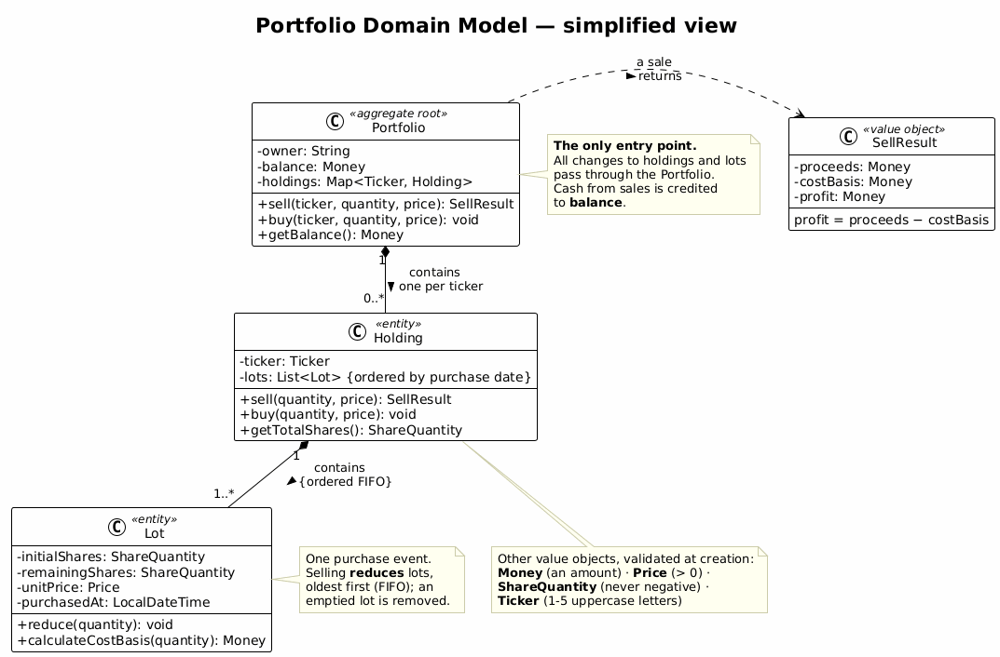

# Exercise 2 — Build it from specifications

> Companion handout for working on your own. Same domain as Exercise 1 — selling stock from a
> portfolio — but this time nothing is left to a conversation. Everything the program must do is
> written down, before any code exists.

## What you are building

The same small piece of financial software as before: an investor sells shares, and the system
reports proceeds, profit, and an updated cash balance. This time you're not told a business story
and left to guess the gaps — you're handed two files that already settle every behaviour and every
class. Your job is to build exactly what they say, then check your result against them.

The exercise has two parts, and you need both. In **part one** the specification is given to
you and you run the machine: spec → tests → implementation. In **part two** you become the
specifier: same machine, but for the *buy stocks* use case, and the specification is yours to
write. Writing specifications is not a side quest — it is one of the defining skills of an
engineer working with AI, because the assistant can only build well what someone specified
well. You are done when both use cases run green.

## The specifications

Place both files in `docs/spec/` inside an empty project folder. That is your whole input —
nothing else is needed.

- **[`sell-stocks-spec.md`](spec/sell-stocks-spec.md)** — *behaviour*: preconditions, the FIFO
  lot-consumption rule, the money definitions, and 24 acceptance criteria (AC-01 … AC-24), each
  with a starting context, an action, and an exact expected result.
- **[`domain-class-diagram.puml`](spec/domain-class-diagram.puml)** — *structure*: classes,
  fields, method signatures, visibility, and relationships (`Portfolio` → `Holding` → `Lot`, plus
  the value objects).

If the two ever disagree, structure follows the diagram and behaviour follows the spec — and your
assistant should tell you about the conflict rather than pick silently, the way it did in
Exercise 1.

## The domain model at a glance

Before you touch the prompt, make sure you can *read* the structure you are about to build. This
is the class diagram from `domain-class-diagram.puml`, reduced to its essentials:



Three objects carry all the state, nested like Russian dolls:

| Class | What it is for |
| ----- | -------------- |
| **`Portfolio`** | The *aggregate root* — the only door into the model. It owns the cash balance and a map of holdings keyed by ticker. Every operation (`sell`, `buy`) enters here; nothing outside is allowed to reach in and touch a `Holding` or a `Lot` directly. |
| **`Holding`** | The position in *one* ticker — "my AAPL shares". It keeps a list of lots **ordered by purchase date**, which is exactly what makes FIFO possible. |
| **`Lot`** | One purchase event: how many shares were bought, at what unit price, on what date, and how many of them are still left. Selling *reduces* lots; it never edits their price or date. |

The arrows between them read: a `Portfolio` **contains** zero or more `Holding`s (one per
ticker), and a `Holding` **contains** one or more `Lot`s, oldest first. A holding with zero lots
does not exist — selling the last share removes the holding itself.

Everything else in the diagram is a *value object* — small, immutable, validated the moment it
is created: `Money` (an amount), `Price` (must be positive), `ShareQuantity` (never negative),
`Ticker` (1–5 uppercase letters), and `SellResult`, the receipt a sale returns: proceeds, cost
basis, and profit.

## Part one — sell stocks: build from the given specification

### Pick a language

Java and Python both work; use whichever you prefer.

**Java**

- Java 21, Maven, a standalone project with its own `pom.xml`, no parent.
- JUnit 5 only, in test scope. No Spring, no persistence, no REST layer.
- Package root: `com.neueda.portfolio.domain`.
- Every monetary amount as `BigDecimal`, scale 2, `HALF_UP` — never `double` or `float`.

**Python**

- Python 3.11+, a standalone project. Tests with the built-in `unittest` module, or whatever test
  tooling is already approved and installable in your environment — don't assume a specific
  third-party test library is available. No framework, no persistence layer.
- Package root: `portfolio.domain` (or your project's equivalent).
- Every monetary amount as `decimal.Decimal`, quantized to 2 places with `ROUND_HALF_UP` — never
  a plain `float`.

### The suggested prompt

```text
Implement the domain model described by the two specifications in this project:

  docs/spec/sell-stocks-spec.md       the behaviour: preconditions, the FIFO
                                       rule, the money definitions, and the
                                       acceptance criteria AC-01 to AC-24
  docs/spec/domain-class-diagram.puml the structure: classes, fields, methods,
                                       visibility and relationships

The specifications are authoritative. Implement what they say and nothing more: do not add members that are absent from the class diagram, and do not invent behaviour the acceptance criteria do not describe. If the two ever disagree, follow the diagram for structure and the specification for behaviour, and tell me about the conflict rather than choosing silently.

[ Paste in the technical block for your chosen language here. ]

Tests: one test per acceptance criterion, named so the criterion it covers is obvious. Use the exact numbers from the specification. Compare monetary amounts with an exact comparison so that 1200 and 1200.00 count as equal. Assert state, not only return values — the remaining lots, the cash balance, and the fact that a rejected sale changes nothing at all.

Done when the test suite runs green and every acceptance criterion is covered.
```

### Checking what comes back

A green build is not proof — check these, in this order:

1. **The tests run green** — 36 tests from 24 criteria (two are checked against a list of inputs
   each, one has an extra converse case).
2. **Every criterion has a test.** Walk AC-01 to AC-24. A missing criterion won't show up as a
   failure.
3. **The numbers are right.** Selling 12 of the baseline holding must give proceeds 1800.00, cost
   basis 1240.00, profit 560.00, leaving one lot of 3 shares at 120.00 — not a blended-average
   cost basis of 1280.00.
4. **A rejected sale changes nothing.** Selling 16 of 15 shares must leave the lots and the cash
   balance untouched — validation before mutation, not during it.
5. **Nothing extra was invented.** Compare the classes against the diagram: no extra fields, no
   `Transaction` class, no cached `profit` field — if it's not in the diagram, it shouldn't exist.

## Part two — now *you* write the specification: buying stocks

So far the specification was handed to you and your job was mechanical: feed it in, verify the
output. That is only half the skill. The other half is *producing* a specification good enough
to drive that machine — and that is what you do now, for the **buy stocks** use case.

### Who writes specifications, really

In a real project the behaviour in a specification comes from *people*: clients, product owners,
business stakeholders. Extracting it is engineering work of the human kind — asking the right
questions, listening, detecting the requirement behind the request, confirming your
understanding out loud before writing it down. Communication, empathy, assertiveness: soft
skills, doing hard work. An AI assistant can *phrase* a specification beautifully, but it cannot
sit in that meeting for you, and it cannot take responsibility for having understood the client.
You can — and must.

So the deal for this part is:

- You **may** use your AI assistant to help *draft* the specification and extend the diagram —
  nobody writes these letter by letter, and drafting speed is exactly what the assistant is for.
- You **may not** delegate the *decisions*. Every business rule below is an agreement with a
  stakeholder. You are the one accountable for the spec saying what the client meant — the
  assistant only helps you say it well.
- Only once the specification is agreed do you unleash the automation: spec → tests →
  implementation, exactly like part one.

### The stakeholder decisions — already taken for you

In real life you would obtain these answers by interviewing the product owner. Today, for time,
here is the interview's outcome. These decisions are **fixed** — your specification must encode
exactly these rules, no others:

1. **Purchases are paid from the cash balance.** Buying `quantity` shares at `price` decreases
   the balance by `quantity × price`.
2. **Money must be deposited before it can be spent.** `Portfolio` gains one new operation,
   `deposit(amount)`, which increases the cash balance. The amount must be positive; a
   non-positive deposit is rejected with the invalid-amount exception (`InvalidAmountException`)
   and changes nothing.
3. **You cannot spend money you do not have.** If `quantity × price` exceeds the balance, the
   purchase is rejected with a new exception, `InsufficientFundsException`, whose message reports
   the available and required amounts. Nothing is mutated — no balance change, no lot, no
   holding.
4. **A successful purchase appends a new lot.** The lot records the quantity, the unit price and
   the purchase date, and goes at the **end** of the holding's lot list, preserving the FIFO
   order that selling depends on. Buying never merges into an existing lot.
5. **First purchase of a ticker creates the holding; the validations you already know still
   apply.** Non-positive quantity → `InvalidQuantityException`; malformed ticker →
   `InvalidTickerException`; non-positive price → `InvalidAmountException`. A rejected purchase
   never leaves an empty holding behind (the sell spec's AC-24 already demands this).

### Extend the class diagram — this much and no more

The existing diagram already has `buy(...)` on `Portfolio` and `Holding` — most of the structure
is already there. Extend it with **exactly** these three things:

1. `+ deposit(amount: Money): void` on `Portfolio`.
2. The `InsufficientFundsException`, alongside the other domain exceptions.
3. A note on `buy`: *"paid from the cash balance; validates funds before mutating anything"*.

If you find yourself adding anything else — a `Transaction` class, an `Order`, a `withdraw`
method — stop. The specification does not ask for it, so it must not exist.

### Write `buy-stocks-spec.md`

Use `sell-stocks-spec.md` as your template — same sections, same discipline: user story,
preconditions, the buying rule, and an acceptance-criteria table where every row has a starting
context, an action, and an exact expected result. Draft it with your assistant if you like, but
read every line as its author, because that is what you are.

Your criteria must cover at least:

- **Happy path with exact numbers.** Deposit 1000.00, buy 5 AAPL at 100.00 → balance 500.00 and
  one lot of 5 shares at 100.00.
- **A second purchase appends a second lot.** After the above, buy 3 AAPL at 110.00 → balance
  170.00 and two lots in order: 5 @ 100.00 then 3 @ 110.00. (You have just rebuilt the sell
  spec's baseline holding shape — that is not a coincidence.)
- **Insufficient funds change nothing.** With balance 500.00, attempt to buy 4 AAPL at 130.00
  (cost 520.00) → `InsufficientFundsException`; balance still 500.00, lots untouched.
- **Deposit works and validates.** A positive deposit increases the balance by exactly that
  amount; a zero or negative deposit is rejected and the balance is unchanged.
- **The rejections you already know.** Zero/negative quantity, malformed ticker, non-positive
  price — each rejected with the right exception, and nothing mutated.

### Then run the machine

Point your assistant at *your* two files, with the same prompt pattern as part one — swap in
`docs/spec/buy-stocks-spec.md` and your extended diagram, keep the same technical block and the
same testing instructions. Then check the result the same way: every criterion has a test, the
numbers are exact, a rejected purchase mutates nothing.

If a test fails, resist the urge to patch the code by hand. Ask first: *is the code wrong, or is
my specification ambiguous?* When the answer is the specification — and sometimes it will be —
fix the spec and regenerate. That loop, not any single artifact, is the discipline this
exercise teaches.

## Worth trying afterwards

- Delete the class diagram and regenerate from the behaviour spec alone — what does the assistant
  now decide on its own?
- Change one number in the specification (say, the second lot's price) and regenerate. Everything
  downstream should follow, because the specification is the source of truth, not your memory of
  a conversation.

## What's next

You've now stood on both sides of a specification: builder, regenerating a domain from files
someone else agreed on, and author, deciding with the stakeholder what those files must say
before any automation touches them. Exercise 3 asks whether the *working method* itself —
planning, implementing, reviewing — can be made just as durable.
