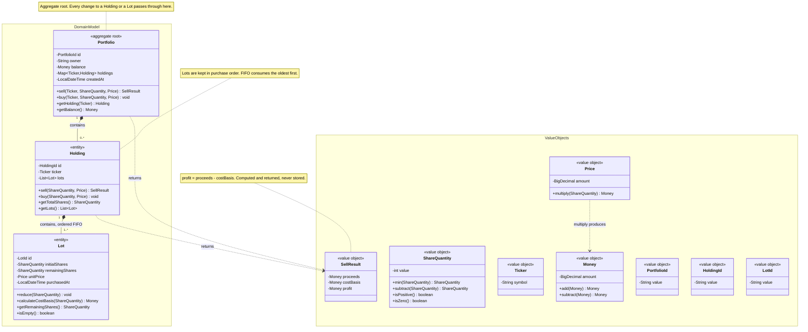
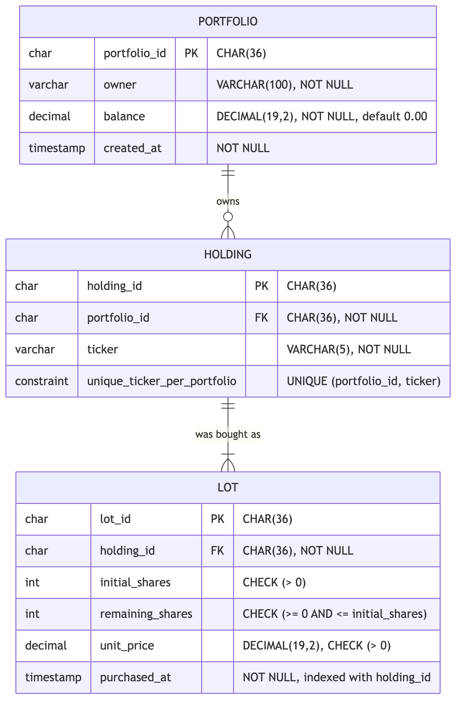
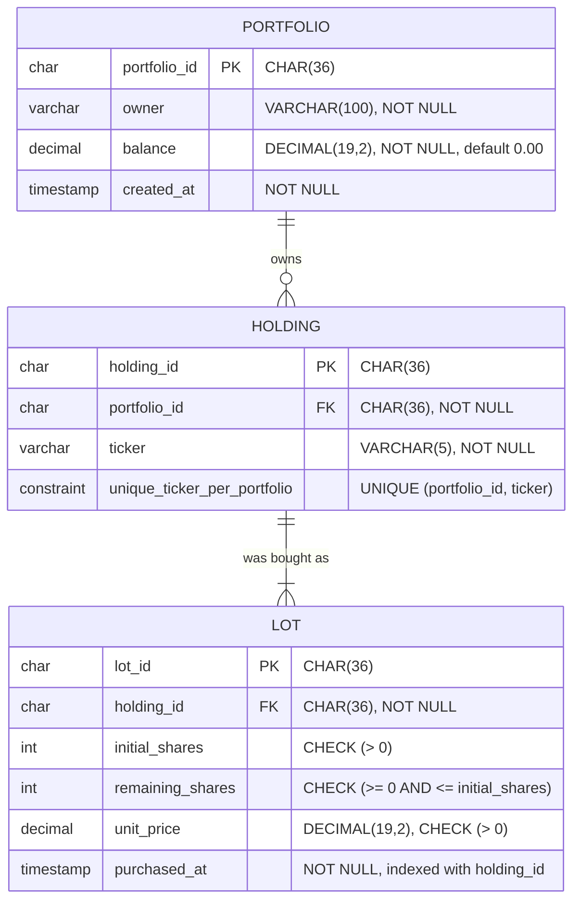

# Domain diagrams (Mermaid)

The same model as [`domain-class-diagram.puml`](domain-class-diagram.puml) and
[`domain-er-diagram.puml`](domain-er-diagram.puml), written in Mermaid so it renders inline
on GitHub, in most IDE markdown previews, and anywhere else that will not run PlantUML.

Rendered images are in [`png/`](png/) if your viewer shows neither.

---

## 1. Class diagram — the object-oriented view




> Which value object each entity uses is already visible in its field list, so those
> dependency arrows are left out — only the two relationships you cannot read off a field
> are drawn: what a sale *returns*, and what multiplying a price *produces*.

> **Note on one relationship.** `Holding *-- "1..*" Lot` really is *one* or more. Selling an
> entire position consumes every lot, and the portfolio then drops the holding altogether — so
> a holding you can reach from a portfolio always has at least one lot. See
> [`sell-stocks-spec.md`](sell-stocks-spec.md) §6.2.

---

## 2. Entity-relationship diagram — the same model as tables





What this view cannot show — FIFO ordering, the money formulas, the aggregate boundary, and
the all-or-nothing guarantee of a failed sale — is written up in
[`er-model-limitations.md`](er-model-limitations.md). Read that before concluding the schema
tells the whole story; it is roughly a fifth of it.

---

## Regenerating the images

The PNGs in [`png/`](png/) are rendered from the fenced blocks above, which are the single
source — edit the Mermaid here, never the images.

```bash
cd sell-stocks-domain-kata
./docs/spec/render-diagrams.sh
```

The script needs Node and network access on first run (it fetches `@mermaid-js/mermaid-cli`
via `npx`). It is a convenience, not part of `mvn test`; the build never depends on it.
